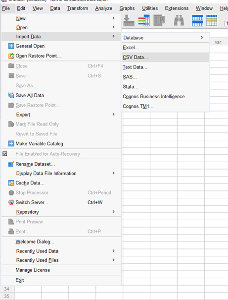
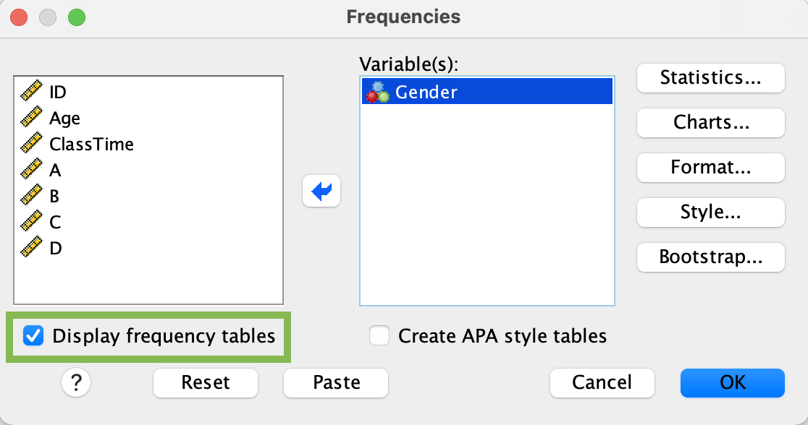
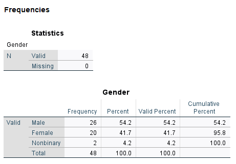

```{r setup, include=FALSE}
library(learnr)
library(knitr)
```

<style>

a:link {
  color: #D95829;
}
  
h2, h3, h4, h5, h6 {
  font-family: 'Inter', sans-serif;
  font-weight: bold;
}

h2 {
  font-size: 18pt;
}

h3 {
   color: #18778C;
   font-size: 14pt;
}

body {
  font-family: 'Inter', sans-serif;
  font-size: 14pt;
}

pre {
    border: 0;
}

</style>

## Introduction to Today's Lab
This week, we've reviewed the basics of null-hypothesis statistical testing (NHST). Specifically, we've covered null and alternative hypotheses, samples and populations, measures of central tendency, measures of variance, and frequency distributions.

### Learning Objectives
After completing this lab, you should be able to:

1.  Import data into SPSS
2.  Check and reset variable types and codes
3.  Check the descriptive statistics of your data
4.  Produce histograms to visually assess your data's distribution

### Requirements
To complete this lab, you should have:

- [ ] &nbsp; Attended this week's lectures
- [ ] &nbsp; Installed SPSS on your computer

## Import Data

### Description
Import 'Week1LabData' into SPSS. You can download the data from [Learn (requires university login)](MONICA - ADD LINK HERE)

### Test your Understanding
```{r Q1, echo = F}
question_radio(
  "What type of file is 'Week1LabData'?",
  answer("xlsx"),
  answer("csv", correct = TRUE),
  answer("sav"),
  answer("docx"),
  allow_retry = TRUE,
  random_answer_order = TRUE,
  incorrect = 'Please try again',
  correct = 'Well done!'
)
```


<details>
<summary> <span style = "color: #18778C; font-size: 14pt; font-weight: bold;"> Hint </span> </summary>

Check under the **File** tab in SPSS. What is the difference between the 'Open' and 'Import Data' options? 
</details>


<details>
<summary> <span style = "color: #18778C; font-size: 14pt; font-weight: bold;"> Solution  </span> </summary>

Click *Import Data* under the **File** tab. The data are in .csv format, so choose *CSV Data*. Navigate to the folder where you've stored  'Week1LabData.csv' and select the file. 

```{r, echo = F, out.width='50%'}

```

A box will pop up that allows you to review the data before import. In this example, the first row of our data is the name for each column, so the 'First line contains variable names' should remain checked. Note that if you import data without column names, you'll need to uncheck this box. Click 'OK'. 

```{r, echo = F, out.width='60%'}
include_graphics('images/week1_1b.png')
```

</details>

## Adjust Variable Measures {.tabset .tabset-fade .tabset-pills}

#### Description
Recall that data can be measured in multiple formats, and these scales of measurement will affect how data may be described and analysed. Have a look at your data - were all variables imported into SPSS as the correct measurement type? If not, change the variable's measure so that it appropriately describes the data. 

**Answer the following:**
* What type of data are each of your variables?

#### Hint
You'll need to switch from *Data View* to *Variable View* for this step. Do the labels used by SPSS match the scales of measurement you've learned (Nominal, Ordinal, Interval, Ratio)? Think about what kind of data each of your variables represents. 

#### Solution
To check that your variables are labeled as the correct scale of measurement, look at the **Measure** column under the *Variable View* tab. 

```{r, echo = F, out.width='75%'}
include_graphics('images/week1_2a.png')
```

SPSS labels the data as:

* _Nominal:_ data that fall into discrete categories that have no information regarding order (e.g., eye colour)
* _Ordinal:_ data that fall into discrete categories that have some kind of ordering information (e.g. Likert Scale responses)
* _Scale:_ continuous/numerical data; data have some kind of numeric relationship and could technically be measured to infinite decimal places, if the measurement was actually capable of doing so. 

To adjust the measure type, select the Measure box for a single variable and click the arrow that appears. 

* **ID** is represented as a number, but there really is no numeric relationship between the numbers (e.g. someone with an ID = 40 didn't complete the study in twice the time of someone with an ID = 20). Technically, the numbers are ordered in a way that reflects the order in which they completed the study, so this could be considered an 'Ordinal' variable.

* **Age** is continuous. Someone who is 12 is twice as old as someone who is 6, and you could measure age up to infinite decimal places if you had a perfectly precise measurement. This can be considered a 'Scale' variable.

* **Gender** is nominal. It can be captured in discrete categories and there is no inherent order.

* **Education** is a bit tricky, as its type changes based on how it is measured. In this example, the variable reflects years of education, so technically it is numeric, or a 'Scale' variable.

* **SubAgeT1** and * **SubAgeT2** were measured on a continuous slider, so they are both numeric, or 'Scale' variables.

* **MemoryScore** is also a numeric variable. 

## Add Values to Nondescriptive Nominal Data {.tabset .tabset-fade .tabset-pills}

#### Description
Sometimes categorical data may be recorded as a number. In this example, the gender variable consists of 3 values: 1, 2, 3, which represent the different genders that participated in the study. Instead of recording gender as a character label, participants were given a number to reflect their gender group. However, it is important to always include a coding key, so that anyone who works with the data will know the labels used and can make appropriate interpretations. 

Add a key to the Gender variable so that 1 = 'Male', 2 = 'Female', and 3 = 'Nonbinary'. 

#### Hint
This should also be done in **Variable View**. The column names may seem a bit misleading; you don't use the 'Label' column for this task.

#### Solution
To provided an associated label for each value of a variable, you'll use the **Values** column under the **Variable View** tab. 

```{r, echo = F, out.width='70%'}
include_graphics('images/week1_3a.png')
```

Select the Gender x Values cell and click the dots to bring up the _Value Labels_ box. Use the $+$ to add a new label. In the Value column, type the value **exactly as it is recorded in your data.** In the Label column, add the label you would like to associate with that specific value. Continue adding labels using  $+$ until you've labeled all values in the Gender column. 

```{r, echo = F, out.width='40%'}
include_graphics('images/week1_3b.png')
```

Click 'OK'. If you've done this properly, you'll see that each numeric value is now associated with a character label.


## Check Frequency Data {.tabset .tabset-fade .tabset-pills}
#### Description
Before doing any sort of analysis, it's important to first visualise the data to make sure everything is as expected. With categorical data, we can inspect the frequency of observations in each group. When doing this, it allows you to check the following:

* Are observations distributed relatively equally or are there major differences across groups?
* Are there any groups with a limited number of observations?
* Are there any missing datapoints?

Check the frequency of the Gender variable. Make sure to display a frequency table.

**Answer the following:**

How many total datapoints do you have for the Gender variable?

What percent of the participants are female?

How many nonbinary participants are there in your sample?

Are any of these groups limited in size? If so, how might this affect your ability to make generalisable claims about this group?


#### Hint
You'll find what you need under the *Analyze* tab.

#### Solution

Select Analyze>Descriptives>Frequencies. Select Gender and use the arrow to move it into the Variable box. Make sure 'Display frequency tables' is checked. 

</br>

```{r, echo = F, out.width='65%'}

```

</br>

**Output:**

```{r, echo = F, out.width='50%'}

```

### 5) Check Central Tendency {.tabset .tabset-fade .tabset-pills}

#### Task Description
Check the measures of central tendency discussed in class and report here. MORE DESCRIPTION

#### Hint/Example
Have a toggle link they have to click to get hints here. 

#### Solution
Final solution goes here.

### Check Variability {.tabset .tabset-fade .tabset-pills}

#### Task Description
Check the variability measures discussed in lecture and report here. MORE DESCRIPTION

#### Hint/Example
Have a toggle link they have to click to get hints here. 

#### Solution
Final solution goes here.


### Create a Frequency Table {.tabset .tabset-fade .tabset-pills}

#### Task Description
Create a frequency table task description goes here

#### Hint/Example
Have a toggle link they have to click to get hints here. 

#### Solution
Final solution goes here.


### Task 6 {.tabset .tabset-fade .tabset-pills}

#### Task Description
Compute the thresholds for 68%/95%/99% for the dataset. Description Here.

#### Hint/Example
Have a toggle link they have to click to get hints here. 

#### Solution
Final solution goes here.


### Task 7 {.tabset .tabset-fade .tabset-pills}

#### Task Description
WHAT TASK CAN GO HERE?

#### Hint/Example
Have a toggle link they have to click to get hints here. 

#### Solution
Final solution goes here.

### Create a Histogram {.tabset .tabset-fade .tabset-pills}

#### Task Description
Produce a histogram task description goes here

#### Hint/Example
Have a toggle link they have to click to get hints here. 

#### Solution
Final solution goes here.

### Task 9 {.tabset .tabset-fade .tabset-pills}

#### Task Description
Identify a certain proportion of data task description goes here

#### Hint/Example
Have a toggle link they have to click to get hints here. 

#### Solution
Final solution goes here.

### Report & Interpret {.tabset .tabset-fade .tabset-pills}

#### Task Description
Report and Interpret task description goes here

#### Hint/Example
Have a toggle link they have to click to get hints here. 

#### Solution
Final solution goes here.