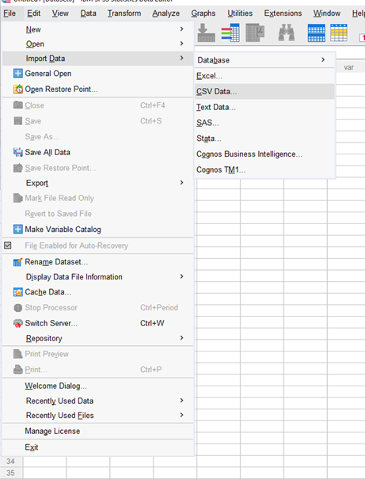

```{r}
library(knitr)
```


## Learning Objectives
At the end of this lab, you will be able to:

1.  Import data into SPSS
2.  Check and reset variable types and codes
3.  Check the descriptive statistics of your data
4.  Produce histograms to visually assess your data's distribution

## Lab Requirements
To complete this lab, you should have:

- [ ] &nbsp; Attended this week's lectures
- [ ] &nbsp; Installed SPSS on your computer


## Lab Tasks


### Import Data {.tabset .tabset-fade .tabset-pills}

#### Task Description
Import Data into SPSS
Describe some data here. Provide the link to download the data. 

#### Hint
Click the *File* tab in SPSS. What is the difference between the 'Open' and 'Import Data' options? What is the file type of ''Week1LabData'?

#### Solution
Click *Import Data* under the **File** tab. The data are in .csv format, so choose *CSV data*. Navigate to the folder where you've stored  'Week1LabData.csv' and select the file. In this case, the first row is the name for each column, so the 'First line contains variable names' should remain checked. Note that if you import data without column names, you'll need to uncheck this box. Click 'OK'. 

```{r, echo = F, out.width='45%'}

```


### Adjust Variable Types {.tabset .tabset-fade .tabset-pills}

#### Task Description
Update Variable Types in SPSS; Talk about categorical variables coded as numeric

#### Hint/Example
Have a toggle link they have to click to get hints here. 

#### Solution
Final solution goes here.

### Check Central Tendency {.tabset .tabset-fade .tabset-pills}

#### Task Description
Check the measures of central tendency discussed in class and report here. MORE DESCRIPTION

#### Hint/Example
Have a toggle link they have to click to get hints here. 

#### Solution
Final solution goes here.

### Check Variability {.tabset .tabset-fade .tabset-pills}

#### Task Description
Check the variability measures discussed in lecture and report here. MORE DESCRIPTION

#### Hint/Example
Have a toggle link they have to click to get hints here. 

#### Solution
Final solution goes here.


### Create a Frequency Table {.tabset .tabset-fade .tabset-pills}

#### Task Description
Create a frequency table task description goes here

#### Hint/Example
Have a toggle link they have to click to get hints here. 

#### Solution
Final solution goes here.


### Task 6 {.tabset .tabset-fade .tabset-pills}

#### Task Description
Compute the thresholds for 68%/95%/99% for the dataset. Description Here.

#### Hint/Example
Have a toggle link they have to click to get hints here. 

#### Solution
Final solution goes here.


### Task 7 {.tabset .tabset-fade .tabset-pills}

#### Task Description
WHAT TASK CAN GO HERE?

#### Hint/Example
Have a toggle link they have to click to get hints here. 

#### Solution
Final solution goes here.

### Create a Histogram {.tabset .tabset-fade .tabset-pills}

#### Task Description
Produce a histogram task description goes here

#### Hint/Example
Have a toggle link they have to click to get hints here. 

#### Solution
Final solution goes here.

### Task 9 {.tabset .tabset-fade .tabset-pills}

#### Task Description
Identify a certain proportion of data task description goes here

#### Hint/Example
Have a toggle link they have to click to get hints here. 

#### Solution
Final solution goes here.

### Report & Interpret {.tabset .tabset-fade .tabset-pills}

#### Task Description
Report and Interpret task description goes here

#### Hint/Example
Have a toggle link they have to click to get hints here. 

#### Solution
Final solution goes here.
