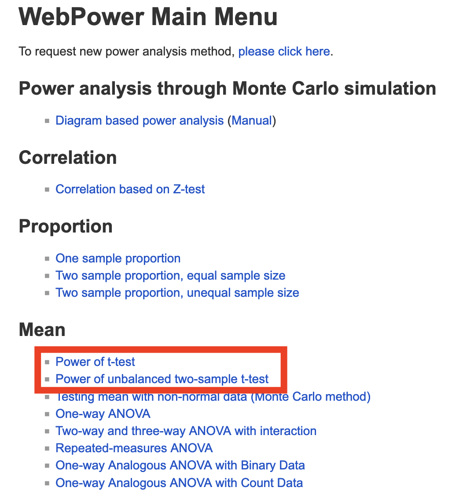
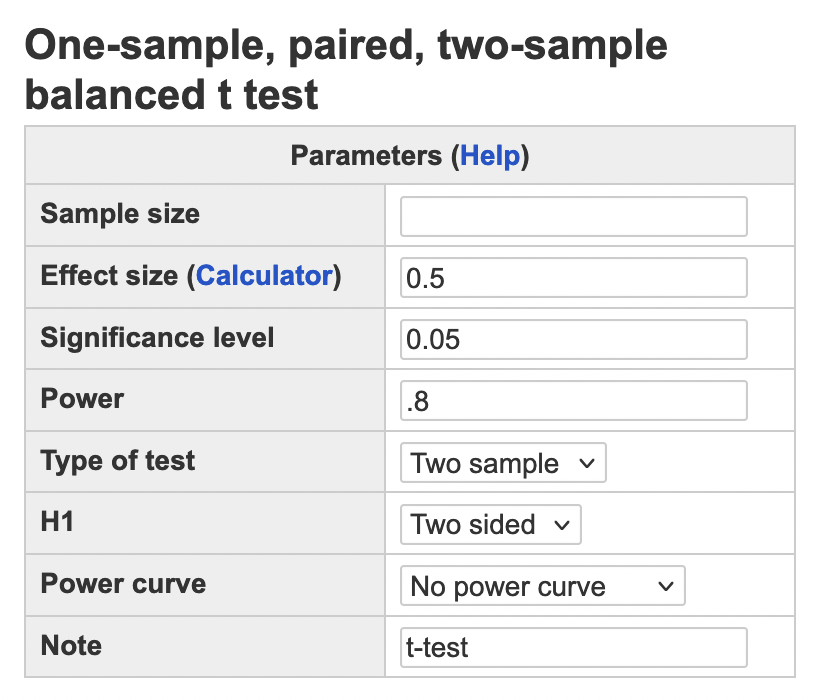
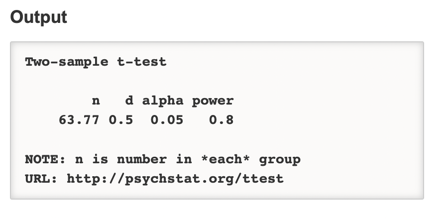
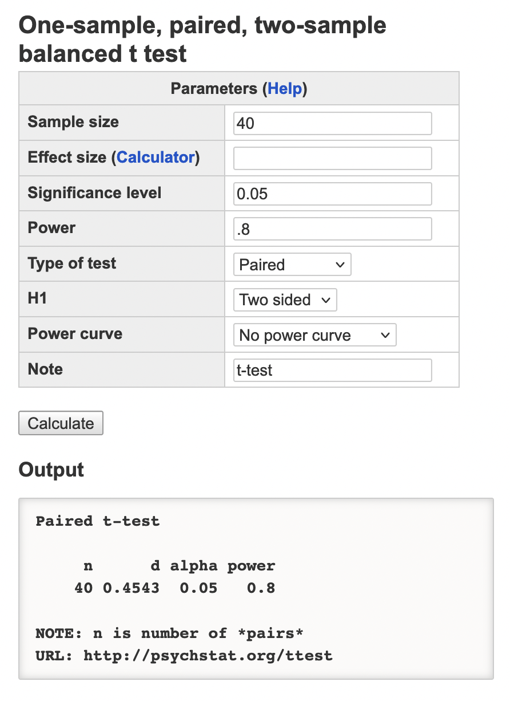
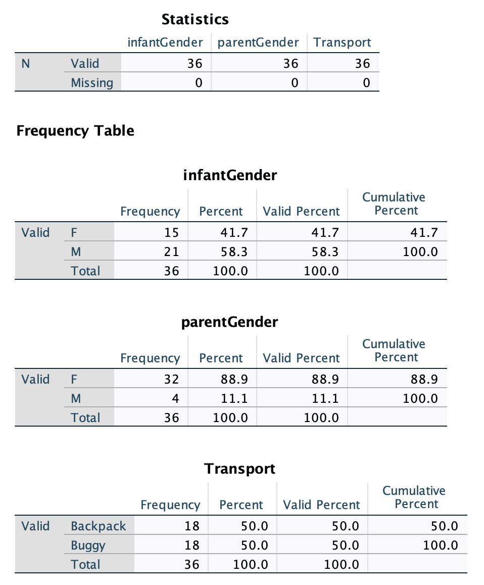

```{r setup, include=FALSE}
library(learnr)
library(tidyverse)
library(kableExtra)
library(knitr)
library(shiny)
library(shinyjs)
library(bslib)

baseColor <- '#4CA384'
accent1 <- '#9AD079'
accent2 <- '#C4C6C7'
accent3 <- '#19424C'
#tutorial_options(exercise.timelimit = 60)
```

```{r, context = 'server'}
output$distPlot <- renderPlot({
  set.seed(806)
      dat <- data.frame(X=rnorm(300, mean = input$mean, sd = input$sd))
      ggplot(data.frame(X = c(-30, 30)), aes(x = X)) +
        geom_histogram(data=dat, aes(x=X, y = after_stat(density)), fill = '#4CA384', color = '#19424C',
                       binwidth = 2) +
        stat_function(fun=dnorm, geom = "line", args = list(mean = input$mean, sd = input$sd),
                      linewidth = 1, color = '#19424C') +
        scale_x_continuous(breaks = seq(-30, 30, 10), limits=c(-30, 30)) +
        scale_y_continuous(limits=c(0, .4)) +
        theme(axis.title.x = element_text(size = 16, face = 'bold'),
              axis.text.x = element_text(size = 16),
              axis.line.y = element_blank(),
              axis.text.y = element_blank(),
              axis.ticks = element_blank(),
              axis.title.y = element_blank())
    })
```

## Intro to Today's Lab

During today's lab, you'll apply the concepts discussed during this week's lecture. Each lab consists of a range of tasks, with corresponding questions you can answer. Please note that the questions are not required and not marked, although they do provide a helpful source of formative feedback that will help you gauge your understanding. 

In this week's lab, you'll be working with data simulated based on [this paper](https://onlinelibrary.wiley.com/doi/10.1111/infa.12238). In this study, researchers tested the effect of infant transport modality on their social interaction. Specifically, they compared the use of buggies and backpacks. 

You'll be analysing data from two separate studies. In the first, researchers recruited 36 participants and split them into a backpack group and a buggy group. They then sent participants on a 15-minute walk with their infant and recorded the total number of parent vocalisations, infant vocalisations, and social interactions with strangers. They also recorded the number of times the parent touched their infant over the course of the walk.

You can download the dataset from the first experiment [here.](https://mtruelovehill.github.io/PRM/Labs/Week4LabData1.csv) This dataset contains the following variables:

```{r, echo = F}
dat <- read.csv('https://mtruelovehill.github.io/PRM/Labs/Week4LabData1.csv')
datInfo <- data.frame(VariableName=colnames(dat),
                      Description=c('Levels: M = Male, F = Female', 'Infant age in weeks', 
                                    'Levels: M = Male, F = Female', 'Parent age in years',
                                    'Transport Modality; Levels: Buggy; Backpack',
                                    'Total number of infant vocalisations',
                                    'Total number of infant vocalisations',
                                    'Total number of times parent touched infant',
                                    'Total number of interactions with strangers'))
 
datInfo %>%
  kbl(col.names=c('Variable Name', 'Description')) %>%
  kable_styling(full_width = F) %>%
  row_spec(0, bold = T, color=baseColor, font_size = 18, align='l') %>%
  column_spec(1, bold = T, width = '4.5cm')
```

<br>

After running the first study, the researchers wanted to further support their findings. They ran a second experiment using a within-subjects design. In this experiment, they recruited 40 participants and sent them out on 2 separate walks over the course of two weeks, once using a backpack and once a buggy. In this experiment, they recorded both infant and parent vocalisations from the same participants across each condition.

You can download the dataset from the second experiment [here.](https://mtruelovehill.github.io/PRM/Labs/Week4LabData2.csv) It contains the following variables:

```{r, echo = F}
dat2 <- read.csv('https://mtruelovehill.github.io/PRM/Labs/Week4LabData2.csv')
dat2Info <- data.frame(VariableName=colnames(dat2),
                      Description=c('Infant age in weeks', 'Parent age in years',
                                    'Levels: M = Male, F = Female', 
                                    'Levels: M = Male, F = Female', 
                                    'Total number of infant vocalisations while in buggy',
                                    'Total number of infant vocalisations while in backpack',
                                    'Total number of parent vocalisations while using buggy',
                                    'Total number of parent vocalisations while using backpack'))
 
dat2Info %>%
  kbl(col.names=c('Variable Name', 'Description')) %>%
  kable_styling(full_width = F) %>%
  row_spec(0, bold = T, color=baseColor, font_size = 18, align='l') %>%
  column_spec(1, bold = T, width = '4.5cm')
```

### Learning Objectives
At the end of this lab, you will be able to:

1. Identify hypotheses which may be tested using $t$-tests
2. Run an appropriate power analysis for both independent and paired-samples $t$-tests
3. Check assumptions for both independent- and paired-samples $t$-tests
4. Use SPSS to perform both independent- and paired-samples $t$-tests
5. Interpret and report results from both independent- and paired-samples $t$-tests


## State your Hypotheses

The first step when planning your analysis is to specify your research questions and associated hypotheses. You should make a separate hypothesis for every analysis. 

### Your Task

For each analysis:

+ State your research question

+ Identify the independent and dependent variables

+ State both the null and alternative hypothesis

+ Specify your hypothesis using statistical notation, [as directed in the lecture](https://mtruelovehill.github.io/PRM/Lectures/Week04_ttests_lecture.html#42)


```{r q1, echo = FALSE}
quiz(caption = 'Test Your Understanding',
     question('Which of the following research questions can be tested using a t-test? Please select all that apply.',
              answer('Hypothesis1', correct = T),
              answer('Hypothesis2'),
              answer('Hypothesis3'),
              answer('Hypothesis4'),
              answer('Hypothesis5'),
              random_answer_order = T,
              message = 'Feedback Here'),
     question('You have developed an intervention and want to test its effectiveness. You recruit a sample of participants and measure their symptom severity both before and after the intervention. You measure patient symptom severity on a continuous scale. You would like to compare the two symptom severity scores. Which of the following tests is most appropriate?',
              answer('One-sample t-test'),
              answer('Independent samples t-test'),
              answer('Paired-samples t-test', correct = T),
              message = "Because you have a pre- and post-intervention measurement from each participant, the two scores are considered to be paired. An individual's score on the post-test will not be independent of their scores on the pre-test. A paired-samples t-test will account for this lack of independence between the two groups of scores."))

```

<div class="container">
<details><summary><span style = "font-weight: bold; font-size: 16pt"> Click here for a hint </span></summary>

In the first study, you will be conducting 4 different analyses. In the second, you will be conducting two different analyses. You should specify your hypotheses/variables for each.

</details>
</div>
</br>

<div class="container">
<details><summary><span style = "font-weight: bold; font-size: 16pt"> Click here for the solution </span></summary>

<span style = "font-weight: bold; font-size: 14pt"> Study 1 </span>

<b>Research Question:</b> Does infant transport modality affect the infant's socialisation opportunities? Specifically, we are investigating whether the transportation modality affects the following during its use: (1) infant vocalisation to the parent; (2) parent vocalisation to the infant; (3) physical contact between the parent and infant; (4) interactions with others. 

<b> Variables </b>

(1) IV: Transportation Modality; DV: Infant Vocalisation

(2) IV: Transportation Modality; DV: Parent Vocalisation

(3) IV: Transportation Modality; DV: Physical Contact

(4) IV: Transportation Modality; DV: Outside Interaction

<b>Hypotheses:</b>

(1) $H_0: Infant\ Vocalisation_{buggy} = Infant\ Vocalisation_{backpack}$
    $H_1: Infant\ Vocalisation_{buggy} \neq Infant\ Vocalisation_{backpack}$

(2) $H_0: Parent\ Vocalisation_{buggy} = Parent\ Vocalisation_{backpack}$
    $H_1: Parent\ Vocalisation_{buggy} \neq Parent\ Vocalisation_{backpack}$

(3) $H_0: Contact_{buggy} = Contact_{backpack}$
    $H_1: Contact_{buggy} \neq Contact_{backpack}$

(4) $H_0: Interaction_{buggy} = Interaction_{backpack}$
    $H_1: Interaction_{buggy} \neq Interaction_{backpack}$

<span style = "font-weight: bold; font-size: 14pt"> Study 2 </span>

<b>Research Question:</b> Does infant transport modality affect the infant's socialisation opportunities? Specifically, we are investigating whether the transportation modality affects the following during its use: (1) infant vocalisation to the parent; (2) parent vocalisation to the infant.

<b> Variables </b>

(1) IV: Transportation Modality; DV: Infant Vocalisation

(2) IV: Transportation Modality; DV: Parent Vocalisation


<b>Hypotheses:</b>

(1) $H_0: Infant\ Vocalisation_{buggy}-Infant\ Vocalisation_{backpack} = 0$
    $H_1: Infant\ Vocalisation_{buggy}-Infant\ Vocalisation_{backpack} \neq 0$

(2) $H_0: Parent\ Vocalisation_{buggy}-Parent\ Vocalisation_{backpack} = 0$
    $H_1: Parent\ Vocalisation_{buggy}-Parent\ Vocalisation_{backpack} \neq 0$


<br>

Note that in both studies you could also use directional hypotheses, although it is not recommended. To specify direction, you would use $>$ or $<$ rather than $\neq$.

</details>
</div>
</br>

## Run the Appropriate Power Analyses 

After deciding on your hypotheses but before gathering data, you should run a power analysis to determine the sample necessary to capture your effect of interest. When running power analyses, you only need to run a single power analysis for each study design. In this case, you have 2 designs, so you will only need to run 2 analyses. 

Recall the effect size measure for $t$-tests, $d$:

| Strength | Absolute Magnitude of $d$ |
|:--------:|:-------------------------:|
| Weak     | $\leq$ .20                |
| Moderate | $\approx$ .50             |
| Strong   | $\geq$ .8                 |

### Your Task

+ For your first study, run a power analysis using $\alpha$ = .05 and power = .8 to determine the sample size necessary to detect a moderate effect size (d = .5). Assume you will have an equal number of participants in each group.

+ For the second study, let's imagine that you already had data from 40 participants recruited as part of a larger study. You want to determine the effect size this sample has the power to detect, given an $\alpha$ = .05 and a power = .8. Run the appropriate power analysis. 


Click [here to use WebPower to run your analysis](https://webpower.psychstat.org/wiki/models/index).

```{r q2, echo = FALSE}
quiz(caption = 'Test Your Understanding',
     question('You run a power analysis for a one-tailed (directional) test. Holding power, effect size, and alpha constant, how do the sample size requirements change compared to a two-tailed (nondirectional) test?',
                      answer('The sample size requirements increase for a one-tailed test'),
                      answer('The sample size requirements decrease for a one-tailed test', correct = T),
                      answer('The sample size requirements are identical for both one- and two- tailed tests'),
                      message = 'When using an alpha = .05, we consider values in the most extreme 5% of the distribution to be significant. When running a two-tailed test, this 5% is split in both directions, so the 2.5% highest AND 2.5% lowest values are considered significant. In a one-tailed test, only the extreme results in one direction are considered significant, so all 5% is grouped in a single area of the distribution. This naturally increases the power to detect an effect as the critical threshold in that direction is closer to the mean. Because of this, a smaller sample size in a one-tailed analysis can produce the same power level as a larger sample size in a two-tailed analysis.'),
     question_numeric('How many participants do you need to detect a weak effect (d = .2) with a paired-samples t-test, a nondirectional hypothesis, power = .8, and alpha = .05?',
                      answer(199, correct = T),
                      message = "You will need 199 participants to detect this effect. You will have needed to round up, as you can't have .2 participants."),
     question_numeric('How many total participants do you need to detect a strong effect (d = .8) with an independent-samples t-test, a directional hypothesis, power = .8, and alpha = .001?',
                      answer(102, correct = T),
                      message = "You will need 102 total participants to detect this effect (51 in each group)."),
     question_numeric('You are running a secondary analysis with 134 participants (85 in group 1; 49 in group 2). You make a nondirectional hypothesis and set alpha = .05. What is the maximum effect size you can detect with a power of 80%? Please round your answer to two decimal places.',
                      answer(.51, correct = T),
                      message = 'The maximum effect size you could detect in this instance is .51. In this example, you were working with an unbalanced sample, so you needed to run a power analysis that accounts for this. A power analysis that assumes equal group sizes would have given you a slightly different answer (.49). You would have also received an inaccurate result if you used the total sample size rather than sample per group (.34)'))
```

<div class="container">
<details><summary><span style = "font-weight: bold; font-size: 16pt"> Click here for a hint </span></summary>
Two important hints: 

(1) The power analysis uses/outputs the number of participants in each group, rather than the total number of participants. 
(2) Remember, the study design of your second study is slightly different from the first. This will affect the input to your power analysis.

</details>
</div>
</br>

<div class="container">
<details><summary><span style = "font-weight: bold; font-size: 16pt"> Click here for the solution </span></summary>

Navigate to the WebPower site. For $t$-tests, you'll be using one of these options, depending on whether your sample within each group will be equal or not.

```{r, echo = F, fig.align='center'}

```


<span style = "font-weight: bold; font-size: 14pt"> Study 1 </span>

Because you're assuming an equal sample size within each group, you will click the first option: "Power of t-test." You'll leave the Sample Size option blank, as that's the value you want to calculate. You'll fill in the other options as follows:

```{r, echo = F, fig.align='center'}

```

Because you'll be running an independent-samples $t$-test, the 'Type of Test' option will be 'Two sample.' Note that if you choose to use a directional hypothesis, you'll need to change the 'H1' value to 'Greater.' WebPower doesn't seem to work with 'Lesser' for some reason, but you can use 'Greater' regardless of the direction, as the results would be identical either way. Once you've entered the appropriate information, click 'Calculate' and the results will appear below. 

```{r, echo = F, fig.align='center'}

```

Note that the sample size refers to the sample PER GROUP, not the total sample. In other words, to achieve 80% power to detect a moderate effect size with an alpha = .05, you would need 64 participants per group, or 128 total participants.

<br>

<span style = "font-weight: bold; font-size: 14pt"> Study 2 </span>

In the case of your paired-samples analysis, you will once again have an equal sample size within each group. In this case, you want to calculate effect size, so you will leave that box blank and fill in the other values. You'll need to update 'Type of Test' to 'Paired.' If you entered everything properly, you'll get the following output:

```{r, echo = F, fig.align='center'}

```

With 40 participants and a within subjects design, you'll have 80% power to detect an effect of $d$ = .45, given $\alpha$ = .05. 

</details>
</div>
</br>


## Calculate Descriptive Data 

Before running any analyses, you should first check your data. In many cases, some kind of cleaning or data wrangling will be necessary. For instance, are there any missing values? Do you have any unexpected values or extreme outliers? Do you need to create a variable from the existing data (e.g., a summary metric for a cognitive task). These things should be dealt with before conducting the analyses.

Additionally, you'll need to compute descriptive data. You'll do this for both your main variables of interest and your sample's demographic data (this must be included in the Sample portion of your Methods section). 

### Your Task

+ Check Study 1 data.
  + Are variables coded correctly in SPSS?
  + Produce frequency tables for categorical variables
  + Compute the mean, standard deviation, minimum, and maximum on continuous data
  + Are there any missing values or outliers?
  
+ Check Study 2 data.
  + Are variables coded correctly in SPSS?
  + Produce frequency tables for categorical variables
  + Compute the mean, standard deviation, minimum, and maximum on continuous data
  + Are there any missing values or outliers?

```{r q3, echo = FALSE}
quiz(caption = 'Test Your Understanding',
     question_numeric("How many female infants participated in Study 1?",
              answer(15, correct = T),
              message = '15 female infants participated in Study 1.'),
     question_numeric('What percentage of parent participants were male in Study 1?',
              answer(11.1, correct = T),
              message = '11.1% of the parents in this study were male.'),
     question("Considering the power analysis results from the previous step, Study 1 is adequately powered to detect a moderate effect size, given power = .8 and alpha = .05",
              answer("True"),
              answer("False", correct = T),
              message = 'No; Study 1 only has 18 participants per group. If the effect of transport modality on socialisation is weak or moderate, a Type II error is likely to occur.'))
```

<div class="container">
<details><summary><span style = "font-weight: bold; font-size: 16pt"> Click here for a hint </span></summary>

Hint Here

</details>
</div>
</br>

<div class="container">
<details><summary><span style = "font-weight: bold; font-size: 16pt"> Click here for the solution </span></summary>

<span style = "font-weight: bold; font-size: 14pt"> Study 1 </span>

When you check your data under *Variable View*, you'll notice that your dependent variables have been coded as 'Nominal'. You'll need to change this to 'Scale' in order for the $t$-test to work properly.

Next, produce frequency tables and descriptive statistics by navigating to *Analyze > Descriptive Statistics > Frequencies*. Add your categorical variables to the *Variable(s)* box and make sure 'Display Frequency Tables' is checked, then click 'OK'. If you've done this properly, you should get the following output:

```{r, echo=F, fig.align='center'}

```

Here, you can see the frequencies of participants in each category. You might note that there were slightly more male infants than females, but there were substantially more female parents than males. You can see that there are equal participants in the 'Buggy' and 'Backpack' groups, as expected.

After checking the categorical variables, you can check the continuous data. 


<span style = "font-weight: bold; font-size: 14pt"> Study 2 </span>


</details>
</div>
</br>


## Visualise Your Data 

Task Here.

```{r q4, echo = FALSE}
# quiz(caption = 'Test Your Understanding',
#      question("At least one of the groups is limited in size compared to the others",
#               answer("True", correct = T),
#               answer("False"),
#               message = 'The nonbinary group is much smaller than the other two measured groups.'),
#      question_numeric("How many total datapoints do you have for the gender variable?",
#               answer(48, correct=T)),
#      question_numeric("What percentage of participants are female?",
#               answer(41.7, correct=T)),
#      question_numeric('How many nonbinary participants are in your sample?',
#               answer(2, correct=T)))
```

<div class="container">
<details><summary><span style = "font-weight: bold; font-size: 16pt"> Click here for a hint </span></summary>

Hint Here

</details>
</div>
</br>

<div class="container">
<details><summary><span style = "font-weight: bold; font-size: 16pt"> Click here for the solution </span></summary>

Solution Here.

</details>
</div>
</br>

## Check Assumptions

Task Here

<div class="container">
<details><summary><span style = "font-weight: bold; font-size: 16pt"> Click here for a hint </span></summary>

Hint Here

</details>
</div>
</br>

<div class="container">
<details><summary><span style = "font-weight: bold; font-size: 16pt"> Click here for the solution </span></summary>

Solution Here.

</details>
</div>
</br>

## Run Independent Samples $t$-test 

Task Description.
* Maybe also discuss degrees of freedom here

```{r q6, echo = FALSE}
# quiz(caption = 'Test Your Understanding',
#      question("Which of the following central tendency measures could be used to describe age? Please select all that apply.",
#               answer("Mean", correct = T),
#               answer("Median", correct = T),
#               answer('Mode', correct = T),
#               message = 'All of the above could technically be used to describe the Age variable. However, it is most common to use the
#               mean, as it includes information from each observation.'),
#      question("Which of the following central tendency measures could be used to describe gender? Please select all that apply.",
#               answer("Mean"),
#               answer("Median"),
#               answer('Mode', correct = T),
#               message = 'As a categorical variable, there is no numeric relationship between values in the gender variable. Therefore, 
#               the mode is the only measure of central tendency that is appropriate to describe this variable'),
#      question_numeric("What is the average score on Assessment A?",
#               answer(39.10, correct=T)),
#      question_numeric("What is the most common age in this sample?",
#               answer(19, correct=T)),
#      question_numeric("What is the median score on Assessment D?",
#               answer(81.87, correct=T))
# )
```

<div class="container">
<details><summary><span style = "font-weight: bold; font-size: 16pt"> Click here for a hint </span></summary>

Hint Here

</details>
</div>
</br>

<div class="container">
<details><summary><span style = "font-weight: bold; font-size: 16pt"> Click here for the solution </span></summary>

Solution Here.

</details>
</div>
</br>

## Calculate Effect Size for Independent-Samples $t$-Test

Task here.

```{r q7, echo = FALSE}
# quiz(caption = 'Test Your Understanding',
#      question_numeric("What is the IQR for Assessment B?",
#               answer(4, correct=T),
#               message = "To get the IQR for a variable, you'll need to subtract the 25th percentile from the 75th percentile."),
#      question_numeric("What is the maximum score on Assessment C?",
#               answer(78, correct=T)),
#      question_numeric("What is the standard deviation of scores on Assessment D? Please report your answer to two decimal places.",
#               answer(2.15, correct=T))
# )
```

<div class="container">
<details><summary><span style = "font-weight: bold; font-size: 16pt"> Click here for a hint </span></summary>

Hint Here

</details>
</div>
</br>

<div class="container">
<details><summary><span style = "font-weight: bold; font-size: 16pt"> Click here for the solution </span></summary>

Solution Here.

</details>
</div>
</br>
</br>

## Run a Paired-Samples $t$-Test 

Task here.

```{r distPlot, echo = F}
# 
# fluidRow(column(4, 
#   sliderInput("mean","Value of Mean:", min = -6, max = 6, value = 0, step = 2),
#   sliderInput('sd', 'Value of SD:', min = 1, max = 5, value = 1, step = .25)),
#   column(8, plotOutput('distPlot')))
# 
# tags$style(HTML(".js-irs-0 .irs-single, .js-irs-0 .irs-bar-edge, .js-irs-0 .irs-bar {background: #4CA384}"))
# tags$style(HTML(".js-irs-1 .irs-single, .js-irs-1 .irs-bar-edge, .js-irs-1 .irs-bar {background: #4CA384}"))

```

<div class="container">
<details><summary><span style = "font-weight: bold; font-size: 16pt"> Click here for a hint </span></summary>

Hint Here

</details>
</div>
</br>

<div class="container">
<details><summary><span style = "font-weight: bold; font-size: 16pt"> Click here for the solution </span></summary>

Solution Here.

</details>
</div>
</br>


## Calculate Effect Size for a Paired-Samples $t$-Test 

Task here.

<div class="container">
<details><summary><span style = "font-weight: bold; font-size: 16pt"> Click here for a hint </span></summary>

Hint Here

</details>
</div>
</br>

<div class="container">
<details><summary><span style = "font-weight: bold; font-size: 16pt"> Click here for the solution </span></summary>

Solution Here.

</details>
</div>
</br>

## Report & Interpret

Task here.


<div class="container">
<details><summary><span style = "font-weight: bold; font-size: 16pt"> Click here for a hint </span></summary>

Hint Here

</details>
</div>
</br>

<div class="container">
<details><summary><span style = "font-weight: bold; font-size: 16pt"> Click here for the solution </span></summary>

Solution Here.

</details>
</div>
</br>

