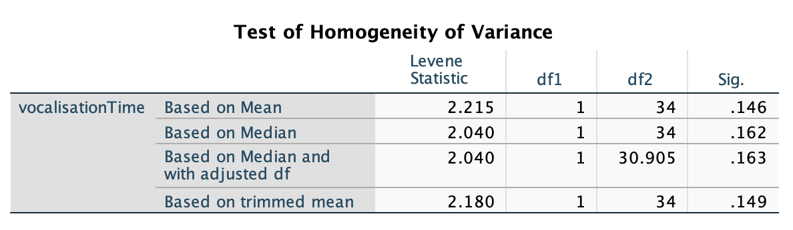

```{r setup, include=FALSE}
library(learnr)
library(tidyverse)
library(kableExtra)
library(knitr)
library(shiny)
library(shinyjs)
library(bslib)

baseColor <- '#4CA384'
accent1 <- '#9AD079'
accent2 <- '#C4C6C7'
accent3 <- '#19424C'
#tutorial_options(exercise.timelimit = 60)
```

```{r, context = 'server'}
output$distPlot <- renderPlot({
  set.seed(806)
      dat <- data.frame(X=rnorm(300, mean = input$mean, sd = input$sd))
      ggplot(data.frame(X = c(-30, 30)), aes(x = X)) +
        geom_histogram(data=dat, aes(x=X, y = after_stat(density)), fill = '#4CA384', color = '#19424C',
                       binwidth = 2) +
        stat_function(fun=dnorm, geom = "line", args = list(mean = input$mean, sd = input$sd),
                      linewidth = 1, color = '#19424C') +
        scale_x_continuous(breaks = seq(-30, 30, 10), limits=c(-30, 30)) +
        scale_y_continuous(limits=c(0, .4)) +
        theme(axis.title.x = element_text(size = 16, face = 'bold'),
              axis.text.x = element_text(size = 16),
              axis.line.y = element_blank(),
              axis.text.y = element_blank(),
              axis.ticks = element_blank(),
              axis.title.y = element_blank())
    })
```

## Intro to Today's Lab

During today's lab, you'll apply the concepts discussed during this week's lecture. Each lab consists of a range of tasks, with corresponding questions you can answer. Please note that the questions are not required and not marked, although they do provide a helpful source of formative feedback that will help you gauge your understanding. 

In this week's lab, you'll be working with data simulated based on [this paper](https://onlinelibrary.wiley.com/doi/10.1111/infa.12238). In this study, researchers tested the effect of infant transport modality on their social interaction. Specifically, they compared the use of buggies and backpacks. 

You'll be analysing data from two separate experiments In the first, researchers recruited 36 participants and split them into a backpack group and a buggy group. They then sent participants on a 15-minute walk with their infant and recorded the total number of parent and infant vocalisations. They also recorded the number of times the parent touched their infant over the course of the walk.

You can download the dataset from the first experiment [here.](https://mtruelovehill.github.io/PRM/Labs/Week4LabData1.csv) This dataset contains the following variables:

```{r, echo = F}
dat <- read.csv('https://mtruelovehill.github.io/PRM/Labs/Week4LabData1.csv')
datInfo <- data.frame(VariableName=colnames(dat),
                      Description=c('Levels: M = Male, F = Female', 'Infant age in weeks',
                                    'Transport Modality; Levels: Buggy; Backpack',
                                    'Total number of infant vocalisations',
                                    'Total number of times parent touched infant'))
 
datInfo %>%
  kbl(col.names=c('Variable Name', 'Description')) %>%
  kable_styling(full_width = F) %>%
  row_spec(0, bold = T, color=baseColor, font_size = 18, align='l') %>%
  column_spec(1, bold = T, width = '4.5cm')
```

<br>

After running the first study, the researchers wanted to further support their findings. They ran a second experiment using a within-subjects design. In this experiment, they recruited 40 participants and sent them out on 2 separate walks over the course of two weeks, once using a backpack and once a buggy. In this experiment, they recorded infant vocalisations from the same participants across each condition.

You can download the dataset from the second experiment [here.](https://mtruelovehill.github.io/PRM/Labs/Week4LabData2.csv) It contains the following variables:

```{r, echo = F}
dat2 <- read.csv('https://mtruelovehill.github.io/PRM/Labs/Week4LabData2.csv')
dat2Info <- data.frame(VariableName=colnames(dat2),
                      Description=c('Infant age in weeks',
                                    'Levels: M = Male, F = Female', 
                                    'Total number of infant vocalisations while in buggy',
                                    'Total number of infant vocalisations while in backpack'))
 
dat2Info %>%
  kbl(col.names=c('Variable Name', 'Description')) %>%
  kable_styling(full_width = F) %>%
  row_spec(0, bold = T, color=baseColor, font_size = 18, align='l') %>%
  column_spec(1, bold = T, width = '4.5cm')
```

### Learning Objectives
At the end of this lab, you will be able to:

1. Identify hypotheses which may be tested using $t$-tests
2. Run an appropriate power analysis for both independent and paired-samples $t$-tests
3. Check assumptions for both independent- and paired-samples $t$-tests
4. Use SPSS to perform both independent- and paired-samples $t$-tests
5. Interpret and report results from both independent- and paired-samples $t$-tests


## State your Hypotheses

The first step when planning your analysis is to specify your research questions and associated hypotheses. You should make a separate hypothesis for every analysis. 

### Your Task

For each analysis:

+ State your research question

+ Identify the independent and dependent variables

+ State both the null and alternative hypothesis

+ Specify your hypothesis using statistical notation, [as directed in the lecture](https://mtruelovehill.github.io/PRM/Lectures/Week04_ttests_lecture.html#42)

<div class="container">
<details><summary><span style = "font-weight: bold; font-size: 16pt"> Click here for a hint </span></summary>

In the first study, you will be conducting 2 different analyses. In the second, you will be conducting a single analysis. You should specify your hypotheses/variables for each.

</details>
</div>
</br>

<div class="container">
<details><summary><span style = "font-weight: bold; font-size: 16pt"> Click here for the solution </span></summary>

<span style = "font-weight: bold; font-size: 14pt"> Study 1 </span>

<b>Research Question:</b> Does infant transport modality affect the infant's socialisation opportunities? Specifically, we are investigating whether the transportation modality affects the following during its use: (1) infant vocalisation to the parent; (2) physical contact between the parent and infant. 

<b> Variables </b>

(1) IV: Transportation Modality; DV: Infant Vocalisation

(2) IV: Transportation Modality; DV: Physical Contact


<b>Hypotheses:</b>

(1) $H_0: Infant\ Vocalisation_{buggy} = Infant\ Vocalisation_{backpack}$
    $H_1: Infant\ Vocalisation_{buggy} \neq Infant\ Vocalisation_{backpack}$

(2) $H_0: Contact_{buggy} = Contact_{backpack}$
    $H_1: Contact_{buggy} \neq Contact_{backpack}$


<span style = "font-weight: bold; font-size: 14pt"> Study 2 </span>

<b>Research Question:</b> Does infant transport modality affect the amount of infant vocalisation during use?

<b> Variables </b>

IV: Transportation Modality; DV: Infant Vocalisation


<b>Hypotheses:</b>

$H_0: Infant\ Vocalisation_{buggy}-Infant\ Vocalisation_{backpack} = 0$
$H_1: Infant\ Vocalisation_{buggy}-Infant\ Vocalisation_{backpack} \neq 0$


<br>

Note that in both studies you could also use directional hypotheses, although it is not recommended. To specify direction, you would use $>$ or $<$ rather than $\neq$.

</details>
</div>
</br>

```{r q1, echo = FALSE}
quiz(caption = 'Test Your Understanding',
     question('Which of the following research questions could be tested using a t-test? Please select all that apply.',
              answer("Is this year's average rice crop yield significantly higher than last year's?", correct = T),
              answer('How do Therapies A, B, and C compare to each other in reduction of symptoms?'),
              answer('Does a 30-minute weightlifting routine burn more calories than a 30-minute cardio routine?', correct = T),
              answer('Is there an association between brain volume and processing speed?'),
              answer("Is participant performance on a True/False test signficantly better than chance (50%)?", correct = T),
              random_answer_order = T,
              message = 'The therapy research question is better suited to an ANOVA or a regression, as it is comparing 3 means. A t-test can only handle two at a time. The brain volume research question asks about an association between two continuous variables. A t-test requires a categorical independent variable. This question is better answered with a correlation or regression.'),
     question('You have developed an intervention and want to test its effectiveness. You recruit a sample of participants and measure their symptom severity both before and after the intervention. You measure patient symptom severity on a continuous scale. You would like to compare the two symptom severity scores. Which of the following tests is most appropriate?',
              answer('One-sample t-test'),
              answer('Independent samples t-test'),
              answer('Paired-samples t-test', correct = T),
              message = "Because you have a pre- and post-intervention measurement from each participant, the two scores are considered to be paired. An individual's score on the post-test will not be independent of their scores on the pre-test. A paired-samples t-test will account for this lack of independence between the two groups of scores."))

```

## Run the Appropriate Power Analyses 

After deciding on your hypotheses but before gathering data, you should run a power analysis to determine the sample necessary to capture your effect of interest. When running power analyses, you only need to run a single power analysis for each study design. In this case, you have 2 designs, so you will only need to run 2 analyses. 

Recall the effect size measure for $t$-tests, $d$:

| Strength | Absolute Magnitude of $d$ |
|:--------:|:-------------------------:|
| Weak     | $\leq$ .20                |
| Moderate | $\approx$ .50             |
| Strong   | $\geq$ .8                 |

### Your Task

+ For your first study, run a power analysis using $\alpha$ = .05 and power = .8 to determine the sample size necessary to detect a moderate effect size (d = .5). Assume you will have an equal number of participants in each group.

+ For the second study, let's imagine that you already had data from 40 participants recruited as part of a larger study. You want to determine the effect size this sample has the power to detect, given an $\alpha$ = .05 and a power = .8. Run the appropriate power analysis. 


Click [here to use WebPower to run your analysis](https://webpower.psychstat.org/wiki/models/index).

<div class="container">
<details><summary><span style = "font-weight: bold; font-size: 16pt"> Click here for a hint </span></summary>
Two important hints: 

(1) The power analysis uses/outputs the number of participants in each group, rather than the total number of participants. 
(2) Remember, the study design of your second study is slightly different from the first. This will affect the input to your power analysis.

</details>
</div>
</br>

<div class="container">
<details><summary><span style = "font-weight: bold; font-size: 16pt"> Click here for the solution </span></summary>

Navigate to the WebPower site. For $t$-tests, you'll be using one of these options, depending on whether your sample within each group will be equal or not.

```{r, echo = F, fig.align='center'}
knitr::include_graphics('https://mtruelovehill.github.io/PRM/Labs/images/week4_2a.png')
```


<span style = "font-weight: bold; font-size: 14pt"> Study 1 </span>

Because you're assuming an equal sample size within each group, you will click the first option: "Power of t-test." You'll leave the Sample Size option blank, as that's the value you want to calculate. You'll fill in the other options as follows:

```{r, echo = F, fig.align='center'}
knitr::include_graphics('https://mtruelovehill.github.io/PRM/Labs/images/week4_2b.png')
```

Because you'll be running an independent-samples $t$-test, the 'Type of Test' option will be 'Two sample.' Note that if you choose to use a directional hypothesis, you'll need to change the 'H1' value to 'Greater.' WebPower doesn't seem to work with 'Lesser' for some reason, but you can use 'Greater' regardless of the direction, as the results would be identical either way. Once you've entered the appropriate information, click 'Calculate' and the results will appear below. 

```{r, echo = F, fig.align='center'}
knitr::include_graphics('https://mtruelovehill.github.io/PRM/Labs/images/week4_2c.png')
```

Note that the sample size refers to the sample PER GROUP, not the total sample. In other words, to achieve 80% power to detect a moderate effect size with an alpha = .05, you would need 64 participants per group, or 128 total participants.

<br>

<span style = "font-weight: bold; font-size: 14pt"> Study 2 </span>

In the case of your paired-samples analysis, you will once again have an equal sample size within each group. In this case, you want to calculate effect size, so you will leave that box blank and fill in the other values. You'll need to update 'Type of Test' to 'Paired.' If you entered everything properly, you'll get the following output:

```{r, echo = F, fig.align='center'}
knitr::include_graphics('https://mtruelovehill.github.io/PRM/Labs/images/week4_2d.png')
```

With 40 participants and a within subjects design, you'll have 80% power to detect an effect of $d$ = .45, given $\alpha$ = .05. 

</details>
</div>
</br>

```{r q2, echo = F}

quiz(caption = 'Test Your Understanding',
     question_numeric('You are running a secondary analysis with 134 participants (85 in group 1; 49 in group 2). You make a nondirectional hypothesis and set alpha = .05. What is the maximum effect size you can detect with a power of 80%? Please round your answer to two decimal places.',
                      answer(.51, correct = T),
                      message = 'The maximum effect size you could detect in this instance is .51. In this example, you were working with an unbalanced sample, so you needed to run a power analysis that accounts for this. A power analysis that assumes equal group sizes would have given you a slightly different answer (.49). You would have also received an inaccurate result if you used the total sample size rather than sample per group (.34)'),
     question_numeric('How many total participants do you need to detect a strong effect (d = .8) with an independent-samples t-test, a directional hypothesis, power = .8, and alpha = .001?',
                      answer(199, correct = T),
                      message = 'You will need 199 participants to detect this effect. You will have needed to round up, as you cannot have .2 participants.'),
     question('You run a power analysis for a one-tailed (directional) test. Holding power, effect size, and alpha constant, how do the sample size requirements change compared to a two-tailed (nondirectional) test?',
              answer('The sample size requirements increase for a one-tailed test'),
              answer('The sample size requirements decrease for a one-tailed test', correct = T),
              answer('The sample size requirements are identical for both one- and two-tailed tests'),
              message='When using an alpha = .05, we consider values in the most extreme 5% of the distribution to be significant. When running a two-tailed test, this 5% is split in both directions, so the 2.5% highest AND 2.5% lowest values are considered significant. In a one-tailed test, only the extreme results in one direction are considered significant, so all 5% is grouped in a single area of the distribution. This naturally increases the power to detect an effect as the critical threshold in that direction is closer to the mean. Because of this, a smaller sample size in a one-tailed analysis can produce the same power level as a larger sample size in a two-tailed analysis.'))

```

## Study 1: Check Descriptive Data 

Before running any analyses, you should first check your data. In many cases, some kind of cleaning or data wrangling will be necessary. For instance, are there any missing values? Do you have any unexpected values or extreme outliers? Do you need to create a variable from the existing data (e.g., a summary metric for a cognitive task). These things should be dealt with before conducting the analyses.

Additionally, you'll need to compute descriptive data. You'll do this for both your main variables of interest and your sample's demographic data (this must be included in the Sample portion of your Methods section). 

### Your Task

+ Check Study 1 data.
  + Are variables coded correctly in SPSS?
  + Produce frequency tables for categorical variables
  + Compute the mean, standard deviation, minimum, and maximum on continuous data
  + Are there any missing values or outliers?

<div class="container">
<details><summary><span style = "font-weight: bold; font-size: 16pt"> Click here for a hint </span></summary>

There are some issues to address under the *Variable View* tab. Remember to use the *Frequencies* option rather than *Descriptives*. 

</details>
</div>
</br>

<div class="container">
<details><summary><span style = "font-weight: bold; font-size: 16pt"> Click here for the solution </span></summary>

When you check your data under *Variable View*, you'll notice that your dependent variables have been coded as 'Nominal'. You'll need to change this to 'Scale' in order for the $t$-test to work properly.

Next, produce frequency tables and descriptive statistics by navigating to *Analyze > Descriptive Statistics > Frequencies*. Add your 2 categorical variables to the *Variable(s)* box and make sure 'Display Frequency Tables' is checked, then click 'OK'. If you've done this properly, you should get the following output:

```{r, echo=F, fig.align='center'}
knitr::include_graphics('https://mtruelovehill.github.io/PRM/Labs/images/week4_3a.png')
```

Here, you can see the frequencies of participants in each category. You might note that there were slightly more male infants than females, but there were substantially more female parents than males. You can see that there are equal participants in the 'Buggy' and 'Backpack' groups, as expected.

After checking the categorical variables, you can check the continuous data. Open the *Frequencies* box once again and replace your categorical variables with your 3 continuous variables. Uncheck 'Display Frequency Tables' and click the 'Statistics' box. Select 'Mean', 'Std. deviation', 'Maximum' and 'Minimum', then click 'Continue'. Click 'OK'. You should get the following table:

```{r, echo=F, fig.align='center'}
knitr::include_graphics('https://mtruelovehill.github.io/PRM/Labs/images/week4_3b.png')
```

Have a look at the values here. There is no missing data, and the values seem reasonable, so you can move forward to the next step.


</details>
</div>
</br>

```{r q3, echo = FALSE}
quiz(caption = 'Test Your Understanding',
     question_numeric("How many female infants participated?",
              answer(15, correct = T),
              message = '15 female infants participated in Study 1.'),
     question("Considering the power analysis results from the previous step, Study 1 is adequately powered to detect a moderate effect size, given power = .8 and alpha = .05",
              answer("True"),
              answer("False", correct = T),
              message = 'No; Study 1 only has 18 participants per group. If the effect of transport modality on socialisation is weak or moderate, a Type II error is likely to occur.'),
     question_numeric('What is the minimum number of infant vocalisations?',
                      answer(2, correct = T),
                      message = 'The minimum number of infant vocalisations is 2.'))
```


## Study 1: Check Assumptions

The assumptions of an independent-samples $t$ test are:

(1) Dependent variable must be normally distributed

(2) Observations must be independent of each other

(3) The two groups must exhibit approximately equal variance in the dependent variable 

### Your Task

Check each of these assumptions in your data.

<div class="container">
<details><summary><span style = "font-weight: bold; font-size: 16pt"> Click here for a hint </span></summary>

Have a look at the [lecture slides](https://mtruelovehill.github.io/PRM/Lectures/Week04_ttests_lecture.html#50) if you're lost.

</details>
</div>
</br>

<div class="container">
<details><summary><span style = "font-weight: bold; font-size: 16pt"> Click here for the solution </span></summary>


<span style = "font-weight: bold; font-size: 14pt"> Normality </span>

Normality can be assessed in multiple ways. I prefer visual assessment, as the statistical tests can be overly sensitive, particularly with larger sample sizes. To check the histograms, click *Analyze > Descriptive Statistics > Frequencies* and add your dependent variables to the 'Variable(s)' box. Click 'Charts', then select 'Histograms' and make sure the box that says, 'Show normal curve on histogram' is checked. Click 'Continue.' While here, you can also go to the 'Statistics' box and select 'Skewness' and 'Kurtosis'. Once this is all done, click 'OK'.

```{r, echo = F, fig.align= 'center'}
knitr::include_graphics('https://mtruelovehill.github.io/PRM/Labs/images/week4_4a.png')
```

Skewness and kurtosis values are all within the bounds of -1 and 1, which is ideal. Next, you can check the histograms with the normal curve for each of the dependent variables:

```{r, echo = F, fig.align= 'center', out.width='75%'}
knitr::include_graphics('https://mtruelovehill.github.io/PRM/Labs/images/week4_4b.png')
```

```{r, echo = F, fig.align= 'center', out.width='75%'}
knitr::include_graphics('https://mtruelovehill.github.io/PRM/Labs/images/week4_4c.png')
```

None of them seem to be perfectly normal, but this is not unexpected with such a small sample. In any case, they're generally normal. There is no evidence of a significant normality violation. 

You can also check the Q-Q plots. To do this, click *Analyze > Descriptive Statistics > Q-Q Plots*. Add your three dependent variables to the 'Variable(s)' box, confirm that the 'Test Distribution' is set to 'Normal' and then click 'OK'. This will produce several pieces of output, but you want to specifically focus on the Normal Q-Q Plots. Data that are generally normal will more closely follow the black diagonal.

```{r, echo = F, fig.align= 'center', out.width='75%'}
knitr::include_graphics('images/week4_4d.png')
```

The points go very slightly off the line in the upper range, but not in a concerning way. Still ok.

```{r, echo = F, fig.align= 'center', out.width='75%'}

```

Looks good.

These figures indicate that the data have not violated the assumption of normality.

<span style = "font-weight: bold; font-size: 14pt"> Independence </span>

Assessing independence requires you to have an understanding of the conditions under which your data were collected. The study design (between-participants) increases the likelihood that the observations are independent of each other, so this assumption is met.

<span style = "font-weight: bold; font-size: 14pt"> Homogeneity of Variance </span>

This can be tested using Levene's test. This test runs automatically when you perform a $t$-test, but you can also run it separately. To run the test outwith the analysis, navigate to *Analyze > Descriptive Statistics > Explore*. Place the dependent variables in the 'Dependent List' box and the Independent/Grouping variable in the 'Factor List' box. Click the 'Plots' button. In the 'Spread vs Level with Levene Test' area, select 'Power Estimation', then click 'Continue' and 'OK'. The results will appear in the output:

```{r, echo = F, fig.align= 'center'}
knitr::include_graphics('https://mtruelovehill.github.io/PRM/Labs/images/week4_4f.png')
```

You can check the line for each variable that says 'Based on Mean' and evaluate the 'Sig.' column. While the Touch variable meets the assumption ($p$ > .05), the Infant Vocalisation variable violates the assumption of equal variances ($p$ = .048). This can be accounted for when the primary analysis is performed. 

</details>
</div>
</br>

```{r q4, echo = FALSE}
quiz(caption = 'Test Your Understanding',
     question("At least one of the variables violates an assumption",
              answer("True", correct = T),
              answer("False"),
              message = 'The Infant Vocalisation variable violates the Homogeneity of Variance assumption.'),
     question("Which of the following could be used to assess normality? Please select all that apply.",
              answer('Histograms', correct = T),
              answer('Q-Q Plots', correct = T),
              answer('Shapiro-Wilk Test', correct = T),
              answer('Skewness & Kurtosis values', correct = T),
              message = 'All of the above could be used to assess normality. However, statistical tests are not recommended.'))
```

## Study 1: Perform Primary Analysis

As you are comparing two independent means, you'll run independent-samples $t$-tests to provide statistical support for your hypotheses. Recall that you're testing the following hypotheses:

$$H_1: Infant\ Vocalisation_{buggy} \neq Infant\ Vocalisation_{backpack}$$

$$H_1: Contact_{buggy} \neq Contact_{backpack}$$


### Your Task

+ Run an independent-samples $t$-test to test each of your hypotheses

+ Compute effect sizes and check confidence intervals for each of your analyses

<div class="container">
<details><summary><span style = "font-weight: bold; font-size: 16pt"> Click here for a hint </span></summary>

Although you're performing 2 separate tests, you can run them at the same time.

</details>
</div>
</br>

<div class="container">
<details><summary><span style = "font-weight: bold; font-size: 16pt"> Click here for the solution </span></summary>

Click *Analyze > Compare Means and Proportions > Independent-Samples T test*. Move your DVs into the 'Test Variable(s)' box and your IV into the 'Grouping Variable' box. Click 'Define Groups' and enter the names of your groups exactly as they are provided in the spreadsheet. In the main box, make sure 'Estimate effect sizes' is checked, then click 'OK' to run the test.

The first bit of output will provide the descriptive statistics separated by your IV. This is useful information to report in your paper, so take note.

```{r, echo = F, fig.align= 'center', out.width='75%'}
knitr::include_graphics('https://mtruelovehill.github.io/PRM/Labs/images/week4_5a.png')
```

The second bit of output provides the results of your $t$-tests. The first portion provides the results from your Levene's test. In cases where Levene's test is not significant, you can look at the results from the rows that say 'Equal variances assumed'. If the test is significant, there is a slightly different version of a $t$-test that is robust to a violation of the equal variance assumption. The results from this test are provided in the rows that say 'Equal variances not assumed'. 

```{r, echo = F, fig.align= 'center'}
knitr::include_graphics('https://mtruelovehill.github.io/PRM/Labs/images/week4_5b.png')
```

The results from the t-test suggest that infant vocalisation was significantly different between buggy and backpack users, while touch was not significantly different between the two groups. The confidence intervals for the variables further support this; the CI associated with vocalisation does not contain the null value of 0, while the CI associated with Touch does.

```{r, echo = F, fig.align= 'center'}
knitr::include_graphics('https://mtruelovehill.github.io/PRM/Labs/images/week4_5c.png')
```

Checking the effect sizes, you can see that the absolute value of Cohen's $d$ is greater than 1 for infant vocalisation. This indicates there is a strong effect of transport modality on infant vocalisation. 

```{r, echo = F, fig.align= 'center', out.width='75%'}
knitr::include_graphics('https://mtruelovehill.github.io/PRM/Labs/images/week4_5d.png')
```


</details>
</div>
</br>

```{r q5, echo = FALSE}
quiz(caption = 'Test Your Understanding',
     question_numeric("What is the t-value associated with infant vocalisation? Please round your answer to two decimal places.",
              answer(-3.70, correct = T),
              message = 'The t-value associated with this test is -3.70.'),
     question("A researcher conducts a Levene's test and finds that the associated p = .02. Which of the following is true? Please select all that apply.",
              answer('The homogeneity of variance assumption has been violated', correct = T),
              answer('The assumption of normality has been violated'),
              answer('No assumptions have been violated'),
              answer('When looking at the corresponding t-test results, the researcher should check the "Equal variances assumed" row'),
              answer('When looking at the corresponding t-test results, the researcher should check the "Equal variances not assumed" row', correct = T),
              message = "When Levene's test is significant, it means the homogeneity assumption has been violated and equal variance cannot be assumed."),
     question('A researcher makes a nondirectional hypothesis and runs an independent t-test in SPSS. Under which column will they find the appropriate significance value?',
              answer('One-sided p'),
              answer('Two-sided p', correct = T),
              answer('Either of these options will provide an appropriate significance value.'),
              message = 'When evaluating a nondirectional hypothesis, you must run a two-tailed test, as you are testing for an extreme value in either direction.'),
     question('A researcher runs an independent test in SPSS and gets the following 95% confidence interval of the difference: [-.28, .83]. Which of the following is true?',
              answer('The results are significant.'),
              answer('The results are not significant', correct = T),
              answer("Significance can't be evaluated using this information"),
              message = "The null hypothesis of an independent-samples t-test is that the difference between the means of each group is 0. If the confidence interval contains 0, it means that 0 is a plausible value for the true difference between groups. Therefore, you don't have enough evidence to reject the null hypothesis that the true difference between groups is 0."))
```

## Study 1: Visualise Results

## Study 2: Check Descriptive Data

As with Study 1, you'll need to check your data for Study 2. 

### Your Task

+ Check Study 2 data.
  + Are variables coded correctly in SPSS?
  + Produce frequency tables for categorical variables
  + Compute the mean, standard deviation, minimum, and maximum on continuous data
  + Are there any missing values or outliers?


<div class="container">
<details><summary><span style = "font-weight: bold; font-size: 16pt"> Click here for a hint </span></summary>

As before, there are some issues to address in Variable View.

</details>
</div>
</br>

<div class="container">
<details><summary><span style = "font-weight: bold; font-size: 16pt"> Click here for the solution </span></summary>

You can use the same procedure that was previously described in [Study 1: Check Descriptive Data]. 

</details>
</div>
</br>

```{r q6, echo = FALSE}
quiz(caption = 'Test Your Understanding',
     question_numeric("What is the mean infant age (in weeks) in the sample? Please round your answer to two decimal places.",
              answer(34.89, correct=T),
              message = "The mean age of the infants in the sample is 34.89 weeks."),
     question_numeric("What is the maximum number of vocalisations made by infants in backpacks?",
              answer(9, correct=T))
)
```

## Study 2: Check Assumptions

The assumptions of a paired-samples $t$-test are slightly different than an independent-samples $t$-test.

(1) Difference scores must be normally distributed

(2) Participants must be independent of each other


<div class="container">
<details><summary><span style = "font-weight: bold; font-size: 16pt"> Click here for a hint </span></summary>

You'll need to make a new variable to check the assumption of normality.

</details>
</div>
</br>

<div class="container">
<details><summary><span style = "font-weight: bold; font-size: 16pt"> Click here for the solution </span></summary>

Because we have to check the normality of the difference scores rather than the raw variables, we will need to compute a difference score. To do this, navigate to *Transform > Compute Variable*. Name your new variable in the 'Target Variable' box. Next, move the buggyIVocal to the 'Numeric Expression' box, add a minus sign, then add backpackIVocal. Click 'OK'. Notice in *Data View* that you now have a new variable that reflects the difference between your paired variables.

```{r, echo = F, fig.align= 'center', out.width='75%'}
knitr::include_graphics('https://mtruelovehill.github.io/PRM/Labs/images/week4_7a.png')
```

Perform the normality tests from [Study 1: Check Assumptions] with this new variable.

```{r, echo = F, fig.align= 'center', out.width='50%'}
knitr::include_graphics('https://mtruelovehill.github.io/PRM/Labs/images/week4_7c.png')
```

```{r, echo = F, fig.align= 'center', out.width='75%'}
knitr::include_graphics('https://mtruelovehill.github.io/PRM/Labs/images/week4_7b.png')

knitr::include_graphics('https://mtruelovehill.github.io/PRM/Labs/images/week4_7d.png')
```


</details>
</div>
</br>
</br>

```{r q7, echo = FALSE}
# quiz(caption = 'Test Your Understanding',
#      question_numeric("What is the IQR for Assessment B?",
#               answer(4, correct=T),
#               message = "To get the IQR for a variable, you'll need to subtract the 25th percentile from the 75th percentile."),
#      question_numeric("What is the maximum score on Assessment C?",
#               answer(78, correct=T)),
#      question_numeric("What is the standard deviation of scores on Assessment D? Please report your answer to two decimal places.",
#               answer(2.15, correct=T))
# )
```

## Study 2: Perform Primary Analysis

As you are comparing two paired means, you'll run paired-samples $t$-tests to provide statistical support for your hypotheses. Recall that you're testing the following hypothesis:

$$H_1: Infant\ Vocalisation_{buggy}-Infant\ Vocalisation_{backpack} \neq 0$$

### Your Task

+ Run a paired-samples $t$-test to test your hypothesis

+ Compute the effect size and check the confidence interval


```{r distPlot, echo = F}
# 
# fluidRow(column(4, 
#   sliderInput("mean","Value of Mean:", min = -6, max = 6, value = 0, step = 2),
#   sliderInput('sd', 'Value of SD:', min = 1, max = 5, value = 1, step = .25)),
#   column(8, plotOutput('distPlot')))
# 
# tags$style(HTML(".js-irs-0 .irs-single, .js-irs-0 .irs-bar-edge, .js-irs-0 .irs-bar {background: #4CA384}"))
# tags$style(HTML(".js-irs-1 .irs-single, .js-irs-1 .irs-bar-edge, .js-irs-1 .irs-bar {background: #4CA384}"))

```

<div class="container">
<details><summary><span style = "font-weight: bold; font-size: 16pt"> Click here for a hint </span></summary>

No hints...this one is pretty straightforward.

</details>
</div>
</br>

<div class="container">
<details><summary><span style = "font-weight: bold; font-size: 16pt"> Click here for the solution </span></summary>

Navigate to *Analyze > Compare Means and Proportions > Paired Samples T-Test*. Add one of the paired variables into the Variable1 space and the other into the Variable2 space and click 'OK'.

As before, take note of the descriptive statistics for each group, as you'll need this for reporting purposes. 

```{r, echo = F, fig.align= 'center', out.width='75%'}
knitr::include_graphics('https://mtruelovehill.github.io/PRM/Labs/images/week4_8a.png')
```

The results indicate that the difference in infant vocalisation when in a buggy versus a backpack was significant ($p$ < .001). This is further confirmed by the confidence interval, which doesn't contain the null value of 0. The output also provides the average difference score.

```{r, echo = F, fig.align= 'center', out.width='75%'}
knitr::include_graphics('https://mtruelovehill.github.io/PRM/Labs/images/week4_8b.png')
```

As before, Cohen's $d$ indicates there is a strong effect of transportation modality on infant vocalisation.


</details>
</div>
</br>


## Intepret & Report

Now that you've completed the analyses, choose one of the studies and write a mini results section about it. In this section, please:

+ Describe your sample as you would in a methods section. 

+ Report your results and a brief interpretation in APA style.

<div class="container">
<details><summary><span style = "font-weight: bold; font-size: 16pt"> Click here for a hint </span></summary>

There are many ways you could write this up, but you'll need to at least include the following information:

+ alpha level
+ number of participants (n)
+ power analysis information (effect size used, power level, n, and alpha level)
+ results from assumptions checks
+ descriptive data for each group (M and SD)
+ the type of test used (independent or paired-samples?)
+ independent and dependent variables tested
+ $t$-statistics
+ degrees of freedom
+ p-values
+ confidence intervals
+ effect sizes

The proper style of reporting the results from a $t$-test looks like this:

$t$(##) = #.##, $p$ = .###, 95% CI = [#.##, #.##], $d$ = #.##.

Note that the numbers inside the curly brackets refer to the degrees of freedom. Please refer to the [lecture slides](https://mtruelovehill.github.io/PRM/Lectures/Week04_ttests_lecture.html#57) for a specific example.


</details>
</div>
</br>


<div class="container">
<details><summary><span style = "font-weight: bold; font-size: 16pt"> Click here for the solution </span></summary>

<span style = "font-weight: bold; font-size: 14pt"> Study 1 </span>

In this study, we tested the effect of infant transportation modality on their opportunity for socialisation. We hypothesised that there would be differences in socalisation depending on whether infants were using a buggy or a backpack. To test this, we performed two independent-samples $t$-tests with transportation modality as an independent variable and infant vocalisation and physical contact as dependent variables. $\alpha$ was set at .05 for all analyses. 

An a priori power analysis indicated that 128 participants was necessary to achieve 80% power to detect a moderate effect size ($d$ = .50) with $\alpha$ = .05. Our sample consisted of 36 infants between 21 and 45 weeks old ($M$ = 33.13, $SD$ = 5.48; 15 females, 21 males).

Assumptions checks were conducted through visual assessment. All data met the assumptions of normality and independence. The infant vocalisations variable violated the homogeneity of variance assumption ($p$ = .048), so results from Welch's $t$-test were evaluated. 

Transportation modality had a significant effect on infant vocalisation, $t$(35.34) = -3.70, $p$ = .001, 95% CI[-1.89, -.55], $d$ = 1.23. Specifically, backpack users had significantly more vocalisations ($M$ = 5.17, $SD$ = 1.25) than buggy users ($M$ = 3.94, $SD$ = .64). There was no significant difference in physical contact between backpack ($M$ = 6.22, $SD$ = 1.67) and buggy users ($M$ = 5.61, $SD$ = 1.65), $t$(34) = 1.11, $p$ = .276, 95% CI[-1.73, 0.51], $d$ = 0.37.


<span style = "font-weight: bold; font-size: 14pt"> Study 2 </span>

In this study, we tested the effect of infant transportation modality on their vocalisation. We hypothesised that there would be differences in vocalisation depending on whether infants were riding in a buggy or a backpack. This study incorporated a within-subjects design. $\alpha$ values for all analyses were set at .05.

A sensitivity power analysis indicated that the 40 participants in our sample would provide 80% power to detect an effect size of $d$ = 0.45 with $\alpha$ = .05. Our sample consisted of 40 infants between 19 and 54 weeks old ($M$ = 34.89, $SD$ = 6.86; 23 females, 17 males).

Assumptions checks were conducted through visual assessment. All data met the assumptions of normality and independence.

A paired-samples $t$-test indicated that transportation modality had a significant effect on infant vocalisation, $t$(39) = -22.73, $p$ < .001, 95% CI[-4.00, -3.35], $d$ = 3.59. Specifically, infants produced significantly more vocalisations while riding in a backpack ($M$ = 6.70, $SD$ = 1.49) than when riding in a buggy ($M$ = 3.03, $SD$ = 1.33).


</details>
</div>
</br>

