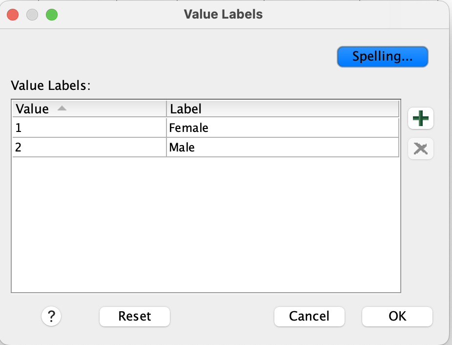
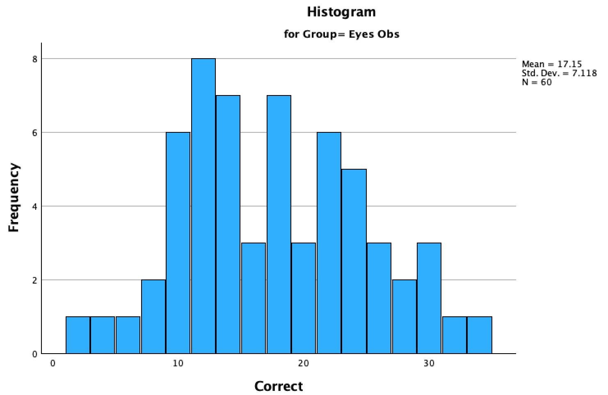
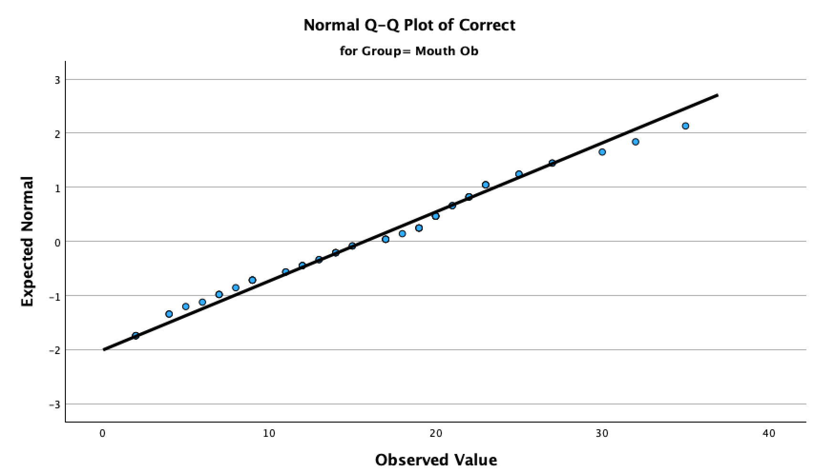
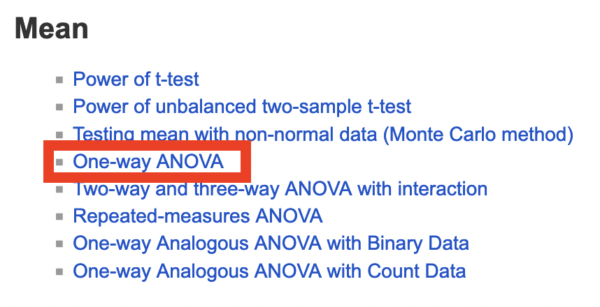

```{r setup, include=FALSE}
library(learnr)
library(tidyverse)
library(kableExtra)

baseColor <- '#4CA384'
accent1 <- '#9AD079'
accent2 <- '#C4C6C7'
accent3 <- '#19424C'
```

```{r, context = 'server'}

```

## Intro to Today's Lab

During today's lab, you'll apply the concepts discussed during this week's lecture. Each lab consists of a range of tasks, with corresponding questions you can answer. Please note that the questions are not required and not marked, although they do provide a helpful source of formative feedback that will help you gauge your understanding. 

### Learning Objectives
At the end of this lab, you will be able to:

1. Identify hypotheses which may be tested using ANOVAs
2. Check assumptions for a one-way ANOVA
3. Use SPSS to perform one-way ANOVAs
4. Interpret and report results from one-way ANOVAs

If you also complete the bonus material, you'll be able to:

1. Produce a box-plot to visualise the results from a one-way ANOVA
2. Run an appropriate power analysis for both one-way and repeated-measures ANOVAs
3. Check assumptions for a repeated-measures ANOVA 
4. Use SPSS to perform one-way and repeated-measures ANOVAs
5. Interpret and report results from repeated-measures ANOVAs

### This Week's Study

You'll be working with data adapted from studies on emotion recognition (see [here](https://journals.plos.org/plosone/article?id=10.1371/journal.pone.0243708)). Specifically, you're testing whether mask-wearing during COVID influenced children's ability to correctly identify emotions during social interactions. You'll be investigating this through two separate experiments.

## Experiment 1 Overview

<br>
In the first experiment, you'll investigate whether the region of the face covered affects a child's ability to recognize emotions conveyed by facial expressions. You recruited a sample of primary-school aged children. All participants were presented with photos of people making stereotypical facial expressions associated with 5 different emotions (happiness, sadness, fear, anger, disgust). However, participants were grouped into one of three conditions. Participants in the first condition viewed unobstructed faces Participants in the second condition viewed faces wearing sunglasses so that the eyes were obstructed. Participants in the third condition viewed faces wearing masks so that the mouth was obstructed (see examples below).

```{r, echo = F, out.width='90%', fig.align='center'}
knitr::include_graphics('https://mtruelovehill.github.io/PRM/Labs/images/Week5_expStimuli.png')
```

Participants viewed 10 photos per emotion, for a total of 50 photos. Photos were presented in random order for each participant. 

You can download the dataset from the first experiment [here](https://mtruelovehill.github.io/PRM/Labs/Week5LabData1.csv). It contains the following variables:

```{r, echo = F}
dat <- read.csv('https://mtruelovehill.github.io/PRM/Labs/Week5LabData1.csv')
datInfo <- data.frame(VariableName = colnames(dat),
                      Description=c('Participant ID',
                                    'Levels: 1 = Female; 2 = Male',
                                    'Age in years',
                                    'Levels: Control; Mouth Obstructed; Eyes Obstructed',
                                    'Total number of correctly identified emotions; possible scores = 0 - 50'))

datInfo %>%
  kbl(col.names=c('Variable Name', 'Description')) %>%
  kable_styling(full_width = F) %>%
  row_spec(0, bold = T, color=baseColor, font_size = 18, align='l') %>%
  column_spec(1, bold = T, width = '4.5cm')
```

```{r q1, echo = FALSE}
quiz(caption = '',
     question("Which test is most appropriate to address your research question, given the study design?",
              answer("t-test"),
              answer("One-Way ANOVA", correct = T),
              answer("Repeated-Measures ANOVA"),
              message = "While all of these tests are appropriate for use with categorical independent variables and continuous dependent variables, a t-test can only test the differences between two means. Here, you have 3 groups (control, eyes obstructed, and mouth obstructed), so a single t-test will not work. Both a one-way ANOVA and a repeated-measures ANOVA can test for differences between more than 2 means, but a repeated-measures ANOVA expects that the means are connected in some way (e.g., measured from the same participants over multiple timepoints). These means are independent of each other (collected from 3 separate groups of people), so a One-Way ANOVA should be used."))
```

### Your Tasks
+ [ ] $\ $ Identify your independent and dependent variables for this experiment. 
+ [ ] $\ $ State your research question for this experiment.
+ [ ] $\ $ State your hypotheses for this experiment, both using words and statistically.

<br>

<div class="container">
<details><summary><span style = "font-weight: bold; font-size: 16pt"> Click here for a hint </span></summary>


In your research question, you should mention the independent variable, the dependent variable, and the population being studied.

To state hypotheses statistically, you should structure them in the framework of the statistical values being tested.

</details>
</div>
</br>

<div class="container">
<details><summary><span style = "font-weight: bold; font-size: 16pt"> Click here for the solution </span></summary>
<br>
<b>Possible Research Questions:</b>

Does the region of the face being obstructed affect the ability of school-aged children to make emotional inferences?

Do different types of facial coverage impact a child's ability to correctly identify emotions?

<br>

<b>Independent Variable:</b> Region of Face Obstructed (3 levels: Control/Mouth/Eyes)

<b>Dependent Variable:</b> Correct Identifications of Emotion

<br>

<b>Hypotheses:</b>

<i> General: </i>

$H_0:$ Facial obstruction will not affect the ability of school-aged children to make emotion inferences.

$H_1:$ Facial obstruction will affect the ability of school-aged children to make emotion inferences.


<i> Statistical: </i>

$H_0: \mu_{control} = \mu_{eyes} = \mu_{mouth}$

$H_1:$ at least one $\mu \neq$ the other $\mu$s

</details>
</div>
</br>


## Experiment 1 Data Review

### Your Tasks

+ [ ] $\ $ Import 'Week5LabData1.csv' into SPSS

+ [ ] $\ $ Check whether all variables imported into SPSS as the correct measurement type. 

+ [ ] $\ $ Add a key to the `Gender` variable so that 1 = 'Female' and 2 = 'Male'.

+ [ ] $\ $ Check the descriptive statistics of your data

+ [ ] $\ $ Produce the proper plot to visualise the distribution of your dependent variable, `Correct`.


<div class="container">
<details><summary><span style = "font-weight: bold; font-size: 16pt"> Click here for a hint </span></summary>

For continuous variables, the descriptive statistics you'll want to check are mean and standard deviation. It's also useful to check the minimum and maximum so you can easily identify values outside of your expected range. For categorical variables, you'll check the frequency of participants in each group. It may also be useful to check the mode.

Your dependent variable, `Correct`, is continuous. Consider whether either a bar plot or a histogram is more appropriate for use with continuous variables. 

</details>
</div>
</br>

<div class="container">
<details><summary><span style = "font-weight: bold; font-size: 16pt"> Click here for the solution </span></summary>

<span style = "font-weight: bold; font-size: 14pt"> Adjust Variable Measure Format </span>

To check that your variables are labeled as the correct scale of measurement, look at the **Measure** column under the *Variable View* tab.

* `ID` - Ordinal

* `Gender` - Nominal

* `Age` - Scale

* `Group` - Nominal

* `Correct` - Scale

In this instance, SPSS assigned the proper measures by default, so no changes are needed.

<br>
<span style = "font-weight: bold; font-size: 14pt"> Adding Labels to Variables </span>

To associate a label with each value of a variable, you'll use the **Values** column under the **Variable View** tab.

Select the Gender x Values cell and click the dots to bring up the _Value Labels_ box. Use the $+$ to add a new label. In the Value column, type the value **exactly as it is recorded in your data.** In the Label column, add the label you would like to associate with that specific value. Continue adding labels using  $+$ until you've labeled all values in the Gender column.

```{r, echo = F, out.width='40%', fig.align='center'}

```

Click 'OK'. If you've done this properly, you'll see that each numeric value is now associated with a character label.

<br>
<span style = "font-weight: bold; font-size: 14pt"> Check Descriptive Statistics </span>

**Categorical Variables:** Your categorical variables are `Group` and `Gender`. Click *Analyze>Descriptive Statistics>Frequencies*, then add these two variables to the 'Variable(s)' box. Make sure 'Display frequency tables' is checked, then click 'OK'. You should see the following output:

```{r, echo = F, fig.align= 'center', out.width = '50%'}
knitr::include_graphics('images/week5_freqTables.png')
```

Note that if you set up the labels for the Gender variable properly, you should see 'Female' and 'Male' in the frequency table for `Gender`, rather than '1' and '2'.

**Continuous Variables:** Your categorical variables are `Age` and `Correct`. Click *Analyze>Descriptive Statistics>Frequencies*, then add these two variables to the 'Variable(s)' box. Make sure 'Display frequency tables' is not ticked, then click 'Statistics'. Tick 'Mean', 'Std. Deviation', 'Minimum', and 'Maximum'. Click 'Continue', then 'OK'. You should see the following output:

```{r, echo = F, fig.align= 'center', out.width = '40%'}
knitr::include_graphics('images/week5_descStats.png')
```

<br>
<span style = "font-weight: bold; font-size: 14pt"> Produce Distribution Plot </span>

You can also use *Analyze>Descriptive Statistics>Frequencies* to produce a distribution plot. Add `Correct` to the 'Variable(s)' box, then click 'Charts'. As `Correct` is a continuous variable, you will visualise it using a histogram. Click 'Histogram', then tick 'Show normal curve on histogram'. Click 'Continue' and then 'OK'. 


```{r, echo = F, fig.align= 'center', out.width = '50%'}
knitr::include_graphics('images/week5_corrHist.png')
```

Here, you can have a look at your dependent variable's distribution. There are no concerning outliers or unusual values, so you can move forward with assumptions checks.


</details>
</div>
</br>

## Experiment 1 Assumptions

The requirements/assumptions of a One-Way ANOVA are:

(1) **Normality:** Values are normally distributed *within levels*

(2) **Independence of Observations:** Individual observations should not be dependent upon any others

(3) **Homogeneity of Variance:** Variances within each level should be generally similar

(4) The dependent/outcome variable must be continuous and the independent/predictor variable must be categorical

### Your Tasks

+ [ ] $\ $ Decide whether your data meet the assumption of normality

+ [ ] $\ $ Decide whether your data meet the assumption of independence

+ [ ] $\ $ Decide whether your data meet the assumption of homogeneity


<div class="container">
<details><summary><span style = "font-weight: bold; font-size: 16pt"> Click here for a hint </span></summary>

Have a look at the [lecture slides]() if you're lost. Because normality must be tested within levels, you should use *Analyze>Descriptive Statistics>Explore* to get the plots you need.

</details>
</div>
</br>

<div class="container">
<details><summary><span style = "font-weight: bold; font-size: 16pt"> Click here for the solution </span></summary>

To check the assumptions of normality and homogeneity, click *Analyze > Descriptive Statistics > Explore* and add your dependent variable to the 'Dependent List' box and your independent variable to the 'Factor List' box. Click the 'Plots' button on the right. Under 'Boxplots', select 'None', under 'Descriptive', tick 'Histogram', and tick 'Normality plots with tests.' Under 'Spread vs Level with Levene Test', click 'Power Estimation'


```{r, echo = F, fig.align= 'center'}
knitr::include_graphics('images/week5_assumptionPlots.png')
```

Click 'Continue' and then 'OK.'

<br>

<span style = "font-weight: bold; font-size: 14pt"> Normality </span>

Have a look at the histograms and Q-Q Plots.

Remember that normally distributed data will be primarily clustered around the mean, with ends tapering off on either side. The histograms show that the data generally follow this pattern across the levels:

```{r, echo = F, fig.align= 'center', out.width='65%'}
knitr::include_graphics('images/week5_histogramControl.png')
```

```{r, echo = F, fig.align= 'center', out.width='65%'}

```

```{r, echo = F, fig.align= 'center', out.width='65%'}
knitr::include_graphics('images/week5_histogramMouthObs.png')
```

However, they are perhaps very slightly flatter than would be expected, so the Q-Q plots can help bolster our confidence that the data are sufficiently normally distributed:

```{r, echo = F, fig.align= 'center', out.width='65%'}
knitr::include_graphics('images/week5_qqControl.png')
```

```{r, echo = F, fig.align= 'center', out.width='65%'}
knitr::include_graphics('images/week5_qqEyesObs.png')
```

```{r, echo = F, fig.align= 'center', out.width='65%'}

```

Here you can see that the points follow the diagonal pretty closely, so we'll consider the data to have met the normality assumption.


<span style = "font-weight: bold; font-size: 14pt"> Independence </span>

Assessing independence requires you to have an understanding of the conditions under which your data were collected. The study design (between-participants) increases the likelihood that the observations are independent of each other, so you can consider this assumption to be met.

<span style = "font-weight: bold; font-size: 14pt"> Homogeneity of Variance </span>

Find the box in the output labeled 'Test of Homogeneity of Variance' and check the row labeled 'Based on Mean'. If Levene's statistic is not significant, we can assume that our data meet the homogeneity of variance assumption. Here, the $p$-value is greater than the threshold of .05, so this test is not significant. 

</details>
</div>

## Experiment 1 Analysis

ANOVA requires that you use a number variable for your grouping variable (IV) even though it's categorical.
*Transform>Recode Into Different Variables* Add `Group` into the box, then type a name ('GroupNum') into the 'Name' box in the 'Output Variable' section. Click 'Change'. Next, click 'Old and New Values'. Add the old name to the 'Value' box in the 'Old Value' section, then add a number to assign that category to in the 'New Value' section. Click 'Add', and you'll see it appear in the 'Old --> New' box. Do this until you've assigned all three categories to a number. Click 'Continue' and then 'OK'. You'll notice a new column appear in the *Data View* window. It will default to 2 decimals, so if you'd like to adjust it to 0, go to *Variable View* and change the value in the 'Decimal' column for `GroupNum` to 0.

Once you have your IV set as a number, navigate to *Analyze>Compare Means & Proportions>One-Way ANOVA*. Add your new number column, `GroupNum`, to the 'Factor' box, and add `Correct` to the 'Dependent List'. Make sure 'Estimate effect size for overall tests' is ticked. To get the post-hoc comparisons, click 'Post-Hoc', then 'Tukey'. Under 'Options', click 'Descriptive'. You can also tick 'Means plot' to generate a boxplot of the means of each group. Click 'Continue' and then 'Ok'. 
## State Your Hypotheses

Task 1 Here

* Identify IV & DV
* State Hypotheses for One Way, Between-Subjects, and RM ANOVA

<div class="container">
<details><summary><span style = "font-weight: bold; font-size: 16pt"> Click here for a hint </span></summary>

Hint Goes Here

</details>
</div>
</br>

<div class="container">
<details><summary><span style = "font-weight: bold; font-size: 16pt"> Click here for the solution </span></summary>

Solution Goes Here

</details>
</div>
</br>

## Check Assumptions 


Task Description Here

<div class="container">
<details><summary><span style = "font-weight: bold; font-size: 16pt"> Click here for a hint </span></summary>

Hint Here

</details>
</div>
</br>


<div class="container">
<details><summary><span style = "font-weight: bold; font-size: 16pt"> Click here for the solution </span></summary>

Solution here.

</details>
</div>
</br>


## Compute Descriptive Data 

Task Here.

```{r q4, echo = FALSE}
# quiz(caption = 'Test Your Understanding',
#      question("At least one of the groups is limited in size compared to the others",
#               answer("True", correct = T),
#               answer("False"),
#               message = 'The nonbinary group is much smaller than the other two measured groups.'),
#      question_numeric("How many total datapoints do you have for the gender variable?",
#               answer(48, correct=T)),
#      question_numeric("What percentage of participants are female?",
#               answer(41.7, correct=T)),
#      question_numeric('How many nonbinary participants are in your sample?',
#               answer(2, correct=T)))
```

<div class="container">
<details><summary><span style = "font-weight: bold; font-size: 16pt"> Click here for a hint </span></summary>

Hint Here

</details>
</div>
</br>


<div class="container">
<details><summary><span style = "font-weight: bold; font-size: 16pt"> Click here for the solution </span></summary>

Solution here.

</details>
</div>
</br>

## Data Visualisation 

Task Here

<div class="container">
<details><summary><span style = "font-weight: bold; font-size: 16pt"> Click here for a hint </span></summary>

Hint Here

</details>
</div>
</br>


<div class="container">
<details><summary><span style = "font-weight: bold; font-size: 16pt"> Click here for the solution </span></summary>

Solution here.

</details>
</div>
</br>


## Repeated Measures ANOVA 

Task here.

```{r distPlot, echo = F}
# 
# fluidRow(column(4, 
#   sliderInput("mean","Value of Mean:", min = -6, max = 6, value = 0, step = 2),
#   sliderInput('sd', 'Value of SD:', min = 1, max = 5, value = 1, step = .25)),
#   column(8, plotOutput('distPlot')))
# 
# tags$style(HTML(".js-irs-0 .irs-single, .js-irs-0 .irs-bar-edge, .js-irs-0 .irs-bar {background: #4CA384}"))
# tags$style(HTML(".js-irs-1 .irs-single, .js-irs-1 .irs-bar-edge, .js-irs-1 .irs-bar {background: #4CA384}"))

```

<div class="container">
<details><summary><span style = "font-weight: bold; font-size: 16pt"> Click here for a hint </span></summary>

Hint Here

</details>
</div>
</br>


<div class="container">
<details><summary><span style = "font-weight: bold; font-size: 16pt"> Click here for the solution </span></summary>

Solution here.

</details>
</div>
</br>


## Compute Effect Sizes

Task here.

<div class="container">
<details><summary><span style = "font-weight: bold; font-size: 16pt"> Click here for a hint </span></summary>

Hint Here

</details>
</div>
</br>


<div class="container">
<details><summary><span style = "font-weight: bold; font-size: 16pt"> Click here for the solution </span></summary>

Solution here.

</details>
</div>
</br>


## Interpret & Report 

Task here.


<div class="container">
<details><summary><span style = "font-weight: bold; font-size: 16pt"> Click here for a hint </span></summary>

Hint Here

</details>
</div>
</br>


<div class="container">
<details><summary><span style = "font-weight: bold; font-size: 16pt"> Click here for the solution </span></summary>

Solution here.

</details>
</div>
</br>


## Bonus Material: Visualise results (boxplot)
## Bonus Material: Repeated-Measures ANOVA

In the second experiment, you investigated whether a mask differentially effects a child's ability to recognize specific emotions. You recruited a new sample of primary-school aged children. All participants were presented with photos of masked people making stereotypical facial expressions associated with 5 different emotions (happiness, sadness, fear, anger, disgust). All participants viewed 50 photos per emotion. Photos were presented in random order for each participant. 

You can download the dataset from the second experiment [here](https://mtruelovehill.github.io/PRM/Labs/Week5LabData2.csv). It contains the following variables:

```{r, echo = F}
dat <- read.csv('https://mtruelovehill.github.io/PRM/Labs/Week5LabData2.csv')
datInfo <- data.frame(VariableName = colnames(dat),
                      Description=c('Participant ID',
                                    'Levels: 1 = Female; 2 = Male',
                                    'Age in years',
                                    'Total number of correctly identified photos where the subject was emoting happiness; possible scores = 0-50',
                                    'Total number of correctly identified photos where the subject was emoting sadness; possible scores = 0-50',
                                    'Total number of correctly identified photos where the subject was emoting fear; possible scores = 0-50',
                                    'Total number of correctly identified photos where the subject was emoting anger; possible scores = 0-50',
                                    'Total number of correctly identified photos where the subject was emoting disgust; possible scores = 0-50'))

datInfo %>%
  kbl(col.names=c('Variable Name', 'Description')) %>%
  kable_styling(full_width = F) %>%
  row_spec(0, bold = T, color=baseColor, font_size = 18, align='l') %>%
  column_spec(1, bold = T, width = '4.5cm')
```


## Bonus Material: Power Analysis
<br>

Recall the effect size measure for ANOVA, $\eta^2$:

```{r, echo = F}

eta2Tab <- data.frame(Strength = c('Weak', 'Moderate', 'Strong'), Magnitude = c(.01, .06, .14))

eta2Tab %>%
  kbl(col.names=c('Variable Name', paste('Magnitude of', "$\\eta^2$"))) %>%
  kable_styling(full_width = F) %>%
  row_spec(0, bold = T, color=baseColor, font_size = 16, align='l') %>%
  column_spec(1, bold = T, width = '4.5cm')
```


### Your Task

+ [ ] $\ $ Run a power analysis using $\alpha$ = .05 and power = .8 to determine the sample size necessary to detect a moderate effect size ( $\eta^2$ = .06) using a One-Way ANOVA. Note that WebPower uses $f$ as its measure of effect size for ANOVA, so you'll need to convert $\eta^2$ to $f$ before running the power analysis. You can do this with the following equation:

$$f = \sqrt{\frac{\eta^2}{1-\eta^2}}$$

Click [here to use WebPower to run your analysis](https://webpower.psychstat.org/wiki/models/index).

<div class="container">
<details><summary><span style = "font-weight: bold; font-size: 16pt"> Click here for a hint </span></summary>
<br>
Unlike the power analysis for $t$-tests, this power analysis requires/outputs the total number of participants, rather than the number of participants per group. 

If you're completely lost, you might find the section on One-Way ANOVA in the [WebPower manual](https://webpower.psychstat.org/wiki/_media/grant/webpower_manual_book.pdf) helpful.


</details>
</div>
</br>

<div class="container">
<details><summary><span style = "font-weight: bold; font-size: 16pt"> Click here for the solution </span></summary>
<br>
Navigate to the WebPower site and click One-Way ANOVA:

```{r, echo = F, fig.align='center'}

```
<br>
<i> Number of groups </i> refers to the number of levels in your independent variable. In this case, you have 3 (Control/Eyes Obstructed/Mouth Obstructed). You'll leave the Sample Size option blank, as that's the value you want to calculate. To compute the effect size, $f$, you'll do the following:

$$f = \sqrt{\frac{.06}{1-.06}} = .25$$
You can enter in the appropriate values for $\alpha$ and power. When you're finished, click 'Calculate' and you should see the following results if you've entered everything properly:

```{r, echo = F, fig.align='center'}
knitr::include_graphics('images/week5_oneWayPower.png')
```

You'll obviously need a whole number of participants, so you should round up. To detect the desired effect with the given constraints, you need 158 participants.


</details>
</div>
