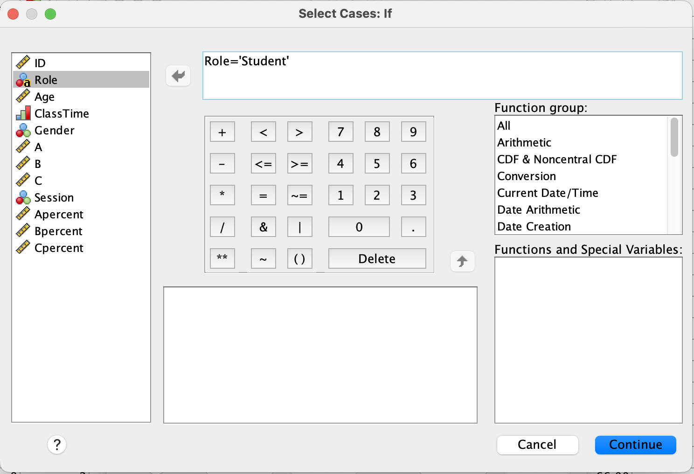

```{r setup, include=FALSE}
library(learnr)
library(tidyverse)
library(kableExtra)
library(knitr)
library(shiny)
library(shinyjs)

baseColor <- '#4CA384'
accent1 <- '#9AD079'
accent2 <- '#C4C6C7'
accent3 <- '#19424C'
#tutorial_options(exercise.timelimit = 60)
```

## Intro to Today's Lab


During today's lab, you'll apply the concepts discussed during this week's lecture. Each lab consists of 10 tasks, with corresponding questions you can answer. Please note that the questions are not required and not marked, although they do provide a helpful source of formative feedback that will help you gauge your understanding. 

Imagine that you're a statistician in a Psychology department, and an instructor has asked for your help in selecting a proper assessment for their course. They have tested 4 different assessments, and they want to select the option that best captures students' abilities, without being too difficult or too easy. 

They've gathered a sample of data from 45 students across 3 of their courses.   

```{r, echo = F}
dat <- read.csv('Week1LabData.csv')
datInfo <- data.frame(VariableName=colnames(dat), 
                      Description=c('Participant ID', 'Age in years', 'Time of class in which assessment was given', 'Levels: 1=Male,
                                    2=Females, 3=Nonbinary', 'Assessment Version A Scores', 'Assessment Version B Scores', 'Assessment 
                                    Version C Scores', 'Assessment Version D Scores'))

datInfo %>%
  kbl(col.names=c('Variable Name', 'Description')) %>%
  kable_styling(full_width = F) %>%
  row_spec(0, bold = T, color=baseColor, font_size = 18, align='l') %>%
  column_spec(1, bold = T, width = '4.5cm')
```


### Learning Objectives
At the end of this lab, you will be able to:

1.  Import data into SPSS
2.  Check and reset variable types and codes
3.  Check the descriptive statistics of your data
4.  Produce histograms to visually assess your data's distribution
5.  Assess the normality of your variables


## Task 1: Import Data

Import 'Week1LabData.csv' into SPSS. You can download the data from <span style = "color: #18778C;"> [Learn (requires university login)](MONICA - ADD LINK HERE) </span>. Once you have imported the file, save it as 'Week1LabData_SPSS' in the folder of your choice on your home computer. Note the difference in filetype between 'Week1LabData' and 'Week1LabData_SPSS'. 

```{r q1, echo = FALSE}
quiz(caption = 'Test Your Understanding',
     question("What kind of file is 'Week1LabData'?",
              answer("SPSS datafile"),
              answer("comma separated values file", correct = T),
              answer("Excel file"),
              answer("Word file"),
              random_answer_order = T,
              message = "The .csv file extension indicates the file is a comma separated values file. This filetype is meant for
              spreadsheet-style data. It can be easily used with a wide variety of data analysis software, making it more flexible than
              SPSS (.sav) or Excel (.xlsx) files. Word files (.docx) are not meant to be used with spreadsheet-style data."),
     question('If you were to restart SPSS, you would open "Week1LabData_SPSS" using "File>Import".',
              answer('True'),
              answer('False', correct = T),
              message = 'Because "Week1LabData_SPSS" is a .sav file, it can be opened using "File>Open". Using the Import option is only
              necessary when opening a file that is not an SPSS datafile, such as a .csv or .xlsx file.')
     )
```

<details><summary><span style = "font-weight: bold; font-size: 16pt"> + Click here for a hint </span></summary>

Check under the **File** tab in SPSS. What is the difference between the 'Open' and 'Import Data' options? 

</details>

</br>

<details><summary><span style = "font-weight: bold; font-size: 16pt"> + Click here for the solution </span></summary>

Click *Import Data* under the **File** tab. The data are in .csv format, so choose *CSV Data*. Navigate to the folder where you've stored  'Week1LabData.csv' and select the file. 

```{r, echo = F, out.width='50%'}
include_graphics('images/week1_1a.png')
```

A box will pop up that allows you to review the data before import. In this example, the first row of our data is the name for each column, so the 'First line contains variable names' should remain checked. Note that if you import data without column names, you'll need to uncheck this box. Click 'OK'. 

```{r, echo = F, out.width='60%'}
include_graphics('images/week1_1b.png')
```

</details>

</br>


## Task 2: Adjust Variable Measures

Recall that data can be measured in multiple formats, and these scales of measurement will affect how data may be described and analysed. Have a look at your data - were all variables imported into SPSS as the correct measurement type? If not, change the variable's measure so that it appropriately describes the data. 

```{r q2, echo = FALSE}
quiz(caption = 'Test Your Understanding',
     question("Which type of data is C?",
              answer("Categorical"),
              answer("Continuous", correct = T),
              random_answer_order = T),
     question("Which type of data is Gender?",
              answer("Continuous"),
              answer('Categorical', correct = T)),
     question("Which type of data is ClassTime?",
              answer("Continuous"),
              answer('Categorical', correct = T),
              message='Categorical data are nominal or ordinal data with no numeric relationship (although they may be represented
              numerically), while continuous data have a traditional numeric relationship; continuous data can technically take on an  
              infinite range of values if measurement was precise enough'),
     question('Which of the following "Measure" values used by SPSS reflects categorical data?',
              answer('Nominal', correct = T),
              answer('Ordinal', correct = T),
              answer('Scale'),
              message = 'Scale can be used for both types of continuous data (ratio and interval scales of measurement), but categorical
              variables are split into nominal and ordinal measures. Remember that nominal data reflects purely independent categories,
              but ordinal data has some sort of implied order (e.g. Likert Scale data, level of education).'))
```

<details><summary><span style = "font-weight: bold; font-size: 16pt"> + Click here for a hint </span></summary>

You'll need to switch from *Data View* to *Variable View* for this step. Do the labels used by SPSS match the scales of measurement you've learned about in RMAP (Nominal, Ordinal, Interval, Ratio)? Think about what kind of data each of your variables represents. 

</details>

</br>

<details><summary><span style = "font-weight: bold; font-size: 16pt"> + Click here for the solution </span></summary>


To check that your variables are labeled as the correct scale of measurement, look at the **Measure** column under the *Variable View* tab. 

```{r, echo = F, out.width='75%'}
include_graphics('images/week1_2a.png')
```

SPSS labels the data as:

* _Nominal:_ data that fall into discrete categories that have no information regarding order (e.g., eye colour)
* _Ordinal:_ data that fall into discrete categories that have some kind of ordering information (e.g. Likert Scale responses)
* _Scale:_ continuous/numerical data; data have some kind of numeric relationship and could technically be measured to infinite decimal places, if the measurement was actually capable of doing so. 

To adjust the measure type, select the Measure box for a single variable and click the arrow that appears. 

* **ID** is represented as a number, but there really is no numeric relationship between the numbers (e.g. someone with an ID = 40 didn't complete the study in twice the time of someone with an ID = 20). Technically, the numbers are ordered in a way that reflects the order in which they completed the study, so this could be considered an 'Ordinal' variable.

* **Age** is continuous. Someone who is 12 is twice as old as someone who is 6, and you could measure age up to infinite decimal places if you had a perfectly precise measurement. This can be considered a 'Scale' variable.

* **Gender** is nominal. It can be captured in discrete categories and there is no inherent order.

* **ClassTime** is ordinal, because, as with ID, there is no numeric relationship between these values but the times do have some sense of order (10 is earlier than 13, e.g.).

* The assessments were all measured on a continuous scale.

</details>

</br>


## Task 3: Add Values to Nondescriptive Data

Sometimes categorical data may be recorded as a number. In this example, the gender variable consists of 3 values which represent the different genders that participated in the study. Instead of recording gender as a character label, participants were given a number to reflect their gender group. However, it is important to always include a coding key, so that anyone who works with the data will know the labels used and can make appropriate interpretations. 

Add a key to the Gender variable so that 1 = 'Male', 2 = 'Female', and 3 = 'Nonbinary'. 

<details><summary><span style = "font-weight: bold; font-size: 16pt"> + Click here for a hint </span></summary>

This should also be done in Variable View. The column names may seem a bit misleading; you don’t use the ‘Label’ column for this task.

</details>

</br>

<details><summary><span style = "font-weight: bold; font-size: 16pt"> + Click here for the solution </span></summary>

To provided an associated label for each value of a variable, you'll use the **Values** column under the **Variable View** tab. 

Select the Gender x Values cell and click the dots to bring up the _Value Labels_ box. Use the $+$ to add a new label. In the Value column, type the value **exactly as it is recorded in your data.** In the Label column, add the label you would like to associate with that specific value. Continue adding labels using  $+$ until you've labeled all values in the Gender column. 

```{r, echo = F, out.width='40%'}
include_graphics('images/week1_3a.png')
```

Click 'OK'. If you've done this properly, you'll see that each numeric value is now associated with a character label.

</details>

</br>


## Task 4: Check Frequency Data

Before doing any sort of analysis, it's important to first check the data to make sure everything is as expected. With categorical data, one way we can do this is to inspect the frequency of observations in each group. When doing this, it allows you to check the following:

+ Are observations distributed relatively equally or are there major differences across groups?
+ Are there any groups with a limited number of observations?
+ Are there any missing datapoints?

Check the frequency of the Gender variable. Make sure to display a frequency table.

Are any of these groups limited in size? If so, how might this affect your ability to make generalisable claims about this group?

```{r q4, echo = FALSE}
quiz(caption = 'Test Your Understanding',
     question("At least one of the groups is limited in size compared to the others",
              answer("True", correct = T),
              answer("False"),
              message = 'The nonbinary group is much smaller than the other two measured groups.'),
     question_numeric("How many total datapoints do you have for the gender variable?",
              answer(48, correct=T)),
     question_numeric("What percentage of participants are female?",
              answer(41.7, correct=T)),
     question_numeric('How many nonbinary participants are in your sample?',
              answer(2, correct=T)))
```

<details><summary><span style = "font-weight: bold; font-size: 16pt"> + Click here for a hint </span></summary>

You'll find what you need under the *Analyze* tab.

</details>
</br>

<details><summary><span style = "font-weight: bold; font-size: 16pt"> + Click here for the solution </span></summary>
Select Analyze>Descriptives>Frequencies. Select Gender and use the arrow to move it into the Variable box. Make sure 'Display frequency tables' is checked. 

</br>

```{r, echo = F, out.width='65%'}
include_graphics('images/week1_4a.PNG')
```

</br>

**Output:**

```{r, echo = F, out.width='50%'}
include_graphics('images/week1_4b.PNG')
```

</details>
</br>

## Task 5: Visualise Distribution of Data 

Another useful way of visualising the data is to check how your variables are distributed. Produce plots that allow you to look at the distribution of your variables. Make sure to use the proper plot type given the type of variables you have.

```{r q5, echo = FALSE}
quiz(caption = 'Test Your Understanding',
     question("What does the x-axis of a histogram represent?",
              answer("The values of the continuous variable being inspected", correct = T),
              answer("The frequency of each value of the variable being inspected"),
              answer('The levels of a categorical variable being inspected'),
              answer('The normal distribution associated with the variable being inspected'),
              random_answer_order = T),
     question("What does the x-axis of a histogram represent?",
              answer("The values of the continuous variable being inspected"),
              answer("The frequency of each value of the variable being inspected", correct = T),
              answer('The levels of a categorical variable being inspected'),
              answer('The normal distribution associated with the variable being inspected'),
              random_answer_order = T,
              message = 'Histograms should be used with continuous data. The x-axis is the horizontal axis and reflects the values of the
              variable being inspected. The y-axis reflects the frequency, of each value (or, more often, a range of values) of the
              plotted variable. The normal curve associated with a specific variable can be plotted as a line overlaying the
              histogram.'),
     question_numeric("Approximately how many values of SubAgeT1 fall between 58-61?",
              answer(10, correct=T),
              message='You can find this answer by checking the histogram for SubAgeT1.'))
```


<details><summary><span style = "font-weight: bold; font-size: 16pt"> + Click here for a hint </span></summary>

A histogram will allow you to visualise the distribution of continuous variables. Bar plots allow you to check the distribution of categorical data. You'll need to produce a separate plot for each variable.

</details>
</br>

<details><summary><span style = "font-weight: bold; font-size: 16pt"> + Click here for the solution </span></summary>
<B> For Categorical Variables: </B>

Select *Graphs>Bar*. Select the chart type you'd prefer. When you're checking the distribution of a single variable, you would use a 'Simple' plot.  Use the arrow to add the variable you wish to view to the 'Category Axis' box. When looking at distributions of a categorical variable, you are plotting the total number of participants of each group, so you can leave the 'Bars Represent' portion at the default setting.

```{r, echo = F, out.width='55%'}
include_graphics('images/week1_5a.PNG')
```

When checking the distribution of categorical variables, check whether all groups are well represented. Consider the questions from the [Frequency Data](#check-frequency-data) portion of this lab. 


<B> For Continuous Variables: </B>


Select *Graphs>Histogram*. Use the arrow to add the variable you wish to view to the 'Variable' box.

```{r, echo = F, out.width='55%'}
include_graphics('images/week1_5b.PNG')
```

Have a look at the output. If a variable is normally distributed, most observations will fall near the mean, while more extreme values are less common.


**Note:** You can also produce both of these plots using *Analyze>Descriptive Statistics>Frequencies* and selecting the Charts option.
</details>
</br>

## Task 6: Check Central Tendency

Check the measures of central tendency discussed in class. Make sure to use the proper central tendency measures given the variable type.

+ Are the measures of central tendency similar within a variable?
+ If not, what might this imply?

```{r q6, echo = FALSE}
quiz(caption = 'Test Your Understanding',
     question("Which of the following central tendency measures could be used to describe age? Please select all that apply.",
              answer("Mean", correct = T),
              answer("Median", correct = T),
              answer('Mode', correct = T),
              message = 'All of the above could technically be used to describe the Age variable. However, it is most common to use the
              mean, as it includes information from each observation.'),
     question("Which of the following central tendency measures could be used to describe gender? Please select all that apply.",
              answer("Mean"),
              answer("Median"),
              answer('Mode', correct = T),
              message = 'As a categorical variable, there is no numeric relationship between values in the gender variable. Therefore, 
              the mode is the only measure of central tendency that is appropriate to describe this variable'),
     question_numeric("What is the average score on Assessment A?",
              answer(39.10, correct=T)),
     question_numeric("What is the most common age in this sample?",
              answer(19, correct=T)),
     question_numeric("What is the median score on Assessment D?",
              answer(81.87, correct=T))
)
```

<details><summary><span style = "font-weight: bold; font-size: 16pt"> + Click here for a hint </span></summary>
Although this is descriptive data, *Analyze>Descriptive Statistics>Descriptives* is not what you need.
</details>
</br>

<details><summary><span style = "font-weight: bold; font-size: 16pt"> + Click here for the solution </span></summary>
To get all 3 measures of central tendency, you'll need to select *Analyze>Descriptive Statistics>Frequencies*, then put the variables of interest into the 'Variable(s)' box. Click 'Statistics' and select the options for 'Mean', 'Median', and 'Mode', as needed. 

```{r, echo = F, out.width='60%'}

```

Note that Gender, as a categorical variable, should only be described using Mode. The other variables can be described using all 3 measures.

</details>
</br>

## Task 7: Check Measures of Variability

For all continuous variables, check the measures of variance described in class. These include the maximum, minimum, range, interquartile range, variance, and standard deviation.

```{r q7, echo = FALSE}
quiz(caption = 'Test Your Understanding',
     question_numeric("What is the IQR for Age?",
              answer(9, correct=T),
              message = "To get the IQR for a variable, you'll need to subtract the 25th percentile from the 75th percentile."),
     question_numeric("What is the maximum subjective age before the memory test?",
              answer(88, correct=T)),
     question_numeric("What is the standard deviation for scores on the memory test? Please report your answer to two decimal places.",
              answer(12.71, correct=T))
)
```

<details><summary><span style = "font-weight: bold; font-size: 16pt"> + Click here for a hint </span></summary>
You've already completed the steps to do this. You just need to check different boxes.

</details>
</br>

<details><summary><span style = "font-weight: bold; font-size: 16pt"> + Click here for the solution </span></summary>
This procedure is identical to getting the measures of central tendency, so in the future, you can do it all at once. You'll need to select *Analyze>Descriptive Statistics>Frequencies*, then put the variables of interest into the 'Variable(s)' box. Click 'Statistics' and select the options needed. For IQR, you'll need to select 'Quartiles':

```{r, echo = F, out.width='60%'}
include_graphics('images/week1_7a.PNG')
```

Data will be reported in table format in the output. To get the IQR, you'll need to subtract the 25th percentile value from the 75th percentile value.

</details>
</br>


## Task 8: Identify Normal Distribution Thresholds 

Remember that a perfectly normal distribution has the following criteria:

+ 68% of scores fall within 1 SD of the mean
+ 95% of scores fall within 1.96 SD of the mean
+ 99.75% of scores fall within 3 SD of the mean

Using these criteria, answer the following questions:

```{r q8, echo = FALSE}
quiz(caption = 'Test Your Understanding',
     question_numeric('If memory scores in this study were perfectly normally distributed, there would be symmetrical upper and lower thresholds between which 95% of scores would fall. What is the upper threshold value? Please round your answer to 2 decimal places.',
              answer(70.13, correct = T),
              tolerance = .02,
              message = 'See the solution below'),
     question_numeric('If the subjective age after the memory test variable was perfectly normally distributed, there would be symmetrical upper and lower thresholds between which 68% of scores would fall. What is the lower threshold value? Please round your answer to 2 decimal places.',
              answer(53.55, correct=T),
              tolerance = .02,
              message = 'See the solution below'),
     question('Imagine the age variable is perfectly normally distributed. What is the age range within which 99.75% of the sample falls?',
              answer('[57.98, 94.60]', correct=T),
              answer('[64.33, 88.25]'),
              answer('[70.19, 82.39]'),
              answer('[70.00, 82.20]'),
              random_answer_order = T,
              message = 'See the solution below')
)
```


<details><summary><span style = "font-weight: bold; font-size: 16pt"> + Click here for a hint </span></summary>

You'll need to get two values from SPSS for each variable to perform these calculations. You may find it helpful to review the normal distribution material from the [lecture](lecture slides link). 

</details>
</br>

<details><summary><span style = "font-weight: bold; font-size: 16pt"> + Click here for the solution </span></summary>

You'll need to extract the mean and standard deviation for each variable from SPSS:

```{r, echo = F}
descDat <- data.frame(Variable=c('MemoryScore', 'SubAgeT2', 'Age'), Mean = c(round(mean(dat$MemoryScore),2), round(mean(dat$SubAgeT2),2), round(mean(dat$Age),2)),SD=c(round(sd(dat$MemoryScore),3), round(sd(dat$SubAgeT2),3), round(sd(dat$Age),3)))

descDat %>%
  kbl() %>%
  kable_styling(full_width = F) %>%
  row_spec(0, bold = T, color=baseColor, font_size = 18, align='l') %>%
  column_spec(1, bold = T)
```


We know that a normal distribution is symmetrical with the mean as its center point, so to get these thresholds, we can use the following equations:

**68%:** $\bar{x}\ \pm\ 1\times s$

**95%:** $\bar{x}\ \pm\ 1.96\times s$

**99.75%:** $\bar{x}\ \pm\ 3\times s$


So, for example, to get the upper 95% threshold for memory score, you would use the following equation:

$$45.21+1.96\times 12.714 = `r round(45.21+1.96*12.714,2)`$$

To get the lower 68% threshold, as in the second question, you just subtract instead of add:

$$63.31-1\times 9.761 = `r round(63.31-1*9.761,2)`$$

To get the range of data in which 99.75% of observations fall, as in the third question, you'll do both:

$$76.29-3\times 6.102 = `r round(76.29-3*6.102,2)`$$
$$76.29+3\times 6.102 = `r round(76.29+3*6.102,2)`$$

</details>
</br>

## Task 9: Evaluting Normality

Evaluate the normality of your continuous variables by visually checking the histograms, assessing the skewness and kurtosis values, and running an appropriate statistical test. 

```{r q9, echo = FALSE}
quiz(caption = 'Test Your Understanding',
     question('Which statistical test is most appropriate for use to check normality in the current dataset?',
              answer('Shapiro-Wilk Test', correct = T),
              answer('Kolmogorov–Smirnov Test'),
              answer('t-Test'),
              answer('Pearson Correlation'),
              random_answer_order = T,
              message = 'The Shapiro-Wilk test is appropriate for use with smaller datasets (n < 50), while the Kolmogorov-Smirnov test 
              should be used with datasets of 50 observations or more. t-Tests and Pearson correlations are not used to measure normality 
              in data.'),
     question('Do any of the assessments violate normality, according to the statistical test you selected? Please select all that apply.',
              answer('Assessment A'),
              answer('Assessment B', correct=T),
              answer('Assessment C'),
              answer('Assessment D'),
              message = 'Assessment B has a strong ceiling effect, which produced a negative skew in the data. The Shapiro-Wilk test was 
              significant, indicating the data were not normally distributed. Scores on the other tests were normally distributed.'),
     question_numeric('What is the skewness value of Assessment C?',
              answer('ANSWERHERE', correct=T),
              message = 'See the solution below'),
     question_numeric('What is the kurtosis value of Assessment D?',
              answer('ANSWERHERE', correct=T),
              message = 'See the solution below')
)
```

<details><summary><span style = "font-weight: bold; font-size: 16pt"> + Click here for a hint </span></summary>

</details>
</br>

<details><summary><span style = "font-weight: bold; font-size: 16pt"> + Click here for the solution </span></summary>

</details>
</br>

## Task 10: Report and Interpret

Write a paragraph describing your sample as you would include in a methods section. Please be sure to use APA style. Include an APA-style table to present the descriptive data for each variable (excluding ID). 

When writing a describing your sample, you will need to include, at minimum, the total number of participants included, a description of their available demographic data, and how/where participants were recruited. See the Hughes paper for a brief example.

</br>
</br>

<details><summary><span style = "font-weight: bold; font-size: 16pt"> + Click here for a hint </span></summary>

You might find the [Purdue Owl website](https://owl.purdue.edu/owl/research_and_citation/apa_style/apa_formatting_and_style_guide/general_format.html) helpful for APA formatting.

</br>
</br>
</details>

<details><summary><span style = "font-weight: bold; font-size: 16pt"> + Click here for the solution </span></summary>


</br>
</br>
</details>