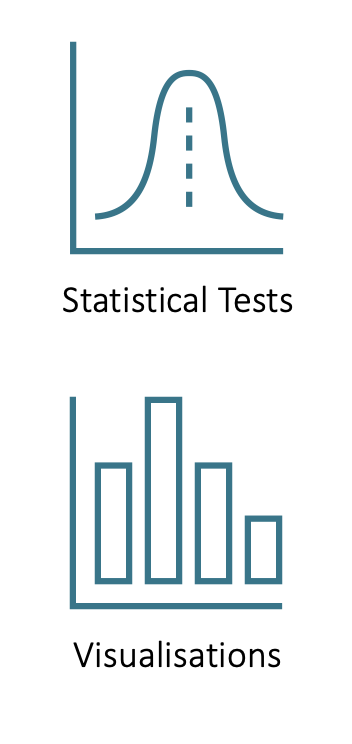

```{r setup, include=FALSE}
options(htmltools.dir.version = FALSE)
```

```{r xaringan-themer, include = FALSE}
library(xaringanthemer)
style_mono_accent(
  base_color = "#18778C",
  header_color = "#000000",
  header_font_google = google_font("Jost"),
  header_font_weight = 500,
  text_font_google = google_font("Jost", "300", "300i", "500", "500i"),
  code_font_google = google_font("Source Code Pro"),
  text_bold_color = '#4CA384',
  text_slide_number_color = '#18778C',
  text_font_size = '16pt'
)
```

```{r, echo = F, message = F, warning = F}
library(tidyverse)
knitr::opts_chunk$set(dev = 'svg')

baseColor <- '#4CA384'
accent1 <- '#9AD079'
accent2 <- '#18778C'
accent3 <- '#19424C'

```

```{css, echo=FALSE}
.link-style1 a {
  color: #18778C;
  text-decoration: underline;
}
```

## Course Objectives

.pull-left[

You'll learn to:

.center[
```{r, echo = F, out.width='75%'}
knitr::include_graphics('images/IntroObj1Vert.png')
```
]

]

--

.pull-right[

Aided by:

.center[
```{r, echo = F, out.width='40%'}

```
]
]

---
## Why is this good for you?

+ Look at all the skills you'll gain/develop!

  + Working with data
  
  + Critical thinking
  
  + Collaborative working
  
  + Taking complex information and presenting it in an accessible way

---

## Course Team

.pull-left[.center[**Lecturers**]

+ Monica Truelove-Hill
  + Course Organiser and Lecturer
  + .link-style1[[m.truelovehill@ed.ac.uk](mailto:m.truelovehill@ed.ac.uk)]
  + Room 1.5, Doorway 6
  + Office Hours: Mondays from 12:30-13:30


+ Emily-Marie Pacheco
  + Lecturer - Qualitative Content
  + .link-style1[[epacheco@ed.ac.uk](mailto:epacheco@ed.ac.uk)]

]

.pull-right[.center[**Tutors**]

  + .link-style1[[Rhys Davies](mailto:s2038326@ed.ac.uk)]
  + .link-style1[[Yanming He](mailto:s1809158@ed.ac.uk)]
  + .link-style1[[Alexandros Kapatais](mailto:alexandros.kapatais@ed.ac.uk)]
  + .link-style1[[Hamdullah Tunc](mailto:s2121526@ed.ac.uk)]

]


---
## Tentative Course Timeline

| Week     | Lecture Topic                                | Key Lab Tasks                                        |
|:--------:|:---------------------------------------------|:-----------------------------------------------------|
|  1       | Exploring your Data                          | Describing Data & Working with Distributions         |
|  2       | Thematic Analysis                            | Conducting a Thematic Analysis                       |
|  3       | Intro to Null-Hypothesis Statistical Testing | Computing Effect Sizes & Conducting Power Analyses   |
|  4       | $t$ -tests                                   | Running & Interpreting $t$-tests; Boxplots           |
|  5       | ANOVA I                                      | One-Way and Repeated Measures ANOVA                  |
|  6       | ANOVA II                                     | Moderation with ANOVA                                |
|  7       | Correlation                                  | Running & Interpreting Correlations; Scatterplots    |
|  8       | Regression I                                 | Simple and Multiple Linear Regression                |
|  9       | Regression II                                | Moderation with Regression                           |
|  10      | Nonparametric Testing                        | <B> Formative Assessment </B>                        |


---
## Course Delivery

+ Required:
  
  + Weekly 2-hour live lecture
    
      + Mix of theory and practical application examples

  + Weekly 1-hour lab
    
      + Structured exercises to provide application practice
      + Self-study expected (may take longer than 1 hour)

--

+ Optional (but **strongly** recommended):
  
  + Office Hours


---
## Assessment

+ **Group Qualitative Report (30% of mark)**
  + Due <b> 25th October at noon </b>
  + Provided with a selection of texts and must choose one to analyse using thematic analysis
  + Produce 3000-word report of methods and analysis
  + Not eligible for extensions
  
+ **Individual Quantitative Report (70% of mark)**
  + Released 3rd December at noon
  + Due <b> 5th December at noon </b>
  + Provided with dataset and must answer question prompts
  + Will require you to select appropriate tests, given data and research questions
  + Must use APA format when reporting results

---
## Assessment - Academic Integrity

+ Acceptable and encouraged:

  + Helping each other think through and solve problems in labs
  + Revising together for the assessments
  + Using materials (both course related and not) to troubleshoot SPSS-related issues
  + Googling how to properly use APA style

+ Not acceptable:

  + Copying content from other students on course
  + Sharing answers for quantitative report
  + Use of AI tools (e.g. ChatGPT) or online tutoring services (e.g. Chegg) for any assessment
  + Any form of cheating on either of the exams

+ Cases of suspected misconduct will be investigated

---
## Expectations

.pull-left[

.center[**What you can expect from us**]

1. We will work hard to help you learn

2. We will be open and communicate with you

3. We will be polite, respectful, and treat you like adults
]

.pull-right[

.center[**What we expect from you**]

1. Work hard

2. Talk to us

3. Be polite and respectful of the teaching team and your classmates

]

---
## Suggestions on How to Engage

+ Statistics cannot be crammed.

  + Much better to consistently work through the content

--

+ We want to make sure everyone keeps on top of the course.
  
  + We need to know when people are struggling.

--
  
+ Please help us by being proactive:

  + Come to all sessions
  + Use office hours to clarify any questions you have.
  + Form study groups (we can help with this, if you'd like)
