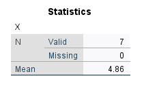
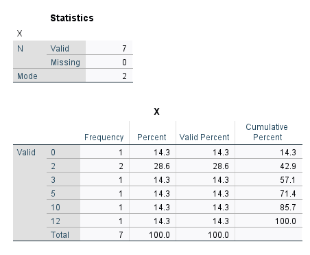
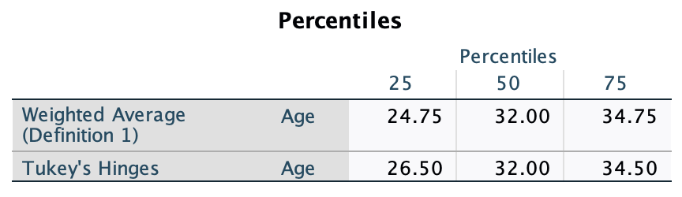

```{r setup, include=FALSE}
options(htmltools.dir.version = FALSE)
```

```{r xaringan-themer, include = FALSE}
library(xaringanthemer)
# style_mono_accent(
#   base_color = "#18778C",
#   header_color = "#000000",
#   header_font_google = google_font("Jost"),
#   header_font_weight = 500,
#   text_font_google = google_font("Jost", "300", "300i", "500", "500i"),
#   code_font_google = google_font("Source Code Pro"),
#   text_bold_color = '#D95829',
#   text_slide_number_color = '#18778C',
#   text_font_size = '16pt'
# )


style_mono_accent(
  base_color = "#18778C",
  header_color = "#000000",
  header_font_google = google_font("Jost"),
  header_font_weight = 500,
  text_font_google = google_font("Jost", "300", "300i", "500", "500i"),
  code_font_google = google_font("Source Code Pro"),
  text_bold_color = '#4CA384',
  text_slide_number_color = '#18778C',
  text_font_size = '16pt'
)
```

```{r, echo = F, message = F, warning = F}
library(tidyverse)
knitr::opts_chunk$set(dev = 'svg')

# baseColor <- "#18778C"
# accent1 <- '#D95829'
# accent2 <- '#BF3326'
# accent3 <- '#F29422'

baseColor <- '#4CA384'
accent1 <- '#9AD079'
accent2 <- '#18778C'
accent3 <- '#19424C'

Mode <- function(x) {
  ux <- unique(x)
  ux[which.max(tabulate(match(x, ux)))]
}
```

## Research process

```{r, echo = F}

```

---

## Why????

+ Psychology is a science....

--

+ with a lot of uncertainty

--

+ To answer our research questions, we rely on empirical evidence 

+ We take measurements that allow us to make systematic observations of our construct of interest, then use these observations to draw conclusions

+ In other words, we gather data and look for consistent patterns within the data that support (or refute) our ideas

+ But how do we decide what is *consistent enough*?

---
## From sample to population

+ In statistics, we often refer to samples and populations
  
  + **Population:** The entire group about whom you're making inferences
  
  + **Sample:** The subset of the population from whom you will collect data to make these inferences
  
+ We typically use **sample statistics**, or **point-estimates** to make inferences about **population parameters**

---
## Visualising your data: Frequency Distributions

+ Frequency distributions allow you to visualise how often each observation occurs

+ The type of frequency distribution you use depends on the type of data you have:

--

.pull-left[
.center[**Categorical Data: Bar Plots**]
```{r, echo = F, fig.height=3.5, fig.width = 4.5}
set.seed(608)

dat <- data.frame(EyeColour = sample(c('Blue', 'Green', 'Hazel', 'Amber', 'Brown', 'Gray'), size = 1000, replace = T, 
                            prob = c(.10, .02, .05, .05, .75, .03)),
                  Age = rnorm(1000, 35, 10))

ecPlot <- ggplot(dat, aes(EyeColour, fill = as.factor(EyeColour))) + geom_bar() +
  scale_fill_manual(values = c('#D98825', '#6D90A6', '#592202', '#B8BDB6', '#4E7A23', '#716F3F')) +
  labs(x = 'Eye Colour', y = 'Count') +
  theme(legend.position = 'none',
        axis.text = element_text(size = 14),
        axis.title = element_text(size = 16, face = 'bold'))

ecPlot
```
]

.pull-right[
.center[**Continuous Data: Histograms**]
```{r, echo = F, fig.height=3.5, fig.width = 4.5, message = F}

ggplot(dat, aes(Age)) + geom_histogram(fill=baseColor, colour = accent3) +
  labs(x = 'Age', y = 'Count') +
  theme(axis.text = element_text(size = 14),
        axis.title = element_text(size = 16, face = 'bold'))

```
]

---
## Describing your data: Central Tendancy

+ What is the middle-ish point of your data?

+ Can estimate in 3 ways:
  + **Mean**
  + **Median**
  + **Mode**
  
---
## Central Tendancy: Mean

.pull-left[


**The mathematical notation:**

$$\bar{x} = \frac{\displaystyle\sum_{i=1}^{n}x_i}{n}$$
+ Where:
    + $n$ = total number of values in the data
    + $x_i$ = an individual value in the data
    + $\displaystyle\sum_{i=1}^{n}$ = sum all values between 1 ( $i=1$ ) and $n$

]

---
count: false

## Central Tendancy: Mean

.pull-left[

**The mathematical notation:**

$$\bar{x} = \frac{\displaystyle\sum_{i=1}^{n}x_i}{n}$$
+ Where:
    + $n$ = total number of values in the data
    + $x_i$ = an individual value in the data
    + $\displaystyle\sum_{i=1}^{n}$ = sum all values between 1 ( $i=1$ ) and $n$

    
**In basic language:** 
 
 + The mathematical average; sum all values and divide by the total number of values
]

--

.pull-right.center[

$x = \{10, 2, 5, 3, 2, 0, 12\}$

$\bar{x} = \frac{\sum(10, 2, 5, 3, 2, 0, 12)}{7}$ 


$\bar{x} = 4.86$ 


```{r, echo = F, out.width='45%'}

```

]

---
## Central Tendancy: Mean

+ Can be used with _continuous/numeric_ data (i.e. interval and ratio data)

--


+ Say you have the following scale:

.pull-left[


| Scale  | Rate your understanding of the lecture     |
|--------|--------------------------------------------|
|    1   | I'm completely lost.                       |
|    2   | I'm a bit confused.                        |
|    3   | I understand about half of it.             |
|    4   | It's starting to come together.            |
|    5   | Everything is perfectly clear.             |

]

.pull-right[

> **Test your understanding:** What does a mean of 3.2 actually mean, in the context of this scale?

]

---
count: false

## Central Tendancy: Mean

+ Can be used with _continuous/numeric_ data (i.e. interval and ratio data)

+ Say you have the following scale:

.pull-left[


| Scale  | Rate your understanding of the lecture     |
|--------|--------------------------------------------|
|    1   | I'm completely lost.                       |
|    2   | I'm a bit confused.                        |
|    3   | I understand about half of it.             |
|    4   | It's starting to come together.            |
|    5   | Everything is perfectly clear.             |

]

.pull-right[

> **Test your understanding:** What does a mean of 3.2 actually mean, in the context of this scale?

> Is someone who is a bit confused twice as confused as someone for whom it's starting to come together?

]

--

+ Best not used with ordinal data, even though they may be coded as numeric values

---
## Central Tendancy: Median

+ The value in the exact center of a range

+ Can be used with ordinal, ratio, or interval data

.pull-left[
.center[
**If there are an odd number of values:**

$x = \{10, 2, 5, 3, 2, 0, 12\}$

$0, 2, 2, \color{#4CA384}{3}, 5, 10, 12$

**Median $x$ = 3**

]
]


.pull-right[
.center[
**If there are an even number of values:**

$y = \{3, 7, 1, 20, 14, 25\}$


$1, 3, \color{#4CA384}{7, 14,} 20, 25$


$\frac{7+14}{2} = 10.5$


**Median $y$ = 10.5**
]


]


---
## Central Tendancy: Mode

.pull-left[
+ The value that appears most frequently in a range

+ Can be used with all types of data, although may be less descriptive of continuous data depending on the precision of the measurement

+ Data may be bimodal or multimodal

```{r, echo = F, fig.height=3.5}
ecPlot
```

]

--

.pull-right.center[

$x = \{10, \color{#4CA384}{2}, 5, 3, \color{#4CA384}{2}, 0, 12\}$

```{r, echo = F, out.width='85%'}

```

]


---
exclude: true

####  How useful are the measures of central tendency in each of the following situations?

.pull-left.center[
```{r, echo = F, message = F, fig.height=2.5, fig.width=4}
set.seed(113)
x <- round(rnorm(250, 25, 20))
ggplot(mapping = aes(x)) + geom_histogram(fill = baseColor, color = accent3, binwidth = 2) +
  theme(axis.text = element_blank(),
        axis.ticks = element_blank(),
        axis.title = element_blank()) +
  geom_vline(xintercept = mean(x), color = accent1, linewidth = 1.5) +
  geom_vline(xintercept = median(x), color = accent2, linewidth = 1.5) +
  geom_vline(xintercept = round(Mode(x)), color = accent3, linewidth = 1.5) +
  annotate('text', label = paste('Mean =', round(mean(x), 2)), color = accent1, x = 60, y = 18, size = 4.5) +
  annotate('text', label = paste('Median =', round(median(x), 2)), color = accent2, x = 60, y = 16, size = 4.5) +
  annotate('text', label = paste('Mode =', round(Mode(x))), color = accent3, x = 60, y = 14, size = 4.5)
```

```{r, echo = F, message = F, fig.height=2.5, fig.width=4}
set.seed(926)
y <- round(rnorm(250, 25, 3))
ggplot(mapping = aes(y)) + geom_histogram(fill = baseColor, color = accent3, binwidth = 2) +
  theme(axis.text = element_blank(),
        axis.ticks = element_blank(),
        axis.title = element_blank()) +
  geom_vline(xintercept = mean(y), color = accent1, linewidth = 1.5) +
  geom_vline(xintercept = median(y), color = accent2, linewidth = 1.5) +
  geom_vline(xintercept = round(Mode(y)), color = accent3, linewidth = 1.5) +
  annotate('text', label = paste('Mean =', round(mean(y), 2)), color = accent1, x = 30, y = 55, size = 4.5) +
  annotate('text', label = paste('Median =', round(median(y), 2)), color = accent2, x = 30, y = 50, size = 4.5) +
  annotate('text', label = paste('Mode =', round(Mode(y))), color = accent3, x = 30, y = 45, size = 4.5)
```
]

.pull-right.center[
```{r, echo = F, message = F, fig.height=2.5, fig.width=4}
set.seed(1022)
z <- round(runif(100, 0, 10))
ggplot(mapping = aes(z)) + geom_histogram(fill = baseColor, color = accent3, binwidth = 1) +
  theme(axis.text = element_blank(),
        axis.ticks = element_blank(),
        axis.title = element_blank()) +
  geom_vline(xintercept = mean(z), color = accent1, linewidth = 1.5) +
  geom_vline(xintercept = median(z), color = accent2, linewidth = 1.5) +
  geom_vline(xintercept = round(Mode(z)), color = accent3, linewidth = 1.5) +
  annotate('text', label = paste('Mean =', round(mean(z), 2)), color = accent1, x = 9 , y = 17, size = 4.5) +
  annotate('text', label = paste('Median =', round(median(z), 2)), color = accent2, x = 9 , y = 15.5, size = 4.5) +
  annotate('text', label = paste('Mode =', round(Mode(z))), color = accent3, x = 9 , y = 14, size = 4.5)
```

```{r, echo = F, message = F, fig.height=2.5, fig.width=4}
set.seed(526)
a <- rbeta(100, 10, .5)
ggplot(mapping = aes(a)) + geom_histogram(fill = baseColor, color = accent3, binwidth = .01) +
  theme(axis.text = element_blank(),
        axis.ticks = element_blank(),
        axis.title = element_blank()) +
  geom_vline(xintercept = mean(a), color = accent1, linewidth = 1.5) +
  geom_vline(xintercept = median(a), color = accent2, linewidth = 1.5) +
  geom_vline(xintercept = round(Mode(a),2), color = accent3, linewidth = 1.5) +
  annotate('text', label = paste('Mean =', round(mean(a), 2)*315), color = accent1, x = .75, y = 17, size = 4.5) +
  annotate('text', label = paste('Median =', round(median(a), 2)*315), color = accent2, x = .75 , y = 15, size = 4.5) +
  annotate('text', label = paste('Mode =', round(Mode(a),2)*315), color = accent3, x = .75, y = 13, size = 4.5)
```

]


---
## Limitations of Central Tendency

+ In isolation, central tendency doesn't sufficiently describe the data

.pull-left[

| Participant |  Test Score |
|:-----------:|:-----------:|
| 1           |    6        |
| 2           |    5        |
| 3           |    6        |
| 4           |    5        |
| 5           |    5        |
| Total       |    27       |

.center[
**Mean = 5.4**
]

]

.pull-right[

| Participant |  Test Score |
|:-----------:|:-----------:|
| 1           |    2        |
| 2           |    2        |
| 3           |    10       |
| 4           |    10       |
| 5           |    3        |
| Total       |    27       |

.center[
**Mean = 5.4**
]

]

---
class: center, inverse, middle
count: false

## Questions?

---
## Variation in Scores

.pull-left[
+ Helps us to understand how well the mean describes our data

+ Can estimate this using:

  + Maxima & Minima
  
  + Range
  
  + Interquartile Range
  
  + Standard Deviation
]


--


.pull-right[
```{r, echo = F, fig.height=5}
set.seed(208)
sampDat <- data.frame(Participant = as.factor(1:12), Age=round(sample(dat$Age, 12)))
sampDat$Age[sampDat$Participant=='12'] <- 33
varPlot <- ggplot(sampDat, aes(Participant, Age)) + geom_point(size = 2.5) +
  scale_y_continuous(breaks=seq(15, 45, 5), limits = c(15, 45)) +
  theme(axis.text = element_text(size = 14),
        axis.title = element_text(size = 16, face = 'bold'))

varPlot
  
```
]


---
## Variation in Scores

.pull-left[
+ Helps us to understand how well the mean describes our data

+ Can estimate this using:

  + **Maxima & Minima**
  
  + Range
  
  + Interquartile Range
  
  + Standard Deviation
]


.pull-right[
```{r, echo = F, fig.height=5}

varPlot + annotate(geom = 'rect', xmin = which.min(sampDat$Age)-.5, xmax = which.min(sampDat$Age)+.5, ymin = min(sampDat$Age)-2, ymax = min(sampDat$Age)+2, alpha = .1, color = accent3) + 
  annotate('text', label = paste0('Minimum Value = ', round(min(sampDat$Age),2)), x = which.min(sampDat$Age)-3, y = min(sampDat$Age), size = 6) + 
  annotate(geom = 'rect', xmin = which.max(sampDat$Age)-.5, xmax = which.max(sampDat$Age)+.5, ymin = max(sampDat$Age)-2, ymax = max(sampDat$Age)+2, alpha = .1, color = accent3) + 
  annotate('text', label = paste0('Maximum Value = ', round(max(sampDat$Age),2)), x = which.max(sampDat$Age)-3, y = max(sampDat$Age), size = 6)
  
  
```
]

---
## Variation in Scores

.pull-left[
+ Helps us to understand how well the mean describes our data

+ Can estimate this using:

  + Maxima & Minima
  
  + **Range**
  
  + Interquartile Range
  
  + Standard Deviation
]


.pull-right[
```{r, echo = F, fig.height=5}

varPlot + 
  annotate(geom = 'rect', xmin = which.min(sampDat$Age)-.5, xmax = which.min(sampDat$Age)+.5, ymin = min(sampDat$Age)-2, ymax = min(sampDat$Age)+2, alpha = .1, color = accent3) + 
  annotate('text', label = paste('Range =', round(max(sampDat$Age), 2), '-', round(min(sampDat$Age),2), '=', round(max(sampDat$Age), 2)-round(min(sampDat$Age),2)), x = 10, y = 45, size = 6) +
  annotate(geom = 'rect', xmin = which.max(sampDat$Age)-.5, xmax = which.max(sampDat$Age)+.5, ymin = max(sampDat$Age)-2, ymax = max(sampDat$Age)+2, alpha = .1, color = accent3) +
  annotate(geom = 'segment', x = 12.5, xend = 12.5, y = min(sampDat$Age), yend = max(sampDat$Age), color = accent3) +
  annotate(geom = 'segment', x = 11.5, xend = 12.5, y = max(sampDat$Age), yend = max(sampDat$Age), color = accent3, linetype = 'dashed') + 
  annotate(geom = 'segment', x = 6.5, xend = 12.5, y = min(sampDat$Age), yend = min(sampDat$Age), color = accent3, linetype = 'dashed')
  
```
]

---
## Variation in Scores - Interquartile Range

.pull-left[
+ Interquartile Range (IQR) tells you about the spread in the middle range of your data

+ It allows you to get a sense of variation in your data, excluding the most extreme values

+ This metric depends on the order of the values in the data, so note that the plot has been reordered based on Age. 

+ **NOTE:** The IQR is a key component of a boxplot, which we will return to later in the course
]


.pull-right[


```{r, echo = F, fig.height=5}
roDat <- sampDat
roDat$Participant <- factor(roDat$Participant, levels = sampDat$Participant[order(sampDat$Age)])

iqrPlot <- ggplot(roDat, aes(Participant, Age)) + geom_point() +
  theme(axis.text = element_text(size = 14),
        axis.title = element_text(size = 16, face = 'bold'))

iqrPlot 
```
]

---
## Variation in Scores - Interquartile Range

.pull-left[
+ First, calculate the median of your data

  + In our case, the median is the average of 31 and 33
  
  + This becomes our 2nd Quartile (Q2)

]


.pull-right[

```{r, echo = F, fig.height=5}

iqrPlot <- iqrPlot +  annotate('text', label = 'Q2 (median) = 32', x = 3, y = 32.5, color = baseColor, size = 6) +
  geom_hline(yintercept = median(roDat$Age), color = baseColor)

iqrPlot 
```
]

---
count: false

## Variation in Scores - Interquartile Range

.pull-left[
+ First, calculate the median of your data

  + In our case, the median is the average of 31 and 33
  
  + This becomes our 2nd Quartile (Q2)

+ Q4 = the maximum value in your data

]


.pull-right[


```{r, echo = F, fig.height=5}
iqrPlot <- iqrPlot + geom_hline(yintercept = max(roDat$Age), color = accent1) +
  annotate('text', label = paste0('Q4 (max) = ', max(roDat$Age)), x = 2.75, y = max(roDat$Age)+.5, color = accent1, size = 6)

iqrPlot
```
]

---
## Variation in Scores - Interquartile Range


.pull-left[
+ Next, calculate the remaining quartiles of your data

  + There are several ways to do this, and all will give you slightly different outcomes
  
  + This method uses *Tukey's Hinges*:
     
     + With an **even** number of observations:
        
        + Split the data in half at Q2.
        
        + Identify the median of all values below Q2. This is Q1.
        
        + The median of all values above Q2 is Q3.
]

.pull-right[

```{r, echo = F, fig.height=5}

ageOrder <- roDat$Age[order(roDat$Age)]
Q1 <- median(ageOrder[1:6])
Q3 <- median(ageOrder[7:12])

iqrPlot <- iqrPlot + 
  geom_hline(yintercept = Q1, color = accent2) +
  annotate('text', label = paste0('Q1 = ', Q1), x = 2.35, y = Q1+.5, color = accent2, size = 6) +
  geom_hline(yintercept = Q3, color = accent3) +
  annotate('text', label = paste0('Q3 = ', Q3), x = 2.35, y = Q3+.5, color = accent3, size = 6)

iqrPlot
```


]   

---
## Variation in Scores - Interquartile Range


.pull-left[
+ Next, calculate the remaining quartiles of your data

  + There are several ways to do this, and all will give you slightly different outcomes
  
  + This method uses *Tukey's Hinges*:
     
     + With an **odd** number of observations:
        
        + Split the data in half at Q2.
        
        + Q1 is the median of all values below Q2, including Q2.
        
        + Q3 is the median of all values above Q2, including Q2.
]

.pull-right[

```{r, echo = F, fig.height=5}

ageOrder <- roDat$Age[order(roDat$Age)]
Q1 <- median(ageOrder[1:6])
Q3 <- median(ageOrder[7:12])

iqrPlot <- iqrPlot + 
  geom_hline(yintercept = Q1, color = accent2) +
  annotate('text', label = paste0('Q1 = ', Q1), x = 2.35, y = Q1+.5, color = accent2, size = 6) +
  geom_hline(yintercept = Q3, color = accent3) +
  annotate('text', label = paste0('Q3 = ', Q3), x = 2.35, y = Q3+.5, color = accent3, size = 6)

iqrPlot
```


]   
---
## Variation in Scores - Interquartile Range


.pull-left[
+ Finally, calculate the IQR
      
     + $IQR=Q3-Q1$
     
     + $`r Q3` - `r Q1` = `r Q3-Q1`$
     

```{r, echo = F}

```


]

.pull-right[

```{r, echo = F, fig.height=5}
iqrPlot
```


]   

---
## Variation in Scores - Standard Deviation

.pull-left[

$$SD = \sqrt{\frac{\sum(x_i-\bar{x})^2}{n-1}}$$
+ On average, how far away are individual observations from the mean? 

]

.pull-right[
```{r, echo = F, fig.height=4.5}
varPlot
```

]


---
## Variation in Scores - Standard Deviation

.pull-left[

$$SD = \sqrt{\frac{\sum(\color{#4CA384}{x_i}-\bar{x})^2}{n-1}}$$

+ $x_i$ = individual observations of x
]

.pull-right[
```{r, echo = F, fig.height=4.5}
varPlot + geom_point(color = baseColor, size = 3)
```

]

---
## Variation in Scores - Standard Deviation

.pull-left[
$$SD = \sqrt{\frac{\sum(x_i-\color{#4CA384}{\bar{x}})^2}{n-1}}$$


+ $x_i$ = individual observations of x

+ $\bar{x}$ = mean of variable x

]

.pull-right[
```{r, echo = F, fig.height=4.5}
varPlot <- varPlot + geom_hline(yintercept = mean(sampDat$Age), color = accent2)
varPlot
```

]

---
## Variation in Scores - Standard Deviation

.pull-left[
$$SD = \sqrt{\frac{\sum(\color{#4CA384}{x_i-\bar{x}})^2}{n-1}}$$


+ $x_i$ = individual observations of x

+ $\bar{x}$ = mean of variable x

]

.pull-right[
```{r, echo = F, fig.height=4.5}
sampDat$dist <- sampDat$Age-mean(sampDat$Age)

varPlot + geom_segment(aes(x = Participant, y = Age, xend = Participant, yend = mean(Age)),
               col = baseColor, lty = 2) + 
  annotate(geom='text', label=sampDat$dist, x=1:12+.5, y = sampDat$Age-sampDat$dist*.5, size=4.5)

```

]

---
## Variation in Scores - Standard Deviation

.pull-left[
$$SD = \sqrt{\frac{\sum(x_i-\bar{x})\color{#4CA384}{^2}}{n-1}}$$


+ $x_i$ = individual observations of x

+ $\bar{x}$ = mean of variable x

> **Test Your Understanding:** Why do we need to square these values before summing them?

]

.pull-right[
```{r, echo = F, fig.height=4.5}
sampDat$sqDist <- round(sampDat$dist^2,2)

varPlot + geom_segment(aes(x = Participant, y = Age, xend = Participant, yend = mean(Age)),
               col = baseColor, lty = 2) + 
  annotate(geom='text', label=sampDat$sqDist, x=1:12+.5, y = sampDat$Age-sampDat$dist*.5, size=4.5)

```

]

---
## Variation in Scores - Standard Deviation

.pull-left[
$$SD =\sqrt{\frac{\sum(x_i-\bar{x})^2}{n-1}}$$


+ $x_i$ = individual observations of x

+ $\bar{x}$ = mean of variable x

+ $\sum(x_i-\bar{x})^2$ = sum of squared deviations (AKA the sum of squares)

+ $SD = \sqrt{\frac{`r round(sum(sampDat$sqDist),2)`}{12-1}} = `r round(sqrt(sum(sampDat$sqDist)/(nrow(sampDat)-1)), 2)`$


]

.pull-right[
```{r, echo = F, fig.height=4.5}
varPlot + geom_segment(aes(x = Participant, y = Age, xend = Participant, yend = mean(Age)),
               col = baseColor, lty = 2) + 
  annotate(geom='text', label=sampDat$sqDist, x=1:12+.5, y = sampDat$Age-sampDat$dist*.5, size=4.5)
```

]

---
## Why n-1?

+ Recall that we are using a sample to make estimates about the overall population

+ In doing so, we are assuming that our sample mean reflects the population mean

+ Adding -1 allows us to make an estimate of the population that's less biased by our specific sample.

--

> **Test your understanding:** Is a smaller sample MORE or LESS likely to reflect the overall population?

--


| Sample Size | SD (n)          | SD (n - 1)     |
|:-----------:|:---------------------:|:--------------------:|
|    5        |  `r round(sqrt(526.22/5), 2)`  | `r round(sqrt(526.22/4), 2)`  |
|    10       |  `r round(sqrt(526.22/10),2)`  | `r round(sqrt(526.22/9), 2)`  |
|    50       |  `r round(sqrt(526.22/50),2)`  | `r round(sqrt(526.22/49),2)`  |
|    100      |  `r round(sqrt(526.22/100),2)` | `r round(sqrt(526.22/99),2)`  |
|    1000     |  `r round(sqrt(526.22/1000),2)`| `r round(sqrt(526.22/999),2)` |


???

Probably a wider spread in the population than what we are accounting for in our small sample

As the sample grows larger, the variance estimated using n or n-1 grows more similar


---
## Variation in Scores - Standard Deviation

.pull-left[
+ $SD = \sqrt{`r round(sum(sampDat$sqDist)/(nrow(sampDat)-1),2)`} = `r round(sqrt(sum(sampDat$sqDist)/(nrow(sampDat)-1)),2)`$

+ Expressed in the units of the variable of interest


+ On average, participants in our sample are `r round(sqrt(sum(sampDat$sqDist)/(nrow(sampDat)-1)),2)` years older or younger than the mean of `r round(mean(sampDat$Age),2)`.

]

--

.pull-right.center[
**Mean = 10, SD = 1**
```{r, echo = F, fig.height=2, fig.width=4}
set.seed(444)
f <- rnorm(200, 10, 1)
ggplot(mapping=aes(f)) + geom_histogram(fill = baseColor, color = accent3, bins=15) +
  theme(axis.text = element_blank(),
        axis.ticks = element_blank(),
        axis.title = element_blank()) +
  geom_vline(xintercept = mean(f), color = accent1, linewidth = 1.5)
```

**Mean = 10, SD = 10**

```{r, echo = F, fig.height=2, fig.width=4}
set.seed(602)
m <- rnorm(200, 10, 10)
ggplot(mapping=aes(m)) + geom_histogram(fill = baseColor, color = accent3, bins=15) +
  theme(axis.text = element_blank(),
        axis.ticks = element_blank(),
        axis.title = element_blank()) +
  geom_vline(xintercept = mean(m), color = accent1, linewidth = 1.5)

```

]

---
## A Note on Notation

+ We use slightly different notations when referring to point-estimates versus population parameters:

.center[

| Value              | Population | Sample          |
|:------------------:|:----------:|:---------------:|
| Mean               |  $\mu$     | $M$ or $\bar{x}$|
| Standard Deviation | $\sigma$   | $SD$ or $s$     |
| Sample Size        | $N$        | $n$             |

]


---
class: center, inverse, middle
count: false

## Questions?

---
## Describing your data: Probability distributions

.pull-left[

+ A probability distribution is a way to visualise the probability of specific observations

+ These distributions give us an idea of how unusual or rare a specific observation is

+ Specifically, we can compute the probability of a specific range of values within a distribution
]


.pull-right[

```{r, echo = F, fig.height=3.5}
ggplot(data.frame(x = c(-4, 4)), aes(x = x)) +
  stat_function(fun=dnorm, geom = "line", linewidth = 1.5) + 
  theme(axis.text = element_text(size = 12), 
        axis.title = element_text(size = 14, face = 'bold'),
        axis.text.y = element_blank(),
        axis.ticks.y = element_blank(),
        axis.title.y = element_blank()) +
  geom_hline(yintercept = 0, linewidth = 1.5)

```


]

--

> **Test Your Understanding:** Which value of x is most common, according to the probability distribution seen here? Which values are less common?

---
## The Normal Distribution

+ A probability distribution where values around the mean are most common, and values further from the mean are increasingly less common.

+ AKA the bell curve, a Gaussian distribution

--

> **Test Your Understanding:** What kinds of variables can you think of that might follow a normal distribution? 

---
## The Normal Distribution
.pull-left[
**Characteristics of a normal distribution**

+ Unimodal

+ Its key parameters are mean and standard deviation

]
.pull-right[
```{r, echo = F, fig.width=5, fig.height=3.5}
normDist <- ggplot(data.frame(X = c(-6, 6)), aes(x = X)) +
  stat_function(fun=dnorm, geom = "line", linewidth = 1.5) + 
  theme(axis.title.x = element_text(size = 14, face = 'bold'),
        axis.line.y = element_blank(),
        axis.text = element_blank(),
        axis.ticks = element_blank(),
        axis.title.y = element_blank())

normDist + geom_vline(xintercept = 0, color=accent2, linewidth = 1.5)
```
]

---
## The Normal Distribution
.pull-left[
**Characteristics of a normal distribution**

+ Unimodal

+ Its key parameters are mean and standard deviation
  

]
.pull-right[

```{r, echo = F, fig.width=5, fig.height=3.5}
normDist + geom_vline(xintercept = 0, color=accent2, linewidth = 1.5) + 
  stat_function(fun=dnorm, geom = "line", args = list(mean = 2), linewidth = 1.5, color = baseColor) +
  stat_function(fun=dnorm, geom = "line", args = list(mean = -2), linewidth = 1.5, color = accent1) +
  annotate(geom='text', label=paste0('mu == -2'), parse = T, x=-5, y=0.32, size = 6, colour = accent1, hjust = 0) +
  annotate(geom='text', label=paste0('mu == 0'), parse = T, x=-5, y=0.35, size = 6, hjust = 0) +
  annotate(geom='text', label=paste0('mu == 2'), parse = T, x=-5, y=0.38, size = 6, colour = baseColor, hjust = 0)
```

Adjusting the mean changes where the curve is centered on the $x$-axis

]

---
## The Normal Distribution
.pull-left[
**Characteristics of a normal distribution**

+ Unimodal

+ Its key parameters are mean and standard deviation
  

]
.pull-right[

```{r, echo = F, fig.width=5, fig.height=3.5}
normDist + geom_vline(xintercept = 0, color=accent2, linewidth = 1.5) + 
  stat_function(fun=dnorm, geom = "line", args = list(sd = .5), linewidth = 1.5, color = baseColor) +
  stat_function(fun=dnorm, geom = "line", args = list(sd = 1.5), linewidth = 1.5, color = accent1) +
  annotate(geom='text', label=paste0('mu == -2'), parse = T, x=-5, y=0.61, size = 6, colour = accent1, hjust = 0) +
  annotate(geom='text', label=paste0('mu == 0'), parse = T, x=-5, y=0.68, size = 6, hjust = 0) +
  annotate(geom='text', label=paste0('mu == .5'), parse = T, x=-5, y=.75, size = 6, colour = baseColor, hjust = 0)
```

Adjusting the $SD$ changes the shape of the curve

]

---
exclude: true

## The Normal Distribution
.pull-left[
**Characteristics of a normal distribution**

+ Unimodal

+ Its key parameters are mean and standard deviation

  + **68%** of scores fall within **1 SD** of the mean

]
.pull-right[
```{r, echo = F, fig.width=5, fig.height=3.5}
normDist + geom_area(stat = 'function', fun = dnorm, fill = accent1, xlim=c(-1, 1), alpha = .7) + 
  geom_vline(xintercept = 0, color=accent3, linewidth = 1.5)
```
]

---
exclude: true

## The Normal Distribution
.pull-left[
**Characteristics of a normal distribution**

+ Unimodal

+ Its key parameters are mean and standard deviation

  + 68% of scores fall within 1 SD of the mean
  + **95%** of scores fall within **~2 SD** of the mean (exactly 1.96 SD of the mean)

]
.pull-right[
```{r, echo = F, fig.width=5, fig.height=3.5}
normDist + geom_area(stat = 'function', fun = dnorm, fill = baseColor, xlim=c(-1.96, 1.96), alpha = .7) + 
  geom_vline(xintercept = 0, color=accent3, linewidth = 1.5)
```
]

---
exclude: true

## The Normal Distribution
.pull-left[
**Characteristics of a normal distribution**

+ Unimodal

+ Its key parameters are mean and standard deviation

  + 68% of scores fall within 1 SD of the mean
  + 95% of scores fall within ~2 SD of the mean (exactly 1.96 SD of the mean)
  + **99.75%** of scores fall within **3 SD** of the mean

]
.pull-right[
```{r, echo = F, fig.width = 5, fig.height = 3.5}
normDist + geom_area(stat = 'function', fun = dnorm, fill = accent2, xlim=c(-3, 3), alpha = .7) +
  geom_vline(xintercept = 0, color=accent3, linewidth = 1.5)
```
]

---
exclude: true

## The Normal Distribution

> **Test your understanding:** You have given participants the WAIS-IV, which is an IQ test that has been normalised so that the mean is 100 and the SD is 15. Scores are normally distributed. What value do we expect at each point on this normal distribution?

.center[
```{r, echo = F, fig.width=8, fig.height=4}

set.seed(22)
waisDat <- data.frame(Score=rnorm(1000, mean = 100, sd = 15))

waisDist <- ggplot(data.frame(X=c(-4, 4)), aes(x=X)) + 
  stat_function(fun=dnorm, geom = "line", linewidth = 1.5, args = c(mean=0, sd =1)) +
  geom_hline(yintercept = 0, linewidth = 1.5) +
  xlab('WAIS Score') +
  theme(axis.title.x = element_text(size = 14, face = 'bold'),
        axis.line.y = element_blank(),
        axis.text = element_blank(),
        axis.ticks = element_blank(),
        axis.title.y = element_blank())

waisDist + 
  annotate(geom='segment', x=0, xend=0, y=0, yend=.4, color = accent3, linetype='dashed', linewidth = 1.5) +
  annotate(geom='text', label = 'A', x=0, y = -.02, color = accent3, size = 5)
```
]

---
exclude: true

## The Normal Distribution

> **Test your understanding:** You have given participants the WAIS-IV, which is an IQ test that has been normalised so that the mean is 100 and the SD is 15. Scores are normally distributed. What value do we expect at each point on this normal distribution?

.center[
```{r, echo = F, fig.width=8, fig.height=4}

waisDist <- waisDist + 
  annotate(geom='text', label = '100', x = 0, y = -.02, size = 5, color = accent3) +
  annotate(geom='segment', x=0, xend=0, y=.01, yend=-.01)

waisDist + 
  geom_area(stat = 'function', fun = dnorm, fill = accent1, xlim=c(-1, 1), alpha = .7) +
  annotate(geom='segment', x=-1, xend=-1, y=0, yend=.4, color = accent1, linetype='dashed', linewidth = 1) +
  annotate(geom='segment', x=1, xend=1, y=0, yend=.4, color = accent1, linetype='dashed', linewidth = 1) +
  annotate(geom = 'text', label = '~68%', x = 0, y = .2, color='white', size = 7) +
  annotate(geom='text', label = 'C', x=1, y = -.02, color = accent1, size = 5) +
  annotate(geom='text', label = 'B', x=-1, y = -.02, color = accent1, size = 5)
  
```
]

---
exclude: true

## The Normal Distribution

> **Test your understanding:** You have given participants the WAIS-IV, which is an IQ test that has been normalised so that the mean is 100 and the SD is 15. Scores are normally distributed. What value do we expect at each point on this normal distribution?

.center[
```{r, echo = F, fig.width=8, fig.height=4}

waisDist <- waisDist + 
  annotate(geom='text', label = '85', x = -1, y = -.02, size = 5, color = accent1) +
  annotate(geom='segment', x=-1, xend=-1, y=.01, yend=-.01) +
  annotate(geom='text', label = '115', x = 1, y = -.02, size = 5, color = accent1) +
  annotate(geom='segment', x=1, xend=1, y=.01, yend=-.01)
  

waisDist + 
  geom_area(stat = 'function', fun = dnorm, fill = baseColor, xlim=c(-1.96, 1.96), alpha = .7) +  
  annotate(geom='segment', x=-1.96, xend=-1.96, y=0, yend=.4, color = baseColor, linetype='dashed', linewidth = 1) +
  annotate(geom='segment', x=1.96, xend=1.96, y=0, yend=.4, color = baseColor, linetype='dashed', linewidth = 1) +
  annotate(geom = 'text', label = '~95%', x = 0, y = .2, color='white', size = 7) +
  annotate(geom='text', label = 'E', x= 1.96, y = -.02, color = baseColor, size = 5) +
  annotate(geom='text', label = 'D', x=-1.96, y = -.02, color = baseColor, size = 5)
  
```
]

---
exclude: true

## The Normal Distribution

> **Test your understanding:** You have given participants the WAIS-IV, which is an IQ test that has been normalised so that the mean is 100 and the SD is 15. Scores are normally distributed. What value do we expect at each point on this normal distribution?

.center[
```{r, echo = F, fig.width=8, fig.height=4}

waisDist <- waisDist + 
  annotate(geom='text', label = '70', x = -1.96, y = -.02, size = 5, color = baseColor) +
  annotate(geom='segment', x=-1.96, xend=-1.96, y=.01, yend=-.01) +
  annotate(geom='text', label = '130', x = 1.96, y = -.02, size = 5, color = baseColor) +
  annotate(geom='segment', x=1.96, xend=1.96, y=.01, yend=-.01)
  

waisDist + 
  geom_area(stat = 'function', fun = dnorm, fill = accent2, xlim=c(-3, 3), alpha = .7) +
  annotate(geom = 'text', label = '~99%', x = 0, y = .2, color='white', size = 7) +
  annotate(geom='segment', x=-3, xend=-3, y=0, yend=.4, color = accent2, linetype='dashed', linewidth = 1) +
  annotate(geom='segment', x=3, xend=3, y=0, yend=.4, color = accent2, linetype='dashed', linewidth = 1) +
  annotate(geom='text', label = 'G', x=-3, y = -.02, color = accent2, size = 5) +
  annotate(geom='text', label = 'F', x=3, y = -.02, color = accent2, size = 5)
  
```
]

---
exclude: true

## The Normal Distribution

> **Test your understanding:** You have given participants the WAIS-IV, which is an IQ test that has been normalised so that the mean is 100 and the SD is 15. Scores are normally distributed. What value do we expect at each point on this normal distribution?

.center[
```{r, echo = F, fig.width=8, fig.height=4}

waisDist <- waisDist + 
  annotate(geom='text', label = '55', x = -3, y = -.02, size = 5, color = accent2) +
  annotate(geom='segment', x=-3, xend=-3, y=.01, yend=-.01) +
  annotate(geom='text', label = '145', x = 3, y = -.02, size = 5, color = accent2) +
  annotate(geom='segment', x=3, xend=3, y=.01, yend=-.01)
  

waisDist + 
  annotate(geom='text', label = 'Mean', x = 0, y = -.045, size = 5, color = accent3) +
  annotate(geom='text', label = '-1 SD', x = -1, y = -.045, size = 5, color = accent1) +
  annotate(geom='text', label = '+1 SD', x = 1, y = -.045, size = 5, color = accent1) +
  annotate(geom='text', label = '-~2 SD', x = -1.96, y = -.045, size = 5, color = baseColor) +
  annotate(geom='text', label = '+~2 SD', x = 1.96, y = -.045, size = 5, color = baseColor) +
  annotate(geom='text', label = '-3 SD', x = -3, y = -.045, size = 5, color = accent2) +
  annotate(geom='text', label = '+3 SD', x = 3, y = -.045, size = 5, color = accent2) +
  annotate(geom='segment', x=-3, xend=-3, y=0, yend=.01, color = accent2, linetype='dashed', linewidth = 1) +
  annotate(geom='segment', x=3, xend=3, y=0, yend=.01, color = accent2, linetype='dashed', linewidth = 1) +   
  annotate(geom='segment', x=-1.96, xend=-1.96, y=0, yend=.06, color = baseColor, linetype='dashed', linewidth = 1) +
  annotate(geom='segment', x=1.96, xend=1.96, y=0, yend=.06, color = baseColor, linetype='dashed', linewidth = 1) + 
  annotate(geom='segment', x=-1, xend=-1, y=0, yend=.25, color = accent1, linetype='dashed', linewidth = 1) +
  annotate(geom='segment', x=1, xend=1, y=0, yend=.25, color = accent1, linetype='dashed', linewidth = 1) +
  annotate(geom='segment', x=0, xend=0, y=0, yend=.4, color = accent3, linetype='dashed', linewidth = 1)
```
]

---
exclude: true

## The Standard Normal Distribution

.pull-left[
+ A normal distribution in which $\mu$ = 0 and $\sigma$ = 1

+ AKA the $z$ distribution

+ Comprised of $z$-scores, which represent the number of standard deviations a value is from the mean

+ All values from a normal distribution can be converted to $z$-scores (standardised) using the following formula:

$$z = \frac{X-\mu}{\sigma}$$

]


.pull-right[

```{r, echo = F, fig.width=5, fig.height=4}
ggplot(data.frame(z=c(-4, 4)), aes(x=z)) + 
  stat_function(fun=dnorm, geom = "line", linewidth = 1.5, args = c(mean=0, sd =1)) +
  geom_hline(yintercept = 0, linewidth = 1.5) +
  theme(axis.title.x = element_text(size = 14, face = 'bold'),
        axis.line.y = element_blank(),
        axis.text.y = element_blank(),
        axis.text.x = element_text(size = 12, face = 'bold'),
        axis.ticks.y = element_blank(),
        axis.title.y = element_blank())
```

]

---
class: center, inverse, middle
count: false

## Questions?

---
exclude: true

## Wooclap questions slide!

