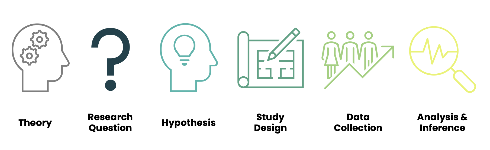

```{r setup, include=FALSE}
options(htmltools.dir.version = FALSE)
```

```{r xaringan-themer, include = FALSE}
library(xaringanthemer)
# style_mono_accent(
#   base_color = "#18778C",
#   header_color = "#000000",
#   header_font_google = google_font("Jost"),
#   header_font_weight = 500,
#   text_font_google = google_font("Jost", "300", "300i", "500", "500i"),
#   code_font_google = google_font("Source Code Pro"),
#   text_bold_color = '#D95829',
#   text_slide_number_color = '#18778C',
#   text_font_size = '16pt'
# )


style_mono_accent(
  base_color = "#18778C",
  header_color = "#000000",
  header_font_google = google_font("Jost"),
  header_font_weight = 500,
  text_font_google = google_font("Jost", "300", "300i", "500", "500i"),
  code_font_google = google_font("Source Code Pro"),
  text_bold_color = '#4CA384',
  text_slide_number_color = '#18778C',
  text_font_size = '16pt'
)
```


```{r, echo = F, message = F, warning = F}
library(tidyverse)
library(faux)

knitr::opts_chunk$set(dev = 'svg')

# baseColor <- "#18778C"
# accent1 <- '#D95829'
# accent2 <- '#BF3326'
# accent3 <- '#F29422'

baseColor <- '#4CA384'
accent1 <- '#9AD079'
accent2 <- '#18778C'
accent3 <- '#19424C'
 
# ```{css, echo = F}
# @media print {
#   .has-continuation {
#     display: block;
#   }
# }
# 
# ```

```

## Research process

```{r, echo = F}

```

---

## Why????

+ Psychology is a science

--

+ To answer our research questions, we use empirical evidence rather than rely on intuition or theory

  + We make systematic observations of our construct of interest then use these observations to draw conclusions

  + In other words, we gather data and look for consistent patterns within the data that support (or refute) our ideas

--

+ This class will help you build the skills necessary to evaluate research questions or hypotheses through empirical means


---
## Two primary analysis streams

.pull-left[
.center[<span style = "font-size:22pt"> **Qualitative Research** </span>]
+ Primarily used to explore ideas and formulate hypotheses

+ Results mostly extracted through words/text

+ Summarises themes or ideas within data

]

--

.pull-right[
.center[<span style = "color:#9AD079; font-size:22pt"><b>Quantitative Research</b></span>]
+ Primarily used to test predefined hypotheses and make predictions

+ Results mostly extracted through numeric data

+ Utilises statistical testing

]

--

.pull-left[
**Example Research Objective:** Describe the lived experiences of people managing anxiety without medication.
]

--
.pull-right[
<span style = "color:#9AD079"><b>Example Research Objective:</b></span> Determine whether individuals using compensatory mechanisms to manage their anxiety show significant differences in symptoms compared to those in therapy.

]

---
## Working with Data

+ Today: Visualisations and Summaries (used in Quantitative Analysis)

+ Next Week: Qualitative Analysis

+ And Beyond: More Quant Analysis

---

class: center, inverse, middle
count: false

## Visualising Data

---
## Visualising your data

.pull-left[

+ You can gain different information from your data depending on how it is visualised. 

  + **Frequency distributions** allow you to visualise how often each observation occurs or how a variable is distributed
  + **Boxplots** and **Scatterplots** allow you to inspect relationships between two (or more) variables
  
<span style = "font-size:14pt">Note that there are many other ways to visualise data, but these will be the key ways data are visualised on this course </span>

]

--

.pull-right[.center[<b> Basic Plot Anatomy </b>
```{r, echo = F, fig.height=5, fig.width = 6, warning = F, message = F}
dat <- data.frame(x = 1:10)

ggplot(dat, aes(x)) + geom_histogram(fill = 'white') +
  labs(x = 'x-axis', y = 'y-axis') +
  theme(axis.line = element_line(),
        panel.background = element_blank(),
        axis.text = element_blank(),
        axis.title = element_text(size = 18, face = 'bold'),
        axis.ticks = element_blank())

```
]]

---
## Frequency Distributions

.pull-left[

+ The type of frequency distribution you use depends on the type of data you have

+ The height of the bars represent the number of observations whose datapoints fall within the category or range of values on the x-axis

+ Allows you to quickly evaluate:
  + Whether there are any unusual values in your data
  + Which categories or values have the greatest (or least) representation in your data
  + Whether data are distributed in the way you would expect
]

.pull-right[
.center[**Discrete Categories - Bar Plot**
```{r, echo = F, fig.height=2.75, fig.width = 5, warning = F}

set.seed(608)

dat <- data.frame(YearofStudy = sample(c('Year 1', 'Year 2', 'Year 3', 'Year 4'), size = 100, replace = T, 
                            prob = c(.05, .35, .35, .25)),
                    Age = rnorm(n = 100, mean = 45, sd = 8))

(studyPlot <- ggplot(dat, aes(YearofStudy, fill = as.factor(YearofStudy))) + geom_bar() +
  scale_fill_manual(values = c(baseColor, accent1, accent2, accent3)) +
  scale_y_continuous(limits = c(0, 50), breaks = seq(0, 50, by = 10)) +
  labs(x = 'Year of Study', y = 'Count') +
  theme(legend.position = 'none',
        panel.background = element_blank(),
        axis.line = element_line(),
        axis.text = element_text(size = 14),
        axis.title = element_text(size = 16, face = 'bold')))

```


**Continuous Numbers - Histogram**
```{r, echo = F, fig.height=2.75, fig.width = 5, warning = F}
ggplot(dat, aes(Age)) + geom_histogram(fill = accent1, color = accent3, bins = 20, drop = TRUE) +
  ylab('Count')+
  scale_y_continuous(limits = c(0, 16), breaks = seq(0, 16, by = 2)) +
  scale_x_continuous(limits = c(20, 70), breaks = seq(20, 70, by = 10)) +
  theme(axis.line = element_line(),
        panel.background = element_blank(),
        axis.text = element_text(size = 12),
        axis.title = element_text(size = 14, face = 'bold'))

```
]]


---
## Boxplots

.pull-left[

+ Boxplots allow you to visualise the association between a categorical and continuous variable

  + <b>Box:</b> half of the observations
  
  + <b>Upper whisker:</b> upper quarter of the data
  
  + <b>Lower whisker:</b> lower quarter of the data
  
  + <b>Center line:</b> the **median**
  
  + <b>Dots:</b> **outliers** (extreme values that fall farther than expected from the average value in your data)

]

.pull-right[.center[
```{r, echo = F, fig.height=5, fig.width = 6, warning = F}
set.seed(44)
bDat <- data.frame(Weather = as.factor(c(rep('Rainy', 50), rep('Sunny', 50))),
                   Happiness = c(rnorm(n = 50, mean = 42, sd = 18),
                                 rnorm(n = 50, mean = 55, sd = 20)))

ggplot(bDat, aes(Weather, Happiness, fill = Weather)) + geom_boxplot() +
  scale_fill_manual(values = c(baseColor, accent1)) +
    theme(axis.line = element_line(),
          legend.position = 'none',
          panel.background = element_blank(),
          axis.text = element_text(size = 14),
          axis.title = element_text(size = 16, face = 'bold'))
```
]]

---
## Boxplots

.pull-left[
+ As with a frequency plot, boxplots also allow you to evaluate:
  + Whether there are any unusual values in your data
  + Whether data are distributed in the way you would expect
  
+ But now you can evaluate this for each category of a second variable, as well as how different the categories are from each other
]

.pull-right[.center[
```{r, echo = F, fig.height=5, fig.width = 6, warning = F}
ggplot(bDat, aes(Weather, Happiness, fill = Weather)) + geom_boxplot() +
  scale_fill_manual(values = c(baseColor, accent1)) +
    theme(axis.line = element_line(),
          legend.position = 'none',
          panel.background = element_blank(),
          axis.text = element_text(size = 14),
          axis.title = element_text(size = 16, face = 'bold'))
```
]]

---
## Scatterplots

.pull-left[

+ Scatterplots allow you to visualise the association between continuous variables

+ Each point represents an individual observation mapped across both continuous variables

+ A fit line may be added to evaluate the association further
  
]

.pull-right[.center[
```{r, echo = F, fig.height=5, fig.width = 6, warning = F, message = F}
set.seed(1022)
lT <- rnorm_multi(n = 50, varnames = c('Temperature', 'Happiness'),
                    mu = c(12, 45), sd = c(3, 10),
                    r = .6)

mT <- rnorm_multi(n = 50, varnames = c('Temperature', 'Happiness'),
                    mu = c(18, 60), sd = c(5, 10),
                    r = 0.1)

hT <- rnorm_multi(n = 50, varnames = c('Temperature', 'Happiness'),
                    mu = c(26, 60), sd = c(5, 10),
                    r = -.1)

ehT <- rnorm_multi(n = 50, varnames = c('Temperature', 'Happiness'),
                    mu = c(35, 45), sd = c(3, 10),
                    r = -.6)

sDat <- rbind(lT, mT, hT, ehT)


ggplot(sDat, aes(Temperature, Happiness)) + geom_point(color = accent2, size = 3.5) +
  geom_point(color = accent1, size = 2) +
  geom_smooth(se = F, color = accent2, size = 2) + 
    theme(axis.line = element_line(),
          legend.position = 'none',
          panel.background = element_blank(),
          axis.text = element_text(size = 14),
          axis.title = element_text(size = 16, face = 'bold'))
```
]]

---
class: center, middle, inverse

## Questions?

---
count: false
class: center, middle, inverse

## Describing Central Tendency in Data

---
## Describing your data

.pull-left[
+ Measures of Central Tendency
  
  + What is the middle-ish point of your data?

  + Can estimate in 3 ways:
    + **Mean**
    + **Median**
    + **Mode**
]

--

.pull-right[
+ Measures of Dispersion
  
  + How much spread is there in your data?
  
  + Helps us to understand how well the mean describes the data

  + Can estimate this in many ways, but in this course, we'll primarily focus on:

    + **Maxima & Minima**
  
    + **Standard Deviation**
]

---
## Central Tendancy: Mean

**In basic language:** The mathematical average; sum all values and divide by the total number of values

--

.pull-left[
**The mathematical notation:**

$$\bar{x} = \frac{\displaystyle\sum_{i=1}^{n}x_i}{n}$$
+ $n$ = total number of values in the data
+ $x_i$ = an individual value in the data
+ $\displaystyle\sum_{i=1}^{n}$ = sum all values between 1 ( $i=1$ ) and $n$

]

--

.pull-right.center[

$x = \{10, 2, 5, 3, 2, 0, 12\}$

$\bar{x} = \frac{\sum(10, 2, 5, 3, 2, 0, 12)}{7}$ 


$\bar{x} = 4.86$ 


```{r, echo = F, out.width='45%'}
#
```

]

---
## Central Tendancy: Mean

+ Can be used with _continuous/numeric_ data (i.e. interval and ratio data)

--


+ Say you have the following scale:

.pull-left[


| Scale  | Rate your understanding of the lecture     |
|--------|--------------------------------------------|
|    1   | I'm completely lost.                       |
|    2   | I'm a bit confused.                        |
|    3   | I understand about half of it.             |
|    4   | It's starting to come together.            |
|    5   | Everything is perfectly clear.             |

]

.pull-right[

> **Test your understanding:** What does an average of 3.2 actually mean, in the context of this scale?

]

---
count: false

## Central Tendancy: Mean

+ Can be used with _continuous/numeric_ data (i.e. interval and ratio data)

+ Say you have the following scale:

.pull-left[


| Scale  | Rate your understanding of the lecture     |
|--------|--------------------------------------------|
|    1   | I'm completely lost.                       |
|    2   | I'm a bit confused.                        |
|    3   | I understand about half of it.             |
|    4   | It's starting to come together.            |
|    5   | Everything is perfectly clear.             |

]

.pull-right[

> **Test your understanding:** What does an average of 3.2 actually mean, in the context of this scale?

> Is someone who is a bit confused twice as confused as someone for whom it's starting to come together?

]

--

<br>

+ Best not used with ordinal data, even though they may be coded as numeric values

---
## Central Tendancy: Median

+ The value in the exact center of a range

+ Can be used with ordinal, ratio, or interval data

.pull-left[
.center[
**If there are an odd number of values:**

$x = \{10, 2, 5, 3, 2, 0, 12\}$

$0, 2, 2, \color{#4CA384}{3}, 5, 10, 12$

**Median $x$ = 3**

]
]


.pull-right[
.center[
**If there are an even number of values:**

$y = \{3, 7, 1, 20, 14, 25\}$


$1, 3, \color{#4CA384}{7, 14,} 20, 25$


$\frac{7+14}{2} = 10.5$


**Median $y$ = 10.5**
]
]

--

> **Test your Understanding:** When might this measure be a better descriptor than the mean? 

---
## When is the median more useful than the mean?

+ To describe ordinal data (uses ranks rather than quantities)

+ When there are extreme values that could skew the data

--

```{r, echo = F}

```

--

.center[
<span style = "color:#18778C"><b>Mean =</span> £34,070</b>

<span style = "color:#9AD079"><b>Median =</span> £33,335</b>
]

---
## When is the median more useful than the mean?

+ To describe ordinal data (uses ranks rather than quantities)

+ When there are extreme values that could skew the data


```{r, echo = F}

```

--

.center[
<span style = "color:#18778C"><b>Mean =</span> £910,534,146</b>

<span style = "color:#9AD079"><b>Median =</span> £33,335</b>
]


---
## Central Tendancy: Mode

.pull-left[
+ The value that appears most frequently in a range
  + Data may be bimodal or multimodal

+ Can be used with all types of data, although generally useless for describing continuous data

]

--

.pull-right.center[
**Unimodal**
```{r, echo = F, fig.height=2.5}
studyPlot
```

**Bimodal**
```{r, echo = F, fig.height=2.5}
biDat <- data.frame(x=c(rep('Cats', 12), rep('Dogs', 12), rep('Rodents', 10), rep('Reptiles', 7), rep('Other', 6)))

ggplot(biDat, aes(x, fill = x)) + geom_bar() +
  labs(x = 'Type of Pet', y = 'Count') +
  scale_y_continuous(breaks = seq(0, 12, by = 2), limits = c(0,12)) +
  scale_fill_manual(values = c(baseColor, accent1, accent2, accent3, 'gray18')) +
  theme(legend.position = 'none',
        axis.text = element_text(size = 14),
        axis.title = element_text(size = 16, face = 'bold'),
        panel.background = element_blank(),
        axis.line = element_line())
```

]


---
## Limitations of Central Tendency

+ In isolation, central tendency doesn't sufficiently describe the data

.pull-left[

| Participant |  Test Score |
|:-----------:|:-----------:|
| 1           |    6        |
| 2           |    5        |
| 3           |    6        |
| 4           |    5        |
| 5           |    5        |
| Total       |    27       |

.center[
**Mean** = 5.4
]

--

]

.pull-right[

| Participant |  Test Score |
|:-----------:|:-----------:|
| 1           |    2        |
| 2           |    2        |
| 3           |    10       |
| 4           |    10       |
| 5           |    3        |
| Total       |    27       |

.center[
**Mean** = 5.4
]
]

---
class: center, inverse, middle

## Questions?

---
count: false
class: center, inverse, middle

## Describing Variation in Data


---
## Variation in Scores

.pull-left[
+ Helps us to understand how well the mean describes our data

+ In this course, we'll primarily use:

  + Maxima & Minima
  
  + Standard Deviation
]

--


.pull-right[
```{r, echo = F, fig.height=4.5, warning=F, message = F}
set.seed(208)
sampDat <- data.frame(Participant = 1:8, Age=round(sample(dat$Age, 8)))

(varPlot <- ggplot(sampDat, aes(Participant, Age)) + geom_point(size = 2.5) +
  scale_x_continuous(limits = c(0.5, 8.5), breaks = seq(1, 8, by = 1)) +
  scale_y_continuous(breaks=seq(30, 65, 5), limits = c(30, 65)) +
  theme(axis.text = element_text(size = 14),
        axis.title = element_text(size = 16, face = 'bold')))
  
```
]


---
## Variation in Scores

.pull-left[
+ Helps us to understand how well the mean describes our data

+ In this course, we'll primarily use:

  + **Maxima & Minima**
  
  + Standard Deviation
]


.pull-right[
```{r, echo = F, fig.height=4.5}

varPlot + 
 annotate(geom = 'rect', xmin = which.min(sampDat$Age)-.5, xmax = which.min(sampDat$Age)+.5, ymin = min(sampDat$Age)-2, ymax = min(sampDat$Age)+2, alpha = .1, color = accent2, linewidth = 1) +
  annotate('text', label = paste0('Minimum Value = ', round(min(sampDat$Age),2)), x = which.min(sampDat$Age)-2, y = min(sampDat$Age), size = 6) + 
  annotate(geom = 'rect', xmin = which.max(sampDat$Age)-.5, xmax = which.max(sampDat$Age)+.5, ymin = max(sampDat$Age)-2, ymax = max(sampDat$Age)+2, alpha = .1, color = accent2, linewidth = 1) +
  annotate('text', label = paste0('Maximum Value = ', round(max(sampDat$Age),2)), x = which.max(sampDat$Age)-2, y = max(sampDat$Age), size = 6)

```
]

---
## Variation in Scores - Standard Deviation

+ On average, how far away are individual observations from the mean? 

.pull-left.center[

```{r, echo = F, fig.height=4, fig.width=6, warning = F}
set.seed(1022)
f <- rnorm(200, 10, 5)

ggplot(mapping=aes(f)) + geom_histogram(fill = baseColor, color = accent3, binwidth = 1) +
  scale_x_continuous(limits = c(-25, 45)) +
  scale_y_continuous(limits = c(0, 25)) +
  theme(axis.text = element_blank(),
        axis.ticks = element_blank(),
        axis.title = element_blank()) +
  geom_vline(xintercept = mean(f), color = accent1, linewidth = 1.5)
```

**Mean = 10, SD = 5**

]

.pull-right.center[

```{r, echo = F, fig.height=4, fig.width=6, warning = F}
set.seed(608)
m <- rnorm(200, 10, 10)

ggplot(mapping=aes(m)) + geom_histogram(fill = baseColor, color = accent3, binwidth=1) +
  scale_x_continuous(limits = c(-25, 45)) +
  scale_y_continuous(limits = c(0, 25)) +
  theme(axis.text = element_blank(),
        axis.ticks = element_blank(),
        axis.title = element_blank()) +
  geom_vline(xintercept = mean(m), color = accent1, linewidth = 1.5)

```

**Mean = 10, SD = 10**

]

---
## Variation in Scores - Standard Deviation

.pull-left[
$$SD = \sqrt{\frac{\sum(x_i-\bar{x})^2}{n-1}}$$
]

.pull-right[
```{r, echo = F, fig.height=4.5}
varPlot
```
]

---
## Variation in Scores - Standard Deviation

.pull-left[

$$SD = \sqrt{\frac{\sum(\color{#4CA384}{x_i}-\bar{x})^2}{n-1}}$$

+ $x_i$ = individual observations of x
]

.pull-right[
```{r, echo = F, fig.height=4.5}
varPlot + geom_point(color = baseColor, size = 3)
```

]

---
## Variation in Scores - Standard Deviation

.pull-left[
$$SD = \sqrt{\frac{\sum(x_i-\color{#4CA384}{\bar{x}})^2}{n-1}}$$


+ $x_i$ = individual observations of x

+ $\bar{x}$ = mean of variable x

]

.pull-right[
```{r, echo = F, fig.height=4.5}
(varPlot <- varPlot + geom_hline(yintercept = mean(sampDat$Age), color = accent2, linewidth = 1))
```

]

---
## Variation in Scores - Standard Deviation

.pull-left[
$$SD = \sqrt{\frac{\sum(\color{#4CA384}{x_i-\bar{x}})^2}{n-1}}$$


+ $x_i$ = individual observations of x

+ $\bar{x}$ = mean of variable x

]

.pull-right[
```{r, echo = F, fig.height=4.5}
sampDat$dist <- sampDat$Age-mean(sampDat$Age)

varPlot + geom_segment(aes(x = Participant, y = Age, xend = Participant, yend = mean(Age)),
               col = baseColor, lty = 2) + 
  annotate(geom='text', label=sampDat$dist, x=1:nrow(sampDat)+.5, y = sampDat$Age-sampDat$dist*.5, size=5.5)

```

]

---
## Variation in Scores - Standard Deviation

.pull-left[
$$SD = \sqrt{\frac{\sum(x_i-\bar{x})\color{#4CA384}{^2}}{n-1}}$$


+ $x_i$ = individual observations of x

+ $\bar{x}$ = mean of variable x

> **Test Your Understanding:** Why do we need to square these values before summing them?

]

.pull-right[
```{r, echo = F, fig.height=4.5}
sampDat$sqDist <- round(sampDat$dist^2,2)

varPlot + geom_segment(aes(x = Participant, y = Age, xend = Participant, yend = mean(Age)),
               col = baseColor, lty = 2) + 
  annotate(geom='text', label=sampDat$sqDist, x=1:nrow(sampDat)+.5, y = sampDat$Age-sampDat$dist*.5, size=5.5)

```

]

---
## Variation in Scores - Standard Deviation

.pull-left[
$$SD =\sqrt{\frac{\sum(x_i-\bar{x})^2}{n-1}}$$


+ $x_i$ = individual observations of x

+ $\bar{x}$ = mean of variable x

+ $\sum(x_i-\bar{x})^2$ = sum of squared deviations (AKA the sum of squares)

+ $SD = \sqrt{\frac{`r round(sum(sampDat$sqDist),2)`}{8-1}} = `r round(sqrt(sum(sampDat$sqDist)/(nrow(sampDat)-1)), 2)`$


]

.pull-right[
```{r, echo = F, fig.height=4.5}
varPlot + geom_segment(aes(x = Participant, y = Age, xend = Participant, yend = mean(Age)),
               col = baseColor, lty = 2) + 
  annotate(geom='text', label=sampDat$sqDist, x=1:nrow(sampDat)+.5, y = sampDat$Age-sampDat$dist*.5, size=5.5)
```

]

---
## Why n-1?

+ When we conduct a research study, we are using a sample to make estimates about the overall population

+ In doing so, we are assuming that our sample mean reflects the population mean

+ Adding -1 allows us to make an estimate of the population that's less biased by our specific sample.

--

> **Test your understanding:** Is a smaller sample MORE or LESS likely to reflect the overall population?


--


| Sample Size | SD (n)          | SD (n - 1)     |
|:-----------:|:---------------------:|:--------------------:|
|    5        |  `r round(sqrt(526.22/5), 2)`  | `r round(sqrt(526.22/4), 2)`  |
|    10       |  `r round(sqrt(526.22/10),2)`  | `r round(sqrt(526.22/9), 2)`  |
|    50       |  `r round(sqrt(526.22/50),2)`  | `r round(sqrt(526.22/49),2)`  |
|    100      |  `r round(sqrt(526.22/100),2)` | `r round(sqrt(526.22/99),2)`  |
|    1000     |  `r round(sqrt(526.22/1000),2)`| `r round(sqrt(526.22/999),2)` |


???

Probably a wider spread in the population than what we are accounting for in our small sample

As the sample grows larger, the variance estimated using n or n-1 grows more similar


---
## Variation in Scores - Standard Deviation

.pull-left[
+ $SD = \sqrt{`r round(sum(sampDat$sqDist)/(nrow(sampDat)-1),2)`} = `r round(sqrt(sum(sampDat$sqDist)/(nrow(sampDat)-1)),2)`$

+ Expressed in the units of the variable of interest


+ On average, participants in our sample are `r round(sqrt(sum(sampDat$sqDist)/(nrow(sampDat)-1)),2)` years older or younger than the mean of `r round(mean(sampDat$Age),2)`.

]


---
## A Note on Notation

+ We use slightly different notations when referring to point-estimates versus population parameters:

.center[

| Value              | Population | Sample          |
|:------------------:|:----------:|:---------------:|
| Mean               |  $\mu$     | $M$ or $\bar{x}$|
| Standard Deviation | $\sigma$   | $SD$ or $s$     |
| Sample Size        | $N$        | $n$             |

]


---
## Important Final Note

+ The methods covered today are to help you start to explore and evaluate the quality of your data

+ They cannot tell you whether there is a significant or meaningful relationship between your variables

+ Further testing is needed

---

class: center, inverse, middle
count: false

## Questions?
