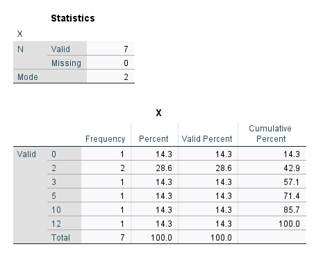

```{r setup, include=FALSE}
options(htmltools.dir.version = FALSE)
```

```{r xaringan-themer, include = FALSE}
library(xaringanthemer)
style_mono_accent(
  base_color = "#18778C",
  header_color = "#000000",
  header_font_google = google_font("Jost"),
  header_font_weight = 500,
  text_font_google = google_font("Jost", "300", "300i", "500", "500i"),
  code_font_google = google_font("Source Code Pro"),
  text_bold_color = '#D95829',
  text_slide_number_color = '#18778C',
  text_font_size = '16pt'
)
```

```{r, echo = F, message = F, warning = F}
library(tidyverse)
knitr::opts_chunk$set(dev = 'svg')

baseColor <- "#18778C"
accent1 <- '#D95829'
accent2 <- '#BF3326'
accent3 <- '#F29422'
```

## Why????

+ Psychology is a science....

--

+ with a lot of uncertainty

---
exclude: true

## Research process

---
exclude: true
## The truth is out there.

---
exclude: true
## From sample to population

---
exclude: true
## Hypotheses

---
exclude: true
## Directional vs nondirectional hypotheses

---
## Visualising your data: Frequency Distributions

+ Frequency distributions allow you to visualise how often each observation occurs

+ The type of frequency distribution you use depends on the type of data you have.

--

.pull-left.center[
**Categorical Data: Bar Plots**
```{r}
catDat <- data.frame(EyeColour=sample(c('Blue', 'Green', 'Hazel', 'Amber', 'Brown', 'Gray'), size = 1000, replace = T, 
                            prob = c(.10, .02, .05, .05, .75, .03)))

ggplot(catDat, aes(EyeColour, fill = as.factor(EyeColour))) + geom_bar() +
  scale_fill_manual(values = c('#D98825', '#6D90A6', '#592202', '#B8BDB6', '#4E7A23', '#716F3F')) +
  theme(legend.position = 'none')

```
]

---
## Describing your data: Central Tendancy

+ What is the middle-ish point of your data?

+ Can estimate in 3 ways:
  + **Mean**
  + **Median**
  + **Mode**
  
---
## Central Tendancy: Mean

.pull-left[


**The mathematical notation:**

$$\bar{x} = \frac{1}{n} \displaystyle\sum_{i=1}^{n}x_i$$
+ Where:
    + $n$ = total number of values in the data
    + $x_i$ = an individual value in the data
    + $\displaystyle\sum_{i=1}^{n}$ = sum all values between the first value in the set ( $i=1$ ) and the $n$th value in the set

]
---
count: false

## Central Tendancy: Mean

.pull-left[

**The mathematical notation:**

$$\bar{x} = \frac{1}{n} \displaystyle\sum_{i=1}^{n}x_i$$
+ Where:
    + $n$ = total number of values in the data
    + $x_i$ = an individual value in the data
    + $\displaystyle\sum_{i=1}^{n}$ = sum all values between the first value in the set ( $i=1$ ) and the $n$th value in the set

    
**In basic language:** 
 
 + The mathematical average; sum all values and divide by the total number of values
]

--

.pull-right.center[

$y = \{4, 1, 2, 4, 3\}$
<br />
<br />
$\bar{y} = \frac{1}{5}\times(4+1+2+4+3)$ 
<br />
$\bar{y} = 2.80$ 
<br />
<br />
<br />

$x = \{10, 2, 5, 3, 2, 0,8, 2,5,3,4,3,1,1,2,0\}$
```{r, echo = F, out.width='45%'}
knitr::include_graphics('images/SPSSmean.PNG')
```

]

---
## Central Tendancy: Mean

+ Can be used with _continuous/numeric_ data (i.e. interval and ratio data)

+ Best not to be used with ordinal data or nominal data, even though they may be coded as numeric values

+ Say you have the following scale:

[MONICA CHANGE THESE RATINGS]

|Rating Scale | Rate your understanding of today's lecture                       |
|-------------|------------------------------------------------------------------|
|    1        | You know nothing, John Snow                                      |
|    2        | I'm a bit confused.                                              |
|    3        | I understand about half of it.                                   |
|    4        | Clever girl.                                                     |
|    5        | I'm beginning to feel like a stats god.                          |

> **Test your understanding:** What does a mean of 3.2 actually mean, in the context of this scale?

--

> Is someone who gives a rating of 2 twice as confused as someone who gives a rating of 4?

---
## Central Tendancy: Mode

.pull-left[
+ The number that appears most frequently in a range of numbers.

+ Can be used with all types of data, although may be less useful

]

.pull-left.center[

$x = \{10, \color{#D95829}{2}, 5, 3, \color{#D95829}{2}, 0, 12\}$

```{r, echo = F, out.width='85%'}

```

]
  
---
exclude: true
## Describing your data: Variance


---
exclude: true
## Describing your data: Frequency distributions

---
## The normal distribution

+ A probability distribution where values around the mean are most common, and values further from the mean are increasingly less common.

+ AKA the bell curve, a Gaussian distribution

--

> **Test Your Understanding:** What kinds of variables can you think of that might follow a normal distribution? 

---
## The normal distribution
.pull-left[
**Characteristics of a normal distribution**

+ Unimodal

+ Centered around mean

]
.pull-right[
```{r, echo = F, fig.width=5, fig.height=3.5}
normDist <- ggplot(data.frame(X = c(-6, 6)), aes(x = X)) +
  stat_function(fun=dnorm, geom = "line", linewidth = 1.5) + 
  theme(axis.title.x = element_text(size = 14, face = 'bold'),
        axis.line.y = element_blank(),
        axis.text = element_blank(),
        axis.ticks = element_blank(),
        axis.title.y = element_blank())

normDist + geom_vline(xintercept = 0, color=accent1)
```
]

---
## The normal distribution
.pull-left[
**Characteristics of a normal distribution**

+ Unimodal

+ Centered around mean

  + **68%** of scores fall within **1 SD** of the mean

]
.pull-right[
```{r, echo = F, fig.width=5, fig.height=3.5}
normDist + geom_area(stat = 'function', fun = dnorm, fill = baseColor, xlim=c(-1, 1), alpha = .7) + 
  geom_vline(xintercept = 0, color=accent1)
```
]

---
## The normal distribution
.pull-left[
**Characteristics of a normal distribution**

+ Unimodal

+ Centered around mean

  + 68% of scores fall within 1 SD of the mean
  + **95%** of scores fall within **~2 SD** of the mean (exactly 1.96 SD of the mean)

]
.pull-right[
```{r, echo = F, fig.width=5, fig.height=3.5}
normDist + geom_area(stat = 'function', fun = dnorm, fill = accent3, xlim=c(-1.96, 1.96), alpha = .7) + 
  geom_vline(xintercept = 0, color=accent1)
```
]

---
## The normal distribution
.pull-left[
**Characteristics of a normal distribution**

+ Unimodal

+ Centered around mean

  + 68% of scores fall within 1 SD of the mean
  + 95% of scores fall within ~2 SD of the mean (exactly 1.96 SD of the mean)
  + **99.75%** of scores fall within **3 SD** of the mean

]
.pull-right[
```{r, echo = F, fig.width = 5, fig.height = 3.5}
normDist + geom_area(stat = 'function', fun = dnorm, fill = accent2, xlim=c(-3, 3), alpha = .7) +
  geom_vline(xintercept = 0, color=accent1)
```
]

---
## The normal distribution

> **Test your understanding:** You have given participants the WAIS-IV, which is an IQ test that has been normalised so that the mean is 100 and the SD is 15. Scores are normally distributed. What value do we expect at each point on this normal distribution?

.center[
```{r, echo = F, fig.width=8, fig.height=4}

set.seed(22)
waisDat <- data.frame(Score=rnorm(1000, mean = 100, sd = 15))

waisDist <- ggplot(data.frame(X=c(-4, 4)), aes(x=X)) + 
  stat_function(fun=dnorm, geom = "line", linewidth = 1.5, args = c(mean=0, sd =1)) +
  geom_hline(yintercept = 0, linewidth = 1.5) +
  xlab('WAIS Score') +
  theme(axis.title.x = element_text(size = 14, face = 'bold'),
        axis.line.y = element_blank(),
        axis.text = element_blank(),
        axis.ticks = element_blank(),
        axis.title.y = element_blank())

waisDist + 
  annotate(geom='segment', x=0, xend=0, y=0, yend=.4, color = accent1, linetype='dashed', linewidth = 1) +
  annotate(geom='text', label = 'A', x=0, y = -.02, color = accent1, size = 5)
```
]

---
## The normal distribution

> **Test your understanding:** You have given participants the WAIS-IV, which is an IQ test that has been normalised so that the mean is 100 and the SD is 15. Scores are normally distributed. What value do we expect at each point on this normal distribution?

.center[
```{r, echo = F, fig.width=8, fig.height=4}

waisDist <- waisDist + 
  annotate(geom='text', label = '100', x = 0, y = -.02, size = 5, color = accent1) +
  annotate(geom='segment', x=0, xend=0, y=.01, yend=-.01)

waisDist + 
  geom_area(stat = 'function', fun = dnorm, fill = baseColor, xlim=c(-1, 1), alpha = .7) +
  annotate(geom='segment', x=-1, xend=-1, y=0, yend=.4, color = baseColor, linetype='dashed', linewidth = 1) +
  annotate(geom='segment', x=1, xend=1, y=0, yend=.4, color = baseColor, linetype='dashed', linewidth = 1) +
  annotate(geom = 'text', label = '~68%', x = 0, y = .2, color='white', size = 7) +
  annotate(geom='text', label = 'C', x=1, y = -.02, color = baseColor, size = 5) +
  annotate(geom='text', label = 'B', x=-1, y = -.02, color = baseColor, size = 5)
  
```
]

---
## The normal distribution

> **Test your understanding:** You have given participants the WAIS-IV, which is an IQ test that has been normalised so that the mean is 100 and the SD is 15. Scores are normally distributed. What value do we expect at each point on this normal distribution?

.center[
```{r, echo = F, fig.width=8, fig.height=4}

waisDist <- waisDist + 
  annotate(geom='text', label = '85', x = -1, y = -.02, size = 5, color = baseColor) +
  annotate(geom='segment', x=-1, xend=-1, y=.01, yend=-.01) +
  annotate(geom='text', label = '115', x = 1, y = -.02, size = 5, color = baseColor) +
  annotate(geom='segment', x=1, xend=1, y=.01, yend=-.01)
  

waisDist + 
  geom_area(stat = 'function', fun = dnorm, fill = accent3, xlim=c(-1.96, 1.96), alpha = .7) +  
  annotate(geom='segment', x=-1.96, xend=-1.96, y=0, yend=.4, color = accent3, linetype='dashed', linewidth = 1) +
  annotate(geom='segment', x=1.96, xend=1.96, y=0, yend=.4, color = accent3, linetype='dashed', linewidth = 1) +
  annotate(geom = 'text', label = '~95%', x = 0, y = .2, color='white', size = 7) +
  annotate(geom='text', label = 'E', x= 1.96, y = -.02, color = accent3, size = 5) +
  annotate(geom='text', label = 'D', x=-1.96, y = -.02, color = accent3, size = 5)
  
```
]

---

## The normal distribution

> **Test your understanding:** You have given participants the WAIS-IV, which is an IQ test that has been normalised so that the mean is 100 and the SD is 15. Scores are normally distributed. What value do we expect at each point on this normal distribution?

.center[
```{r, echo = F, fig.width=8, fig.height=4}

waisDist <- waisDist + 
  annotate(geom='text', label = '70', x = -1.96, y = -.02, size = 5, color = accent3) +
  annotate(geom='segment', x=-1.96, xend=-1.96, y=.01, yend=-.01) +
  annotate(geom='text', label = '130', x = 1.96, y = -.02, size = 5, color = accent3) +
  annotate(geom='segment', x=1.96, xend=1.96, y=.01, yend=-.01)
  

waisDist + 
  geom_area(stat = 'function', fun = dnorm, fill = accent2, xlim=c(-3, 3), alpha = .7) +
  annotate(geom = 'text', label = '~99%', x = 0, y = .2, color='white', size = 7) +
  annotate(geom='segment', x=-3, xend=-3, y=0, yend=.4, color = accent2, linetype='dashed', linewidth = 1) +
  annotate(geom='segment', x=3, xend=3, y=0, yend=.4, color = accent2, linetype='dashed', linewidth = 1) +
  annotate(geom='text', label = 'G', x=-3, y = -.02, color = accent2, size = 5) +
  annotate(geom='text', label = 'F', x=3, y = -.02, color = accent2, size = 5)
  
```
]

---
## The normal distribution

> **Test your understanding:** You have given participants the WAIS-IV, which is an IQ test that has been normalised so that the mean is 100 and the SD is 15. Scores are normally distributed. What value do we expect at each point on this normal distribution?

.center[
```{r, echo = F, fig.width=8, fig.height=4}

waisDist <- waisDist + 
  annotate(geom='text', label = '55', x = -3, y = -.02, size = 5, color = accent2) +
  annotate(geom='segment', x=-3, xend=-3, y=.01, yend=-.01) +
  annotate(geom='text', label = '145', x = 3, y = -.02, size = 5, color = accent2) +
  annotate(geom='segment', x=3, xend=3, y=.01, yend=-.01)
  

waisDist + 
  annotate(geom='text', label = 'Mean', x = 0, y = -.045, size = 5, color = accent1) +
  annotate(geom='text', label = '-1 SD', x = -1, y = -.045, size = 5, color = baseColor) +
  annotate(geom='text', label = '+1 SD', x = 1, y = -.045, size = 5, color = baseColor) +
  annotate(geom='text', label = '-~2 SD', x = -1.96, y = -.045, size = 5, color = accent3) +
  annotate(geom='text', label = '+~2 SD', x = 1.96, y = -.045, size = 5, color = accent3) +
  annotate(geom='text', label = '-3 SD', x = -3, y = -.045, size = 5, color = accent2) +
  annotate(geom='text', label = '+3 SD', x = 3, y = -.045, size = 5, color = accent2) +
  annotate(geom='segment', x=-3, xend=-3, y=0, yend=.01, color = accent2, linetype='dashed', linewidth = 1) +
  annotate(geom='segment', x=3, xend=3, y=0, yend=.01, color = accent2, linetype='dashed', linewidth = 1) +   
  annotate(geom='segment', x=-1.96, xend=-1.96, y=0, yend=.06, color = accent3, linetype='dashed', linewidth = 1) +
  annotate(geom='segment', x=1.96, xend=1.96, y=0, yend=.06, color = accent3, linetype='dashed', linewidth = 1) + 
  annotate(geom='segment', x=-1, xend=-1, y=0, yend=.25, color = baseColor, linetype='dashed', linewidth = 1) +
  annotate(geom='segment', x=1, xend=1, y=0, yend=.25, color = baseColor, linetype='dashed', linewidth = 1) +
  annotate(geom='segment', x=0, xend=0, y=0, yend=.4, color = accent1, linetype='dashed', linewidth = 1)
```
]
---

exclude: true
## Probability Distributions

---
exclude: true
## Where does probability come in?

---
exclude: true
## Null Distribution

---
exclude: true
## Comparing Data against null distribution: NHST

---
exclude: true

## Wooclap questions slide!

