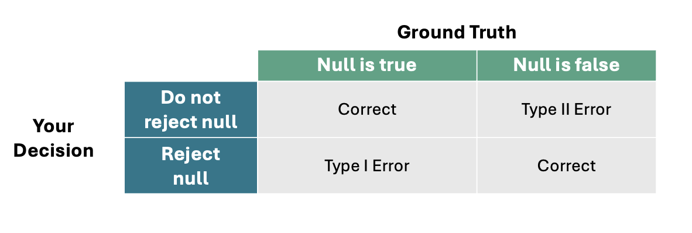

```{r setup, include=FALSE}
options(htmltools.dir.version = FALSE)
```

```{r xaringan-themer, include = FALSE}
library(xaringanthemer)
style_mono_accent(
  base_color = "#18778C",
  header_color = "#000000",
  header_font_google = google_font("Jost"),
  header_font_weight = 500,
  text_font_google = google_font("Jost", "300", "300i", "500", "500i"),
  code_font_google = google_font("Source Code Pro"),
  text_bold_color = '#4CA384',
  text_slide_number_color = '#18778C',
  text_font_size = '16pt'
)
```

```{r, echo = F, message = F, warning = F}
library(tidyverse)
library(rstatix)

knitr::opts_chunk$set(dev = 'svg')

baseColor <- '#4CA384'
accent1 <- '#9AD079'
accent2 <- '#18778C'
accent3 <- '#19424C'
```

## This Week's Key Topics

+ Standard Error

+ Effect Sizes

+ Confidence Intervals

+ Power

---
## Effect Size

+ On it's own, a $p$-value is not sufficient. 

.pull-left[.center[
```{r, echo = F, fig.width=5, fig.height=3.5}
set.seed(1022)
dat <- data.frame(group = c(rep('A', 10), rep('B', 10)), x=c(rnorm(10, mean = 5, sd = 4), rnorm(10, mean = 10.5, sd = 4)))

set.seed(7)
dat2 <- data.frame(group = c(rep('A', 100), rep('B', 100)), x=c(rnorm(100, mean = 5, sd = 3.4), rnorm(100, mean = 6.15, sd = 3.4)))

(p1 <- ggplot(dat, aes(x)) + geom_density(data = dat[dat$group=='A',], fill = baseColor, alpha = .7) + 
  geom_vline(xintercept = mean(dat$x[dat$group=='A']), color = baseColor, linewidth = 1.5, linetype = 2) +
  geom_density(data = dat[dat$group=='B',], fill = accent2, alpha = .7) +
  theme(axis.text = element_blank(),
        axis.title = element_blank(),
        axis.ticks = element_blank()) +
  annotate('text', label = 'n = 10 per group', x = 30, y = .05, size = 5) +
  geom_vline(xintercept = mean(dat$x[dat$group=='B']), color = accent2, linewidth = 1.5, linetype = 2) + 
  geom_hline(yintercept = 0, linewidth = 1) + 
  scale_x_continuous(limits = c(-10, 40)))

```
]]

.pull-right[.center[
```{r, echo = F, fig.width=5, fig.height=3.5, warning = F}
(p2 <- ggplot(dat2, aes(x)) + geom_density(data = dat2[dat2$group=='A',], fill = baseColor, alpha = .7) + 
  geom_vline(xintercept = mean(dat2$x[dat2$group=='A']), color = baseColor, linewidth = 1.5, linetype = 2) +
  geom_density(data = dat2[dat2$group=='B',], fill = accent2, alpha = .7) +
  theme(axis.text = element_blank(),
        axis.title = element_blank(),
        axis.ticks = element_blank()) +
  annotate('text', label = 'n = 100 per group', x = 30, y = .075, size = 5) +
  geom_vline(xintercept = mean(dat2$x[dat2$group=='B']), color = accent2, linewidth = 1.5, linetype = 2) + 
  geom_hline(yintercept = 0, linewidth = 1) + 
  scale_x_continuous(limits = c(-10, 40)))
```
]]

---
count: false

## Effect Size

+ On it's own, a $p$-value is not sufficient. 

.pull-left[.center[
```{r, echo = F, fig.width=5, fig.height=3.5}
p1
```

** $p$ = .015**
]]


.pull-right[.center[
```{r, echo = F, fig.width=5, fig.height=3.5}
p2
```

** $p$ = .015**
]]

---
## Effect Size

+ The **effect size** describes the magnitude of the effect or relationship

+ Unlike a $p$-value, which only tells you the likelihood that an effect or relationship exists, the effect size tells you how strong it is.

+ Different measures of effect size depending on your data/the statistical test you use

+ Usually standardised so that you can make comparisons across different variables

--

.pull-left.center[

```{r, echo = F, fig.width=4.5, fig.height=2.5}
dP1 <- cohens_d(dat, formula = x~group)
p1 + 
  annotate('segment', x=mean(dat$x[dat$group=='A']), xend = mean(dat$x[dat$group=='B']), y = .1, color = accent3, linewidth = 1.5) +
  annotate('text', label = paste('effect size =', round(abs(dP1$effsize), 2), '(large)'), x=28, y = .1, color = accent3, size = 5)
```

]

.pull-right.center[

```{r, echo = F, fig.width=4.5, fig.height=2.5}
dP2 <- cohens_d(dat2, formula = x~group)

p2 + 
  annotate('segment', x=mean(dat2$x[dat2$group=='A']), xend = mean(dat2$x[dat2$group=='B']), y = .15, color = accent3, linewidth = 1.5) +
  annotate('text', label = paste('effect size =', round(abs(dP2$effsize), 2), '(small)'), x=24, y = .15, color = accent3, size = 5)
```

]


???

Think about practical significance - a pharmaceutical company tests the effect of their new vitamin and finds that it significantly decreases the amount of time someone is sick over the course of a year. SIGNIFICANCE! But wait...it only decreases the amount of sick days by a single day. EFFECT SIZE. Do they really want to spend an immense amount of money for a single day's improvement?

---
## Confidence Intervals

+ Remember, we don't actually know the population parameter; we're trying to estimate this with our data.

+ A **confidence interval** defines a plausible range of values for our population parameter. 

+ The wider the interval, the more confident that we can be that the interval captures our true value.

--

> How many of you are confident that I'm exactly 35 years old?

--

> How many of you are confident that I'm between 33 & 38 years old?

--

> How many of you are confident that I'm between 29 & 42 years old?

--

> How many of you are confident that I'm between 25 & 46 years old?
  
---
## Confidence Level

+ To estimate the confidence interval, we need:

  + To define a confidence level
  + The standard error

+ The **confidence level** refers to the percentage of times confidence intervals would be expected to contain the true population parameter across repeated samples.

+ The typical confidence level used is **95%**, although you might also see 90% or 99%

+ So, if we were to take 100 samples and calculate a 95% CI on each of them, ~95 of those intervals would contain the true population parameter.


???

+ What are we 95% confident in?

  + We are 95% confident that our interval contains the true population mean.
  
  + The 95% probability comes from the long-run frequencies of our intervals.

---
## Standard Error

+ The average deviation from the mean *within* our sample is the **standard deviation**

+ Now imagine you took multiple samples and plotted their means:

--

.center[
```{r, echo = F, fig.height=3.5, warning = F}
set.seed(44)
seDat <- data.frame(MeanScore = rnorm(1, mean = 62, sd = 5))

ggplot(seDat, aes(MeanScore)) + geom_histogram(binwidth = 2, fill = baseColor, color = accent3) +
  scale_y_continuous(breaks=seq(0, 20, 5), limits = c(0, 20)) + 
  scale_x_continuous(breaks=seq(45, 80, 5), limits = c(45, 80)) +
  xlab('Mean Score') +
  theme(axis.text = element_text(size = 12),
        axis.title = element_text(size = 14, face = 'bold'))
```
]

---
count: false

## Standard Error

+ The average deviation from the mean *within* our sample is the **standard deviation**

+ Now imagine you took multiple samples and plotted their means:

.center[
```{r, echo = F, fig.height=3.5, warning = F}
set.seed(44)
seDat <- data.frame(MeanScore = rnorm(2, mean = 62, sd = 5))

ggplot(seDat, aes(MeanScore)) + geom_histogram(binwidth = 2, fill = baseColor, color = accent3) +
  scale_y_continuous(breaks=seq(0, 20, 5), limits = c(0, 20)) + 
  scale_x_continuous(breaks=seq(45, 80, 5), limits = c(45, 80)) +
  xlab('Mean Score') +
  theme(axis.text = element_text(size = 12),
        axis.title = element_text(size = 14, face = 'bold'))
```
]

---
count: false

## Standard Error

+ The average deviation from the mean *within* our sample is the **standard deviation**

+ Now imagine you took multiple samples and plotted their means:

.center[
```{r, echo = F, fig.height=3.5, warning = F}
set.seed(44)
seDat <- data.frame(MeanScore = rnorm(3, mean = 62, sd = 5))

ggplot(seDat, aes(MeanScore)) + geom_histogram(binwidth = 2, fill = baseColor, color = accent3) +
  scale_y_continuous(breaks=seq(0, 20, 5), limits = c(0, 20)) + 
  scale_x_continuous(breaks=seq(45, 80, 5), limits = c(45, 80)) +
  xlab('Mean Score') +
  theme(axis.text = element_text(size = 12),
        axis.title = element_text(size = 14, face = 'bold'))
```
]

---
count: false

## Standard Error

+ The average deviation from the mean *within* our sample is the **standard deviation**

+ Now imagine you took multiple samples and plotted their means:

.center[
```{r, echo = F, fig.height=3.5, warning = F}
set.seed(44)
seDat <- data.frame(MeanScore = rnorm(4, mean = 62, sd = 5))

ggplot(seDat, aes(MeanScore)) + geom_histogram(binwidth = 2, fill = baseColor, color = accent3) +
  scale_y_continuous(breaks=seq(0, 20, 5), limits = c(0, 20)) + 
  scale_x_continuous(breaks=seq(45, 80, 5), limits = c(45, 80)) +
  xlab('Mean Score') +
  theme(axis.text = element_text(size = 12),
        axis.title = element_text(size = 14, face = 'bold'))
```
]

---
count: false

## Standard Error

+ The average deviation from the mean *within* our sample is the **standard deviation**

+ Now imagine you took multiple samples and plotted their means:

.center[
```{r, echo = F, fig.height=3.5, warning = F}
set.seed(44)
seDat <- data.frame(MeanScore = rnorm(5, mean = 62, sd = 5))

ggplot(seDat, aes(MeanScore)) + geom_histogram(binwidth = 2, fill = baseColor, color = accent3) +
  scale_y_continuous(breaks=seq(0, 20, 5), limits = c(0, 20)) + 
  scale_x_continuous(breaks=seq(45, 80, 5), limits = c(45, 80)) +
  xlab('Mean Score') +
  theme(axis.text = element_text(size = 12),
        axis.title = element_text(size = 14, face = 'bold'))
```
]

---
count: false

## Standard Error

+ The average deviation from the mean *within* our sample is the **standard deviation**

+ Now imagine you took multiple samples and plotted their means:

.center[
```{r, echo = F, fig.height=3.5, warning = F}
set.seed(44)
seDat <- data.frame(MeanScore = rnorm(100, mean = 62, sd = 5))

ggplot(seDat, aes(MeanScore)) + geom_histogram(binwidth = 2, fill = baseColor, color = accent3) +
  scale_y_continuous(breaks=seq(0, 20, 5), limits = c(0, 20)) + 
  scale_x_continuous(breaks=seq(45, 80, 5), limits = c(45, 80)) +
  xlab('Mean Score') +
  theme(axis.text = element_text(size = 12),
        axis.title = element_text(size = 14, face = 'bold'))
```
]

--

+ The average deviation from the mean of the means *between* samples is the **standard error**

---
## Standard Error

+ The **standard error** gives you a sense of how different $\bar{x}$ is likely to be from $\mu$

+ It helps you to evaluate how well your sample reflects the population

+ A smaller standard error suggests our estimate is likely to be closer to the true population parameter

--

$$SE = \frac{\sigma}{\sqrt{N}}$$


???

Why would we calculate this? Who has the time and resources to collect lots of different samples???

Don't worry, brilliant statisticians have figured out how you can estimate this value from a single sample.

---
## Calculation of Confidence Intervals

+ As this is an interval, you'll need to calculate both a lower and upper band.

--

$$CI = \bar{x}\pm z\times SE$$

$\bar{x}$: sample mean

$z$: $z$-score associated with the confidence level
  + 90% = 1.64
  + 95% = 1.96
  + 99% = 2.58

$SE$: the standard error

---
## Calculation of Confidence Intervals

.pull-left[

$$95\% \ CI = \bar{x}\pm 1.96\times SE$$
]

.pull-right[
$$SE = \frac{s}{\sqrt{n}}$$
]

> Test your Understanding: Imagine you have an attention assessment that you have tested in a sample of 525 university students. The mean score is 42.35 and the sd is 5.62.

--

> What is n?

> What is the SE?

> What is the lower band of the 95% CI?

> What is the upper band of the 95% CI?


---
## Calculation of Confidence Intervals

$$SE = \frac{s}{\sqrt{n}}$$

**Step 1:** Calculate the Standard Error

$SE = \frac{5.62}{\sqrt{525}}$

--

$SE = `r round(5.62/sqrt(525), 2)`$


---
## Calculation of Confidence Intervals

$$95\% \ CI = \bar{x}\pm 1.96\times SE$$

.pull-left[

**Step 2:** Calculate the Lower Band of 95% CI

$95\% \ CI = 42.35 - 1.96\times `r round(5.62/sqrt(525), 2)`$


$95\% \ CI = 42.35 - `r 1.96*round(5.62/sqrt(525), 2)`$


$95\% \ CI = `r round(42.35 - 1.96*round(5.62/sqrt(525), 2), 2)`$

]

--

.pull-right[
**Step 3:** Calculate the Higher Band of 95% CI


$95\% \ CI = 42.35 + `r 1.96*round(5.62/sqrt(525), 2)`$


$95\% \ CI = `r round(42.35 + 1.96*round(5.62/sqrt(525), 2), 2)`$

]

---
## Visualisation of Confidence Intervals

.pull-left[
```{r, echo = F, warning = F, fig.height=4.5}
sumDat <- dat %>%
  group_by(group) %>%
  summarise( 
    n=n(),
    mean=mean(x),
    sd=sd(x)
  ) %>%
  mutate( se=sd/sqrt(n))  %>%
  mutate( ic=se*1.96) %>%
  mutate(ic99=se*2.58)

ggplot(sumDat) + 
  geom_bar(aes(group, mean), stat = 'identity', fill = c(baseColor, accent1)) +
  geom_errorbar( aes(x=group, ymin=mean-ic, ymax=mean+ic), width=0.4, colour=accent3, alpha=0.9, size=1.5) +
  geom_point(aes(group, mean), size = 4, color = accent3) +
  scale_y_continuous(limits = c(0, 20)) +
  labs(x = 'Group', y = 'Score') + 
  theme(legend.position = 'none',
        axis.text=element_text(size = 14),
        axis.title = element_text(size = 16, face = 'bold'))

```

]

--

.pull-right[

> **Test Your Understanding:** If you were to instead plot the 99% CI, would the error bars be longer or shorter?

]


---
count: false

## Visualisation of Confidence Intervals

.pull-left[
```{r, echo = F, warning = F, fig.height=4.5}
ggplot(sumDat) + 
  geom_bar(aes(group, mean), stat = 'identity', fill = c(baseColor, accent1)) +
  geom_errorbar( aes(x=group, ymin=mean-ic, ymax=mean+ic), width=0.4, colour=accent3, alpha=0.9, size=1.5) +
  geom_point(aes(group, mean), size = 4, color = accent3) +
  scale_y_continuous(limits = c(0, 20)) +
  labs(x = 'Group', y = 'Score') + 
  theme(legend.position = 'none',
        axis.text=element_text(size = 14),
        axis.title = element_text(size = 16, face = 'bold'))
```
]

.pull-right[

```{r, echo = F, warning = F, fig.height=4.5}
ggplot(sumDat) + 
  geom_bar(aes(group, mean), stat = 'identity', fill = c(baseColor, accent1)) +
  geom_errorbar( aes(x=group, ymin=mean-ic99, ymax=mean+ic99), width=0.4, colour=accent3, alpha=0.9, size=1.5) +
  geom_point(aes(group, mean), size = 4, color = accent3) +
  scale_y_continuous(limits = c(0, 20)) +
  labs(x = 'Group', y = 'Score') + 
  theme(legend.position = 'none',
        axis.text=element_text(size = 14),
        axis.title = element_text(size = 16, face = 'bold'))
```
]

---
count: false
class: center, inverse, middle

## Questions?

---
## Errors

+ Whether your decision is either to reject or not reject the null hypothesis, you may be making an error.

--

+ Two types of errors:

  + **Type I Error:** You reject a true null hypothesis (i.e., you believe a result is significant when it is not)
  
  + **Type II Error:** You don't reject a false null hypothesis (i.e., you don't think a result is significant when it is)


--

.center[
```{r, echo = F, out.width='75%'}
# 
```
]

---
---

## Power

+ Similarly, we have to make a decision about how much we want to risk making a **Type II error** 

  + The probability of making a Type II error is known as $\beta$
  
+ An analysis's power is associated with the likelihood of making a Type II error.
  
  + It tells us how likely we are to detect an effect *if it exists*
  
  + AKA, 1 - $\beta$

--
  
+ A conventional value for power is .8 (80% power)

+ This means there is a 20% chance of making a Type II error


---

## Power

+ There are typically four numbers that go into a power calculation. If you have 3 of these numbers, you can solve for the fourth:

  + $\alpha$
  + Effect Size
  + $n$
  + Power

--

> **Test Your Understanding:** How do you think each of these values affects your ability to detect an effect?

---
count: false

## Power

+ There are typically four numbers that go into a power calculation. If you have 3 of these numbers, you can solve for the fourth:

  + $\alpha$
  + Effect Size
  + $n$
  + Power

+ In most a priori power analyses, you'll want to check the sample required to get 80% power for a specific effect size.

+ However, if you already have a set sample, you might want to check the effect size that it has the power to detect.

---

## To summarise...

.center[
```{r, echo = F, out.width='75%'}
# knitr::include_graphics('images/ErrorTableAlphaBeta.png')
```
]
