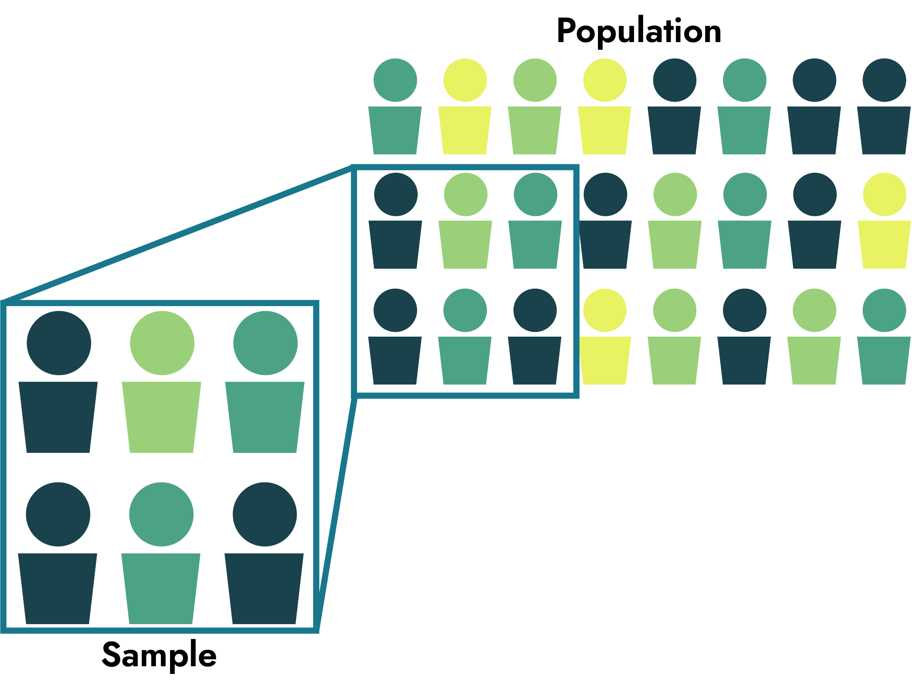

```{r setup, include=FALSE}
options(htmltools.dir.version = FALSE)
```

```{r xaringan-themer, include = FALSE}
library(xaringanthemer)
style_mono_accent(
  base_color = "#18778C",
  header_color = "#000000",
  header_font_google = google_font("Jost"),
  header_font_weight = 500,
  text_font_google = google_font("Jost", "300", "300i", "500", "500i"),
  code_font_google = google_font("Source Code Pro"),
  text_bold_color = '#4CA384',
  text_slide_number_color = '#18778C',
  text_font_size = '16pt'
)
```

```{r, echo = F, message = F, warning = F}
library(tidyverse)
library(rstatix)

knitr::opts_chunk$set(dev = 'svg')

baseColor <- '#4CA384'
accent1 <- '#9AD079'
accent2 <- '#18778C'
accent3 <- '#19424C'
```

## This Week's Key Topics

+ The Null Distribution

+ $p$-Values

+ $\alpha$

+ Standard Error

+ Effect Sizes - REMOVE

+ Confidence Intervals - REMOVE CIs

+ Power - REMOVE

+ TALK ABOUT SAMPLES & POPULATIONS


---
## Hypotheses

+ **Null Hypothesis ( $H_0$ ):** There is no difference or effect, and any experimentally observed difference is due to chance

+ **Alternative Hypothesis ( $H_1$ ):** There is a relationship or association between variables

+ The burden of proof is on $H_1$

  + Assume $H_0$ is accurate until there is sufficient evidence that it is not
  
  + Tests of significance assess strength of the evidence against $H_0$
  
---
## From sample to population

.pull-left[

+ When asking a question or making a hypothesis, we're often referencing the entire **population** of interest
  
+ When collecting data, we're often only measuring a subset of the population (the **sample**)

]


.pull-right[
```{r, echo = F}

```
]

---
count: false

## From sample to population

.pull-left[

+ When asking a question or making a hypothesis, we're often referencing the entire **population** of interest
  
+ When collecting data, we're often only measuring a subset of the population (the **sample**)

> **Test your understanding:** Have a look at the image to the right. Do you see any potential issues that should be considered as part of the sampling process?

]


.pull-right[
```{r, echo = F}

```
]

---
## Refresh from Last Week


+ **Samples** are a subgroup of observations that you're using to make inferences about the overall **population**

+ Probability distributions allow you to visualise the probability of specific observations

+ Why is this relevant to Psychology?

--

  + In psychology, we design a study, take measurements from a sample, and use these measurements to calculate a value that carries some meaning.
 
  + We want to know how meaningful this value is in the context of our hypothesis. 

  + One way we assess 'meaningfulness' is through probability

---
## Describing your data: Probability distributions

.pull-left[

+ A probability distribution is a way to visualise the probability of specific observations

+ These distributions give us an idea of how unusual or rare a specific observation is

+ Specifically, we can compute the probability of a specific range of values within a distribution
]


.pull-right[

```{r, echo = F, fig.height=3.5}
ggplot(data.frame(x = c(-4, 4)), aes(x = x)) +
  stat_function(fun=dnorm, geom = "line", linewidth = 1.5) + 
  theme(axis.text = element_text(size = 12), 
        axis.title = element_text(size = 14, face = 'bold'),
        axis.text.y = element_blank(),
        axis.ticks.y = element_blank(),
        axis.title.y = element_blank()) +
  geom_hline(yintercept = 0, linewidth = 1.5)

```


]

--

> **Test Your Understanding:** Which value of x is most common, according to the probability distribution seen here? Which values are less common?

---
## The Normal Distribution

+ A probability distribution where values around the mean are most common, and values further from the mean are increasingly less common.

+ AKA the bell curve, a Gaussian distribution

--

> **Test Your Understanding:** What kinds of variables can you think of that might follow a normal distribution? 

---
## The Normal Distribution
.pull-left[
**Characteristics of a normal distribution**

+ Unimodal

+ Its key parameters are mean and standard deviation

]
.pull-right[
```{r, echo = F, fig.width=5, fig.height=3.5}
normDist <- ggplot(data.frame(X = c(-6, 6)), aes(x = X)) +
  stat_function(fun=dnorm, geom = "line", linewidth = 1.5) + 
  theme(axis.title.x = element_text(size = 14, face = 'bold'),
        axis.line.y = element_blank(),
        axis.text = element_blank(),
        axis.ticks = element_blank(),
        axis.title.y = element_blank())

normDist + geom_vline(xintercept = 0, color=accent2, linewidth = 1.5)
```
]

---
## The Normal Distribution
.pull-left[
**Characteristics of a normal distribution**

+ Unimodal

+ Its key parameters are mean and standard deviation
  

]
.pull-right[

```{r, echo = F, fig.width=5, fig.height=3.5}
normDist + geom_vline(xintercept = 0, color=accent2, linewidth = 1.5) + 
  stat_function(fun=dnorm, geom = "line", args = list(mean = 2), linewidth = 1.5, color = baseColor) +
  stat_function(fun=dnorm, geom = "line", args = list(mean = -2), linewidth = 1.5, color = accent1) +
  annotate(geom='text', label=paste0('mu == -2'), parse = T, x=-5, y=0.32, size = 6, colour = accent1, hjust = 0) +
  annotate(geom='text', label=paste0('mu == 0'), parse = T, x=-5, y=0.35, size = 6, hjust = 0) +
  annotate(geom='text', label=paste0('mu == 2'), parse = T, x=-5, y=0.38, size = 6, colour = baseColor, hjust = 0)
```

Adjusting the mean changes where the curve is centered on the $x$-axis

]

---
## The Normal Distribution
.pull-left[
**Characteristics of a normal distribution**

+ Unimodal

+ Its key parameters are mean and standard deviation
  

]
.pull-right[

```{r, echo = F, fig.width=5, fig.height=3.5}
normDist + geom_vline(xintercept = 0, color=accent2, linewidth = 1.5) + 
  stat_function(fun=dnorm, geom = "line", args = list(sd = .5), linewidth = 1.5, color = baseColor) +
  stat_function(fun=dnorm, geom = "line", args = list(sd = 1.5), linewidth = 1.5, color = accent1) +
  annotate(geom='text', label=paste0('mu == 1.5'), parse = T, x=-5, y=0.61, size = 6, colour = accent1, hjust = 0) +
  annotate(geom='text', label=paste0('mu == 0'), parse = T, x=-5, y=0.68, size = 6, hjust = 0) +
  annotate(geom='text', label=paste0('mu == .5'), parse = T, x=-5, y=.75, size = 6, colour = baseColor, hjust = 0)
```

Adjusting the $SD$ changes the shape of the curve

]

---
exclude: true

## The Normal Distribution
.pull-left[
**Characteristics of a normal distribution**

+ Unimodal

+ Its key parameters are mean and standard deviation

  + **68%** of scores fall within **1 SD** of the mean

]
.pull-right[
```{r, echo = F, fig.width=5, fig.height=3.5}
normDist + geom_area(stat = 'function', fun = dnorm, fill = accent1, xlim=c(-1, 1), alpha = .7) + 
  geom_vline(xintercept = 0, color=accent3, linewidth = 1.5)
```
]

---
exclude: true

## The Normal Distribution
.pull-left[
**Characteristics of a normal distribution**

+ Unimodal

+ Its key parameters are mean and standard deviation

  + 68% of scores fall within 1 SD of the mean
  + **95%** of scores fall within **~2 SD** of the mean (exactly 1.96 SD of the mean)

]
.pull-right[
```{r, echo = F, fig.width=5, fig.height=3.5}
normDist + geom_area(stat = 'function', fun = dnorm, fill = baseColor, xlim=c(-1.96, 1.96), alpha = .7) + 
  geom_vline(xintercept = 0, color=accent3, linewidth = 1.5)
```
]

---
exclude: true

## The Normal Distribution
.pull-left[
**Characteristics of a normal distribution**

+ Unimodal

+ Its key parameters are mean and standard deviation

  + 68% of scores fall within 1 SD of the mean
  + 95% of scores fall within ~2 SD of the mean (exactly 1.96 SD of the mean)
  + **99.75%** of scores fall within **3 SD** of the mean

]
.pull-right[
```{r, echo = F, fig.width = 5, fig.height = 3.5}
normDist + geom_area(stat = 'function', fun = dnorm, fill = accent2, xlim=c(-3, 3), alpha = .7) +
  geom_vline(xintercept = 0, color=accent3, linewidth = 1.5)
```
]

---
exclude: true

## The Normal Distribution

> **Test your understanding:** You have given participants the WAIS-IV, which is an IQ test that has been normalised so that the mean is 100 and the SD is 15. Scores are normally distributed. What value do we expect at each point on this normal distribution?

.center[
```{r, echo = F, fig.width=8, fig.height=4}

set.seed(22)
waisDat <- data.frame(Score=rnorm(1000, mean = 100, sd = 15))

waisDist <- ggplot(data.frame(X=c(-4, 4)), aes(x=X)) + 
  stat_function(fun=dnorm, geom = "line", linewidth = 1.5, args = c(mean=0, sd =1)) +
  geom_hline(yintercept = 0, linewidth = 1.5) +
  xlab('WAIS Score') +
  theme(axis.title.x = element_text(size = 14, face = 'bold'),
        axis.line.y = element_blank(),
        axis.text = element_blank(),
        axis.ticks = element_blank(),
        axis.title.y = element_blank())

waisDist + 
  annotate(geom='segment', x=0, xend=0, y=0, yend=.4, color = accent3, linetype='dashed', linewidth = 1.5) +
  annotate(geom='text', label = 'A', x=0, y = -.02, color = accent3, size = 5)
```
]

---
exclude: true

## The Normal Distribution

> **Test your understanding:** You have given participants the WAIS-IV, which is an IQ test that has been normalised so that the mean is 100 and the SD is 15. Scores are normally distributed. What value do we expect at each point on this normal distribution?

.center[
```{r, echo = F, fig.width=8, fig.height=4}

waisDist <- waisDist + 
  annotate(geom='text', label = '100', x = 0, y = -.02, size = 5, color = accent3) +
  annotate(geom='segment', x=0, xend=0, y=.01, yend=-.01)

waisDist + 
  geom_area(stat = 'function', fun = dnorm, fill = accent1, xlim=c(-1, 1), alpha = .7) +
  annotate(geom='segment', x=-1, xend=-1, y=0, yend=.4, color = accent1, linetype='dashed', linewidth = 1) +
  annotate(geom='segment', x=1, xend=1, y=0, yend=.4, color = accent1, linetype='dashed', linewidth = 1) +
  annotate(geom = 'text', label = '~68%', x = 0, y = .2, color='white', size = 7) +
  annotate(geom='text', label = 'C', x=1, y = -.02, color = accent1, size = 5) +
  annotate(geom='text', label = 'B', x=-1, y = -.02, color = accent1, size = 5)
  
```
]

---
exclude: true

## The Normal Distribution

> **Test your understanding:** You have given participants the WAIS-IV, which is an IQ test that has been normalised so that the mean is 100 and the SD is 15. Scores are normally distributed. What value do we expect at each point on this normal distribution?

.center[
```{r, echo = F, fig.width=8, fig.height=4}

waisDist <- waisDist + 
  annotate(geom='text', label = '85', x = -1, y = -.02, size = 5, color = accent1) +
  annotate(geom='segment', x=-1, xend=-1, y=.01, yend=-.01) +
  annotate(geom='text', label = '115', x = 1, y = -.02, size = 5, color = accent1) +
  annotate(geom='segment', x=1, xend=1, y=.01, yend=-.01)
  

waisDist + 
  geom_area(stat = 'function', fun = dnorm, fill = baseColor, xlim=c(-1.96, 1.96), alpha = .7) +  
  annotate(geom='segment', x=-1.96, xend=-1.96, y=0, yend=.4, color = baseColor, linetype='dashed', linewidth = 1) +
  annotate(geom='segment', x=1.96, xend=1.96, y=0, yend=.4, color = baseColor, linetype='dashed', linewidth = 1) +
  annotate(geom = 'text', label = '~95%', x = 0, y = .2, color='white', size = 7) +
  annotate(geom='text', label = 'E', x= 1.96, y = -.02, color = baseColor, size = 5) +
  annotate(geom='text', label = 'D', x=-1.96, y = -.02, color = baseColor, size = 5)
  
```
]

---
exclude: true

## The Normal Distribution

> **Test your understanding:** You have given participants the WAIS-IV, which is an IQ test that has been normalised so that the mean is 100 and the SD is 15. Scores are normally distributed. What value do we expect at each point on this normal distribution?

.center[
```{r, echo = F, fig.width=8, fig.height=4}

waisDist <- waisDist + 
  annotate(geom='text', label = '70', x = -1.96, y = -.02, size = 5, color = baseColor) +
  annotate(geom='segment', x=-1.96, xend=-1.96, y=.01, yend=-.01) +
  annotate(geom='text', label = '130', x = 1.96, y = -.02, size = 5, color = baseColor) +
  annotate(geom='segment', x=1.96, xend=1.96, y=.01, yend=-.01)
  

waisDist + 
  geom_area(stat = 'function', fun = dnorm, fill = accent2, xlim=c(-3, 3), alpha = .7) +
  annotate(geom = 'text', label = '~99%', x = 0, y = .2, color='white', size = 7) +
  annotate(geom='segment', x=-3, xend=-3, y=0, yend=.4, color = accent2, linetype='dashed', linewidth = 1) +
  annotate(geom='segment', x=3, xend=3, y=0, yend=.4, color = accent2, linetype='dashed', linewidth = 1) +
  annotate(geom='text', label = 'G', x=-3, y = -.02, color = accent2, size = 5) +
  annotate(geom='text', label = 'F', x=3, y = -.02, color = accent2, size = 5)
  
```
]

---
exclude: true

## The Normal Distribution

> **Test your understanding:** You have given participants the WAIS-IV, which is an IQ test that has been normalised so that the mean is 100 and the SD is 15. Scores are normally distributed. What value do we expect at each point on this normal distribution?

.center[
```{r, echo = F, fig.width=8, fig.height=4}

waisDist <- waisDist + 
  annotate(geom='text', label = '55', x = -3, y = -.02, size = 5, color = accent2) +
  annotate(geom='segment', x=-3, xend=-3, y=.01, yend=-.01) +
  annotate(geom='text', label = '145', x = 3, y = -.02, size = 5, color = accent2) +
  annotate(geom='segment', x=3, xend=3, y=.01, yend=-.01)
  

waisDist + 
  annotate(geom='text', label = 'Mean', x = 0, y = -.045, size = 5, color = accent3) +
  annotate(geom='text', label = '-1 SD', x = -1, y = -.045, size = 5, color = accent1) +
  annotate(geom='text', label = '+1 SD', x = 1, y = -.045, size = 5, color = accent1) +
  annotate(geom='text', label = '-~2 SD', x = -1.96, y = -.045, size = 5, color = baseColor) +
  annotate(geom='text', label = '+~2 SD', x = 1.96, y = -.045, size = 5, color = baseColor) +
  annotate(geom='text', label = '-3 SD', x = -3, y = -.045, size = 5, color = accent2) +
  annotate(geom='text', label = '+3 SD', x = 3, y = -.045, size = 5, color = accent2) +
  annotate(geom='segment', x=-3, xend=-3, y=0, yend=.01, color = accent2, linetype='dashed', linewidth = 1) +
  annotate(geom='segment', x=3, xend=3, y=0, yend=.01, color = accent2, linetype='dashed', linewidth = 1) +   
  annotate(geom='segment', x=-1.96, xend=-1.96, y=0, yend=.06, color = baseColor, linetype='dashed', linewidth = 1) +
  annotate(geom='segment', x=1.96, xend=1.96, y=0, yend=.06, color = baseColor, linetype='dashed', linewidth = 1) + 
  annotate(geom='segment', x=-1, xend=-1, y=0, yend=.25, color = accent1, linetype='dashed', linewidth = 1) +
  annotate(geom='segment', x=1, xend=1, y=0, yend=.25, color = accent1, linetype='dashed', linewidth = 1) +
  annotate(geom='segment', x=0, xend=0, y=0, yend=.4, color = accent3, linetype='dashed', linewidth = 1)
```
]

---
exclude: true

## The Standard Normal Distribution

.pull-left[
+ A normal distribution in which $\mu$ = 0 and $\sigma$ = 1

+ AKA the $z$ distribution

+ Comprised of $z$-scores, which represent the number of standard deviations a value is from the mean

+ All values from a normal distribution can be converted to $z$-scores (standardised) using the following formula:

$$z = \frac{X-\mu}{\sigma}$$

]


.pull-right[

```{r, echo = F, fig.width=5, fig.height=4}
ggplot(data.frame(z=c(-4, 4)), aes(x=z)) + 
  stat_function(fun=dnorm, geom = "line", linewidth = 1.5, args = c(mean=0, sd =1)) +
  geom_hline(yintercept = 0, linewidth = 1.5) +
  theme(axis.title.x = element_text(size = 14, face = 'bold'),
        axis.line.y = element_blank(),
        axis.text.y = element_blank(),
        axis.text.x = element_text(size = 12, face = 'bold'),
        axis.ticks.y = element_blank(),
        axis.title.y = element_blank())
```

]

---
## Frequency vs Probability Distributions

+ A frequency distribution shows the frequency of each possible observation within our sample:

.pull-left[

```{r, echo=F, fig.width=5, fig.height=4}
set.seed(208)
# Categorical distribution plot
dat <- data.frame(x=sample(c('Heads', 'Tails'), size = 40, replace = T, prob = c(.5, .5)), y = rnorm(n = 40))

ggplot(dat, aes(x)) + geom_bar(fill=baseColor, color = accent3) +
  scale_y_continuous(breaks=seq(0, 30, by = 5)) +
  labs(y='Frequency') +
  theme(axis.text = element_text(size=14),
        axis.title.x = element_blank(),
        axis.title.y = element_text(size = 16, face = 'bold'))
```
.center[**Categorical Distribution**]
]

.pull-right[

```{r, echo=F, fig.width=5, fig.height=4, warning = F}
ggplot(dat, aes(y)) + geom_histogram(fill=baseColor, color=accent3, bins=12) +
  labs(y='Frequency') +
  scale_y_continuous(breaks=seq(0, 14, by = 1)) +
  scale_x_continuous(limits = c(-3, 3)) +
  theme(axis.text = element_text(size=14),
        axis.title.y = element_text(size=14, face = 'bold'),
        axis.title.x = element_blank())
```
.center[**Continuous Distribution**]
]

---

## Probability Distributions

+ A probability distribution shows the probability of randomly selecting an observation (or range) from our sample:

.pull-left[

```{r, echo=F, fig.width=5, fig.height=4}
pDat <- data.frame(Outcome = unique(dat$x), Probability = as.numeric(table(dat$x)/nrow(dat)))

ggplot(pDat, aes(x=Outcome, y=Probability)) + 
  geom_bar(stat='identity', color = accent3, fill=baseColor) +
  scale_y_continuous(breaks=seq(0, .7, .1)) +
  theme(axis.text=element_text(size = 14),
        axis.title.y=element_text(size = 16, face = 'bold'),
        axis.title.x = element_blank())
```
.center[**Categorical Probability Distribution**]
]

.pull-right[

```{r, echo=F, fig.width=5, fig.height=4, warning = F}
ggplot(dat, aes(x=y)) + 
  stat_function(fun = dnorm, geom = 'line', args = c(mean=mean(dat$y), sd = sd(dat$y)), linewidth = 1.5, color = baseColor) +
  scale_x_continuous(limits = c(-3, 3)) + 
  scale_y_continuous(breaks=seq(0, .5, by = .1)) +
  theme(axis.text.x = element_text(size=14),
        axis.text.y = element_blank(),
        axis.ticks.y = element_blank(),
        axis.title = element_blank())

```
.center[**Continuous Probability Distribution**]
]
---
## Continuous Probability Distributions

.pull-left[

+ Probability distributions allow you to visualise the probability of specific observations

+ Specifically, we can compute the probability of a specific **range** of values within a continuous distribution
]

.pull-right[

```{r, echo = F, fig.height=3.5}
ggplot(data.frame(x = c(-4, 4)), aes(x = x)) +
  stat_function(fun=dnorm, geom = "line", linewidth = 1.5) + 
  theme(axis.text = element_text(size = 12), 
        axis.title = element_text(size = 14, face = 'bold'),
        axis.text.y = element_blank(),
        axis.ticks.y = element_blank(),
        axis.title.y = element_blank()) +
  geom_hline(yintercept = 0, linewidth = 1.5)

```
]

--

> Why a range? Why can't we compute the probability of a single score?

---
## Continuous Probability Distributions

> Why a range? Why can't we compute the probability of a single score?

.center[
```{r, echo = F, fig.height = 4.5, fig.width = 8}

(conPlot <- ggplot(data.frame(x = c(-4, 4)), aes(x = x)) + stat_function(fun=dnorm, geom = "line", linewidth = 1.5) +
  theme(axis.text = element_text(size = 12), 
        axis.title = element_text(size = 14, face = 'bold'),
        axis.text.y = element_blank(),
        axis.ticks.y = element_blank(),
        axis.title.y = element_blank()) +
  geom_hline(yintercept = 0, linewidth = 1.5) +
  geom_vline(xintercept = 2.4822, color = baseColor, linewidth = 1.5))
```
]

---
## Continuous Probability Distributions

> Why a range? Why can't we compute the probability of a single score?

.center[
```{r, echo = F, fig.height = 4.5, fig.width = 8}
conPlot + coord_cartesian(xlim=c(2, 3))
```
]

---
## Continuous Probability Distributions

> Why a range? Why can't we compute the probability of a single score?

.center[
```{r, echo = F, fig.height = 4.5, fig.width = 8}
conPlot + coord_cartesian(xlim=c(2.45, 2.52))
```
]

---
## Continuous Probability Distributions

> Why a range? Why can't we compute the probability of a single score?

.center[
```{r, echo = F, fig.height = 4.5, fig.width = 8}
conPlot + coord_cartesian(xlim=c(2.475, 2.488))
```
]

---
count: false

## Continuous Probability Distributions

> Why a range? Why can't we compute the probability of a single score?

> Because technically, continuous values go on infinitely, so the probability of any single value is approximately 0

.center[
```{r, echo = F, fig.height = 4.25, fig.width = 8}
conPlot + coord_cartesian(xlim=c(2.475, 2.488))
```
]

---

## Continuous Probability Distributions

.pull-left[
+ We can instead calculate the probability of a range by computing the **area under the curve (AUC)** within that range.

+ Imagine we have a range of observations whose values fall between 8 and 32 that are distributed as pictured.


]

.pull-right[
```{r, echo = F, fig.height=3.5}
testDat <- ggplot(data.frame(x = c(8, 32)), aes(x = x)) +
  stat_function(fun=dnorm, args= list(20, 3), geom = "line", linewidth = 1.5) +
  theme(axis.text = element_text(size = 12), 
        axis.title = element_text(size = 14, face = 'bold'),
        axis.text.y = element_blank(),
        axis.ticks.y = element_blank(),
        axis.title.y = element_blank()) +
  geom_hline(yintercept = 0, linewidth = 1.5)

testDat
```
]

---
## Continuous Probability Distributions

.pull-left[

+ We can instead calculate the probability of a range by computing the **area under the curve (AUC)** within that range.

+ Imagine we have a range of observations whose values fall between 8 and 32 that are distributed as pictured.

+ If we randomly select an observation from our data, what is the likelihood it will be at least 25?


]

.pull-right[

```{r, echo = F, fig.height=3.5}
testDat + 
    geom_vline(xintercept = 25, color = accent3, linewidth = 1.5)
```

]


---
count: false

## Continuous Probability Distributions

.pull-left[
+ We can instead calculate the probability of a range by computing the **area under the curve (AUC)** within that range.

+ Imagine we have a range of observations whose values fall between 8 and 32 that are distributed as pictured.

+ If we randomly select an observation from our data, what is the likelihood it will be at least 25?

+ ~95% of our observations are less than 25. This means we only have about a 5% chance of randomly selecting an observation of at least 25. 

]

.pull-right[

```{r, echo = F, fig.height=3.5}
testDat + 
  geom_area(stat = 'function', fun = dnorm, args= list(20, 3), fill = baseColor, xlim=c(8, 25), alpha = .8) +
  geom_area(stat = 'function', fun = dnorm, args= list(20, 3), fill = accent2, xlim=c(25, 30), alpha = .8) +
  annotate('text', label = '95%', x = 20, y = .05, color = 'white', size = 7) + 
  annotate('text', label = '5%', x = 26, y = .01, color = 'white', size = 7) +
  geom_vline(xintercept = 25, color = accent3, linewidth = 1)
```
]

---
## Continuous Probability Distributions

.pull-left[

```{r, echo = F, fig.height=5}
testDat + geom_vline(xintercept = 24, color = accent1, linewidth = 1.5)
```

]

.pull-right[
```{r, echo = F, fig.height=5}
testDat + geom_vline(xintercept = 18, color = accent3, linewidth = 1.5)
```

]

> **Test Your Understanding:** Is it more unusual to have a score of 24 or more or a score of 18 or less?

---
count: false

## Continuous Probability Distributions

.pull-left[
```{r, echo = F, fig.height=5}
testDat +
  geom_area(stat = 'function', fun = dnorm, args= list(20, 3), fill = baseColor, xlim=c(8, 24), alpha = .8) +
  geom_area(stat = 'function', fun = dnorm, args= list(20, 3), fill = accent2, xlim=c(24, 30), alpha = .8) +
  annotate('text', label = '91%', x = 18, y = .02, color = 'white', size = 7) + 
  annotate('text', label = '9%', x = 25, y = .02, color = 'white', size = 7)+ 
  geom_vline(xintercept = 24, color = accent1, linewidth = 1.5)
```
]

.pull-right[
```{r, echo = F, fig.height=5}
testDat +
  geom_area(stat = 'function', fun = dnorm, args= list(20, 3), fill = accent2, xlim=c(8, 18), alpha = .8) +
  geom_area(stat = 'function', fun = dnorm, args= list(20, 3), fill = baseColor, xlim=c(18, 30), alpha = .8) +
  annotate('text', label = '25%', x = 16, y = .02, color = 'white', size = 7) + 
  annotate('text', label = '75%', x = 22, y = .02, color = 'white', size = 7) + 
  geom_vline(xintercept = 18, color = accent3, linewidth = 1.5)
```
]

> **Test Your Understanding:** Is it more unusual to have a score of 24 or more or a score of 18 or less?

---
## Continuous Probability Distributions

+ Why does this matter?

--

+ Many of the statistical tests we will learn about work by testing the probability of our results given the null hypothesis

  + In other words, if the null hypothesis is true, how likely is it that we would get results at least as extreme as ours?

+ If our results are unusual enough, we reject the null hypothesis.

---
count: false
class: center, inverse, middle

## Questions?

---
## Testing Against the Null Hypothesis

+ In order to make a decision whether our data/values are unusual, we need to have an understanding of what values we might expect to see if the null hypothesis were true.

--

> **Test Your Understanding:** Given the following distributions, do you think a value of 20 would be unusual?


--
.pull-left[
```{r, echo = F, fig.height=4}
set.seed(211)
ggplot(data.frame(x=rnorm(100, mean = 18, sd = 3)), aes(x)) + 
  geom_histogram(binwidth = .75, fill = baseColor, color = accent3) +
  geom_vline(xintercept = 20, color = accent2, linewidth = 1) + 
  theme(axis.text = element_text(size = 14),
        axis.title = element_text(size = 16, face = 'bold'))
```
]

--

.pull-right[
```{r, echo = F, fig.height=4}
set.seed(311)
ggplot(data.frame(x=rnorm(100, mean = 13, sd = 3)), aes(x)) + 
  geom_histogram(binwidth = .75, fill = baseColor, color = accent3) +
  geom_vline(xintercept = 20, color = accent2, linewidth = 1) + 
  theme(axis.text = element_text(size = 14),
        axis.title = element_text(size = 16, face = 'bold'))
```
]


???

+ A value of 20 tells us nothing without context


---
## Null Distributions

+ Most of the tests we cover in this course evaluate significance by evaluating results against a predefined probability distribution known as the **null distribution**

+ The null distribution is the probability distribution of a statistic **given that the null hypothesis is true**. 

+ Each statistical test is associated with a separate null distribution

---

## Null Distributions

.pull-left[
```{r, echo = F, fig.height=2.5, fig.width=4.5}
ggplot(data.frame(x=c(0, 10)), aes(x=x)) +
  stat_function(fun=dchisq, geom='line', args=c(df = 1), color = baseColor, linewidth=1.5) +
  stat_function(fun=dchisq, geom='line', args=c(df = 2), color = accent1, linewidth=1.5) +
  stat_function(fun=dchisq, geom='line', args=c(df = 3), color = accent2, linewidth=1.5) +
  stat_function(fun=dchisq, geom='line', args=c(df = 4), color = accent3, linewidth=1.5) +
  scale_y_continuous(limits=c(0, .52), breaks = seq(0, .5, .1)) +
  annotate('text', label = 'df = 1', color = baseColor, x = 8, y = .45, size = 5) +
  annotate('text', label = 'df = 2', color = accent1, x = 8, y = .38, size = 5) +
  annotate('text', label = 'df = 3', color = accent2, x = 8, y = .31, size = 5) +
  annotate('text', label = 'df = 4', color = accent3, x = 8, y = .24, size = 5) +
  labs(x = expression(chi^2)) +
  theme(axis.text.y = element_blank(),
        axis.title.y = element_blank(),
        axis.ticks.y = element_blank(),
        axis.title.x = element_text(size = 16, face = 'bold'),
        axis.text.x = element_text(size = 14))

```
]


.pull-right[
```{r, echo = F, fig.height=2.5, fig.width=4.5}
ggplot(data.frame(x=c(-6, 6)), aes(x=x)) +
  stat_function(fun=dt, geom='line', args=c(df = 5), color = baseColor, linewidth=1.5) +
  stat_function(fun=dt, geom='line', args=c(df = 10), color = accent1, linewidth=1.5) +
  stat_function(fun=dt, geom='line', args=c(df = 20), color = accent2, linewidth=1.5) +
  stat_function(fun=dt, geom='line', args=c(df = 50), color = accent3, linewidth=1.5) +
  annotate('text', label = 'df = 5', color = baseColor, x = 3, y = .4, size = 5) +
  annotate('text', label = 'df = 10', color = accent1, x = 3, y = .35, size = 5) +
  annotate('text', label = 'df = 20', color = accent2, x = 3, y = .3, size = 5) +
  annotate('text', label = 'df = 50', color = accent3, x = 3, y = .25, size = 5) +
  labs(x = 't-statistic') +
  theme(axis.text.y = element_blank(),
        axis.title.y = element_blank(),
        axis.ticks.y = element_blank(),
        axis.title.x = element_text(size = 16, face = 'bold'),
        axis.text.x = element_text(size = 14))

```
]

.center[
```{r, echo = F, fig.height=2.5, fig.width=4.5}
ggplot(data.frame(x=c(0, 5)), aes(x=x)) +
  stat_function(fun=df, geom='line', args=c(df1 = 2, df2=10), color = baseColor, linewidth=1.5) +
  stat_function(fun=df, geom='line', args=c(df1 = 5, df2=10), color = accent1, linewidth=1.5) + 
  stat_function(fun=df, geom='line', args=c(df1 = 5, df2=100), color = accent2, linewidth=1.5) +
  stat_function(fun=df, geom='line', args=c(df1 = 10, df2=100), color = accent3, linewidth=1.5) +
  annotate('text', label = 'df1 = 2, df2 = 10', color = baseColor, x = 4, y = .75, size = 5) +
  annotate('text', label = 'df1 = 5, df2 = 10', color = accent1, x = 4, y = .6, size = 5) +
  annotate('text', label = 'df1 = 5, df2 = 100', color = accent2, x = 4, y = .45, size = 5) +
  annotate('text', label = 'df1 = 10, df2 = 100', color = accent3, x = 4, y = .3, size = 5) +
  labs(x = 'F-statistic') +
  theme(axis.text.y = element_blank(),
        axis.title.y = element_blank(),
        axis.ticks.y = element_blank(),
        axis.title.x = element_text(size = 16, face = 'bold'),
        axis.text.x = element_text(size = 14))

```
]

---
## Comparing Results to Null Distribution

+ When you run a statistical test, you:

  1. Compute a test statistic based on your data
  
  2. Calculate the probability of obtaining this statistic if the null were true
  
  3. Use this probability to make a decision whether to reject the null hypothesis.
  
---
## Comparing Results to Null Distribution

.pull-left[.center[
```{r, echo = F, fig.height=4, fig.width=5}
baset <- ggplot(data.frame(x=c(-6, 6)), aes(x=x)) +
  stat_function(fun=dt, geom='line', args=c(df = 50), linewidth=1.5) + 
  labs(x = 't-statistic') +
  theme(axis.text.y = element_blank(),
        axis.title.y = element_blank(),
        axis.ticks.y = element_blank(),
        axis.title.x = element_text(size = 12, face = 'bold'),
        axis.text.x = element_text(size = 10)) +
  geom_hline(yintercept = 0, linewidth = 1.5)

baset + geom_vline(xintercept = .75, linewidth = 1.5) +
  annotate('text', label = 't = 0.75', x = 2.25, y = .3, size = 5)
```
]]


---
## Comparing Results to Null Distribution

.pull-left[.center[
```{r, echo = F, fig.height=4, fig.width=5}
(ns <- baset +
  annotate('text', label = 't = 0.75', x = 2.25, y = .3, size = 5) +
  geom_area(stat = 'function', fun = dt, args= list(df = 50), xlim=c(-6, .75), fill = baseColor, alpha = .8) +
  annotate('text', label = '~77%', x = -.4, y = .05, color = 'white', size = 5) + 
  geom_area(stat = 'function', fun = dt, args= list(df = 50), xlim=c(.75, 6), fill = accent2, alpha = .8) +
  annotate('text', label = '~23%', x = 1.4, y = .05, color = 'white', size = 5) +
  geom_vline(xintercept = .75, linewidth = 1.5))
```
]]

---
count: false

## Comparing Results to Null Distribution

.pull-left[.center[
```{r, echo = F, fig.height=4, fig.width=5}
ns
```
<B>Not so unusual.</B>
]]

--

.pull-right[.center[
```{r, echo = F, fig.height=4, fig.width=5}
(sigPlot <- baset + 
  geom_vline(xintercept = 3.05, linewidth = 1.5) +
  annotate('text', label = 't = 3.05', x = 4.5, y = .3, size = 5))
```
]]

---
count:false

## Comparing Results to Null Distribution

.pull-left[.center[
```{r, echo = F, fig.height=4, fig.width=5}
ns
```
<B> Not so unusual. </B>
]]

.pull-right[.center[
```{r, echo = F, fig.height=4, fig.width=5}
sigPlot + 
  geom_area(stat = 'function', fun = dt, args= list(df = 50), xlim=c(-6, 3.05), fill = baseColor, alpha = .8) +
  annotate('text', label = '~99.8%', x = 0, y = .05, color = 'white', size = 5)
```
<B> Quite unusual! </B>
]]

---
count: false

class: center, inverse, middle

## Questions?

---
## $p$ - values

.pull-left[
+ The $p$-value is the **probability** of obtaining data at least as extreme as ours, given that the null hypothesis is true.

+ It is not:
  + The likelihood that the null hypothesis is true.
  + The likelihood that our hypothesis is false
]

---
count: false

## $p$ - values

.pull-left[
+ The $p$-value is the **probability** of obtaining data at least as extreme as ours, given that the null hypothesis is true.

+ It is not:
  + The likelihood that the null hypothesis is true.
  + The likelihood that our hypothesis is false

+ It provides insight into the strength of our evidence against the null hypothesis. 

+ If we get a $p$-value past a certain threshold, we consider our results to be significant.

]

--

.pull-right[
```{r, echo=F, fig.height=3.5, fig.width=5}
ns + annotate('text', label = 'p = .230', x = 4.5, y = .05, size = 6, color = accent3) +
  annotate('segment', x = 2.25, xend = 3.2, y = .045, yend = .045, color = accent3,
           arrow = arrow(type = "closed", length = unit(0.02, "npc"), ends = 'first'))
```
]

---
## Effect Size

+ On it's own, a $p$-value is not sufficient. 

.pull-left[.center[
```{r, echo = F, fig.width=5, fig.height=3.5}
set.seed(1022)
dat <- data.frame(group = c(rep('A', 10), rep('B', 10)), x=c(rnorm(10, mean = 5, sd = 4), rnorm(10, mean = 10.5, sd = 4)))

set.seed(7)
dat2 <- data.frame(group = c(rep('A', 100), rep('B', 100)), x=c(rnorm(100, mean = 5, sd = 3.4), rnorm(100, mean = 6.15, sd = 3.4)))

(p1 <- ggplot(dat, aes(x)) + geom_density(data = dat[dat$group=='A',], fill = baseColor, alpha = .7) + 
  geom_vline(xintercept = mean(dat$x[dat$group=='A']), color = baseColor, linewidth = 1.5, linetype = 2) +
  geom_density(data = dat[dat$group=='B',], fill = accent2, alpha = .7) +
  theme(axis.text = element_blank(),
        axis.title = element_blank(),
        axis.ticks = element_blank()) +
  annotate('text', label = 'n = 10 per group', x = 30, y = .05, size = 5) +
  geom_vline(xintercept = mean(dat$x[dat$group=='B']), color = accent2, linewidth = 1.5, linetype = 2) + 
  geom_hline(yintercept = 0, linewidth = 1) + 
  scale_x_continuous(limits = c(-10, 40)))

```
]]

.pull-right[.center[
```{r, echo = F, fig.width=5, fig.height=3.5, warning = F}
(p2 <- ggplot(dat2, aes(x)) + geom_density(data = dat2[dat2$group=='A',], fill = baseColor, alpha = .7) + 
  geom_vline(xintercept = mean(dat2$x[dat2$group=='A']), color = baseColor, linewidth = 1.5, linetype = 2) +
  geom_density(data = dat2[dat2$group=='B',], fill = accent2, alpha = .7) +
  theme(axis.text = element_blank(),
        axis.title = element_blank(),
        axis.ticks = element_blank()) +
  annotate('text', label = 'n = 100 per group', x = 30, y = .075, size = 5) +
  geom_vline(xintercept = mean(dat2$x[dat2$group=='B']), color = accent2, linewidth = 1.5, linetype = 2) + 
  geom_hline(yintercept = 0, linewidth = 1) + 
  scale_x_continuous(limits = c(-10, 40)))
```
]]

---
count: false

## Effect Size

+ On it's own, a $p$-value is not sufficient. 

.pull-left[.center[
```{r, echo = F, fig.width=5, fig.height=3.5}
p1
```

** $p$ = .015**
]]


.pull-right[.center[
```{r, echo = F, fig.width=5, fig.height=3.5}
p2
```

** $p$ = .015**
]]

---
## Effect Size

+ The **effect size** describes the magnitude of the effect or relationship

+ Unlike a $p$-value, which only tells you the likelihood that an effect or relationship exists, the effect size tells you how strong it is.

+ Different measures of effect size depending on your data/the statistical test you use

+ Usually standardised so that you can make comparisons across different variables

--

.pull-left.center[

```{r, echo = F, fig.width=4.5, fig.height=2.5}
dP1 <- cohens_d(dat, formula = x~group)
p1 + 
  annotate('segment', x=mean(dat$x[dat$group=='A']), xend = mean(dat$x[dat$group=='B']), y = .1, color = accent3, linewidth = 1.5) +
  annotate('text', label = paste('effect size =', round(abs(dP1$effsize), 2), '(large)'), x=28, y = .1, color = accent3, size = 5)
```

]

.pull-right.center[

```{r, echo = F, fig.width=4.5, fig.height=2.5}
dP2 <- cohens_d(dat2, formula = x~group)

p2 + 
  annotate('segment', x=mean(dat2$x[dat2$group=='A']), xend = mean(dat2$x[dat2$group=='B']), y = .15, color = accent3, linewidth = 1.5) +
  annotate('text', label = paste('effect size =', round(abs(dP2$effsize), 2), '(small)'), x=24, y = .15, color = accent3, size = 5)
```

]


???

Think about practical significance - a pharmaceutical company tests the effect of their new vitamin and finds that it significantly decreases the amount of time someone is sick over the course of a year. SIGNIFICANCE! But wait...it only decreases the amount of sick days by a single day. EFFECT SIZE. Do they really want to spend an immense amount of money for a single day's improvement?

---
## Confidence Intervals

+ Remember, we don't actually know the population parameter; we're trying to estimate this with our data.

+ A **confidence interval** defines a plausible range of values for our population parameter. 

+ The wider the interval, the more confident that we can be that the interval captures our true value.

--

> How many of you are confident that I'm exactly 35 years old?

--

> How many of you are confident that I'm between 33 & 38 years old?

--

> How many of you are confident that I'm between 29 & 42 years old?

--

> How many of you are confident that I'm between 25 & 46 years old?
  
---
## Confidence Level

+ To estimate the confidence interval, we need:

  + To define a confidence level
  + The standard error

+ The **confidence level** refers to the percentage of times confidence intervals would be expected to contain the true population parameter across repeated samples.

+ The typical confidence level used is **95%**, although you might also see 90% or 99%

+ So, if we were to take 100 samples and calculate a 95% CI on each of them, ~95 of those intervals would contain the true population parameter.


???

+ What are we 95% confident in?

  + We are 95% confident that our interval contains the true population mean.
  
  + The 95% probability comes from the long-run frequencies of our intervals.

---
## Standard Error

+ The average deviation from the mean *within* our sample is the **standard deviation**

+ Now imagine you took multiple samples and plotted their means:

--

.center[
```{r, echo = F, fig.height=3.5, warning = F}
set.seed(44)
seDat <- data.frame(MeanScore = rnorm(1, mean = 62, sd = 5))

ggplot(seDat, aes(MeanScore)) + geom_histogram(binwidth = 2, fill = baseColor, color = accent3) +
  scale_y_continuous(breaks=seq(0, 20, 5), limits = c(0, 20)) + 
  scale_x_continuous(breaks=seq(45, 80, 5), limits = c(45, 80)) +
  xlab('Mean Score') +
  theme(axis.text = element_text(size = 12),
        axis.title = element_text(size = 14, face = 'bold'))
```
]

---
count: false

## Standard Error

+ The average deviation from the mean *within* our sample is the **standard deviation**

+ Now imagine you took multiple samples and plotted their means:

.center[
```{r, echo = F, fig.height=3.5, warning = F}
set.seed(44)
seDat <- data.frame(MeanScore = rnorm(2, mean = 62, sd = 5))

ggplot(seDat, aes(MeanScore)) + geom_histogram(binwidth = 2, fill = baseColor, color = accent3) +
  scale_y_continuous(breaks=seq(0, 20, 5), limits = c(0, 20)) + 
  scale_x_continuous(breaks=seq(45, 80, 5), limits = c(45, 80)) +
  xlab('Mean Score') +
  theme(axis.text = element_text(size = 12),
        axis.title = element_text(size = 14, face = 'bold'))
```
]

---
count: false

## Standard Error

+ The average deviation from the mean *within* our sample is the **standard deviation**

+ Now imagine you took multiple samples and plotted their means:

.center[
```{r, echo = F, fig.height=3.5, warning = F}
set.seed(44)
seDat <- data.frame(MeanScore = rnorm(3, mean = 62, sd = 5))

ggplot(seDat, aes(MeanScore)) + geom_histogram(binwidth = 2, fill = baseColor, color = accent3) +
  scale_y_continuous(breaks=seq(0, 20, 5), limits = c(0, 20)) + 
  scale_x_continuous(breaks=seq(45, 80, 5), limits = c(45, 80)) +
  xlab('Mean Score') +
  theme(axis.text = element_text(size = 12),
        axis.title = element_text(size = 14, face = 'bold'))
```
]

---
count: false

## Standard Error

+ The average deviation from the mean *within* our sample is the **standard deviation**

+ Now imagine you took multiple samples and plotted their means:

.center[
```{r, echo = F, fig.height=3.5, warning = F}
set.seed(44)
seDat <- data.frame(MeanScore = rnorm(4, mean = 62, sd = 5))

ggplot(seDat, aes(MeanScore)) + geom_histogram(binwidth = 2, fill = baseColor, color = accent3) +
  scale_y_continuous(breaks=seq(0, 20, 5), limits = c(0, 20)) + 
  scale_x_continuous(breaks=seq(45, 80, 5), limits = c(45, 80)) +
  xlab('Mean Score') +
  theme(axis.text = element_text(size = 12),
        axis.title = element_text(size = 14, face = 'bold'))
```
]

---
count: false

## Standard Error

+ The average deviation from the mean *within* our sample is the **standard deviation**

+ Now imagine you took multiple samples and plotted their means:

.center[
```{r, echo = F, fig.height=3.5, warning = F}
set.seed(44)
seDat <- data.frame(MeanScore = rnorm(5, mean = 62, sd = 5))

ggplot(seDat, aes(MeanScore)) + geom_histogram(binwidth = 2, fill = baseColor, color = accent3) +
  scale_y_continuous(breaks=seq(0, 20, 5), limits = c(0, 20)) + 
  scale_x_continuous(breaks=seq(45, 80, 5), limits = c(45, 80)) +
  xlab('Mean Score') +
  theme(axis.text = element_text(size = 12),
        axis.title = element_text(size = 14, face = 'bold'))
```
]

---
count: false

## Standard Error

+ The average deviation from the mean *within* our sample is the **standard deviation**

+ Now imagine you took multiple samples and plotted their means:

.center[
```{r, echo = F, fig.height=3.5, warning = F}
set.seed(44)
seDat <- data.frame(MeanScore = rnorm(100, mean = 62, sd = 5))

ggplot(seDat, aes(MeanScore)) + geom_histogram(binwidth = 2, fill = baseColor, color = accent3) +
  scale_y_continuous(breaks=seq(0, 20, 5), limits = c(0, 20)) + 
  scale_x_continuous(breaks=seq(45, 80, 5), limits = c(45, 80)) +
  xlab('Mean Score') +
  theme(axis.text = element_text(size = 12),
        axis.title = element_text(size = 14, face = 'bold'))
```
]

--

+ The average deviation from the mean of the means *between* samples is the **standard error**

---
## Standard Error

+ The **standard error** gives you a sense of how different $\bar{x}$ is likely to be from $\mu$

+ It helps you to evaluate how well your sample reflects the population

+ A smaller standard error suggests our estimate is likely to be closer to the true population parameter

--

$$SE = \frac{\sigma}{\sqrt{N}}$$


???

Why would we calculate this? Who has the time and resources to collect lots of different samples???

Don't worry, brilliant statisticians have figured out how you can estimate this value from a single sample.

---
## Calculation of Confidence Intervals

+ As this is an interval, you'll need to calculate both a lower and upper band.

--

$$CI = \bar{x}\pm z\times SE$$

$\bar{x}$: sample mean

$z$: $z$-score associated with the confidence level
  + 90% = 1.64
  + 95% = 1.96
  + 99% = 2.58

$SE$: the standard error

---
## Calculation of Confidence Intervals

.pull-left[

$$95\% \ CI = \bar{x}\pm 1.96\times SE$$
]

.pull-right[
$$SE = \frac{s}{\sqrt{n}}$$
]

> Test your Understanding: Imagine you have an attention assessment that you have tested in a sample of 525 university students. The mean score is 42.35 and the sd is 5.62.

--

> What is n?

> What is the SE?

> What is the lower band of the 95% CI?

> What is the upper band of the 95% CI?


---
## Calculation of Confidence Intervals

$$SE = \frac{s}{\sqrt{n}}$$

**Step 1:** Calculate the Standard Error

$SE = \frac{5.62}{\sqrt{525}}$

--

$SE = `r round(5.62/sqrt(525), 2)`$


---
## Calculation of Confidence Intervals

$$95\% \ CI = \bar{x}\pm 1.96\times SE$$

.pull-left[

**Step 2:** Calculate the Lower Band of 95% CI

$95\% \ CI = 42.35 - 1.96\times `r round(5.62/sqrt(525), 2)`$


$95\% \ CI = 42.35 - `r 1.96*round(5.62/sqrt(525), 2)`$


$95\% \ CI = `r round(42.35 - 1.96*round(5.62/sqrt(525), 2), 2)`$

]

--

.pull-right[
**Step 3:** Calculate the Higher Band of 95% CI


$95\% \ CI = 42.35 + `r 1.96*round(5.62/sqrt(525), 2)`$


$95\% \ CI = `r round(42.35 + 1.96*round(5.62/sqrt(525), 2), 2)`$

]

---
## Visualisation of Confidence Intervals

.pull-left[
```{r, echo = F, warning = F, fig.height=4.5}
sumDat <- dat %>%
  group_by(group) %>%
  summarise( 
    n=n(),
    mean=mean(x),
    sd=sd(x)
  ) %>%
  mutate( se=sd/sqrt(n))  %>%
  mutate( ic=se*1.96) %>%
  mutate(ic99=se*2.58)

ggplot(sumDat) + 
  geom_bar(aes(group, mean), stat = 'identity', fill = c(baseColor, accent1)) +
  geom_errorbar( aes(x=group, ymin=mean-ic, ymax=mean+ic), width=0.4, colour=accent3, alpha=0.9, size=1.5) +
  geom_point(aes(group, mean), size = 4, color = accent3) +
  scale_y_continuous(limits = c(0, 20)) +
  labs(x = 'Group', y = 'Score') + 
  theme(legend.position = 'none',
        axis.text=element_text(size = 14),
        axis.title = element_text(size = 16, face = 'bold'))

```

]

--

.pull-right[

> **Test Your Understanding:** If you were to instead plot the 99% CI, would the error bars be longer or shorter?

]


---
count: false

## Visualisation of Confidence Intervals

.pull-left[
```{r, echo = F, warning = F, fig.height=4.5}
ggplot(sumDat) + 
  geom_bar(aes(group, mean), stat = 'identity', fill = c(baseColor, accent1)) +
  geom_errorbar( aes(x=group, ymin=mean-ic, ymax=mean+ic), width=0.4, colour=accent3, alpha=0.9, size=1.5) +
  geom_point(aes(group, mean), size = 4, color = accent3) +
  scale_y_continuous(limits = c(0, 20)) +
  labs(x = 'Group', y = 'Score') + 
  theme(legend.position = 'none',
        axis.text=element_text(size = 14),
        axis.title = element_text(size = 16, face = 'bold'))
```
]

.pull-right[

```{r, echo = F, warning = F, fig.height=4.5}
ggplot(sumDat) + 
  geom_bar(aes(group, mean), stat = 'identity', fill = c(baseColor, accent1)) +
  geom_errorbar( aes(x=group, ymin=mean-ic99, ymax=mean+ic99), width=0.4, colour=accent3, alpha=0.9, size=1.5) +
  geom_point(aes(group, mean), size = 4, color = accent3) +
  scale_y_continuous(limits = c(0, 20)) +
  labs(x = 'Group', y = 'Score') + 
  theme(legend.position = 'none',
        axis.text=element_text(size = 14),
        axis.title = element_text(size = 16, face = 'bold'))
```
]

---
count: false
class: center, inverse, middle

## Questions?

---
## Errors

+ Whether your decision is either to reject or not reject the null hypothesis, you may be making an error.

--

+ Two types of errors:

  + **Type I Error:** You reject a true null hypothesis (i.e., you believe a result is significant when it is not)
  
  + **Type II Error:** You don't reject a false null hypothesis (i.e., you don't think a result is significant when it is)


--

.center[
```{r, echo = F, out.width='75%'}
knitr::include_graphics('images/ErrorTable.png')
```
]

---

## $\alpha$

+ Rejecting the null when it is actually true is known as a **Type I error**. 

  + We have to make a decision about how much we want to risk making a Type I error

  + Our accepted risk threshold is known as $\alpha$
  
  + $\alpha$ reflects the probability of making a Type I error

--
  
+ Typical $\alpha$ value is .05, but may sometimes be set at .01 or .001.

--

+ If our $p$-value is equal to or less than our predetermined $\alpha$, we consider our results to be significant.

---

## $\alpha$

.pull-left[
.center[ ** $\alpha$ = .05**

```{r, echo = F, fig.height=4.5}
ggplot(data = data.frame(t = c(-5, 5)), aes(x=t)) +
  stat_function(fun=dt, geom='line', args=c(df = 29), color = baseColor, linewidth=1.5) +
  geom_area(stat = 'function', fun = dt, args= list(df = 29), fill = accent2, 
            xlim=c(qt(.025, df = 29, lower.tail = F), 5), alpha = .8) +
  geom_area(stat = 'function', fun = dt, args= list(df = 29), fill = accent2, 
            xlim=c(-5, qt(.025, df = 29)), alpha = .8) +
  theme(axis.text = element_blank(),
        axis.title = element_blank(),
        axis.line.y = element_blank(),
        axis.ticks = element_blank()) +
  annotate('text', x = 3, y = .3, parse = T, label = paste('alpha == .05'), size = 8, color = accent2) +
  annotate('text', x = 3.25, y = .05, parse = T, label = paste('alpha/2 == .025'), size = 6, color = accent2) +
  annotate('text', x = -3.25, y = .05, parse = T, label = paste('alpha/2 == .025'), size = 6, color = accent2) +
  annotate('segment', x= -2.25, xend = 3, y = .06, yend = .28, color = accent2, linewidth = 1, linetype = 'dashed') +
  annotate('segment', x= 2.4, xend = 3, y = .06, yend = .28, color = accent2, linewidth = 1, linetype = 'dashed') +
  geom_hline(yintercept = 0, color = baseColor, linewidth = 1.5)
```

]
]

--

.pull-right[
.center[ ** $\alpha$ = .01**

```{r, echo = F, fig.height=4.5}
ggplot(data = data.frame(t = c(-5, 5)), aes(x=t)) +
  stat_function(fun=dt, geom='line', args=c(df = 29), color = baseColor, linewidth=1.5) +
  geom_area(stat = 'function', fun = dt, args= list(df = 29), fill = accent2, 
            xlim=c(qt(.005, df = 29, lower.tail = F), 5), alpha = .8) +
  geom_area(stat = 'function', fun = dt, args= list(df = 29), fill = accent2, 
            xlim=c(-5, qt(.005, df = 29)), alpha = .8) +
  theme(axis.text = element_blank(),
        axis.title = element_blank(),
        axis.line.y = element_blank(),
        axis.ticks = element_blank()) +
  annotate('text', x = 3, y = .3, parse = T, label = paste('alpha == .01'), size = 8, color = accent2) +
  annotate('text', x = 3.5, y = .03, parse = T, label = paste('alpha/2 == .005'), size = 6, color = accent2) +
  annotate('text', x = -3.5, y = .03, parse = T, label = paste('alpha/2 == .005'), size = 6, color = accent2) +
  annotate('segment', x= -2.5, xend = 3, y = .04, yend = .28, color = accent2, linewidth = 1, linetype = 'dashed') +
  annotate('segment', x= 2.8, xend = 3, y = .04, yend = .28, color = accent2, linewidth = 1, linetype = 'dashed') +
  geom_hline(yintercept = 0, color = baseColor, linewidth = 1.5)
```

]
]
---

## Power

+ Similarly, we have to make a decision about how much we want to risk making a **Type II error** 

  + The probability of making a Type II error is known as $\beta$
  
+ An analysis's power is associated with the likelihood of making a Type II error.
  
  + It tells us how likely we are to detect an effect *if it exists*
  
  + AKA, 1 - $\beta$

--
  
+ A conventional value for power is .8 (80% power)

+ This means there is a 20% chance of making a Type II error


---

## Power

+ There are typically four numbers that go into a power calculation. If you have 3 of these numbers, you can solve for the fourth:

  + $\alpha$
  + Effect Size
  + $n$
  + Power

--

> **Test Your Understanding:** How do you think each of these values affects your ability to detect an effect?

---
count: false

## Power

+ There are typically four numbers that go into a power calculation. If you have 3 of these numbers, you can solve for the fourth:

  + $\alpha$
  + Effect Size
  + $n$
  + Power

+ In most a priori power analyses, you'll want to check the sample required to get 80% power for a specific effect size.

+ However, if you already have a set sample, you might want to check the effect size that it has the power to detect.

---

## To summarise...

.center[
```{r, echo = F, out.width='75%'}
knitr::include_graphics('images/ErrorTableAlphaBeta.png')
```
]

---
count: false
class: center, inverse, middle

## Questions?