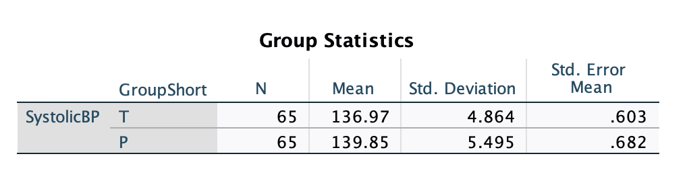
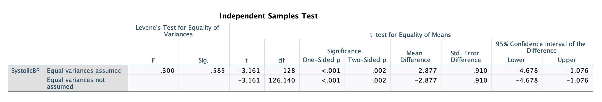
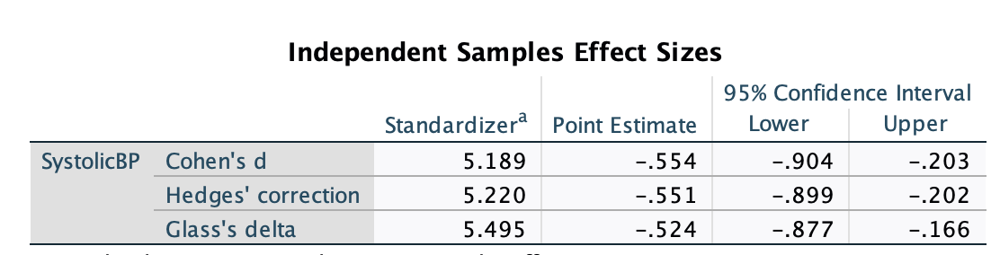
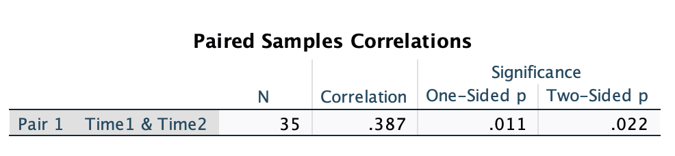
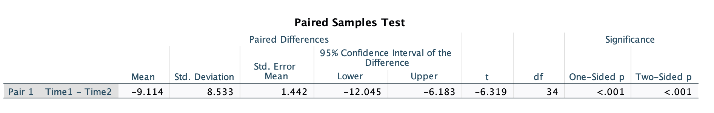
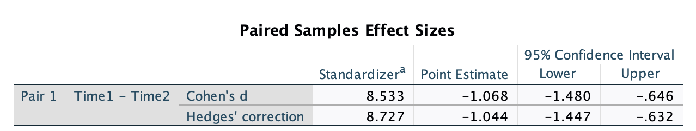

```{r setup, include=FALSE}
options(htmltools.dir.version = FALSE)
```

```{r xaringan-themer, include = FALSE}
library(xaringanthemer)
style_mono_accent(
  base_color = "#18778C",
  header_color = "#000000",
  header_font_google = google_font("Jost"),
  header_font_weight = 500,
  text_font_google = google_font("Jost", "300", "300i", "500", "500i"),
  code_font_google = google_font("Source Code Pro"),
  text_bold_color = '#4CA384',
  text_slide_number_color = '#18778C',
  text_font_size = '16pt'
)
```

```{r, echo = F, message = F, warning = F}
library(tidyverse)
knitr::opts_chunk$set(dev = 'svg')

baseColor <- '#4CA384'
accent1 <- '#9AD079'
accent2 <- '#18778C'
accent3 <- '#19424C'
```

## This Week's Key Topics

+ Types of ANOVAs and their assumptions

+ Interpreting and reporting the results of ANOVA

+ Computing and interpreting effect sizes for ANOVA

+ Conducting a power analysis for ANOVA

---
## Moving on from $t$-tests

+ $t$-tests allow for the comparison of two means...what if we want to compare more than two?

+ 

---
# MONICA EDIT - hypotheses

+ null is that $\mu_1 = \mu_2 =...\mu_n$
+ at least one $\mu$ is different from the other $\mu$s

Monica - show a plot that shows how if even one group is significantly different, the ANOVA can produce significant results.But on its own it doesn't tell you WHICH group is significantly different.


---
## The $t$-test

+ $t$-tests take account of both the mean and the variance of the data to determine whether two means are significantly different from each other. 

+ $t$-tests produce a $t$-statistic that reflects the standardised difference between two mean values

--

+ Generally used to test the difference between two means

  + **One-sample $t$-tests** test the difference between a sample mean and a known mean
  
  + **Independent-sample $t$-tests** test the difference between two separate sample means
  
  + **Paired-samples $t$-tests** test the difference in a single sample at two points in time or across different conditions
  
--

+ Because of this, all $t$-tests require:

  + A continuous dependent variable
  
  + A categorical (binary) independent variable

---
## The $t$-test

+ Running a $t$-test involves:

  + Computing $t$
  
  + Calculating the probability of obtaining our value of $t$ if the null were true

  + Using this probability to make a decision whether to reject the null hypothesis
  
---
## Calculating $t$

+ Although there are 3 types of $t$-tests, they generally involve some form of the following calculation:

$$t = \frac{Observed\ Mean(s) - What\ we\ expect\ if\ null\ is\ true}{Some\ combination\ of\ the\ SE}$$

---
## One-sample $t$-test

$$t = \frac{\bar{x}-\mu_0}{SE_\bar{x}}$$
+ Compare a sample mean ( $\bar{x}$ ) and a known mean ( $\mu_0$ )

+ Used to check whether your sample's mean is significantly different from a known value

--

+ **Example research questions:**

  + Are speeds along Road A significantly higher than the speed limit?
  
  + Do a beauty product's results last longer than 3 months?

---
## Independent-samples $t$-test

$$t = \frac{(\bar{x_1}-\bar{x_2})-(\mu_1 - \mu_2)}{\sqrt{\frac{s_p^2}{n_1}+\frac{s_p^2}{n2}}}$$
$s_p^2$: a pooled variance estimate that weights variance by sample size

--

+ Compares the mean of group 1 ( $\bar{x_1}$ ) to the mean of group 2 ( $\bar{x_2}$ )

+ Used to determine whether there is a difference between two independently measured groups

--

+ **Example research questions:**

  + Are there differences in symptoms between the treatment group and the group that received a placebo?
  
  + Do inmates who are put in solitary confinement exhibit more aggressive behaviour than those who are not?
  
  + Are there differences in TBI rate between boxers and Muay Thai fighters?
  
---
## Paired-samples $t$-test


$$t = \frac{\bar{d}-\mu_d}{SE_\bar{d}}$$


+ where:

  + $\bar{d}$: the mean of the individual difference scores (e.g. $d_i = x_{i1} - x_{i2}$)

  + $\mu_d$: The hypothesised null mean difference

  + $SE_\bar{d} = \frac{sd_\bar{d}}{\sqrt{n}}$

--

+ Compares the mean of the same group of participants across two timepoints/conditions

--

+ **Example research questions:**

  + Does time of day affect one's attention span?
  
  + Is a new fitness routine effective in improving one's cardiovascular health?


---
## The $t$ distribution

.pull-left[
+ The $t$-distribution is the null distribution against which our calculated $t$-value is compared. 

+ The shape of the $t$-distribution depends on the degrees of freedom ( $df$ ) of our data.
]

.pull-right[

```{r, echo = F, fig.height=4}
ggplot(data = data.frame(x = c(-5, 5)), aes(x=x)) +
  stat_function(fun=dt, geom='line', args=c(df = 2), color = baseColor, linewidth=1.5) +
  stat_function(fun=dt, geom='line', args=c(df = 5), color = accent1, linewidth=1.5) +
  stat_function(fun=dt, geom='line', args=c(df = 15), color = accent2, linewidth=1.5) +
  xlab('t') +
  theme(axis.text.y = element_blank(),
        axis.title.y = element_blank(),
        axis.line.y = element_blank(),
        axis.ticks.y = element_blank(),
        axis.text.x = element_text(size = 14),
        axis.title.x = element_text(size = 16, face = 'bold')) +
  annotate('text', label = 'df = 2', x = 2.25, y = .27, color = baseColor, size = 7) + 
  annotate('text', label = 'df = 5', x = 2.25, y = .32, color = accent1, size = 7) +
  annotate('text', label = 'df = 15', x = 2.25, y = .37, color = accent2, size = 7)
```

]

---
## Degrees of freedom

.pull-left[

+ The number of values within the data that are free to vary

+ df = items within dataset - parameters to be estimated

]


???

Imagine we have a set of 3 values and we know that the mean is 4. In this case, the parameter we wish to estimate is the mean, so there is 1 parameter. We have 3 values within our dataset. In this case, the degrees of freedom in this set is 2, because 3-1 is 2. To understand what this means in terms of 'free to vary', if we know the mean is 4, Value 1 could be anything...it could be 3 or 8, or 12. Value 2 could be the same, any value at all. But the third value is fixed, because it has to be whatever makes the mean equal to 4. So Value 1 and 2 are free to vary, but the 3rd value has a constraint, which is that it must be equal to whatever value makes the mean equal to 4. 

---
count: false

## Degrees of freedom

.pull-left[

+ The number of values within the data that are free to vary

+ df = items within dataset - parameters to be estimated

+ The number of parameters we estimate depends on the type of $t$-test

]


.pull-right[
+ **One-sample $t$-test:** we estimate the <span style = "color:#18778C"> mean of our data </span>
    + $df = n - 1$
  
+ **Independent samples $t$-test:** we estimate the <span style = "color:#18778C"> mean of each of our two groups </span>
    + $df = n - 2$
  
+ **Paired-samples $t$-test:** we estimate the <span style = "color:#18778C"> mean difference between observations </span>
    + $df = n - 1$
]


---
## The $t$ distribution

.pull-left[
+ The $t$-distribution is the null distribution against which our calculated $t$-value is compared. 

+ The shape of the $t$-distribution depends on the degrees of freedom ( $df$ ) of our data.

+ Consider how the shape of the distribution changes as $df$ increases

**Test your Understanding:** What does the change in shape suggest?

]

.pull-right[

```{r, echo = F, fig.height=4}
ggplot(data = data.frame(t = c(-5, 5)), aes(x=t)) +
  stat_function(fun=dt, geom='line', args=c(df = 2), color = baseColor, linewidth=1.5) +
  stat_function(fun=dt, geom='line', args=c(df = 5), color = accent1, linewidth=1.5) +
  stat_function(fun=dt, geom='line', args=c(df = 15), color = accent2, linewidth=1.5) +
  theme(axis.text.y = element_blank(),
        axis.title.y = element_blank(),
        axis.line.y = element_blank(),
        axis.ticks.y = element_blank(),
        axis.text.x = element_text(size = 14),
        axis.title.x = element_text(size = 16, face = 'bold')) +
  annotate('text', label = 'df = 2', x = 2.25, y = .27, color = baseColor, size = 7) + 
  annotate('text', label = 'df = 5', x = 2.25, y = .32, color = accent1, size = 7) +
  annotate('text', label = 'df = 15', x = 2.25, y = .37, color = accent2, size = 7)
```

]

---
## Putting it all together

.pull-left[
Basically:

1) Calculate your $t$-statistic

2) Identify the proper null distribution using $df$

3) Using this distribution, compute the probability of getting a $t$-statistic at least as extreme as yours

]

--

.pull-right[
```{r, echo = F, fig.height=4}
ggplot(data = data.frame(t = c(-5, 5)), aes(x=t)) +
  stat_function(fun=dt, geom='line', args=c(df = 15), color = baseColor, linewidth=1.5) +
  geom_vline(xintercept = 2.86, color = accent3, linetype = 'dashed', linewidth = 1.5) +
  annotate('text', label = 't = 2.86', x = 3.75, y = .05, size = 6) +
  theme(axis.text.y = element_blank(),
        axis.title.y = element_blank(),
        axis.line.y = element_blank(),
        axis.ticks.y = element_blank(),
        axis.text.x = element_text(size = 14),
        axis.title.x = element_text(size = 16, face = 'bold'))
```
]

---
count: false
class: center, inverse, middle

## Questions?

---

### Conducting a $t$-test...or really, most inferential statistical tests

1. State your hypothesis

2. Conduct a power analysis

3. Check your data (visualisations/descriptives)

4. Check assumptions

5. Run the test

6. Calculate the effect size/confidence intervals

7. Interpret results

8. Report

---
## One-Tailed vs Two-Tailed Tests

.pull-left[
.center[**One-Tailed**: hypothesis is *directional*


```{r, echo = F, fig.height=2, fig.width = 4}
ggplot(data = data.frame(t = c(-5, 5)), aes(x=t)) +
  stat_function(fun=dt, geom='line', args=c(df = 29), color = baseColor, linewidth=1.5) +
  geom_area(stat = 'function', fun = dt, args= list(df = 29), fill = accent2, 
            xlim=c(qt(.05, df = 29, lower.tail = F), 5), alpha = .8) +
  theme(axis.text.y = element_blank(),
        axis.title.y = element_blank(),
        axis.line.y = element_blank(),
        axis.ticks.y = element_blank(),
        axis.text.x = element_text(size = 10),
        axis.title.x = element_text(size = 12, face = 'bold')) +
  annotate('text', x = 3, y = .3, parse = T, label = paste('bar(x) > mu'), size = 6, color = baseColor) +
  annotate('text', x = 3.25, y = .05, parse = T, label = paste('alpha == .05'), size = 4, color = accent2)
```

```{r, echo = F, fig.height=2, fig.width = 4}
ggplot(data = data.frame(t = c(-5, 5)), aes(x=t)) +
  stat_function(fun=dt, geom='line', args=c(df = 29), color = baseColor, linewidth=1.5) +
  geom_area(stat = 'function', fun = dt, args= list(df = 29), fill = accent2, 
            xlim=c(-5, qt(.05, df = 29)), alpha = .8) +
  theme(axis.text.y = element_blank(),
        axis.title.y = element_blank(),
        axis.line.y = element_blank(),
        axis.ticks.y = element_blank(),
        axis.text.x = element_text(size = 10),
        axis.title.x = element_text(size = 12, face = 'bold')) +
  annotate('text', x = -3, y = .3, parse = T, label = paste('bar(x) < mu'), size = 6, color = baseColor) +
  annotate('text', x = -3.25, y = .05, parse = T, label = paste('alpha == .05'), size = 4, color = accent2)
```
]]

--

.pull-left[
.center[**Two-Tailed**: hypothesis is *nondirectional*]


```{r, echo = F, fig.height=4.5, fig.width = 6.5}
ggplot(data = data.frame(t = c(-5, 5)), aes(x=t)) +
  stat_function(fun=dt, geom='line', args=c(df = 29), color = baseColor, linewidth=1.5) +
  geom_area(stat = 'function', fun = dt, args= list(df = 29), fill = accent2, 
            xlim=c(qt(.025, df = 29, lower.tail = F), 5), alpha = .8) +
  geom_area(stat = 'function', fun = dt, args= list(df = 29), fill = accent2, 
            xlim=c(-5, qt(.025, df = 29)), alpha = .8) +
  theme(axis.text.y = element_blank(),
        axis.title.y = element_blank(),
        axis.line.y = element_blank(),
        axis.ticks.y = element_blank(),
        axis.text.x = element_text(size = 14),
        axis.title.x = element_text(size = 16, face = 'bold')) +
  annotate('text', x = 3, y = .3, parse = T, label = paste('bar(x) != mu'), size = 8, color = baseColor) +
  annotate('text', x = 3.25, y = .05, parse = T, label = paste('alpha == .025'), size = 6, color = accent2) +
  annotate('text', x = -3.25, y = .05, parse = T, label = paste('alpha == .025'), size = 6, color = accent2)
```
]

---
## Assumptions of $t$-tests

+ **Normality:** Dependent data should be normally distributed
  
--

.pull-left[
.center[**Normally Distributed**]
```{r, echo = F, fig.height=5}
set.seed(82087)
assumpDat <- data.frame(normDat=rnorm(300, mean = 25, sd = 5), floorDat=rbeta(300, shape1=1, shape2=5), bimodDat=c(rnorm(150, mean = 8, sd = 4), rnorm(150, mean = 22, sd = 4)), eqVar=rnorm(300, mean = 45, sd = 5), uneqVar = rnorm(300, mean = 45, sd = 12))

ggplot(assumpDat, aes(normDat)) + geom_histogram(fill = baseColor, color = accent3, bins = 30) +
  labs(x='Score', y = 'Count') +
  theme(axis.text = element_text(size = 14),
        axis.title = element_text(size = 16, face = 'bold'))
```
]

.pull-right[
.center[**Not so normally distributed**]
```{r, echo = F, fig.height=2.5}
ggplot(assumpDat, aes(bimodDat)) + geom_histogram(fill = baseColor, color = accent3, bins = 30) +
  labs(x='Score', y = 'Count') +
  theme(axis.text = element_text(size = 12),
        axis.title = element_text(size = 14, face = 'bold'))

ggplot(assumpDat, aes(floorDat)) + geom_histogram(fill = baseColor, color = accent3, bins = 30) +
  labs(x='Score', y = 'Count') +
  theme(axis.text = element_text(size = 12),
        axis.title = element_text(size = 14, face = 'bold'))
```
]
---
## Assumptions of $t$-tests

+ **Normality:** Dependent data should be normally distributed
  
+ **Independence:** Observations should be sampled independently

--

+ Independent-samples $t$-tests also require **Homogeneity of Variance:** Equal variance between the two groups

--

.pull-left[
.center[**Equal Variance**]
```{r, echo = F, fig.height=4}
ggplot(assumpDat) + geom_histogram(aes(normDat), fill = baseColor, color = accent3, alpha = .8, bins = 30) +
  geom_histogram(aes(eqVar), fill = accent2, color = accent3, alpha = .8, bins = 30) + 
  xlab('Score') + 
  theme(axis.text = element_text(size = 12),
        axis.title = element_text(size = 14, face = 'bold'),
        axis.text.y = element_blank(),
        axis.title.y = element_blank(),
        axis.ticks.y = element_blank())
```
]

.pull-right[
.center[**Not So Equal Variance**]
```{r, echo = F, fig.height=4}
ggplot(assumpDat) + geom_histogram(aes(normDat), fill = baseColor, color = accent3, alpha = .8, bins = 30) +
  geom_histogram(aes(uneqVar), fill = accent2, color = accent3, alpha = .8, bins = 30) + 
  xlab('Score') + 
  theme(axis.text = element_text(size = 12),
        axis.title = element_text(size = 14, face = 'bold'),
        axis.text.y = element_blank(),
        axis.title.y = element_blank(),
        axis.ticks.y = element_blank())
```
]

---

## Effect size - Cohen's $d$

+ Cohen's $d$ is the standardized difference between the means

  + in other words, how many standard deviations separate the two values?

$$d = \frac{\bar{x}_1 -\bar{x}_2}{s_{pooled}}$$

.pull-left[
+ $\bar{x}_1$ = mean of group 1
+ $\bar{x}_2$ = mean of group 2
+ $s_{pooled}$ = pooled standard deviation
]

--

.pull-right[

$$s_{pooled} = \sqrt{\frac{(n_1-1)s_1^2\ + (n_2-1)s_2^2}{n_1+n_2-2}}$$

]


---

## Interpretation of Cohen's $d$

+ Proposed by Cohen (1998):


| Strength | Absolute Magnitude of $d$ |
|:--------:|:-------------------------:|
| Weak     | $\leq$ .20                |
| Moderate | $\approx$ .50             |
| Strong   | $\geq$ .8                 |


---
exclude: true
## Effect size - Cohen's $d$

+ Works best for larger samples...for smaller samples (<50), it overinflates results **MONICA, VERIFY THIS**

---
## Checking Power

+ Recall that power usually involves some combination of the following values:
  
  + $\alpha$
  + Effect Size
  + Power
  + Sample Size
  
+ In almost all cases, we will set $\alpha = .05$ and $Power = .8$

+ For $t$-tests, we'll use **Cohen's $d$ ** as our effect size


---
class: middle, inverse, center

## Questions?

---
## Running an Independent-Samples $t$-Test

**Step 1: State Your Hypotheses**

.pull-left[.center[<span style = "color: #18778C"> Null Hypothesis </span>]
$$H_0:  \bar{x_1} = \bar{x_2}$$
]

.pull-right[.center[<span style = "color: #18778C"> Alternative Hypothesis </span>]
<b> Nondirectional </b>

$$H_1: \bar{x_1} \neq \bar{x_2}$$


<b> Directional </b>


$$H_1: \bar{x_1} > \bar{x_2}$$
$$H_1: \bar{x_1} < \bar{x_2}$$
]

--

> **Test Your Understanding:** If your research question is 'Are there differences in systolic blood pressure between the treatment group and the group that received a placebo?', what is your null hypothesis? What is your alternative hypothesis?

--

> Is this a directional or nondirectional hypothesis? Do we need a one-tailed or two-tailed test?


---
## Running an Independent-Samples $t$-Test

**Step 2: Conduct a Power Analysis**

+ [WebPower](https://webpower.psychstat.org/wiki/models/index)

+ Let's check the sample required to achieve 80% power to detect a moderate effect ( $d$ = .5) with $\alpha$ = .05.

+ Remember, our research question is 'Are there differences in systolic blood pressure between the treatment group and the group that received a placebo?'

---
## Running an Independent-Samples $t$-Test

**Step 3: Check your data**

+ Compute descriptive statistics

+ Look at relevant plots
  
--

+ Let's do this in SPSS using [these data](https://mtruelovehill.github.io/PRM/Data/BPdat.csv).


---
## Running an Independent-Samples $t$-Test

**Step 4: Check Assumptions**

+ Normality
  
  + Have a look at the histograms & QQ-plots
  + Check skewness and kurtosis values
  + May also run statistical tests of normality...but this is not recommended

--

+ Independence of Observations
 
  + Consider study design

--

+ Homogeneity of Variance
 
  + Check the results of Levene's Test
  

---
## Running an Independent-Samples $t$-Test

**Step 5: Run the test**

**Step 6: Calculate the effect size/confidence intervals**

Let's continue in SPSS...

---
## Running an Independent-Samples $t$-Test

**Step 7: Interpret results**

```{r, echo = F}

```

---
## Running an Independent-Samples $t$-Test

**Step 7: Interpret results**

```{r, echo = F}

```

--

.center[
```{r, echo = F, fig.height=3}
ggplot(data = data.frame(t = c(-5, 5)), aes(x=t)) +
  stat_function(fun=dt, geom='line', args=c(df = 128), color = baseColor, linewidth=1.5) +
  geom_area(stat = 'function', fun = dt, args= list(df = 128), fill = accent1, 
            xlim=c(qt(.025, df = 128, lower.tail = F), 5), alpha = .8) +
  geom_area(stat = 'function', fun = dt, args= list(df = 128), fill = accent1, 
            xlim=c(-5, qt(.025, df = 128)), alpha = .8) +
  theme(axis.text.y = element_blank(),
        axis.title.y = element_blank(),
        axis.line.y = element_blank(),
        axis.ticks.y = element_blank(),
        axis.text.x = element_text(size = 14),
        axis.title.x = element_text(size = 16, face = 'bold')) +
  annotate('text', x = -4.25, y = .05, label = 't = -3.16', size = 8, color = accent2) +
  geom_vline(xintercept = -3.16, color = accent2, linetype = 'dashed', linewidth = 1.5)

```
]

---
## Running an Independent-Samples $t$-Test

**Step 7: Interpret results**

.pull-left[
```{r, echo = F}

```
]

.pull-right[

| Strength | Absolute Magnitude of $d$ |
|:--------:|:-------------------------:|
| Weak     | $\leq$ .20                |
| Moderate | $\approx$ .50             |
| Strong   | $\geq$ .8                 |

]


---
## Running an Independent-Samples $t$-Test

**Step 8: Report**

+ Type of test conducted

+ Variables tested

+ Descriptive data

+ Test results:
  + Test statistic ( $t$)
  + Degrees of freedom
  + $p$-value
  + Effect size
  + Confidence intervals

+ Brief interpretation (NO DISCUSSION)


---
## Running an Independent-Samples $t$-Test

**Step 8: Report**

We conducted a **two-tailed independent-samples $t$-test** to determine the effect of <span style = "color:#9AD079"> <b> treatment </span></b> on <span style = "color:#9AD079"> <b>systolic blood pressure (SBP) </span></b>. There was a significant effect of treatment, <span style = "color:#18778C"><b> $t$(128) = -3.16, $p$ = .002, 95% CI = [-4.68, -1.08], $d$ = -.55 </span></b>. Specifically, SBP in the treatment group was lower <span style = "color:#19424C"><b> ( $M$ = 136.97, $SD$ = 4.86)</span></b> than SBP in the placebo group <span style = "color:#19424C"><b>( $M$ = 139.85, $SD$ = 5.50)</span></b>.

--

Note number of decimal places and use of italics and brackets

Although it's not here in the results, you'll also need to specify $\alpha$

---
## Running an Independent-Samples $t$-Test

**Step 8: Report**

.pull-left[

+ Figures are useful in helping readers visualise your results.

+ A **boxplot** is especially good for demonstrating results when you have a continuous DV and a categorical IV

]

.pull-right[
```{r, echo = F, fig.height=4.5}

bpDat <- read.csv('https://mtruelovehill.github.io/PRM/Data/BPdat.csv')

ggplot(bpDat, aes(x=Group, y = SystolicBP, fill = Group)) + geom_boxplot() +
  scale_fill_manual(values=c(accent1, accent2)) + 
  ylab('Systolic Blood Pressure') +
  theme(legend.position = 'none',
        axis.text = element_text(size = 14),
        axis.title = element_text(size = 16, face = 'bold'))

```

]

---
count: false
class: center, inverse, middle

## Questions?

---
## Running a paired-samples $t$-test

**Step 1: State Your Hypotheses**

.pull-left[.center[<span style = "color: #18778C"> Null Hypothesis </span>]
$$H_0:  \bar{d} = \mu_d$$
]

.pull-right[.center[<span style = "color: #18778C"> Alternative Hypothesis </span>]
<b> Nondirectional </b>

$$H_1: \bar{d} \neq \mu_d$$


<b> Directional </b>


$$H_1: \bar{d} > \mu_d$$
$$H_1: \bar{d} < \mu_d$$
]

--

> **Test Your Understanding:** If your research question is 'Does Medication X change blood pressure in participants over time?', is this a directional or nondirectional hypothesis? Do we need a one-tailed or two-tailed test?


---
## Running a paired-samples $t$-test

**Step 2: Conduct a Power Analysis**

+ Research Question: Does Medication X decrease blood pressure in participants over time?

+ [WebPower](https://webpower.psychstat.org/wiki/models/index)

+ As before, let's check the sample required to achieve 80% power to detect a moderate effect ( $d$ = .5) with $\alpha$ = .05.

---
## Running a paired-samples $t$-test

**Step 3: Check your data**

+ Let's use [this sample data](https://mtruelovehill.github.io/PRM/PRMcontent/Data/BPpairedDat.csv)

---
## Running a paired-samples $t$-test

**Step 4: Check Assumptions**

+ Normality of difference scores
  
  + Have a look at the histograms & QQ-plots
  + Check skewness and kurtosis values
  + May also run statistical tests of normality...but this is not recommended

--

+ Independence (of participants rather than observations)
 
  + Consider study design


---
## Running a paired-samples $t$-test

**Step 5: Run the test**

**Step 6: Calculate the effect size/confidence intervals**

Again, let's continue in SPSS...

---
## Running a paired-samples $t$-test

**Step 7: Interpret results**

```{r, echo = F}

```

---
## Running a paired-samples $t$-test

**Step 7: Interpret results**

```{r, echo = F}

```

--

.center[
```{r, echo = F, fig.height=3}
ggplot(data = data.frame(t = c(-7, 7)), aes(x=t)) +
  stat_function(fun=dt, geom='line', args=c(df = 34), color = baseColor, linewidth=1.5) +
  geom_area(stat = 'function', fun = dt, args= list(df = 34), fill = accent1, 
            xlim=c(qt(.025, df = 34, lower.tail = F), 7), alpha = .8) +
  geom_area(stat = 'function', fun = dt, args= list(df = 34), fill = accent1, 
            xlim=c(-7, qt(.025, df = 34)), alpha = .8) +
  theme(axis.text.y = element_blank(),
        axis.title.y = element_blank(),
        axis.line.y = element_blank(),
        axis.ticks.y = element_blank(),
        axis.text.x = element_text(size = 14),
        axis.title.x = element_text(size = 16, face = 'bold')) +
  annotate('text', x = -4.75, y = .05, label = 't = -6.32', size = 8, color = accent2) +
  geom_vline(xintercept = -6.32, color = accent2, linetype = 'dashed', linewidth = 1.5)

```
]

---
## Running a paired-samples $t$-test

**Step 7: Interpret results**

.pull-left[
```{r, echo = F}

```
]


.pull-right[

| Strength | Absolute Magnitude of $d$ |
|:--------:|:-------------------------:|
| Weak     | $\leq$ .20                |
| Moderate | $\approx$ .50             |
| Strong   | $\geq$ .8                 |

]


---
## Running a paired-samples $t$-test

**Step 8: Report**

We conducted a **two-tailed paired-samples $t$-test** to determine the effect of <span style = "color:#9AD079"> <b> treatment  </span></b> on <span style = "color:#9AD079"> <b>systolic blood pressure (SBP) </span></b>. There was a significant effect of treatment, <span style = "color:#18778C"><b> $t$(128) = -6.32, $p$ < .001, 95% CI = [-12.05, -6.18], $d$ = -1.07 </span></b>. Specifically, SBP was lower before the medication was administered <span style = "color:#19424C"><b> ( $M$ = 138.60, $SD$ = 6.67)</span></b> than after taking the medication <span style = "color:#19424C"><b>( $M$ = 147.71, $SD$ = 8.48)</span></b>.


---
count: false
class: center, inverse, middle

## Questions?


