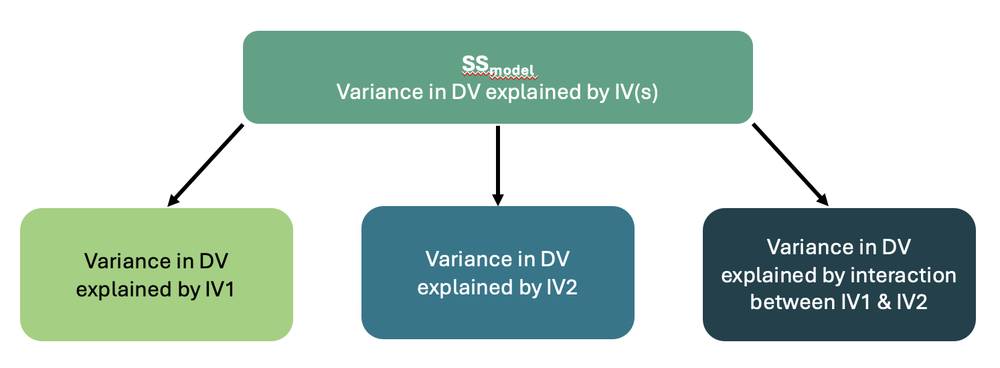

```{r setup, include=FALSE}
options(htmltools.dir.version = FALSE)
```

```{r xaringan-themer, include = FALSE}
library(xaringanthemer)
style_mono_accent(
  base_color = "#18778C",
  header_color = "#000000",
  header_font_google = google_font("Jost"),
  header_font_weight = 500,
  text_font_google = google_font("Jost", "300", "300i", "500", "500i"),
  code_font_google = google_font("Source Code Pro"),
  text_bold_color = '#4CA384',
  text_slide_number_color = '#18778C',
  text_font_size = '16pt'
)
```

```{r, echo = F, message = F, warning = F}
library(tidyverse)
knitr::opts_chunk$set(dev = 'svg')

baseColor <- '#4CA384'
accent1 <- '#9AD079'
accent2 <- '#18778C'
accent3 <- '#19424C'
```

### This Week's Key Topics

+ When to use Factorial ANOVA

+ What is an interaction?

+ Interpreting and reporting the results of Factorial ANOVA

+ Power Analyses with Factorial ANOVAs

---
### Recap from last week

+ ANOVAs can be used to compare more than two means. 

  + One-Way ANOVA and Repeated-Measures ANOVA test for differences in the dependent variable between 3 or more levels of a single independent variable. 
  
  + **Factorial (Multiway) ANOVA** tests for differences in the dependent variable across <b>multiple</b> independent variables

+ A Factorial ANOVA requires:

  + A continuous dependent variable
  
  + 2 or more categorical independent variables (with at least 2 levels each)

---
### Factorial ANOVA

+ Compares the mean of the dependent variable across multiple levels of multiple independent variable

+ When using factorial ANOVA, you can test for both main effects and interactions

  + When multiple independent variables are included in the model, the **main effects** capture the effect of each independent variable, while holding the other independent variable(s) constant.
  
  + The **interaction** captures the how the effect of one independent variable on the dependent variable *changes* across levels of the other independent variable
  
  + This is also known as **moderation**, as the effect between two variables is being moderated by a third.

---
### Main Effects vs Interactions

<br>

.center[
```{r, echo = F, fig.height=5}
intDat <- data.frame(int=c(rep('int1', 4), rep('int2', 4), rep('int3', 4), 
                           rep('meInt', 4), rep('noint', 4)), 
                     IV1 = rep(c('A', 'A', 'B', 'B'), 5), 
                     IV2 = rep(c('A', 'B', 'A', 'B'), 5), 
                     DV = c(4, 2, 2, 4, 2, 2, 2, 4, 3, 4, 2, 2, 3, 4, 2, 4, 2, 1, 4, 3))

ggplot(intDat[intDat$int=='meInt',], aes(IV1, DV, color = IV2, group = IV2)) + geom_point() + geom_line() +
  scale_color_manual(values = c(baseColor, accent2)) +
  scale_y_continuous(limits = c(0,5), breaks = seq(0, 5, by = 1)) +
  labs(x = 'IV 1', y = 'Dependent Variable', color = 'IV 2') +
  theme(legend.position = 'inside',
        legend.position.inside = c(.85, .8),
        axis.text = element_text(size = 12),
        axis.title = element_text(size = 14, face = 'bold'),
        legend.title = element_text(size = 12, face = 'bold'))
```
]

---
### Main Effects vs Interactions

.center[**Main Effect of IV1**

```{r, echo = F, fig.height=5}

mePlot <- ggplot(intDat[intDat$int=='meInt',], aes(IV1, DV, color = IV2, group = IV2)) + 
  geom_point() + geom_line() +
  scale_color_manual(values = c(baseColor, accent2)) +
  scale_y_continuous(limits = c(0,5), breaks = seq(0, 5, by = 1)) +
  labs(x = 'IV 1', y = 'Dependent Variable', color = 'IV 2') +
  theme(legend.position = 'inside',
        legend.position.inside = c(.85, .8),
        axis.text = element_text(size = 12),
        axis.title = element_text(size = 14, face = 'bold'),
        legend.title = element_text(size = 12, face = 'bold'))

mePlot +
  annotate(geom = 'point', x = 1, y = 3.5, shape = 8, size = 4) +
  annotate(geom = 'point', x = 2, y = 3, shape = 8, size = 4) +
  annotate(geom = 'segment', x = 1, xend = 2, y = 3.5, yend = 3, linetype = 2) +
  annotate(geom = 'text', label = 'Difference between IV1 Groups A & B', x = 1.5, y = 3.52) +
  annotate(geom = 'text', label = 'Mean of IV1 \n Group A', x = .85, y = 3.55) + 
  annotate(geom = 'text', label = 'Mean of IV1 \n Group B', x = 2.2, y = 3) 
  
  
```
]

---
### Main Effects vs Interactions

.center[**Main Effect of IV2**

```{r, echo = F, fig.height=5}

mePlot +
  annotate(geom = 'point', x = 1.5, y = 4, shape = 8, size = 4) +
  annotate(geom = 'point', x = 1.5, y = 2.5, shape = 8, size = 4) +
  annotate(geom = 'segment', x = 1.5, xend = 1.5, y = 2.5, yend = 4, linetype = 2) +
  annotate(geom = 'text', label = 'Difference between \n IV2 Groups A & B', x = 1.74, y = 3.25) +
  annotate(geom = 'text', label = 'Mean of IV2 \n Group A', x = 1.5, y = 4.4) +
  annotate(geom = 'text', label = 'Mean of IV2 \n Group B', x = 1.5, y = 2.1) 
```
]

---
### Main Effects vs Interactions

.center[**Interaction**

```{r, echo = F, fig.height=5}
ggplot(intDat[intDat$int=='meInt',], aes(IV1, DV, color = IV2, group = IV2)) + geom_point() + geom_line() +
  scale_color_manual(values = c(baseColor, accent2)) +
  scale_y_continuous(limits = c(0,5), breaks = seq(0, 5, by = 1)) +
  labs(x = 'IV 1', y = 'Dependent Variable', color = 'IV 2') +
  theme(legend.position = 'inside',
        legend.position.inside = c(.85, .8),
        axis.text = element_text(size = 12),
        axis.title = element_text(size = 14, face = 'bold'),
        legend.title = element_text(size = 12, face = 'bold')) + 
  annotate(geom = 'text', label = 'Difference between \n IV2 Groups at IV1A', x = .75, y = 3.5) +
  annotate(geom = 'text', label = 'Difference between \n IV2 Groups at IV1B', x = 2.25, y = 3) +
  annotate(geom = 'segment', x = 1, xend = 1, y = 3, yend = 4, lty = 2) +
  annotate(geom = 'segment', x = 2, xend = 2, y = 2, yend = 4, lty = 2)
  
```
]

---
### Interaction Visualisations

.pull-left[

.center[**Interaction**]
```{r, echo = F, fig.height=3}
ggplot(intDat[intDat$int=='int1',], aes(IV1, DV, color = IV2, group = IV2)) + geom_point() + geom_line() +
  scale_y_continuous(limits = c(0,5), breaks = seq(0, 5, by = 1)) +
  scale_color_manual(values = c(baseColor, accent2)) +
  labs(x = 'IV 1', y = 'Dependent Variable', color = 'IV 2') +
  theme(legend.position = 'inside',
        legend.position.inside = c(.85, .8),
        axis.text = element_text(size = 12),
        axis.title = element_text(size = 14, face = 'bold'),
        legend.title = element_text(size = 12, face = 'bold'))
```
.center[**Interaction**]
```{r, echo = F, fig.height=3}
ggplot(intDat[intDat$int=='int2',], aes(IV1, DV, color = IV2, group = IV2)) + geom_point() + geom_line() +
  scale_color_manual(values = c(baseColor, accent2)) +
  scale_y_continuous(limits = c(0,5), breaks = seq(0, 5, by = 1)) +
  labs(x = 'IV 1', y = 'Dependent Variable', color = 'IV 2') +
  theme(legend.position = 'inside',
        legend.position.inside = c(.85, .8),
        axis.text = element_text(size = 12),
        axis.title = element_text(size = 14, face = 'bold'),
        legend.title = element_text(size = 12, face = 'bold'))
```

]

.pull-right[

.center[**Interaction**]
```{r, echo = F, fig.height=3}
ggplot(intDat[intDat$int=='int3',], aes(IV1, DV, color = IV2, group = IV2)) + geom_point() + geom_line() +
  scale_color_manual(values = c(baseColor, accent2)) +
  scale_y_continuous(limits = c(0,5), breaks = seq(0, 5, by = 1)) +
  labs(x = 'IV 1', y = 'Dependent Variable', color = 'IV 2') +
  theme(legend.position = 'inside',
        legend.position.inside = c(.85, .8),
        axis.text = element_text(size = 12),
        axis.title = element_text(size = 14, face = 'bold'),
        legend.title = element_text(size = 12, face = 'bold'))
```
.center[**No Interaction**]
```{r, echo = F, fig.height=3}
ggplot(intDat[intDat$int=='noint',], aes(IV1, DV, color = IV2, group = IV2)) + geom_point() + geom_line() +
  scale_color_manual(values = c(baseColor, accent2)) +
  scale_y_continuous(limits = c(0,5), breaks = seq(0, 5, by = 1)) +
  labs(x = 'IV 1', y = 'Dependent Variable', color = 'IV 2') +
  theme(legend.position = 'inside',
        legend.position.inside = c(.85, .8),
        axis.text = element_text(size = 12),
        axis.title = element_text(size = 14, face = 'bold'),
        legend.title = element_text(size = 12, face = 'bold'))
```
]

---
### Interpreting Effects

+ Take caution when interpreting main effects in the presence of an interaction. 

.pull-left[

```{r, echo = F, fig.height=4.5}

meDat <- data.frame(Style = rep(c('Alone', 'Alone', 'With Partner', 'With Partner'),2),
                    Method = rep(c('Reading', 'Testing', 'Reading', 'Testing'),2),
                    Score = c(60, 60, 60, 70, 60, 65, 60, 75))

meDat$Method <- factor(meDat$Method, levels = c('Testing', 'Reading'))


ggplot(meDat[1:4,], aes(Style, Score, color = Method, group = Method)) + geom_point() + geom_line() +
  scale_y_continuous(limits = c(50, 80)) +
  scale_color_manual(values = c(baseColor, accent2)) +
  labs(x = 'Style', y = 'Score', color = 'Study Method') +
  theme(legend.position = 'inside',
        legend.position.inside = c(.85, .8),
        axis.text = element_text(size = 12),
        axis.title = element_text(size = 14, face = 'bold'),
        legend.title = element_text(size = 12, face = 'bold'))

```

]

---
### Interpreting Effects

+ Take caution when interpreting main effects in the presence of an interaction. 

.pull-left[

```{r, echo = F, fig.height=4.5}

ggplot(meDat[1:4,], aes(Style, Score, color = Method, group = Method)) + 
  geom_point() + geom_line() +
  scale_y_continuous(limits = c(50, 80)) +
  scale_color_manual(values = c(baseColor, accent2)) +
  labs(x = 'Style', y = 'Score', color = 'Study Method') +
  theme(legend.position = 'inside',
        legend.position.inside = c(.85, .8),
        axis.text = element_text(size = 12),
        axis.title = element_text(size = 14, face = 'bold'),
        legend.title = element_text(size = 12, face = 'bold')) +
  annotate(geom = 'segment', x = 1.5, xend = 1.5, y = 60, yend = 65, linetype = 2) +
  annotate(geom = 'point', x = 1.5, y = 65, shape = 8, size = 4, color = baseColor) +
  annotate(geom = 'point', x = 1.5, y = 60, shape = 8, size = 4, color = accent2) +
  annotate(geom = 'text', label = 'Mean Score of Testing Group', x = 1.95, y = 65, color = baseColor) +
  annotate(geom = 'text', label = 'Mean Score of Reading Group', x = 1.95, y = 59, color = accent2) +
  annotate(geom = 'text', label = 'Main effect of method only due to differences in the partner condition',
           x = 1.5, y = 55)

```
.center[**Main Effect Explained by Interaction**]
]

--

.pull-right[

```{r, echo = F, fig.height=4.5}
ggplot(meDat[5:8,], aes(Style, Score, color = Method, group = Method)) + geom_point() + geom_line() +
  scale_y_continuous(limits = c(50, 80)) +
  scale_color_manual(values = c(baseColor, accent2)) +
  labs(x = 'Style', y = 'Score', color = 'Study Method') +
  theme(legend.position = 'inside',
        legend.position.inside = c(.85, .8),
        axis.text = element_text(size = 12),
        axis.title = element_text(size = 14, face = 'bold'),
        legend.title = element_text(size = 12, face = 'bold')) +
  annotate(geom = 'segment', x = 1.5, xend = 1.5, y = 60, yend = 70, linetype = 2) +
  annotate(geom = 'point', x = 1.5, y = 70, shape = 8, size = 4, color = baseColor) +
  annotate(geom = 'point', x = 1.5, y = 60, shape = 8, size = 4, color = accent2) +
  annotate(geom = 'text', label = 'Mean Score of Testing Group', x = 1.95, y = 70, color = baseColor) +
  annotate(geom = 'text', label = 'Mean Score of Reading Group', x = 1.95, y = 59, color = accent2) +
  annotate(geom = 'text', label = 'Main effect of method across all style conditions',
           x = 1.5, y = 55)
```
.center[**Valid Main Effect AND Interaction**]

]

---
class: inverse, middle, center

## Questions?

---
### Hypotheses

+ Because we have multiple independent variables, we often have multiple hypotheses.

  + Hypotheses about main effects
  
  + Hypothesis about interaction

+ A key consideration when working with tests that produce multiple results is to be sure your research aims and hypotheses align with what your focus in the results and discussion. 

---
### Example Scenario

.pull-left[
+ A researcher is interested in how pet ownership and personality affect subjective well-being.

+ They collect the following data from participants:
  + Type of pet (dog/cat/other/none)
  + Personality type (introvert/extrovert)
  + Subjective well-being
]

.pull-right[

```{r, echo = F, fig.height=3.5}
facDat <- read.csv('https://mtruelovehill.github.io/PRM/Data/petDat.csv')

ggplot(facDat, aes(Pet, SWB, fill = Personality)) + geom_boxplot() +
  scale_y_continuous(limits = c(0, 40), breaks = seq(0, 40, 10)) +
  scale_fill_manual(values = c(baseColor, accent1)) +
  theme(axis.text = element_text(size = 12),
        axis.title = element_text(size = 14, face = 'bold'),
        legend.position = 'inside',
        legend.position.inside = c(.35, .2))

```


]

--

+ There 3 possible research questions that could be tested:

  + Is there an effect of pet ownership on subjective well-being?
  
  + Is there an effect of personality type (introvert vs extrovert) on subjective well being?
  
  + Does the effect of pet ownership on subjective well-being change across personality types?

** Test Your Understanding:** Which of the above questions reference a main effect and which reference an interaction?

---
### The Logic Behind Factorial ANOVA

+ Recall from last week that ANOVAs evaluate two features in our data:

  + Variance in the dependent variable explained by the independent variable ( $SS_{model}$)
  
  + Variance in the dependent variable *not* explained by the independent variable ( $SS_{residual}$)

--

+ With a Factorial ANOVA, the only difference is that the variance explained by the IV is broken down depending on the number of Independent Variables:

.center[
```{r, echo = F, out.width='75%'}

```
]

### The Logic Behind Factorial ANOVA

+ Recall from last week that ANOVAs evaluate two features in our data:

  + Variance in the dependent variable explained by the independent variable ( $SS_{model}$)
  
  + Variance in the dependent variable *not* explained by the independent variable ( $SS_{residual}$)

--

+ With a Factorial ANOVA, the only difference is that the variance explained by the IV is broken down depending on the number of Independent Variables:

.center[
```{r, echo = F, out.width='75%'}

```
]

---
### The Logic Behind Factorial ANOVA

.pull-left[
Recall from last week that $SS_{model}$ is calculated as the distance between the means of each group and the grand mean. 

When there is one IV with 3 groups, this distance is computed between the grand mean and each individual within each of the groups:

```{r, echo = F, fig.height=4, warning = F}
set.seed(526)
dat <- data.frame(IV = c(rep('Group A', 4), rep('Group B', 4), rep('Group C', 4)),
                  DV = c(rnorm(4, mean = 15, sd = 3), rnorm(4, mean = 18, sd = 3), rnorm(4, mean = 12, sd = 3)),
                  ID = 1:12)


basePlot <- ggplot(dat, aes(ID, DV)) + geom_point() +
    labs(x = 'Participant', y = 'Dependent Variable') +
  scale_x_continuous(breaks = seq(1, 12, 1)) + 
    geom_hline(yintercept = mean(dat$DV), linewidth = 1) +
    theme(axis.text = element_text(size = 8),
          axis.title = element_text(size = 8, face = 'bold'))

plotDat <- data.frame(y = c(mean(dat$DV[dat$IV=='Group A']), mean(dat$DV[dat$IV=='Group B']), mean(dat$DV[dat$IV=='Group C'])))

basePlot + geom_point(data = dat, aes(color = IV)) +
  scale_color_manual(values = c(baseColor, accent1, accent2)) +
  geom_segment(aes(x = 1, y = plotDat$y[1], xend = 4, yend = plotDat$y[1]),
               col = baseColor, linewidth = 1) +
  geom_segment(aes(x = 5, y = plotDat$y[2], xend = 8, yend = plotDat$y[2]),
               col = accent1, linewidth = 1) +
  geom_segment(aes(x = 9, y = plotDat$y[3], xend = 12, yend = plotDat$y[3]),
               col = accent2, linewidth = 1) +
  geom_segment(aes(x = ID, y = mean(DV), xend = ID, yend = c(rep(plotDat$y[1], 4), rep(plotDat$y[2], 4), rep(plotDat$y[3], 4)), color = dat$IV), lty = 2, linewidth = 1) +
  theme(legend.position = 'inside',
        legend.position.inside = c(.85, .78),
        legend.text = element_text(size = 8),
        legend.title = element_blank())
```

]

--

.pull-right[
When there are multiple IVs, $SS_{model}$ is still calculated as the distance between the means of each group and the grand mean. 

With 2 IVs (one with 2 levels and one with 3), there are 6 possible groups, so $SS_{model}$ is computed from these:

```{r, echo = F, fig.height=4.5, warning = F}
sampDat <- read.csv('https://mtruelovehill.github.io/PRM/Data/petSampleDat.csv')
sampDat$Group <- paste(sampDat$Pet, sampDat$Personality, sep = '/')
sampDat$ID <- 1:nrow(sampDat)
sampDat$Group <- factor(sampDat$Group, levels = c('Cat/Introvert', 'Cat/Extrovert', 'Dog/Introvert', 'Dog/Extrovert', 'None/Introvert', 'None/Extrovert'))

plotDat <- as.data.frame(sampDat %>%
  group_by(Group) %>%
  summarise(meanSWB = mean(SWB)))

ggplot(sampDat, aes(ID, SWB, color = Group)) + geom_point() +
  scale_color_manual(values = c('#40B6AD', baseColor, accent1, accent2, accent3, 'gray40')) +
  scale_x_continuous(breaks = seq(1, 18, 1)) +
  geom_hline(yintercept = mean(sampDat$SWB), linewidth = 1) +
  geom_segment(aes(x = 1, y = plotDat$meanSWB[1], xend = 3, yend = plotDat$meanSWB[1]),
               col = '#40B6AD', linewidth = 1) + 
  geom_segment(aes(x = 4, y = plotDat$meanSWB[2], xend = 6, yend = plotDat$meanSWB[2]),
               col = baseColor, linewidth = 1) +
  geom_segment(aes(x = 7, y = plotDat$meanSWB[3], xend = 9, yend = plotDat$meanSWB[3]),
               col = accent1, linewidth = 1) +
  geom_segment(aes(x = 10, y = plotDat$meanSWB[4], xend = 12, yend = plotDat$meanSWB[4]),
               col = accent2, linewidth = 1) +
  geom_segment(aes(x = 13, y = plotDat$meanSWB[5], xend = 15, yend = plotDat$meanSWB[5]),
               col = accent3, linewidth = 1) +
  geom_segment(aes(x = 16, y = plotDat$meanSWB[6], xend = 18, yend = plotDat$meanSWB[6]),
               col = 'gray40', linewidth = 1) +
  geom_segment(x = sampDat$ID, y = mean(sampDat$SWB), xend = sampDat$ID, yend = sampDat$GroupMean, lty = 2, linewidth = 1) + 
  theme(legend.position = 'top',
        axis.title = element_text(face = 'bold'))


sampDat %>%
  group_by(Personality) %>%
  summarise(meanSWB = mean(SWB))

```

]

---
### The Logic Behind Factorial ANOVA

+ $SS_{IV1}$: Main Effect of Pet

```{r, echo = F, fig.height=4.5, warning = F}

ggplot(sampDat, aes(ID, SWB, color = Pet)) + geom_point() +
  scale_color_manual(values = c('#40B6AD', baseColor, accent1, accent2, accent3, 'gray40')) +
  scale_x_continuous(breaks = seq(1, 18, 1)) +
  geom_hline(yintercept = mean(sampDat$SWB), linewidth = 1) +
  geom_segment(aes(x = 1, y = plotDat$meanSWB[1], xend = 3, yend = plotDat$meanSWB[1]),
               col = '#40B6AD', linewidth = 1)
  geom_segment(aes(x = 4, y = plotDat$meanSWB[2], xend = 6, yend = plotDat$meanSWB[2]),
               col = baseColor, linewidth = 1) +
  geom_segment(aes(x = 7, y = plotDat$meanSWB[3], xend = 9, yend = plotDat$meanSWB[3]),
               col = accent1, linewidth = 1) 
  geom_segment(x = sampDat$ID, y = mean(sampDat$SWB), xend = sampDat$ID, yend = sampDat$GroupMean, lty = 2, linewidth = 1) + 
  theme(legend.position = 'top',
        axis.title = element_text(face = 'bold'))

```


---
### The $F$ distribution

.pull-left[
+ The $F$-distribution is the null distribution against which our calculated $F$-statistic is compared. 

+ Like the $t$ distribution, the shape of the $F$-distribution depends on the degrees of freedom in our data.

+ Values of 0 or 1 are most common in the null distribution, with values farther from than 1 increasingly less likely.

+ Note that $F$ will never be less than 0. 

]

.pull-right[

```{r, echo = F, fig.height=4}
ggplot(data = data.frame(F = c(0, 5)), aes(x=F)) +
  stat_function(fun=df, geom='line', args=c(df1 = 2, df2 = 10), color = baseColor, linewidth=1.5) +
  stat_function(fun=df, geom='line', args=c(df1 = 2, df2 = 100), color = accent1, linewidth=1.5) +
  stat_function(fun=df, geom='line', args=c(df1 = 5, df2 = 10), color = accent2, linewidth=1.5) +
  stat_function(fun=df, geom='line', args=c(df1 = 5, df2 = 100), color = accent3, linewidth=1.5) +
  theme(axis.text.y = element_blank(),
        axis.title.y = element_blank(),
        axis.line.y = element_blank(),
        axis.ticks.y = element_blank(),
        axis.text.x = element_text(size = 14),
        axis.title.x = element_text(size = 16, face = 'bold')) +
  annotate('text', label = 'df = 2, 10', x = 4, y = .25, color = baseColor, size = 7) + 
  annotate('text', label = 'df = 2, 100', x = 4, y = .35, color = accent1, size = 7) +
  annotate('text', label = 'df = 5, 10', x = 4, y = .45, color = accent2, size = 7) +
  annotate('text', label = 'df = 5, 100', x = 4, y = .55, color = accent3, size = 7)
```

]

---
### Putting it all together

.pull-left[
Basically:

1) Calculate your $F$-statistic

2) Identify the proper null distribution using $df_{model}$ and $df_{residual}$

3) Using this distribution, compute the probability of getting an $F$-statistic at least as extreme as yours


]

.pull-right[
```{r, echo = F, fig.height=4}
Fstat <- 2.36

ggplot(data = data.frame(F = c(0, 5)), aes(x=F)) +
  stat_function(fun=df, geom='line', args=c(df1 = 2, df2 = 9), color = baseColor, linewidth=1.5) +
  theme(axis.text.y = element_blank(),
        axis.title.y = element_blank(),
        axis.line.y = element_blank(),
        axis.ticks.y = element_blank(),
        axis.text.x = element_text(size = 14),
        axis.title.x = element_text(size = 16, face = 'bold')) +
  annotate('text', label = 'df = 2, 9', x = 1, y = .75, color = baseColor, size = 7) +
  geom_vline(xintercept = Fstat, color = accent2, linewidth = 1, linetype = 2) + 
  annotate('text', label = paste('F =', Fstat), x = Fstat+.5, y = .3, color = accent2, size = 7) +
  annotate('text', label = paste('p =', round(pf(2.6, 2, 9, lower.tail = F),3)), x = Fstat+.6, y = .2, color = accent1, size = 7) +
  geom_area(stat = 'function', fun = df, args= list(df1 = 2, df2 = 9), fill = accent1, xlim=c(qf(pf(2.6, 2, 9, lower.tail = F), df1 = 2, df2 = 9, lower.tail = F), 5), alpha = .8)
```
]

---
### Posthoc Tests

+ After determining the presence of an overall effect, you can conduct posthoc tests to look for specific effects between groups.

+ Involves running separate tests on each possible comparison

--

+ But what about inflated Type I error risk??

--

+ First, these are only conducted if the presence of an overall effect is detected.

+ Second, $p$-values are corrected so that the overall Type I error rate across all tests is still equal to the $\alpha$ threshold

---
class: center, inverse, middle

### Questions?

---

### Conducting an ANOVA

1. State your hypothesis

2. Conduct a power analysis

3. Check your data (visualisations/descriptives)

4. Check assumptions

5. Run the test

6. Calculate the effect size/confidence intervals

7. Interpret results

8. Report

---
### State Your Hypotheses

+ $H_0: \mu_1 = \mu_2 =...\mu_n$

+ $H_1:$ at least one $\mu$ is different from the other $\mu$s

+ Note that the ANOVA distribution only has one tail, due to the nature of the $F$-statistic calculation (a ratio cannot be less than 0)

+ However, $H_1$ is still nondirectional
  + ANOVA doesn't tell you the direction of group differences, just that (at least) one exists.


---
### State Your Hypotheses

.pull-left[
.center[**ANOVA results not significant**]

```{r, echo = F, fig.height=4}
set.seed(608)
aovDat <- data.frame(Group = c(rep('A', 50), rep('B', 50), rep('C', 50)),
                     NS = rnorm(150, mean = 25, sd = 5),
                     s1 = c(rnorm(100, mean = 25, sd = 5), rnorm(50, mean = 32, sd = 5)),
                     s2 = c(rnorm(50, mean = 25, sd = 5), rnorm(50, mean = 32, sd = 5), rnorm(50, mean = 38, sd = 5)))

ggplot(aovDat, aes(Group, NS, fill = Group)) + geom_boxplot() +
  scale_fill_manual(values = c(baseColor, accent1, accent2)) +
  labs(x = 'Indepedent Variable', y = 'Dependent Variable') +
  theme(legend.position = 'none',
        axis.text = element_text(size = 12),
        axis.title = element_text(size = 14, face = 'bold')) +
  annotate(geom = 'text', label = 'F = .08, p = .925', x = 1.5, y = 43, size = 6)

```
]

.pull-right[
.center[**ANOVA results significant**]

```{r, echo = F, fig.height=3}
ggplot(aovDat, aes(Group, s1, fill = Group)) + geom_boxplot() +
  scale_fill_manual(values = c(baseColor, accent1, accent2)) +
  labs(x = 'Indepedent Variable', y = 'Dependent Variable') +
  theme(legend.position = 'none',
        axis.text = element_text(size = 12),
        axis.title = element_text(size = 14, face = 'bold')) +
  annotate(geom = 'text', label = 'F = 39.23, p < .001', x = 1.5, y = 43, size = 6)


ggplot(aovDat, aes(Group, s2, fill = Group)) + geom_boxplot() +
  scale_fill_manual(values = c(baseColor, accent1, accent2)) +
  labs(x = 'Indepedent Variable', y = 'Dependent Variable') +
  theme(legend.position = 'none',
        axis.text = element_text(size = 12),
        axis.title = element_text(size = 14, face = 'bold')) +
  annotate(geom = 'text', label = 'F = 94.51, p < .001', x = 1.5, y = 47, size = 6)
```
]

---
### Assumptions of ANOVA

+ **Normality:** Dependent data should be normally distributed *within groups*

--
  
+ **Independence:** Observations/individuals should be sampled independently

--

+ **Homogeneity of Variance:** Equal variance between each group/category

  + This is called sphericity in the case of repeated-measures ANOVA, but it's the same general idea. 

---

### Effect size - $\eta^2$

$$\eta^2 = \frac{SS_{model}}{SS_{total}}$$

+ $\eta^2$ is the proportion of variance in the dependent variable that is explained by the independent variable

+ Values range from 0 to 1

+ When you have multiple variables, you instead use $\eta^2_p$, which is the proportion of variance in the dependent variable that is explained by the independent variable *while controlling for the other variables in the model*. 


---

### Interpretation of $\eta^2$


| Strength | Magnitude of $\eta^2$ |
|:--------:|:-------------------------:|
| Weak     | $\leq$ .01                |
| Moderate | $\approx$ .06             |
| Strong   | $\geq$ .14                |


---
class: middle, inverse, center

### Questions?

---
### Running a One-way ANOVA

**Step 1: State Your Hypotheses**

**Research Question:** Does the type of auditory stimulus an infant is exposed to have an effect on their affect?

**Independent Variable:** Auditory Stimulus (3 levels: Infant-directed Speech; Adult-directed Speech; Infant-directed Singing)

**Dependent Variable:** Time until distressed

.pull-left[.center[<span style = "color: #18778C"> Null Hypothesis </span>
$$\mu_{IDspeech} = \mu_{ADspeech} = \mu_{IDsinging}$$
]]

.pull-right[.center[<span style = "color: #18778C"> Alternative Hypothesis </span>

At least one $\mu \neq$ the other $\mu$s

]]


---
### Running a One-way ANOVA

**Step 2: Conduct a Power Analysis**

+ [WebPower](https://webpower.psychstat.org/wiki/models/index)

+ Let's check the sample required to achieve 80% power to detect a moderate effect ( $eta^2$ = .06) with $\alpha$ = .05.

+ Although we use $\eta^2$, Webpower requires the effect size to be entered as $f$, so you'll need to convert it using the following formula:

$$f = \sqrt{\frac{\eta^2}{1-\eta^2}} = \sqrt{\frac{.06}{1-.06}} = .25$$

---
### Running a One-way ANOVA

**Step 3: Check your data**

+ Compute descriptive statistics

+ Look at relevant plots
  
--

+ Let's do this in SPSS using [these data](https://mtruelovehill.github.io/PRM/Data/babyDat.sav).


---
### Running a One-way ANOVA

**Step 4: Check Assumptions**

+ Normality
  
  + Have a look at the histograms & QQ-plots

+ Independence of Observations
 
  + Consider study design

+ Homogeneity of Variance
 
  + Check the results of Levene's Test
  

---
### Running a One-way ANOVA

**Step 5: Run the test**

**Step 6: Calculate the effect size**

**Step 7: Interpret results**

Let's continue in SPSS...


---
### Running a One-way ANOVA

**Step 8: Report**

+ alpha threshold 

+ Type of test conducted

+ Variables tested

+ Descriptive data

+ Test results:
  + Test statistic ( $t$)
  + Degrees of freedom
  + $p$-value
  + Effect sizes and/or confidence intervals

+ Brief interpretation (NO DISCUSSION)


---
### Running a One-way ANOVA

**Step 8: Report**

We conducted a **One-Way ANOVA** to determine the effect of <span style = "color:#9AD079"> <b> auditory stimulus </span></b> on <span style = "color:#9AD079"> <b> an infant's affect</span></b>. The $\alpha$ threshold was set at .05 for all analyses. There was a significant effect of stimulus, <span style = "color:#18778C"><b> $F$(2, 57) = 5.99, $p$ = .004, $eta^2$ = .174, 95% CI = [.02, .33] </span></b>. Posthoc Tukey's tests indicated that infants listening to infant-directed singing displayed a positive or neutral affect significantly longer <span style = "color:#19424C"><b> ($M$ = 6.32, $SD$ = 2.27)</span></b> than infants listening to adult-directed speech <span style = "color:#19424C"><b> ($M$ = 4.36, $SD$ = 1.55)</span></b>, $p$ = .005, or infants listening to infant-directed speech <span style = "color:#19424C"><b>( $M$ = 4.78, $SD$ = 1.77)</span></b>, $p$ = .033. There was no significant difference in time of distress in infants listening to adult-directed speech and those listening to infant-directed speech, $p$ = .762. 

---
### Running a One-way ANOVA

**Step 8: Report**

.pull-left[

+ Figures are useful in helping readers visualise your results.

+ A **boxplot** is especially good for demonstrating results when you have a continuous DV and a categorical IV

]

.pull-right[
```{r, echo = F, fig.height=4.5}

babyDat <- read.csv('https://mtruelovehill.github.io/PRM/Data/babyDat.csv')
babyDat$Group <- ifelse(babyDat$Group==0, 'AD Speech', ifelse(babyDat$Group==1, 'ID Speech', 'ID Singing'))
babyDat$Group <- factor(babyDat$Group, levels = c('AD Speech', 'ID Speech', 'ID Singing'))

ggplot(babyDat, aes(x=Group, y = TTD, fill = Group)) + geom_boxplot() +
  scale_fill_manual(values=c(baseColor, accent1, accent2)) + 
  ylab('Time to Distress (minutes)') +
  theme(legend.position = 'none',
        axis.text = element_text(size = 14),
        axis.title = element_text(size = 16, face = 'bold'))

```

]

---
class: center, inverse, middle

### Questions?

---
### Running a Repeated-measures ANOVA

**Step 1: State Your Hypotheses**

Does the presence of a family member have an effect on infant's affect?

.pull-left[.center[<span style = "color: #18778C"> Null Hypothesis </span>
$$\mu_{parentAbsent} = \mu_{siblingPresent} = \mu_{parentPresent}$$
]]

.pull-right[.center[<span style = "color: #18778C"> Alternative Hypothesis </span>

At least one $\mu \neq$ the other $\mu$s

]]

---
### Running a Repeated-measures ANOVA

**Step 2: Conduct a Power Analysis**


+ [WebPower](https://webpower.psychstat.org/wiki/models/index)

+ As before, let's check the sample required to achieve 80% power to detect a moderate effect ( $eta^2$ = .06) with $\alpha$ = .05.

---
### Running a Repeated-measures ANOVA

**Step 3: Check your data**

+ We can continue using the data from the previous example.


---
### Running a Repeated-measures ANOVA

**Step 4: Check Assumptions**

.pull-left[


+ Normality of difference scores
  
  + Have a look at the histograms & QQ-plots
  + Check skewness and kurtosis values
  + May also run statistical tests of normality...but this is not recommended

+ Independence (of participants rather than observations)

  + Consider study design
  
+ Sphericity
  
  + Check Mauchly's test
]

.pull-right[
```{r, echo = F, out.width = '75%'}
knitr::include_graphics('https://mtruelovehill.github.io/PRM/Labs/images/week5_sphericity.png')
```
]
  


---
### Running a Repeated-measures ANOVA

**Step 5: Run the test**

**Step 6: Calculate the effect size/confidence intervals**

**Step 7: Interpret results**

Again, let's continue in SPSS...


---
### Running a Repeated-measures ANOVA

**Step 8: Report**

We conducted a **Repeated-measures ANOVA** to determine the effect of <span style = "color:#9AD079"> <b> familial presence  </span></b> on <span style = "color:#9AD079"> <b>infant affect </span></b>. There was a significant effect of familial presence, <span style = "color:#18778C"><b> $F$(1.83, 107.99) = 42.40, $p$ < .001, $\eta^2_p$ = 0.42 </span></b>. Mean comparisons with Bonferroni corrections indicated that infants became distressed more quickly when no family members were present <span style = "color:#19424C"><b> ( $M$ = 3.85, $SD$ = 2.05)</span></b> than when a sibling was present <span style = "color:#19424C"><b>( $M$ = 5.04, $SD$ = 1.79)</span></b>, $p$ < .001, and when a parent was present <span style = "color:#19424C"><b>( $M$ = 7.03, $SD$ = 2.05)</span></b>, $p$ < .001. Infants retained a positive or neutral affect for longer when a parent was present than when a sibling was present, $p$ < .001. 


---
class: center, inverse, middle

## Questions?

---

.center[
```{r, echo = F, out.width='50%'}
knitr::include_graphics('https://mtruelovehill.github.io/PRM/Lectures/images/midsemesterfeedback.png')
```
]


