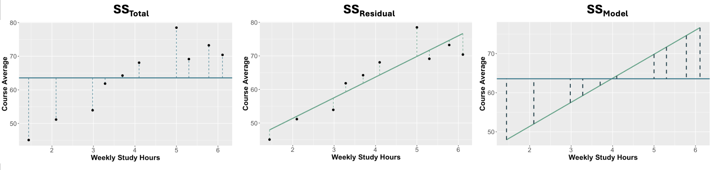

```{r setup, include=FALSE}
options(htmltools.dir.version = FALSE)
```

```{r xaringan-themer, include = FALSE}
library(xaringanthemer)
style_mono_accent(
  base_color = "#18778C",
  header_color = "#000000",
  header_font_google = google_font("Jost"),
  header_font_weight = 500,
  text_font_google = google_font("Jost", "300", "300i", "500", "500i"),
  code_font_google = google_font("Source Code Pro"),
  text_bold_color = '#4CA384',
  text_slide_number_color = '#18778C',
  text_font_size = '16pt'
)
```

```{r, echo = F, message = F, warning = F}
library(tidyverse)
library(faux)
library(kableExtra)

knitr::opts_chunk$set(dev = 'svg')

baseColor <- '#4CA384'
accent1 <- '#9AD079'
accent2 <- '#18778C'
accent3 <- '#19424C'
```

## This Week's Key Topics

+ The difference between variance, covariance, and correlation

+ The correlation coefficient

+ Understand what is meant by model

+ Key features of linear model

+ What are residuals?

+ Key principles of least squares

---
## Correlation

.pull-left[
+ Correlation is a measure of the relationship between two variables

+ Pearson's correlation measures the association between two **continuous** variables

+ When investigating the relationship between two continuous variables, we often visualise them using scatterplots
]

--

.pull-right[

```{r, echo=F, message = F, fig.width=5, fig.height=3.5}

dat <- read.csv('https://mtruelovehill.github.io/PRM/Data/distDat.csv')

ggplot(dat, aes(daysInProgram, maxDistance)) + geom_point(shape = 21, size = 3, color = accent3, fill = baseColor) + 
  labs(x='Days In Program', y='Max Distance (miles)') + 
  theme(axis.text = element_text(size=12), axis.title = element_text(size=14, face = 'bold'))
```
]

---
## Variance Refresher

.pull-left[
$$s^2_x = \frac{\sum_{i=1}^{n}{(x_i - \bar{x})}^2}{n-1}$$

+ **Variance:** Deviance around the mean of a single variable
]

.pull-right[
```{r, echo = F, fig.height=3, fig.width=5}
sampleDat <- data.frame(Names=c('Alfred', 'Bernard', 'Clarence', 'Dorothy', 'Edna', 'Flora', 'Geraldine'),
                    daysInProgram=c(117, 99, 103, 95, 136, 126, 108),
                    maxDistance=c(8.53, 10.57, 8.01, 14.63, 27.03, 22.22, 6.77))


(p1 <- ggplot(sampleDat, aes(Names, daysInProgram)) + geom_point(size=2, colour = baseColor) +
  labs(x='Participant Name', y = 'Days in Program') +
  theme(axis.text = element_text(size=10), axis.title = element_text(size=12, face = 'bold')) +
  scale_y_continuous(breaks=seq(80, 140, by = 20), limits = c(80, 140)))


```

]

---
---
count: false

## Variance Refresher

.pull-left[
$$s^2_x = \frac{\sum_{i=1}^{n}{(x_i - \bar{x})}^2}{n-1}$$

+ **Variance:** Deviance around the mean of a single variable

+ Raw deviation is the distance between each person's days in the program and the mean number of days in the program. 
]

.pull-right[
```{r, echo = F, fig.height=3, fig.width=5}
p1 + geom_hline(yintercept = mean(sampleDat$daysInProgram)) +
  labs(x='Participant Name', y = 'Days In Program') + 
  geom_segment(x = sampleDat$Names, y = sampleDat$daysInProgram, 
               xend = sampleDat$Names, yend = mean(sampleDat$daysInProgram), linetype = "dashed",
               colour= baseColor)
```
]

---
count: false

## Variance Refresher

.pull-left[
$$s^2_x = \frac{\sum_{i=1}^{n}{(x_i - \bar{x})}^2}{n-1}$$

+ **Variance:** Deviance around the mean of a single variable

+ Raw deviation is the distance between each person's days in the program and the mean number of days in the program. 

+ To get the variance, we:
  1. Square the values to get rid of the negative
  2. Sum them up and divide by $n-1$ to get the average deviation of the group from its mean.
]

.pull-right[
```{r, echo = F, fig.height=3, fig.width=5}
p1 + geom_hline(yintercept = mean(sampleDat$daysInProgram)) +
  geom_segment(x = sampleDat$Names, y = sampleDat$daysInProgram, 
               xend = sampleDat$Names, yend = mean(sampleDat$daysInProgram), linetype = "dashed",
               colour= baseColor)
```
]


---
## Covariance

.pull-left[
+ **Covariance:** A value that represents how two variables change together

+ Do $x$ and $y$ differ from their means in a similar way?
]

.pull-right[

```{r, echo = F, fig.height=2.5, fig.width=5}
p1 + geom_hline(yintercept = mean(sampleDat$daysInProgram)) +
  geom_segment(x = sampleDat$Names, y = sampleDat$daysInProgram, 
               xend = sampleDat$Names, yend = mean(sampleDat$daysInProgram), linetype = "dashed",
               colour= baseColor)
```

```{r, echo = F, fig.height=2.5, fig.width=5}
p2 <- ggplot(sampleDat, aes(Names, maxDistance)) + geom_point(size=2, colour = accent2) +
  labs(x='Participant Name', y ='Max Distance (miles)') +
  theme(axis.text = element_text(size=10), axis.title = element_text(size=12, face = 'bold')) + 
  geom_hline(yintercept = mean(sampleDat$maxDistance)) + 
  geom_segment(x = sampleDat$Names, y = sampleDat$maxDistance, 
               xend = sampleDat$Names, yend = mean(sampleDat$maxDistance), linetype = "dashed",
               colour= accent2) +
  scale_y_continuous(breaks=seq(0, 30, 10), limits = c(0, 30))

p2
```

]


---
count: false

## Covariance

.pull-left[
+ **Covariance:** A value that represents how two variables change together

+ Do $x$ and $y$ differ from their means in a similar way?

+ Mathematically similar to variance:


**Variance**
$$s^2_x = \frac{\sum_{i=1}^{n}{(x_i-\bar{x})^2}}{n-1} = \frac{\sum_{i=1}^{n}{(x_i-\bar{x})(x_i-\bar{x})}}{n-1}$$


**Covariance**

$$Cov_{xy} = \frac{\sum_{i=1}^{n}{\color{#4CA384}{(x_i-\bar{x})}\color{#18778C}{(y_i-\bar{y})}}}{n-1}$$
]

.pull-right[
```{r, echo = F, fig.height=2.5, fig.width=5}
p1 + geom_hline(yintercept = mean(sampleDat$daysInProgram)) +
  geom_segment(x = sampleDat$Names, y = sampleDat$daysInProgram, 
               xend = sampleDat$Names, yend = mean(sampleDat$daysInProgram), linetype = "dashed",
               colour= baseColor)
```

```{r, echo = F, fig.height=2.5, fig.width=5}
p2
```
]

---

## Covariance

.pull-left[
+ It's possible two variables are related if their observations differ proportionally from their means in a consistent way

+ Covariance gives us a sense of this...

  + High covariance suggests a stronger relationship than a lower covariance

  + Why can't we stop here? 
  
  + Why is correlation necessary? 

]


.pull-right[
```{r, echo = F, fig.height=2.5, fig.width=5}
p1 + geom_hline(yintercept = mean(sampleDat$daysInProgram)) +
  geom_segment(x = sampleDat$Names, y = sampleDat$daysInProgram, 
               xend = sampleDat$Names, yend = mean(sampleDat$daysInProgram), linetype = "dashed",
               colour= baseColor)
```

```{r, echo = F, fig.height=2.5, fig.width=5}
p2
```
]

---

## The Trouble with Covariance

.pull-left[

$$Cov_{xy}=\frac{\sum_{i=1}^n\color{#18778C}{(x_i-\bar{x})}(y_i-\bar{y})}{n-1}$$


```{r, echo = F}
sampleDat$varX <- round(sampleDat$daysInProgram-mean(sampleDat$daysInProgram),2)
sampleDat$varY <- round(sampleDat$maxDistance-mean(sampleDat$maxDistance), 2)
sampleDat$varXY <- round(sampleDat$varX*sampleDat$varY, 2)
row.names(sampleDat) <- NULL

```

| Participant           |  $x_i - \bar{x}$      |
|:----------------------|:---------------------:|
| `r sampleDat$Names[1]`| `r sampleDat$varX[1]` |
| `r sampleDat$Names[2]`| `r sampleDat$varX[2]` |
| `r sampleDat$Names[3]`| `r sampleDat$varX[3]` |
| `r sampleDat$Names[4]`| `r sampleDat$varX[4]` |
| `r sampleDat$Names[5]`| `r sampleDat$varX[5]` |
| `r sampleDat$Names[6]`| `r sampleDat$varX[6]` |
| `r sampleDat$Names[7]`| `r sampleDat$varX[7]` |
]


.pull-right[

```{r, echo = F, fig.width=5, fig.height=2.5}
(p3 <- p1 + geom_hline(yintercept = mean(sampleDat$daysInProgram)) +
  geom_segment(x = sampleDat$Names, y = sampleDat$daysInProgram, 
               xend = sampleDat$Names, yend = mean(sampleDat$daysInProgram), linetype = "dashed",
               colour= baseColor) +
  geom_text(aes(label = sampleDat$varX), nudge_x = .2, y = mean(sampleDat$daysInProgram)+(sampleDat$varX/2)))
```

]

---
count: false

## The Trouble with Covariance

.pull-left[

$$Cov_{xy}=\frac{\sum_{i=1}^n(x_i-\bar{x})\color{#18778C}{(y_i-\bar{y})}}{n-1}$$

| Participant           |  $x_i - \bar{x}$      |    $y_i - \bar{y}$    |
|:----------------------|:---------------------:|:---------------------:|
| `r sampleDat$Names[1]`| `r sampleDat$varX[1]` | `r sampleDat$varY[1]` |
| `r sampleDat$Names[2]`| `r sampleDat$varX[2]` | `r sampleDat$varY[2]` |
| `r sampleDat$Names[3]`| `r sampleDat$varX[3]` | `r sampleDat$varY[3]` |
| `r sampleDat$Names[4]`| `r sampleDat$varX[4]` | `r sampleDat$varY[4]` |
| `r sampleDat$Names[5]`| `r sampleDat$varX[5]` | `r sampleDat$varY[5]` |
| `r sampleDat$Names[6]`| `r sampleDat$varX[6]` | `r sampleDat$varY[6]` |
| `r sampleDat$Names[7]`| `r sampleDat$varX[7]` | `r sampleDat$varY[7]` |
]


.pull-right[

```{r, echo = F, fig.width=5, fig.height=2.5}
p3 
```

```{r, echo = F, fig.width=5, fig.height=2.5}
(p4 <- p2 + geom_text(aes(label = sampleDat$varY), nudge_x = .35, y = mean(sampleDat$maxDistance)+(sampleDat$varY/2)))
```

]

---
count: false

## The Trouble with Covariance

.pull-left[

$$Cov_{xy}=\frac{\sum_{i=1}^n\color{#18778C}{(x_i-\bar{x})(y_i-\bar{y})}}{n-1}$$

| Participant           |  $x_i - \bar{x}$      |    $y_i - \bar{y}$    | $(x_i - \bar{x})(y_i - \bar{y})$   |
|:----------------------|:---------------------:|:---------------------:|:------------------------:|
| `r sampleDat$Names[1]`| `r sampleDat$varX[1]` | `r sampleDat$varY[1]` |  `r sampleDat$varXY[1]`  |
| `r sampleDat$Names[2]`| `r sampleDat$varX[2]` | `r sampleDat$varY[2]` |  `r sampleDat$varXY[2]`  |
| `r sampleDat$Names[3]`| `r sampleDat$varX[3]` | `r sampleDat$varY[3]` |  `r sampleDat$varXY[3]`  |
| `r sampleDat$Names[4]`| `r sampleDat$varX[4]` | `r sampleDat$varY[4]` |  `r sampleDat$varXY[4]`  |
| `r sampleDat$Names[5]`| `r sampleDat$varX[5]` | `r sampleDat$varY[5]` |  `r sampleDat$varXY[5]`  |
| `r sampleDat$Names[6]`| `r sampleDat$varX[6]` | `r sampleDat$varY[6]` |  `r sampleDat$varXY[6]`  |
| `r sampleDat$Names[7]`| `r sampleDat$varX[7]` | `r sampleDat$varY[7]` |  `r sampleDat$varXY[7]`  |


]


.pull-right[

```{r, echo = F, fig.width=5, fig.height=2.5}
p3
```

```{r, echo = F, fig.width=5, fig.height=2.5}
p4
```

]

---
count: false

## The Trouble with Covariance

.pull-left[

$$Cov_{xy}=\frac{\color{#18778C}{\sum_{i=1}^n}(x_i-\bar{x})(y_i-\bar{y})}{n-1}$$


| Participant           |  $x_i - \bar{x}$      |    $y_i - \bar{y}$    | $(x_i - \bar{x})(y_i - \bar{y})$   |
|:----------------------|:---------------------:|:---------------------:|:------------------------:|
| `r sampleDat$Names[1]`| `r sampleDat$varX[1]` | `r sampleDat$varY[1]` |  `r sampleDat$varXY[1]`  |
| `r sampleDat$Names[2]`| `r sampleDat$varX[2]` | `r sampleDat$varY[2]` |  `r sampleDat$varXY[2]`  |
| `r sampleDat$Names[3]`| `r sampleDat$varX[3]` | `r sampleDat$varY[3]` |  `r sampleDat$varXY[3]`  |
| `r sampleDat$Names[4]`| `r sampleDat$varX[4]` | `r sampleDat$varY[4]` |  `r sampleDat$varXY[4]`  |
| `r sampleDat$Names[5]`| `r sampleDat$varX[5]` | `r sampleDat$varY[5]` |  `r sampleDat$varXY[5]`  |
| `r sampleDat$Names[6]`| `r sampleDat$varX[6]` | `r sampleDat$varY[6]` |  `r sampleDat$varXY[6]`  |
| `r sampleDat$Names[7]`| `r sampleDat$varX[7]` | `r sampleDat$varY[7]` |  `r sampleDat$varXY[7]`  |
|                       |                       |                       |  **`r round(sum(sampleDat$varXY), 2)`**|

]

.pull-right[

```{r, echo = F, fig.width=5, fig.height=2.5}
p3
```

```{r, echo = F, fig.width=5, fig.height=2.5}
p4
```

]

---

## The Trouble with Covariance

.pull-left[

$$Cov_{xy}=\frac{\sum_{i=1}^n(x_i-\bar{x})(y_i-\bar{y})}{n-1}=\frac{`r round(sum(sampleDat$varXY), 2)`}{7-1}=`r round(sum(sampleDat$varXY)/6, 2)`$$


| Participant           |  $x_i - \bar{x}$      |    $y_i - \bar{y}$    | $(x_i - \bar{x})(y_i - \bar{y})$   |
|:----------------------|:---------------------:|:---------------------:|:------------------------:|
| `r sampleDat$Names[1]`| `r sampleDat$varX[1]` | `r sampleDat$varY[1]` |  `r sampleDat$varXY[1]`  |
| `r sampleDat$Names[2]`| `r sampleDat$varX[2]` | `r sampleDat$varY[2]` |  `r sampleDat$varXY[2]`  |
| `r sampleDat$Names[3]`| `r sampleDat$varX[3]` | `r sampleDat$varY[3]` |  `r sampleDat$varXY[3]`  |
| `r sampleDat$Names[4]`| `r sampleDat$varX[4]` | `r sampleDat$varY[4]` |  `r sampleDat$varXY[4]`  |
| `r sampleDat$Names[5]`| `r sampleDat$varX[5]` | `r sampleDat$varY[5]` |  `r sampleDat$varXY[5]`  |
| `r sampleDat$Names[6]`| `r sampleDat$varX[6]` | `r sampleDat$varY[6]` |  `r sampleDat$varXY[6]`  |
| `r sampleDat$Names[7]`| `r sampleDat$varX[7]` | `r sampleDat$varY[7]` |  `r sampleDat$varXY[7]`  |
|                       |                       |                       |  **`r round(sum(sampleDat$varXY), 2)`**|

]

.pull-right[

```{r, echo = F, fig.width=5, fig.height=2.5}
p3
```

```{r, echo = F, fig.width=5, fig.height=2.5}
p4
```

]


---

## The Trouble with Covariance

+ A value of `r round(sum(sampleDat$varXY)/6, 2)` seems high...I think. Is it?

  + Maybe? But maybe not. 
  
  + Covariance is related specifically to the scales of the variables we are analysing. 
  
  + Variables with larger scales will naturally have larger covariance values.


---

## The Trouble with Covariance

+ Consider what would happen if we converted our distance data to kilometers instead of miles.

```{r, echo=F}
sampleDat$maxDistancekm <- sampleDat$maxDistance*1.61
```


.pull-left[

.center[**Miles**]

```{r, echo = 5, fig.height=3.5, fig.width=5}
p4
```


]

.pull-right[

.center[**Kilometers**]

```{r, echo = F, fig.height=3.5, fig.width=5}
sampleDat$varYkm <- round(sampleDat$maxDistancekm-mean(sampleDat$maxDistancekm),2)
sampleDat$varXYkm <- round(sampleDat$varX*sampleDat$varYkm,2)

ggplot(sampleDat, aes(Names, maxDistancekm)) + geom_point(size=2, colour = accent2) +
  labs(x='Participant Name', y = 'Max Distance (km)') + 
  theme(axis.text = element_text(size=10), axis.title = element_text(size=12, face = 'bold')) +
  scale_y_continuous(breaks=seq(20, 50, by = 10), limits = c(0, 50)) + geom_hline(yintercept = mean(sampleDat$maxDistancekm)) +
  geom_segment(x = sampleDat$Names, y = sampleDat$maxDistancekm, 
               xend = sampleDat$Names, yend = mean(sampleDat$maxDistancekm), linetype = "dashed",
               colour= accent2) +
  geom_text(aes(label = varYkm), nudge_x = .35, y = mean(sampleDat$maxDistancekm)+(sampleDat$varYkm/2))
```


]

---

## The Trouble with Covariance

.pull-left[

.center[**Miles**]

$$Cov_{xy}=`r round(sum(sampleDat$varXY)/6, 2)`$$


| Participant       |  $x_i - \bar{x}$      |    $y_i - \bar{y}$    | $(x_i - \bar{x})(y_i - \bar{y})$   |
|:------------------|:---------------------:|:---------------------:|:----------------------------------:|
| `r sampleDat$Names[1]`| `r sampleDat$varX[1]` | `r sampleDat$varY[1]` |  `r sampleDat$varXY[1]`  |
| `r sampleDat$Names[2]`| `r sampleDat$varX[2]` | `r sampleDat$varY[2]` |  `r sampleDat$varXY[2]`  |
| `r sampleDat$Names[3]`| `r sampleDat$varX[3]` | `r sampleDat$varY[3]` |  `r sampleDat$varXY[3]`  |
| `r sampleDat$Names[4]`| `r sampleDat$varX[4]` | `r sampleDat$varY[4]` |  `r sampleDat$varXY[4]`  |
| `r sampleDat$Names[5]`| `r sampleDat$varX[5]` | `r sampleDat$varY[5]` |  `r sampleDat$varXY[5]`  |
| `r sampleDat$Names[6]`| `r sampleDat$varX[6]` | `r sampleDat$varY[6]` |  `r sampleDat$varXY[6]`  |
| `r sampleDat$Names[7]`| `r sampleDat$varX[7]` | `r sampleDat$varY[7]` |  `r sampleDat$varXY[7]`  |
|                       |                       |                       |  **`r round(sum(sampleDat$varXY), 2)`**|


]

.pull-right[

.center[**Kilometers**]

$$Cov_{xy}=`r round(sum(sampleDat$varXYkm)/6, 2)`$$


| Participant           |  $x_i - \bar{x}$      |    $y_i - \bar{y}$    | $(x_i - \bar{x})(y_i - \bar{y})$   |
|:----------------------|:---------------------:|:---------------------:|:------------------------:|
| `r sampleDat$Names[1]`| `r sampleDat$varX[1]` | `r sampleDat$varYkm[1]` |  `r sampleDat$varXYkm[1]`  |
| `r sampleDat$Names[2]`| `r sampleDat$varX[2]` | `r sampleDat$varYkm[2]` |  `r sampleDat$varXYkm[2]`  |
| `r sampleDat$Names[3]`| `r sampleDat$varX[3]` | `r sampleDat$varYkm[3]` |  `r sampleDat$varXYkm[3]`  |
| `r sampleDat$Names[4]`| `r sampleDat$varX[4]` | `r sampleDat$varYkm[4]` |  `r sampleDat$varXYkm[4]`  |
| `r sampleDat$Names[5]`| `r sampleDat$varX[5]` | `r sampleDat$varYkm[5]` |  `r sampleDat$varXYkm[5]`  |
| `r sampleDat$Names[6]`| `r sampleDat$varX[6]` | `r sampleDat$varYkm[6]` |  `r sampleDat$varXYkm[6]`  |
| `r sampleDat$Names[7]`| `r sampleDat$varX[7]` | `r sampleDat$varYkm[7]` |  `r sampleDat$varXYkm[7]`  |
|                       |                       |                         |  **`r round(sum(sampleDat$varXYkm), 2)`**|


]

---

## Correlation

+ Correlation allows you to compare continuous variables across different scales without the magnitude of the variables skewing your results.

+ **Pearson's correlation**, $r$, is the standardised version of covariance:

.f4[

$$r=\frac{\frac{\sum_{i=1}^n(x_i-\bar{x})(y_i-\bar{y})}{n-1}}{\sqrt{\frac{\sum_{i=1}^n(x_i-\bar{x})^2}{n-1}}\sqrt{\frac{\sum_{i=1}^n(y_i-\bar{y})^2}{n-1}}}$$
]


---
count: false

## Correlation

+ Correlation allows you to compare continuous variables across different scales without the magnitude of the variables skewing your results.

+ **Pearson's correlation**, $r$, is the standardised version of covariance:

.f4[

$$r=\frac{\frac{\sum_{i=1}^n(x_i-\bar{x})(y_i-\bar{y})}{n-1}}{\sqrt{\frac{\sum_{i=1}^n(x_i-\bar{x})^2}{n-1}}\sqrt{\frac{\sum_{i=1}^n(y_i-\bar{y})^2}{n-1}}} = \frac{Cov_{xy}}{s_xs_y}$$
]

---
## Correlation

.pull-left[
+ By dividing covariance by the product of the standard deviations of $x$ and $y$, we remove issues with scale differences in the original variables.

+ Because of this, you can use $r$ to investigate the relationships between continuous variables with completely different ranges. 

]


.pull-right[
.center.f3[**Miles**]

<br>

$$r=\frac{`r round(sum(sampleDat$varXY)/6, 2)`}{`r round(sd(sampleDat$daysInProgram),2)`\times`r round(sd(sampleDat$maxDistance),2)`}=`r round((sum(sampleDat$varXY)/6)/(sd(sampleDat$daysInProgram)*sd(sampleDat$maxDistance)), 2)`$$

<br>

.center.f3[**Kilometers**]

<br>

$$r=\frac{`r round(sum(sampleDat$varXYkm)/6, 2)`}{`r round(sd(sampleDat$daysInProgram),2)`\times`r round(sd(sampleDat$maxDistancekm),2)`}=`r round((sum(sampleDat$varXYkm)/6)/(sd(sampleDat$daysInProgram)*sd(sampleDat$maxDistancekm)), 2)`$$

]

---
class: inverse, middle, center

## Questions?

---
## Interpreting $r$

+ Values of $r$ can fall between -1 and 1.

  + Values closer to 0 indicate a weaker relationship
  
  + More extreme values indicate a stronger association

--

+ Interpretation (somewhat arbitrary):

.center[

| Value   | Interpretation |
|:-------:|:--------------:|
| < .1    | Neglible       |
| .1-.3   | Weak           |
| .3-.5   | Moderate       |
|  > .5   | Strong         |

]

---
## Interpreting $r$

+ Values of $r$ fall between -1 and 1.

  + Values closer to 0 indicate a weaker relationship
  
  + More extreme values indicate a stronger association

.center[
```{r, echo = F, message = F, warning = F, fig.height=3.75, fig.width = 9}
set.seed(504)
strCor <- rnorm_multi(n=200, mu = c(mean(dat$daysInProgram), mean(dat$maxDistance)), sd = c(sd(dat$daysInProgram),  sd(dat$maxDistance)), varnames = c('daysInProgram', 'maxDistance'), r = 0.8)
strCor$maxDistance[strCor$maxDistance<=0] <- 5
strCor$daysInProgram[strCor$daysInProgram<=0] <- 2
strCor$corrStrength <- 'Strong'

set.seed(1022)
modCor <- rnorm_multi(n=200, mu = c(mean(dat$daysInProgram), mean(dat$maxDistance)), sd = c(sd(dat$daysInProgram),  sd(dat$maxDistance)), varnames = c('daysInProgram', 'maxDistance'), r = 0.45)
modCor$corrStrength <- 'Moderate'
modCor$maxDistance[modCor$maxDistance<=0] <- 5

set.seed(86)
lowCor <- rnorm_multi(n=200, mu = c(mean(dat$daysInProgram), mean(dat$maxDistance)), sd = c(sd(dat$daysInProgram),  sd(dat$maxDistance)), varnames = c('daysInProgram', 'maxDistance'), r = 0.15)
lowCor$corrStrength <- 'Weak'

set.seed(86)
noCor <- rnorm_multi(n=200, mu = c(mean(dat$daysInProgram), mean(dat$maxDistance)), sd = c(sd(dat$daysInProgram),  sd(dat$maxDistance)), varnames = c('daysInProgram', 'maxDistance'), r = 0)
noCor$corrStrength <- 'None'

corDat <- rbind(strCor, modCor, lowCor, noCor)

corDat$corrStrength <- factor(corDat$corrStrength, levels = c('None', 'Weak', 'Moderate', 'Strong'))

corPlot <- ggplot(corDat, aes(daysInProgram, maxDistance)) + 
  geom_point(alpha = 0.7, size = 1) + 
  geom_smooth(method = 'lm', se = F, colour = baseColor) +
  labs(x = 'Days in Program', y = 'Max Distance (miles)')

ann_text <- data.frame(daysInProgram = rep(75, 4),maxDistance = rep(0, 4),
                       lab = c(paste('r =', round(cor.test(noCor$daysInProgram, noCor$maxDistance)$estimate, 2)),
                               paste('r =', round(cor.test(lowCor$daysInProgram, lowCor$maxDistance)$estimate, 2)),
                               paste('r =', round(cor.test(modCor$daysInProgram, modCor$maxDistance)$estimate, 2)),
                               paste('r =', round(cor.test(strCor$daysInProgram, strCor$maxDistance)$estimate, 2))),
                       corrStrength = c('None', 'Weak', 'Moderate', 'Strong'))

ann_text$corrStrength <- factor(ann_text$corrStrength, levels = c('None', 'Weak', 'Moderate', 'Strong'))

corPlot + facet_grid(.~corrStrength) +
  theme(strip.text = element_text(size = 10, face = 'bold')) +
  geom_text(data = ann_text, label = ann_text$lab, size = 4)

```
]

---
## Interpreting $r$

+ The sign of $r$ refers to the direction of the relationship

  + Positive values: the two variables increase or decrease together.
  
  + Negative values: as one variable increases, the other decreases

.pull-left[
```{r, echo = F, fig.height=3.5, fig.width=5, warning = F, message = F}
set.seed(806)
negCor <- rnorm_multi(n=200, mu = c(mean(dat$daysInProgram), mean(dat$maxDistance)), sd = c(sd(dat$daysInProgram),  sd(dat$maxDistance)), varnames = c('daysInProgram', 'maxDistance'), r = -0.5)
negCor$maxDistance[negCor$maxDistance<=0] <- 5

ggplot(negCor, aes(daysInProgram, maxDistance)) + geom_point() + geom_smooth(method = 'lm', se = F, colour = baseColor) + 
  labs(x='Days in Program', y='Max Distance (miles)') +
  scale_y_continuous(breaks = seq(0, 30, 10), limits = c(0, 35)) +
  theme(axis.text = element_text(size = 10), axis.title = element_text(size = 12, face = 'bold')) + 
  annotate('text', label = paste('r =', round(cor.test(negCor$daysInProgram, negCor$maxDistance)$estimate, 2)),
           x=150, y = 30, size = 4)
```
]

.pull-right[
```{r, echo = F, fig.height=3.5, fig.width=5, warning = F, message = F}
ggplot(modCor, aes(daysInProgram, maxDistance)) + geom_point() + geom_smooth(method = 'lm', se = F, colour = baseColor) + 
  labs(x='Days in Program', y = 'Max Distance (miles)') +
  scale_y_continuous(breaks = seq(0, 30, 10), limits = c(0, 35)) +
  theme(axis.text = element_text(size = 10), axis.title = element_text(size = 12, face = 'bold')) + 
  annotate('text', label = paste('r =', round(cor.test(modCor$daysInProgram, modCor$maxDistance)$estimate, 2)), 
           x = 45, y = 30, size = 4)
```
]
  
---


## $r$ as an effect size

+ $r$ is actually a direct measure of effect size:
  
  + It provides information about the strength of the relationship between two variables.
      
  + It is a standardized measure

  
---
  
class: center, middle, inverse
## Questions?


---
## Models in Research

+ **Model:** a formal representation of the world, or an idea about the way the world is

+ When you formulate a research aim or make a hypothesis, you're pre-supposing a model. 

+ When you perform statistical testing, you are evaluating that model.

---
## Models in Research

.pull-left[
+ Suppose I have the following model for course performance 

+ I'm using this model to formally represent the relationship between course performance and time spent revising. 
  
+ I can test whether this model represents the relationship between these two variables well using statistical testing

]


.pull-right[
```{r, echo = F, message=F, fig.height=5}
dat <- data.frame(StudyHours = c(1.44, 2.98, 5.78, 3.70, 5.30, 2.10, 4.10, 3.28, 6.11, 5),
                 CourseAverage = c(45.07, 53.93, 73.25, 64.25, 69.15, 51.16, 68.08, 61.85, 70.40, 78.50))

ggplot(dat, aes(StudyHours, CourseAverage)) + 
  geom_smooth(method = 'lm', se = F, color = 'black') +
  labs(x = 'Weekly Study Hours', y = 'Course Average') + 
  theme(axis.text = element_text(size = 12),
        axis.title = element_text(size = 16, face = 'bold'))

lrPlot <- ggplot(dat, aes(StudyHours, CourseAverage)) + geom_point(size = 2) + 
  geom_smooth(method = 'lm', se = F, color = 'black') +
  labs(x = 'Weekly Study Hours', y = 'Course Average') + 
  theme(axis.text = element_text(size = 12),
        axis.title = element_text(size = 16, face = 'bold'))
```
]

---
## Finding the Right Model

.pull-left[
+ The goal is to find the model that best represents the data

+ The line reflects the model, so the ideal line will be one that is as close as possible to all observations in the dataset.

+ Therefore, the optimal linear model is determined through the **Principle of Least Squares**
  
  + The best fitting model is the one in which the sum of the squared residuals ( $\epsilon_i$) are minimised across the entire dataset
]


.pull-right[

```{r, echo = F, message=F, fig.height=5}
lrPlot
```


]


---
## Logic of Regression

+ ANOVA is actually a special case of the linear model, so the logic of ANOVA and regression is the same

+ The key difference, in this case, is continuous rather than categorical predictors

+ The overall model test is still comparing a model with some predictors to a baseline mean model

--

```{r, echo = F}

```

---
## Coefficient of Determination

+ One of the key methods through which we evaluate a regression model is through the coefficient of determination, $R^2$

$$R^2 = \frac{SS_{Model}}{SS_{Total}}$$

+ $R^2$ is a measure of the variance in the outcome variable accounted for by the predictor(s)

+ It is equivalent to $\eta^2$ in ANOVA

```{r, echo = F}

```


---
class: center, inverse, middle

## Questions?

---
## Features of a Line

.pull-left[

Two key features of a line:

+ **Intercept:** The value of $y$ when the line crosses the $y$-axis ( $x$ = 0)

+ **Slope:** The line's rate of change (steepness)
  + How much $y$ changes with every one unit change in $x$

]

.pull-right[

```{r, echo = F, fig.height=5}
ggplot() + 
  scale_y_continuous(limits = c(-2, 6), breaks = seq(-2, 6, 1)) +
  scale_x_continuous(limits = c(0, 5)) + 
  labs(x = 'X', y = 'Y') +
  geom_abline(slope = 1, intercept = 0, color = baseColor, linewidth = 1) +
  geom_vline(xintercept = 0, lty = 2, color = accent2, linewidth = 1) +
  annotate(geom = 'segment', x = 2, xend = 2, y = 2, yend = 3, color = accent3, linewidth = 1) +
  annotate(geom = 'segment', x = 2, xend = 3, y = 3, yend = 3, color = accent3, linewidth = 1) +
  annotate(geom = 'point', x = 0, y = 0, color = accent3, size = 6, shape = 18) +
  annotate(geom = 'text', label = 'Intercept', x = .5, y = 0, color = accent3, size = 5) +
  annotate(geom = 'text', label = 'Slope', x = 2.5, y = 3.25, color = accent3, size = 5) +
  theme(axis.text = element_text(size = 14),
        axis.title = element_text(size = 16, face = 'bold'))
```

]

---
## Features of a Line

.pull-left[

.center[**Different Intercepts**]
```{r, echo = F, fig.height=5}
ggplot() + 
  scale_y_continuous(limits = c(-2, 6), breaks = seq(-2, 6, 1)) +
  scale_x_continuous(limits = c(0, 5)) + 
  labs(x = 'X', y = 'Y') +
  geom_abline(slope = 1, intercept = 0, color = baseColor, linewidth = 1) +
  geom_abline(slope = 1, intercept = -1, color = accent1, linewidth = 1) +
  geom_abline(slope = 1, intercept = 1, color = accent3, linewidth = 1) +
  geom_vline(xintercept = 0, lty = 2, color = accent2, linewidth = 1) +
  annotate(geom = 'rect', xmin = 3.25, xmax = 4.75, ymin = -1, ymax = 1, fill = 'white') +
  annotate(geom = 'text', label = 'Intercept = 1', x = 4, y = .5, color = accent3, size = 5) +
  annotate(geom = 'text', label = 'Intercept = 0', x = 4, y = 0, color = baseColor, size = 5) +
  annotate(geom = 'text', label = 'Intercept = -1', x = 4, y = -.5, color = accent1, size = 5) +
  theme(axis.text = element_text(size = 14),
        axis.title = element_text(size = 16, face = 'bold'))
```


]

.pull-right[

.center[**Different Slopes**]
```{r, echo = F, fig.height=5}
ggplot() + 
  scale_y_continuous(limits = c(-6, 6), breaks = seq(-6, 6, 1)) +
  scale_x_continuous(limits = c(0, 5)) + 
  labs(x = 'X', y = 'Y') +
  geom_abline(slope = 1, intercept = 0, color = baseColor, linewidth = 1) +
  geom_abline(slope = 0, intercept = 0, color = accent1, linewidth = 1) +
  geom_abline(slope = -1, intercept = 0, color = accent3, linewidth = 1) +
  geom_vline(xintercept = 0, lty = 2, color = accent2, linewidth = 1) +
  annotate(geom = 'rect', xmin = .5, xmax = 1.5, ymin = -5.75, ymax = -3.25, fill = 'white') +
  annotate(geom = 'text', label = 'Slope = 1', x = 1, y = -3.75, color = accent1, size = 5) +
  annotate(geom = 'text', label = 'Slope = 0', x = 1, y = -4.5, color = baseColor, size = 5) +
  annotate(geom = 'text', label = 'Slope = -1', x = 1, y = -5.25, color = accent3, size = 5) +
  theme(axis.text = element_text(size = 14),
        axis.title = element_text(size = 16, face = 'bold'))
```
]

---
## Linear Model Equation

$$y_i = \beta_0 + \beta_1x_i + \epsilon_i$$
+ $y_i$ = outcome variable

+ $x_i$ = predictor variable

+ $\beta_0$ = intercept

+ $\beta_1$ = slope

+ $\epsilon_i$ = residual

---
## Linear Model Equation

$$y_i = \beta_0 + \beta_1x_i + \epsilon_i$$

+ **Why do we have $i$ in some places and not others?**

+ $i$ indicates that each individual has their own value

+ Each participant has their own:

  + Outcome variable value ( $y_i$)
  + Predictor variable value ( $x_i$)
  + Residual term ( $\epsilon$)

+ **The intercept ( $\beta_0$) and slope ( $\beta_1$) do not have the subscript $i$**

  + This is because there is only one intercept and slope value for all individuals in the dataset
  
  + The model is meant to fit **all the data**

---
## Linear Model Equation

.pull-left[

$$y_i = \beta_0 + \beta_1x_i + \epsilon_i$$
.center[
```{r, echo = F, message = F, fig.height=5}
lrMod <- lm(CourseAverage~StudyHours, dat)

lrPlot
```
]]

---
## Linear Model Equation

.pull-left[

$$y_i = \beta_0 + \beta_1\color{#4CA384}{x_i} + \epsilon_i$$
.center[
```{r, echo = F, message = F, fig.height=5}
dat$labDat <- paste0('x', 1:nrow(dat))
dat$ID <- 1:nrow(dat)

lrPlot + 
  geom_point(color = baseColor, size = 1) +
  annotate(geom = 'text', label = dat$labDat, x = dat$StudyHours + .15, y = dat$CourseAverage, color = baseColor, 
           size = 5, fontface = 'bold')
```
]]

--

.pull-right[

+ The predictor value for each individual

+ In this example, the number of hours that each person studied

]


---
## Linear Model Equation

.pull-left[

$$y_i = \beta_0 + \beta_1\color{#4CA384}{x_i} + \epsilon_i$$
.center[
```{r, echo = F, message = F, fig.height=5}
dat$labDat <- paste0('x', 1:nrow(dat))
dat$ID <- 1:nrow(dat)

lrPlot + 
  geom_point(color = baseColor, size = 1) +
  annotate(geom = 'text', label = dat$labDat, x = dat$StudyHours + .15, y = dat$CourseAverage, color = baseColor, 
           size = 5, fontface = 'bold')
```
]]

.pull-right[

```{r, echo = F}
dat[,c('ID', 'StudyHours')] %>%
  kable(align = 'c', col.names = c('Participant', 'Hours of Study (x)')) %>%
  kable_styling(full_width = F)
```

]


---
## Linear Model Equation

.pull-left[

$$\color{#4CA384}{y_i} = \beta_0 + \beta_1x_i + \epsilon_i$$
.center[
```{r, echo = F, message = F, fig.height=5}
dat$yLabs <- paste0('y', 1:nrow(dat))
dat$yHat <- round(lrMod$fitted.values,2)

lrPlot + 
  geom_point(color = baseColor, size = 1) +
  annotate(geom = 'text', label = dat$yLabs, x = dat$StudyHours + .15, y = dat$CourseAverage, color = baseColor, 
           size = 5, fontface = 'bold')
```
]]

.pull-right[
+ An individual's value on the outcome variable

+ In this example, an individual's course average

]

---
## Linear Model Equation

.pull-left[

$$\color{#4CA384}{y_i} = \beta_0 + \beta_1x_i + \epsilon_i$$
.center[
```{r, echo = F, message = F, fig.height=5}
lrPlot + 
  geom_point(color = baseColor, size = 1) +
  annotate(geom = 'text', label = dat$yLabs, x = dat$StudyHours + .15, y = dat$CourseAverage, color = baseColor, 
           size = 5, fontface = 'bold')
```
]]

.pull-right[

```{r, echo = F}
dat[,c('ID', 'CourseAverage')] %>%
  kable(align = 'c', col.names = c('Participant', 'Course Average (y)')) %>%
  kable_styling(full_width = F)
```

]

---
## Linear Model Equation

.pull-left[

$$y_i = \beta_0 + \beta_1x_i + \color{#4CA384}{\epsilon_i}$$

$$\epsilon_i = \color{#4CA384}{\hat{y_i}}-y_i$$

.center[
```{r, echo = F, message = F, fig.height=5}
dat$yhatLabs <- paste0('yhat', 1:nrow(dat))
dat$yHat <- round(lrMod$fitted.values,2)

lrPlot +  
  annotate(geom = 'point', x = dat$StudyHours, y = dat$yHat, color = 'black', 
           size = 3) +
  annotate(geom = 'point', x = dat$StudyHours, y = dat$yHat, color = baseColor, 
           size = 2) +
  annotate(geom = 'text', label = dat$yhatLabs, x = dat$StudyHours, y = dat$yHat+1.5, color = baseColor, 
           size = 4, fontface = 'bold')
```
]]

.pull-right[

+ Predicted values for the outcome variable 

+ The outcome that the model predicts for someone, given their values on the predictors

+ E.g., the predicted course average, given the amount of time one spends revising the material
]

---
## Linear Model Equation

.pull-left[

$$y_i = \beta_0 + \beta_1x_i + \color{#4CA384}{\epsilon_i}$$

$$\epsilon_i = \color{#4CA384}{\hat{y_i}}-y_i$$

.center[
```{r, echo = F, message = F, fig.height=5}
dat$yhatLabs <- paste0('yhat', 1:nrow(dat))
dat$yHat <- round(lrMod$fitted.values,2)

lrPlot +  
  annotate(geom = 'point', x = dat$StudyHours, y = dat$yHat, color = 'black', 
           size = 3) +
  annotate(geom = 'point', x = dat$StudyHours, y = dat$yHat, color = baseColor, 
           size = 2) +
  annotate(geom = 'text', label = dat$yhatLabs, x = dat$StudyHours, y = dat$yHat+1.5, color = baseColor, 
           size = 4, fontface = 'bold')
```
]]

.pull-right[

```{r, echo = F}
dat[,c('ID', 'yHat')] %>%
  kable(align = 'c', col.names = c('Participant', 'yHat')) %>%
  kable_styling(full_width = F)
```

]

---
## Linear Model Equation

.pull-left[

$$y_i = \beta_0 + \beta_1x_i + \color{#4CA384}{\epsilon_i}$$
$$\epsilon_i = \hat{y_i}-y_i$$
.center[
```{r, echo = F, message = F, fig.height=5}
lrPlot +  
  annotate(geom='segment', x = dat$StudyHours, xend = dat$StudyHours, y = lrMod$fitted.values, 
           yend = dat$CourseAverage, lty = 2, color = baseColor, linewidth = 1) +
  geom_point(size = 3) + 
  annotate(geom = 'point', x = dat$StudyHours, y = lrMod$fitted.values, color = 'black', 
           size = 3) +
  annotate(geom = 'text', label = expression(epsilon[1]), x = dat$StudyHours[1]+.1, y = dat$yHat[1]+(.5*dat$epsilon[1]), color = baseColor, 
           size = 6, fontface = 'bold') +
  annotate(geom = 'text', label = expression(epsilon[2]), x = dat$StudyHours[2]+.1, y = dat$yHat[2]+(.5*dat$epsilon[2]), color = baseColor, 
           size = 6, fontface = 'bold') +
  annotate(geom = 'text', label = expression(epsilon[3]), x = dat$StudyHours[3]+.1, y = dat$yHat[3]+(.5*dat$epsilon[3]), color = baseColor, 
           size = 6, fontface = 'bold') +
  annotate(geom = 'text', label = expression(epsilon[4]), x = dat$StudyHours[4]+.1, y = dat$yHat[4]+(.5*dat$epsilon[4]), color = baseColor, 
           size = 6, fontface = 'bold') +
  annotate(geom = 'text', label = expression(epsilon[5]), x = dat$StudyHours[5]+.1, y = dat$yHat[5]+(.5*dat$epsilon[5]), color = baseColor, 
           size = 6, fontface = 'bold') +
  annotate(geom = 'text', label = expression(epsilon[6]), x = dat$StudyHours[6]+.1, y = dat$yHat[6]+(.5*dat$epsilon[6]), color = baseColor, 
           size = 6, fontface = 'bold') +
  annotate(geom = 'text', label = expression(epsilon[7]), x = dat$StudyHours[7]+.1, y = dat$yHat[7]+(.5*dat$epsilon[7]), color = baseColor, 
           size = 6, fontface = 'bold') +
  annotate(geom = 'text', label = expression(epsilon[8]), x = dat$StudyHours[8]+.1, y = dat$yHat[8]+(.5*dat$epsilon[8]), color = baseColor, 
           size = 6, fontface = 'bold') +
  annotate(geom = 'text', label = expression(epsilon[9]), x = dat$StudyHours[9]+.1, y = dat$yHat[9]+(.5*dat$epsilon[9]), color = baseColor, 
           size = 6, fontface = 'bold') +
  annotate(geom = 'text', label = expression(epsilon[10]), x = dat$StudyHours[10]+.1, y = dat$yHat[10]+(.5*dat$epsilon[10]), color = baseColor, 
           size = 6, fontface = 'bold')

```
]]

.pull-right[

+ The residuals 
  
+ The distance between an individual's actual value on the outcome variable and their model-predicted value ( $y-\hat{y}$)
  
+ In this instance, the distance between an individual's average course mark and the course mark expected given their revision time.
  
+ Reflects how well the model fits each data point

]

---
## Linear Model Equation

.pull-left[

$$y_i = \beta_0 + \beta_1x_i + \color{#4CA384}{\epsilon_i}$$
.center[
```{r, echo = F, message = F, fig.height=5}
lrPlot +  
  annotate(geom='segment', x = dat$StudyHours, xend = dat$StudyHours, y = lrMod$fitted.values, 
           yend = dat$CourseAverage, lty = 2, color = baseColor, linewidth = 1) +
  geom_point(size = 3) + 
  annotate(geom = 'point', x = dat$StudyHours, y = lrMod$fitted.values, color = 'black', 
           size = 3) +
  annotate(geom = 'text', label = expression(epsilon[1]), x = dat$StudyHours[1]+.1, y = dat$yHat[1]+(.5*dat$epsilon[1]), color = baseColor, 
           size = 6, fontface = 'bold') +
  annotate(geom = 'text', label = expression(epsilon[2]), x = dat$StudyHours[2]+.1, y = dat$yHat[2]+(.5*dat$epsilon[2]), color = baseColor, 
           size = 6, fontface = 'bold') +
  annotate(geom = 'text', label = expression(epsilon[3]), x = dat$StudyHours[3]+.1, y = dat$yHat[3]+(.5*dat$epsilon[3]), color = baseColor, 
           size = 6, fontface = 'bold') +
  annotate(geom = 'text', label = expression(epsilon[4]), x = dat$StudyHours[4]+.1, y = dat$yHat[4]+(.5*dat$epsilon[4]), color = baseColor, 
           size = 6, fontface = 'bold') +
  annotate(geom = 'text', label = expression(epsilon[5]), x = dat$StudyHours[5]+.1, y = dat$yHat[5]+(.5*dat$epsilon[5]), color = baseColor, 
           size = 6, fontface = 'bold') +
  annotate(geom = 'text', label = expression(epsilon[6]), x = dat$StudyHours[6]+.1, y = dat$yHat[6]+(.5*dat$epsilon[6]), color = baseColor, 
           size = 6, fontface = 'bold') +
  annotate(geom = 'text', label = expression(epsilon[7]), x = dat$StudyHours[7]+.1, y = dat$yHat[7]+(.5*dat$epsilon[7]), color = baseColor, 
           size = 6, fontface = 'bold') +
  annotate(geom = 'text', label = expression(epsilon[8]), x = dat$StudyHours[8]+.1, y = dat$yHat[8]+(.5*dat$epsilon[8]), color = baseColor, 
           size = 6, fontface = 'bold') +
  annotate(geom = 'text', label = expression(epsilon[9]), x = dat$StudyHours[9]+.1, y = dat$yHat[9]+(.5*dat$epsilon[9]), color = baseColor, 
           size = 6, fontface = 'bold') +
  annotate(geom = 'text', label = expression(epsilon[10]), x = dat$StudyHours[10]+.1, y = dat$yHat[10]+(.5*dat$epsilon[10]), color = baseColor, 
           size = 6, fontface = 'bold')
```
]]

.pull-right[

```{r, echo = F}
dat$epsilon <- round(lrMod$residuals, 2)
dat[,c('ID', 'CourseAverage', 'yHat', 'epsilon')] %>%
  kable(align = 'c', col.names = c('Participant', 'Course Average (y)', 'yHat','epsilon (y - yHat)')) %>%
  kable_styling(full_width = F)
```

]
---
## Linear Model Equation

.pull-left[

$$y_i = \color{#4CA384}{\beta_0} + \beta_1x_i + \epsilon_i$$
.center[

```{r, echo = F, message = F, fig.height=5, warning = F}
lrPlot + 
  geom_vline(xintercept = 0, linetype = 2, color = accent2, size = 1) +
  annotate('segment', x = 0, xend = min(dat$StudyHours), y = lrMod$coefficients[1], yend = min(lrMod$fitted.values), color = baseColor, lty = 2, linewidth = 1) +
  annotate('point', x = 0, y = lrMod$coefficients[1], size = 6, shape = 18, color = baseColor) +
  annotate('text', label = expression(beta[0]==39.09), x = .75, y = 39, size = 5, color = baseColor, fontface = 'bold')
```
]]

--

.pull-right[

**Interpretation of Intercept**

If a student does not study (Weekly Study Hours = 0), we would expect their course average to be `r round(lrMod$coefficients[1], 2)`.

]

---
## Linear Model Equation

.pull-left[

$$y_i = \beta_0 + \color{#4CA384}{\beta_1}x_i + \epsilon_i$$
.center[

```{r, echo = F, message = F, fig.height=5, warning = F}
yPoint <- predict(lrMod, newdata = data.frame(StudyHours=4))
yendPoint <- round(yPoint+lrMod$coefficients[2],2)

lrPlot + 
  annotate('text', label = expression(beta[1]==4.67), x = 4.5, y = yendPoint+1, size = 5, color = baseColor, fontface = 'bold') +
  annotate(geom = 'segment', x = 4, xend = 4, y = yPoint, yend = yendPoint, color = baseColor, size = 1) +
  annotate(geom = 'segment', x = 4, xend = 5, y = yendPoint, yend = yendPoint, color = baseColor, size = 1)
```
]]

--

.pull-right[

**Interpretation of Slope**

For every additional hour a student studies per week, we would expect their course average to improve by `r round(lrMod$coefficients[2], 2)`.

]

---
## Our Example

.pull-left[

+ $\beta_0$: 39.09

+ $\beta_1$: 4.67

+ $x$: study time (hours per week)

+ $y$: average mark for the course

]


.pull-right[

** $\beta_0$: The predicted value of $y$ when $x$ is equal to 0**

** $\beta_1$: The amount that $y$ changes for every 1-unit increase in $x$**

]

--

** $\beta_0$ interpretatation:** Someone who has 0 hours of study time per week would be expected to have a course average of 39.09.

** $\beta_1$ interpretatation:** For every additional hour per week someone revises the material, their course average is expected to increase by 4.67 points.


---
## Check Your Understanding

.pull-left[
+ $\beta_0$: 32.95

+ $\beta_1$: 2.47

+ $x$: years of experience

+ $y$: salary (unit = £1000)

]


.pull-right[

** $\beta_0$: The predicted value of $y$ when $x$ is equal to 0**

** $\beta_1$: The amount that $y$ changes for every 1-unit increase in $x$**

]


---
## Check Your Understanding

.pull-left[

+ $\beta_0$: 68.16

+ $\beta_1$: -5.38

+ $x$: hours of sleep per night

+ $y$: symptom frequency (symptoms per week)

]


.pull-right[

** $\beta_0$: The predicted value of $y$ when $x$ is equal to 0**

** $\beta_1$: The amount that $y$ changes for every 1-unit increase in $x$**

]


---
class: inverse, middle, center

## Questions?

---
## Multiple Predictors

+ Regression is very flexible; you can test the effects of multiple predictors on the outcome at the same time.

+ However, when we include multiple predictors, those predictors are likely to correlate.

+ Thus, a linear model with multiple predictors finds the optimal prediction of the outcome from several predictors, **taking into account their redundancy with one another**


---
## Why Use Multiple Predictors?

+ **Prediction:** multiple predictors may lead to improved prediction.

+ **Theory testing:** often our theories suggest that multiple variables together contribute to variation in an outcome

+ **Covariate control:** we might want to assess the effect of a specific predictor, controlling for the influence of others.
  
  + E.g., effect of revision time on course average score after removing effect of mathematical background


---
## Multiple Predictors - Regression Equation

+ It's very straightforward to expand the regression equation to account for multiple predictors:

+ **One Predictor**: $y_i = \beta_0 + \beta_1x_i + \epsilon_i$

+ **Multiple Predictors**: $y_i = \beta_0 + \beta_1x_{1i} + \beta_2x_{2i} +... \beta_nx_{ni} + \epsilon_i$

+ Still a single intercept ( $\beta_0$), but now there are individual $\beta$ coefficients for each predictor

---
## Multiple Predictors - Interpretation

$$y_i = \beta_0 + \beta_1x_{1i} + \beta_2x_{2i} +... \beta_nx_{ni} + \epsilon_i$$

+ $\beta_0$: The predicted value of the outcome variable when all predictors are equal to 0

+ $\beta_j$: partial regression coefficients
  
  + They now reflect the change in the outcome variable for a one-unit change in the corresponding predictor **while holding all other predictors constant**

---
class: inverse, middle, center

## Questions?

---
## Conducting a Linear Regression

1. State your hypothesis

2. Conduct a power analysis

3. Check your data (visualisations/descriptives)

4. Check assumptions

5. Run the test

6. Calculate the effect size/confidence intervals

7. Interpret results

8. Report

---
## Running a Linear Regression

**Step 1: State Your Hypotheses**

+ Regression is flexible and can be used to test many types of hypotheses, using many types of data

  + Can test for associations, predictions, group differences
  
  + Works with both categorical and continuous predictors

+ Hypotheses can reflect the overall model:

  + This combination of variables significantly predict the outcome variable. 

+ They can also be related to individual predictors:

  + Predictor A has a significant effect on the outcome variable
  
---
## Running a Linear Regression

**Step 1: State Your Hypotheses**

+ Statistically, you're checking whether your $\beta$ values are significantly different from 0

  + $H_0$: $\beta_x = 0$

  + $H_1$: $\beta_x \neq 0$


---
## Running a Linear Regression

**Step 2: Conduct a Power Analysis**

+ [WebPower](https://webpower.psychstat.org/wiki/models/index)

+ Let's run an a priori **power analysis** to calculate the sample size necessary to detect an $R^2$ = .1, with power = .8 and $\alpha$ = .05. Our model only has a single predictor.

+ As with ANOVA, Webpower computes the effect size $f$. If you need to make a conversion, you can use the following formula: 

$$R^2 = \frac{f^2}{1+f^2}$$
---
## Running a Linear Regression

**Step 3: Check your data**

+ Compute descriptive statistics

+ Look at relevant plots
  
--

+ Open [these data](https://mtruelovehill.github.io/PRM/Data/courseDat.sav) in SPSS.

---
## Running a Linear Regression

**Step 4: Check Assumptions - Remember LINE**

  + **L**inearity: Relationship between predictors & outcome should be linear
    + Simple linear regression - check the scatterplot
    + Multiple linear regression - plot the residuals against the predicted values
  
+ **I**ndependence: Observations/individuals should be sampled independently
    + Consider study design
  
+ **N**ormality: residuals should be normally distributed
    + Check histogram and Q-Q plot of residuals

+ **E**quality (Homogeneity) of Variance: equal variance across range of predictors and fitted values
    + Check the plot of residuals against predicted values
  
---
## Running a Linear Regression

**Step 4: Check Assumptions - Remember LINE**
    
+ When you have multiple predictors, you should also check for multico**line**arity
  
  + Check correlations between predictors and the *Variance Inflation Factor* 
  + Correlations should be less than .8
  + VIF values for each predictor should be less than 5
  
---
## Running a Linear Regression

**Step 5: Run the test**

**Step 6: Calculate the effect size**

**Step 7: Interpret results**

Let's continue in SPSS...


---
## Running a Linear Regression

**Step 8: Report**

We conducted a **simple linear regression** to determine the effect of <span style = "color:#9AD079"> <b> revision time (in hours per week) </span></b> on <span style = "color:#9AD079"> <b> course performance (measured as the course average) </span></b>. The $\alpha$ threshold was set at .05 for all analyses. An a priori power analysis indicated that 90 participants were sufficient to detect an effect of $R^2$ = .1 with a power of 80% and an $\alpha$ threshold of .05.

Simple linear regression indicated that revision time explained 56% of the variance in course performance <span style = "color:#18778C"><b> $F$(1, 119) = 150.42, $p$ < .001 </span></b>. For every additional hour of study time per week, the average course mark increased by 2.89, <span style = "color:#18778C"><b> $SE$ = .24, $p$ < .001, 95% CI = [2.43, 3.36] </span></b>. 
