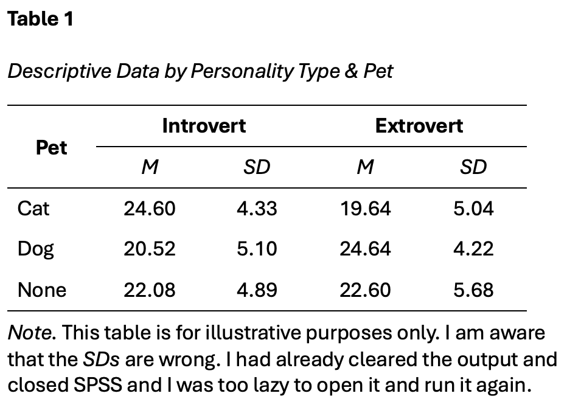

```{r setup, include=FALSE}
options(htmltools.dir.version = FALSE)
```

```{r xaringan-themer, include = FALSE}
library(xaringanthemer)
style_mono_accent(
  base_color = "#18778C",
  header_color = "#000000",
  header_font_google = google_font("Jost"),
  header_font_weight = 500,
  text_font_google = google_font("Jost", "300", "300i", "500", "500i"),
  code_font_google = google_font("Source Code Pro"),
  text_bold_color = '#4CA384',
  text_slide_number_color = '#18778C',
  text_font_size = '16pt'
)
```

```{r, echo = F, message = F, warning = F}
library(tidyverse)
knitr::opts_chunk$set(dev = 'svg')

baseColor <- '#4CA384'
accent1 <- '#9AD079'
accent2 <- '#18778C'
accent3 <- '#19424C'
```

### This Week's Key Topics

+ 

+ MEAN-CENTERING DUE TO INTERACTION TERM - POTENTIAL FOR MULTICOLLINEARITY

+ Probing the interaction


```{r, echo = F}
set.seed(444)
mcDat <- data.frame(x = c(3, 6, 7, 2, 5, 7),
                    z = sample(1:10, size = 6, replace = T))
mcDat$xz = mcDat$x*mcDat$z

mcDat$xMC <- mcDat$x - mean(mcDat$x)

mcDat %>%
  kable(col.names = c('x', 'z', 'xz', 'Mean-centred X')) %>%
  kable_styling()
```
---
### Title

---
### Factorial ANOVA

+ Compares the mean of the dependent variable across multiple levels of multiple independent variable

+ When using factorial ANOVA, you can test for both main effects and interactions

  + When multiple independent variables are included in the model, the **main effects** capture the effect of each independent variable, while holding the other independent variable(s) constant.
  
  + The **interaction** captures the how the effect of one independent variable on the dependent variable *changes* across levels of the other independent variable
  
  + This is also known as **moderation**, as the effect between two variables is being moderated by a third.

---
### Main Effects vs Interactions

<br>

.center[
```{r, echo = F, fig.height=5}
intDat <- data.frame(int=c(rep('int1', 4), rep('int2', 4), rep('int3', 4), 
                           rep('meInt', 4), rep('noint', 4)), 
                     IV1 = rep(c('A', 'A', 'B', 'B'), 5), 
                     IV2 = rep(c('A', 'B', 'A', 'B'), 5), 
                     DV = c(4, 2, 2, 4, 2, 2, 2, 4, 3, 4, 2, 2, 3, 4, 2, 4, 2, 1, 4, 3))

ggplot(intDat[intDat$int=='meInt',], aes(IV1, DV, color = IV2, group = IV2)) + geom_point() + geom_line() +
  scale_color_manual(values = c(baseColor, accent2)) +
  scale_y_continuous(limits = c(0,5), breaks = seq(0, 5, by = 1)) +
  labs(x = 'IV 1', y = 'Dependent Variable', color = 'IV 2') +
  theme(legend.position = 'inside',
        legend.position.inside = c(.85, .8),
        axis.text = element_text(size = 12),
        axis.title = element_text(size = 14, face = 'bold'),
        legend.title = element_text(size = 12, face = 'bold'))
```
]

---
### Main Effects vs Interactions

.center[**Main Effect of IV1**

```{r, echo = F, fig.height=5}

mePlot <- ggplot(intDat[intDat$int=='meInt',], aes(IV1, DV, color = IV2, group = IV2)) + 
  geom_point() + geom_line() +
  scale_color_manual(values = c(baseColor, accent2)) +
  scale_y_continuous(limits = c(0,5), breaks = seq(0, 5, by = 1)) +
  labs(x = 'IV 1', y = 'Dependent Variable', color = 'IV 2') +
  theme(legend.position = 'inside',
        legend.position.inside = c(.85, .8),
        axis.text = element_text(size = 12),
        axis.title = element_text(size = 14, face = 'bold'),
        legend.title = element_text(size = 12, face = 'bold'))

mePlot +
  annotate(geom = 'point', x = 1, y = 3.5, shape = 8, size = 4) +
  annotate(geom = 'point', x = 2, y = 3, shape = 8, size = 4) +
  annotate(geom = 'segment', x = 1, xend = 2, y = 3.5, yend = 3, linetype = 2) +
  annotate(geom = 'text', label = 'Difference between IV1 Groups A & B', x = 1.5, y = 3.52) +
  annotate(geom = 'text', label = 'Mean of IV1 \n Group A', x = .85, y = 3.55) + 
  annotate(geom = 'text', label = 'Mean of IV1 \n Group B', x = 2.2, y = 3) 
  
  
```
]

---
### Main Effects vs Interactions

.center[**Main Effect of IV2**

```{r, echo = F, fig.height=5}

mePlot +
  annotate(geom = 'point', x = 1.5, y = 4, shape = 8, size = 4) +
  annotate(geom = 'point', x = 1.5, y = 2.5, shape = 8, size = 4) +
  annotate(geom = 'segment', x = 1.5, xend = 1.5, y = 2.5, yend = 4, linetype = 2) +
  annotate(geom = 'text', label = 'Difference between \n IV2 Groups A & B', x = 1.74, y = 3.25) +
  annotate(geom = 'text', label = 'Mean of IV2 \n Group A', x = 1.5, y = 4.4) +
  annotate(geom = 'text', label = 'Mean of IV2 \n Group B', x = 1.5, y = 2.1) 
```
]

---
### Main Effects vs Interactions

.center[**Interaction**

```{r, echo = F, fig.height=5}
ggplot(intDat[intDat$int=='meInt',], aes(IV1, DV, color = IV2, group = IV2)) + geom_point() + geom_line() +
  scale_color_manual(values = c(baseColor, accent2)) +
  scale_y_continuous(limits = c(0,5), breaks = seq(0, 5, by = 1)) +
  labs(x = 'IV 1', y = 'Dependent Variable', color = 'IV 2') +
  theme(legend.position = 'inside',
        legend.position.inside = c(.85, .8),
        axis.text = element_text(size = 12),
        axis.title = element_text(size = 14, face = 'bold'),
        legend.title = element_text(size = 12, face = 'bold')) + 
  annotate(geom = 'text', label = 'Difference between \n IV2 Groups at IV1A', x = .75, y = 3.5) +
  annotate(geom = 'text', label = 'Difference between \n IV2 Groups at IV1B', x = 2.25, y = 3) +
  annotate(geom = 'segment', x = 1, xend = 1, y = 3, yend = 4, lty = 2) +
  annotate(geom = 'segment', x = 2, xend = 2, y = 2, yend = 4, lty = 2)
  
```
]

---
### Interaction Visualisations

.pull-left[

.center[**Interaction**]
```{r, echo = F, fig.height=3}
ggplot(intDat[intDat$int=='int1',], aes(IV1, DV, color = IV2, group = IV2)) + geom_point() + geom_line() +
  scale_y_continuous(limits = c(0,5), breaks = seq(0, 5, by = 1)) +
  scale_color_manual(values = c(baseColor, accent2)) +
  labs(x = 'IV 1', y = 'Dependent Variable', color = 'IV 2') +
  theme(legend.position = 'inside',
        legend.position.inside = c(.85, .8),
        axis.text = element_text(size = 12),
        axis.title = element_text(size = 14, face = 'bold'),
        legend.title = element_text(size = 12, face = 'bold'))
```
.center[**Interaction**]
```{r, echo = F, fig.height=3}
ggplot(intDat[intDat$int=='int2',], aes(IV1, DV, color = IV2, group = IV2)) + geom_point() + geom_line() +
  scale_color_manual(values = c(baseColor, accent2)) +
  scale_y_continuous(limits = c(0,5), breaks = seq(0, 5, by = 1)) +
  labs(x = 'IV 1', y = 'Dependent Variable', color = 'IV 2') +
  theme(legend.position = 'inside',
        legend.position.inside = c(.85, .8),
        axis.text = element_text(size = 12),
        axis.title = element_text(size = 14, face = 'bold'),
        legend.title = element_text(size = 12, face = 'bold'))
```

]

.pull-right[

.center[**Interaction**]
```{r, echo = F, fig.height=3}
ggplot(intDat[intDat$int=='int3',], aes(IV1, DV, color = IV2, group = IV2)) + geom_point() + geom_line() +
  scale_color_manual(values = c(baseColor, accent2)) +
  scale_y_continuous(limits = c(0,5), breaks = seq(0, 5, by = 1)) +
  labs(x = 'IV 1', y = 'Dependent Variable', color = 'IV 2') +
  theme(legend.position = 'inside',
        legend.position.inside = c(.85, .8),
        axis.text = element_text(size = 12),
        axis.title = element_text(size = 14, face = 'bold'),
        legend.title = element_text(size = 12, face = 'bold'))
```
.center[**No Interaction**]
```{r, echo = F, fig.height=3}
ggplot(intDat[intDat$int=='noint',], aes(IV1, DV, color = IV2, group = IV2)) + geom_point() + geom_line() +
  scale_color_manual(values = c(baseColor, accent2)) +
  scale_y_continuous(limits = c(0,5), breaks = seq(0, 5, by = 1)) +
  labs(x = 'IV 1', y = 'Dependent Variable', color = 'IV 2') +
  theme(legend.position = 'inside',
        legend.position.inside = c(.85, .8),
        axis.text = element_text(size = 12),
        axis.title = element_text(size = 14, face = 'bold'),
        legend.title = element_text(size = 12, face = 'bold'))
```
]

---
### Interpreting Effects

+ Take caution when interpreting main effects in the presence of an interaction. 

.pull-left[

```{r, echo = F, fig.height=4.5}

meDat <- data.frame(Style = rep(c('Alone', 'Alone', 'With Partner', 'With Partner'),2),
                    Method = rep(c('Reading', 'Testing', 'Reading', 'Testing'),2),
                    Score = c(60, 60, 60, 70, 60, 65, 60, 75))

meDat$Method <- factor(meDat$Method, levels = c('Testing', 'Reading'))


ggplot(meDat[1:4,], aes(Style, Score, color = Method, group = Method)) + geom_point() + geom_line() +
  scale_y_continuous(limits = c(50, 80)) +
  scale_color_manual(values = c(baseColor, accent2)) +
  labs(x = 'Style', y = 'Score', color = 'Study Method') +
  theme(legend.position = 'inside',
        legend.position.inside = c(.85, .8),
        axis.text = element_text(size = 12),
        axis.title = element_text(size = 14, face = 'bold'),
        legend.title = element_text(size = 12, face = 'bold'))

```

]

---
### Interpreting Effects

+ Take caution when interpreting main effects in the presence of an interaction. 

.pull-left[

```{r, echo = F, fig.height=4.5}

ggplot(meDat[1:4,], aes(Style, Score, color = Method, group = Method)) + 
  geom_point() + geom_line() +
  scale_y_continuous(limits = c(50, 80)) +
  scale_color_manual(values = c(baseColor, accent2)) +
  labs(x = 'Style', y = 'Score', color = 'Study Method') +
  theme(legend.position = 'inside',
        legend.position.inside = c(.85, .8),
        axis.text = element_text(size = 12),
        axis.title = element_text(size = 14, face = 'bold'),
        legend.title = element_text(size = 12, face = 'bold')) +
  annotate(geom = 'segment', x = 1.5, xend = 1.5, y = 60, yend = 65, linetype = 2) +
  annotate(geom = 'point', x = 1.5, y = 65, shape = 8, size = 4, color = baseColor) +
  annotate(geom = 'point', x = 1.5, y = 60, shape = 8, size = 4, color = accent2) +
  annotate(geom = 'text', label = 'Mean Score of Testing Group', x = 1.95, y = 65, color = baseColor) +
  annotate(geom = 'text', label = 'Mean Score of Reading Group', x = 1.95, y = 59, color = accent2) +
  annotate(geom = 'text', label = 'Main effect of method only due to differences in the partner condition',
           x = 1.5, y = 55)

```
.center[**Main Effect Explained by Interaction**]
]

--

.pull-right[

```{r, echo = F, fig.height=4.5}
ggplot(meDat[5:8,], aes(Style, Score, color = Method, group = Method)) + geom_point() + geom_line() +
  scale_y_continuous(limits = c(50, 80)) +
  scale_color_manual(values = c(baseColor, accent2)) +
  labs(x = 'Style', y = 'Score', color = 'Study Method') +
  theme(legend.position = 'inside',
        legend.position.inside = c(.85, .8),
        axis.text = element_text(size = 12),
        axis.title = element_text(size = 14, face = 'bold'),
        legend.title = element_text(size = 12, face = 'bold')) +
  annotate(geom = 'segment', x = 1.5, xend = 1.5, y = 60, yend = 70, linetype = 2) +
  annotate(geom = 'point', x = 1.5, y = 70, shape = 8, size = 4, color = baseColor) +
  annotate(geom = 'point', x = 1.5, y = 60, shape = 8, size = 4, color = accent2) +
  annotate(geom = 'text', label = 'Mean Score of Testing Group', x = 1.95, y = 70, color = baseColor) +
  annotate(geom = 'text', label = 'Mean Score of Reading Group', x = 1.95, y = 59, color = accent2) +
  annotate(geom = 'text', label = 'Main effect of method across all style conditions',
           x = 1.5, y = 55)
```
.center[**Valid Main Effect AND Interaction**]

]

---
class: inverse, middle, center

## Questions?

---
### Hypotheses

+ Because we have multiple independent variables, we often have multiple hypotheses.

  + Hypotheses about main effects
  
  + Hypothesis about interaction

+ A key consideration when working with tests that produce multiple results is to be sure your research aims and hypotheses align with what your focus in the results and discussion. 

---
### Example Scenario

.pull-left[
+ A researcher is interested in how pet ownership and personality affect subjective well-being.

+ They collect the following data from participants:
  + Type of pet (dog/cat/other/none)
  + Personality type (introvert/extrovert)
  + Subjective well-being
]

.pull-right[

```{r, echo = F, fig.height=3.5}
facDat <- read.csv('https://mtruelovehill.github.io/PRM/Data/petDat.csv')

ggplot(facDat, aes(Pet, SWB, fill = Personality)) + geom_boxplot() +
  scale_y_continuous(limits = c(0, 40), breaks = seq(0, 40, 10)) +
  scale_fill_manual(values = c(baseColor, accent1)) +
  theme(axis.text = element_text(size = 12),
        axis.title = element_text(size = 14, face = 'bold'),
        legend.position = 'inside',
        legend.position.inside = c(.35, .2))

```


]

--

+ There 3 possible research questions that could be tested:

  + Is there an effect of pet ownership on subjective well-being?
  
  + Is there an effect of personality type (introvert vs extrovert) on subjective well being?
  
  + Does the effect of pet ownership on subjective well-being change across personality types?

** Test Your Understanding:** Which of the above questions reference a main effect and which reference an interaction?

---
### The Logic Behind Factorial ANOVA

+ Recall from last week that ANOVAs evaluate two features in our data:

  + Variance in the dependent variable explained by the independent variable ( $SS_{model}$)
  
  + Variance in the dependent variable *not* explained by the independent variable ( $SS_{residual}$)

--

+ With a Factorial ANOVA, the only difference is that the variance explained by the IV is broken down depending on the number of Independent Variables:

.center[
```{r, echo = F, out.width='75%'}
knitr::include_graphics('images/factorialSS.png')
```
]

### The Logic Behind Factorial ANOVA

+ Recall from last week that ANOVAs evaluate two features in our data:

  + Variance in the dependent variable explained by the independent variable ( $SS_{model}$)
  
  + Variance in the dependent variable *not* explained by the independent variable ( $SS_{residual}$)

--

+ With a Factorial ANOVA, the only difference is that the variance explained by the IV is broken down depending on the number of Independent Variables:

.center[
```{r, echo = F, out.width='75%'}
knitr::include_graphics('images/factorialSS.png')
```
]

---
### The Logic Behind Factorial ANOVA

.pull-left[
Recall from last week that $SS_{model}$ is calculated as the distance between the means of each group and the grand mean. 

When there is one IV with 3 groups, this distance is computed between the grand mean and each individual within each of the groups:

```{r, echo = F, fig.height=4, warning = F}
set.seed(526)
dat <- data.frame(IV = c(rep('Group A', 4), rep('Group B', 4), rep('Group C', 4)),
                  DV = c(rnorm(4, mean = 15, sd = 3), rnorm(4, mean = 18, sd = 3), rnorm(4, mean = 12, sd = 3)),
                  ID = 1:12)


basePlot <- ggplot(dat, aes(ID, DV)) + geom_point() +
    labs(x = 'Participant', y = 'Dependent Variable') +
  scale_x_continuous(breaks = seq(1, 12, 1)) + 
    geom_hline(yintercept = mean(dat$DV), linewidth = 1) +
    theme(axis.text = element_text(size = 8),
          axis.title = element_text(size = 8, face = 'bold'))

plotDat <- data.frame(y = c(mean(dat$DV[dat$IV=='Group A']), mean(dat$DV[dat$IV=='Group B']), mean(dat$DV[dat$IV=='Group C'])))

basePlot + geom_point(data = dat, aes(color = IV)) +
  scale_color_manual(values = c(baseColor, accent1, accent2)) +
  geom_segment(aes(x = 1, y = plotDat$y[1], xend = 4, yend = plotDat$y[1]),
               col = baseColor, linewidth = 1) +
  geom_segment(aes(x = 5, y = plotDat$y[2], xend = 8, yend = plotDat$y[2]),
               col = accent1, linewidth = 1) +
  geom_segment(aes(x = 9, y = plotDat$y[3], xend = 12, yend = plotDat$y[3]),
               col = accent2, linewidth = 1) +
  geom_segment(aes(x = ID, y = mean(DV), xend = ID, yend = c(rep(plotDat$y[1], 4), rep(plotDat$y[2], 4), rep(plotDat$y[3], 4)), color = dat$IV), lty = 2, linewidth = 1) +
  theme(legend.position = 'inside',
        legend.position.inside = c(.85, .78),
        legend.text = element_text(size = 8),
        legend.title = element_blank())
```

]

--

.pull-right[
When there are multiple IVs, $SS_{model}$ is still calculated as the distance between the means of each group and the grand mean. 

With 2 IVs (one with 2 levels and one with 3), there are 6 possible groups, so $SS_{model}$ is computed from these:

```{r, echo = F, fig.height=4.5, warning = F}
sampDat <- read.csv('https://mtruelovehill.github.io/PRM/Data/petSampleDat.csv')
sampDat$Group <- paste(sampDat$Pet, sampDat$Personality, sep = '/')
sampDat$ID <- 1:nrow(sampDat)
sampDat$Group <- factor(sampDat$Group, levels = c('Cat/Introvert', 'Cat/Extrovert', 'Dog/Introvert', 'Dog/Extrovert', 'None/Introvert', 'None/Extrovert'))

plotDat <- as.data.frame(sampDat %>%
  group_by(Group) %>%
  summarise(meanSWB = mean(SWB)))

(ssMod <- ggplot(sampDat, aes(ID, SWB, color = Group)) + geom_point() +
  scale_color_manual(values = c('#40B6AD', baseColor, accent1, accent2, accent3, 'gray40')) +
  scale_x_continuous(breaks = seq(1, 18, 1)) +
   scale_y_continuous(limits = c(10, 35), breaks = seq(10, 35, 5)) + 
  geom_hline(yintercept = mean(sampDat$SWB), linewidth = 1) +
  geom_segment(aes(x = 1, y = plotDat$meanSWB[1], xend = 3, yend = plotDat$meanSWB[1]),
               col = '#40B6AD', linewidth = 1) + 
  geom_segment(aes(x = 4, y = plotDat$meanSWB[2], xend = 6, yend = plotDat$meanSWB[2]),
               col = baseColor, linewidth = 1) +
  geom_segment(aes(x = 7, y = plotDat$meanSWB[3], xend = 9, yend = plotDat$meanSWB[3]),
               col = accent1, linewidth = 1) +
  geom_segment(aes(x = 10, y = plotDat$meanSWB[4], xend = 12, yend = plotDat$meanSWB[4]),
               col = accent2, linewidth = 1) +
  geom_segment(aes(x = 13, y = plotDat$meanSWB[5], xend = 15, yend = plotDat$meanSWB[5]),
               col = accent3, linewidth = 1) +
  geom_segment(aes(x = 16, y = plotDat$meanSWB[6], xend = 18, yend = plotDat$meanSWB[6]),
               col = 'gray40', linewidth = 1) +
  geom_segment(x = sampDat$ID, y = mean(sampDat$SWB), xend = sampDat$ID, yend = sampDat$GroupMean, lty = 2, linewidth = 1) + 
  theme(legend.position = 'top',
        axis.title = element_text(face = 'bold')))

```

]

---
### The Logic Behind Factorial ANOVA

.pull-left.center[

$SS_{IV1}$: Main Effect of Pet

```{r, echo = F, fig.height=4.5, warning = F}

(petSS <- ggplot(sampDat, aes(ID, SWB, color = Pet)) + geom_point() +
  scale_color_manual(values = c(baseColor, accent1, accent2)) +
  scale_x_continuous(breaks = seq(1, 18, 1)) +
   scale_y_continuous(limits = c(10, 35), breaks = seq(10, 35, 5)) +
  geom_hline(yintercept = mean(sampDat$SWB), linewidth = 1) +
  geom_segment(x = 1, y = sampDat$PetMean[1], xend = 6, yend = sampDat$PetMean[1],
               col = baseColor, linewidth = 1) +
  geom_segment(x = 7, y = sampDat$PetMean[7], xend = 12, yend = sampDat$PetMean[7],
               col = accent1, linewidth = 1) +
  geom_segment(x = 13, y = sampDat$PetMean[13], xend = 18, yend = sampDat$PetMean[13],
               col = accent2, linewidth = 1) +
  geom_segment(x = sampDat$ID, y = mean(sampDat$SWB), xend = sampDat$ID, yend = sampDat$PetMean, lty = 2, linewidth = 1) + 
  theme(legend.position = 'inside',
        legend.position.inside = c(.9, .2),
        axis.title = element_text(face = 'bold')))

```
]

--

.pull-right.center[

$SS_{IV2}$: Main Effect of Personality

```{r, echo = F, fig.height=4.5, warning = F}

(persSS <- ggplot(sampDat, aes(PersID, SWB, color = Personality)) + geom_point() +
  scale_color_manual(values = c(accent1, baseColor)) +
  scale_x_continuous(breaks = seq(1, 18, 1)) +
   scale_y_continuous(limits = c(10, 35), breaks = seq(10, 35, 5)) + 
  labs(x = 'ID') +
  geom_hline(yintercept = mean(sampDat$SWB), linewidth = 1) +
  geom_segment(x = 1, y = sampDat$PersMean[1], xend = 9, yend = sampDat$PersMean[1],
               col = baseColor, linewidth = 1) +
  geom_segment(x = 10, y = sampDat$PersMean[4], xend = 18, yend = sampDat$PersMean[4],
               col = accent1, linewidth = 1) + 
  geom_segment(x = sampDat$ID, y = mean(sampDat$SWB), xend = sampDat$ID, yend = sampDat$PersMean, lty = 2, linewidth = 1) + 
  theme(legend.position = 'inside',
        legend.position.inside = c(.9, .2),
        axis.title = element_text(face = 'bold')))

```
]

---


.pull-left[

```{r, echo = F, warning = F, fig.height=4, fig.width = 5}
ssMod + theme(legend.position = 'none') +
  annotate(geom = 'text', label = 'SS Model (Variance in DV explained by IVs)', x = 9, y = 32)
```
$$SS_{model} = SS_{IV1} + SS_{IV2} + SS_{IV1\times IV2}$$

]

--

.pull-right[

```{r, echo = F, fig.height=3, fig.width = 5}
petSS + theme(legend.position = 'none') +
  annotate(geom = 'text', label = 'SS IV1 (Variance in DV explained by Pet)', x = 9, y = 32)
```

```{r, echo = F, fig.height=3, fig.width = 5}
persSS + theme(legend.position = 'none') +
  annotate(geom = 'text', label = 'SS IV2 (Variance in DV explained by Personality)', x = 9, y = 32)
```

]

---
### Simple Effects Analysis

.pull-left[
+ While interaction plots help with interpretation, they don't show which differences across levels are significant.

+ Simple effects analysis tests the effect of one independent variable at individual levels of the other(s)
]

.pull-right[

```{r, echo = F}
ggplot(facDat, aes(Pet, SWB, fill = Personality)) + geom_boxplot() +
  scale_y_continuous(limits = c(0, 40), breaks = seq(0, 40, 10)) +
  scale_fill_manual(values = c(baseColor, accent1)) +
  theme(axis.text = element_text(size = 12),
        axis.title = element_text(size = 14, face = 'bold'),
        legend.position = 'inside',
        legend.position.inside = c(.35, .2))
```


]

---
class: center, inverse, middle

### Questions?

---

### Conducting a Factorial ANOVA

1. State your hypothesis

2. Conduct a power analysis

3. Check your data (visualisations/descriptives)

4. Check assumptions

5. Run the test

6. Calculate the effect size/confidence intervals

7. Interpret results

8. Report

---
### Running a Factorial ANOVA

**Step 1: State Your Hypotheses**

+ 3 hypotheses (2 main effects and 1 interaction):

  + RQ1 - Does pet ownership affect subjective well-being?
      + $H_1$ Pet ownership has an effect on subjective well-being
  
  + RQ2 - Is there an effect of personality type on subjective well being?
      + $H_1$ Personality type has an effect on subjective well-being
    
  + RQ3 - Does the effect of pet ownership on subjective well-being change across personality types?
      + $H_1$ The effect of pet ownership on subjective well-being is different across personality types.


---
### Running a Factorial ANOVA

+ Main Effects Hypotheses:
  
  + Main Effect of Pet:
      + $H_0: \mu_{cat} = \mu_{dog} = \mu_{none}$
      + $H_1:$ at least one $\mu$ is different from the other $\mu$s
    
  + Main Effect of Personality:
      + $H_0: \mu_{introvert} = \mu_{extrovert}$
      + $H_1: \mu_{introvert} \neq \mu_{extrovert}$
    
+ Interaction Effect:
  $C = (\mu_{introvert}\times\mu_{cat}-\mu_{introvert}\times\mu_{dog}-\mu_{introvert}\times\mu_{none}) - (\mu_{extrovert}\times\mu_{cat}-\mu_{extrovert}\times\mu_{dog}-\mu_{extrovert}\times\mu_{none})$
      + $H_0: C = 0$
      + $H_1: C \neq 0$


---
### Running a Factorial ANOVA

**Step 2: Conduct a Power Analysis**

+ [WebPower](https://webpower.psychstat.org/wiki/models/index)

+ Let's run a **sensitivity power analysis**

  + These are useful when working with secondary data, where you already have a pre-existing dataset
  
  + Here, you calculate the effect size you can detect with a given sample.
  
  + Our dataset has 150 participants. Check the effect size we have 80% power to detect, given $\alpha$ = .05.

+ Remember, Webpower computes the effect size $f$. We'll need to convert it back to $\eta^2$ using the following formula:

$$\eta^2 = \frac{f^2}{1+f^2}$$

---
### Running a Factorial ANOVA

**Step 3: Check your data**

+ Compute descriptive statistics

+ Look at relevant plots
  
--

+ Open [these data](https://mtruelovehill.github.io/PRM/Data/petDat.sav) in SPSS.


---
### Running a Factorial ANOVA

**Step 4: Check Assumptions**

+ **Normality:** Residuals should be normally distributed

--

  + What are residuals, and why should they be normally distributed?
  
--

.center[
```{r, echo = F, warning = F, fig.height=4}
ggplot(sampDat, aes(ID, SWB, color = Group)) + geom_point() +
  scale_color_manual(values = c('#40B6AD', baseColor, accent1, accent2, accent3, 'gray40')) +
  scale_x_continuous(breaks = seq(1, 18, 1)) +
   scale_y_continuous(limits = c(10, 35), breaks = seq(10, 35, 5)) + 
  geom_hline(yintercept = mean(sampDat$SWB), linewidth = 1) + 
  geom_segment(aes(x = 1, y = plotDat$meanSWB[1], xend = 3, yend = plotDat$meanSWB[1]),
               col = '#40B6AD', linewidth = 1) + 
  geom_segment(aes(x = 4, y = plotDat$meanSWB[2], xend = 6, yend = plotDat$meanSWB[2]),
               col = baseColor, linewidth = 1) +
  geom_segment(aes(x = 7, y = plotDat$meanSWB[3], xend = 9, yend = plotDat$meanSWB[3]),
               col = accent1, linewidth = 1) +
  geom_segment(aes(x = 10, y = plotDat$meanSWB[4], xend = 12, yend = plotDat$meanSWB[4]),
               col = accent2, linewidth = 1) +
  geom_segment(aes(x = 13, y = plotDat$meanSWB[5], xend = 15, yend = plotDat$meanSWB[5]),
               col = accent3, linewidth = 1) +
  geom_segment(aes(x = 16, y = plotDat$meanSWB[6], xend = 18, yend = plotDat$meanSWB[6]),
               col = 'gray40', linewidth = 1) +
  geom_segment(x = sampDat$ID, y = sampDat$SWB, xend = sampDat$ID, yend = sampDat$GroupMean, lty = 2, linewidth = 1) + 
  theme(legend.position = 'top',
        axis.title = element_text(face = 'bold'))
```
]


---
### Running a Factorial ANOVA

**Step 4: Check Assumptions**

+ **Normality:** Residuals should be normally distributed
    + Have a look at the histograms & QQ-plots
  
+ **Independence:** Observations/individuals should be sampled independently
    + Consider study design
  
+ **Homogeneity of Variance:** Equal variance between each group/category
    + Check the results of Levene's Test for between-subjects variables
    + Check for sphericity using Mauchly's test for within-subjects variables with > 2 levels


---
### Running a Factorial ANOVA

**Step 5: Run the test**

**Step 6: Calculate the effect size**

**Step 7: Interpret results**

Let's continue in SPSS...


---
### Running a Factorial ANOVA

**Step 8: Report**

We conducted a **2x3 Factorial ANOVA** to determine the effect of <span style = "color:#9AD079"> <b> personality (levels: introversion; extroversion) </span></b> and <span style = "color:#9AD079"> <b> pet ownership (levels: cat; dog; none) </span></b> on <span style = "color:#9AD079"> <b> subjective well-being </span></b>. The $\alpha$ threshold was set at .05 for all analyses. A sensitivity power analysis indicated that 150 participants were sufficient to detect an effect of $\eta^2$ = .06 with a power of 80% and an $\alpha$ threshold of .05.

Pet ownership did not significantly affect subjective well-being, <span style = "color:#18778C"><b> $F$(2, 144) = 0.10, $p$ = .908, $\eta^2$ = .001 </span></b>. Additionally, personality was not associated with subjective well-being, <span style = "color:#18778C"><b> $F$(1, 144) = 0.02, $p$ = .901, $\eta^2$ < .001 </span></b>. 

---
### Running a Factorial ANOVA

**Step 8: Report**

There was a significant interaction of pet ownership and personality on subjective well-being, <span style = "color:#18778C"><b> $F$(2, 144) = 9.57, $p$ < .001, $\eta^2$ = .12 </span></b>. Simple effects analysis there was a significant difference in the effect of pet ownership on subjective well-being, depending on personality type. These effects were only observed in those who owned dogs, $F$(1, 144) = 7.77, $p$ = .006, $\eta^2$ = .05, and those who owned cats, $F$(1, 144) = 11.26, $p$ = .001, $\eta^2$ = .07. There was no significant effect of personality type in those who did not own a pet,  $F$(1, 144) = 0.12, $p$ = .726, $\eta^2$ = .001. Specifically, introverts who owned cats reported significantly higher levels of subjective well-being than extroverts who owned cats, $p$ = .001. Conversely, extroverts who owned dogs reported significantly higher levels of subjective well-being than introverts who owned dogs, $p$ = .006. Additionally, extroverted dog owners reported higher levels of subjective well-being than extroverted cat owners, $p$ = .003, while introverted cat owners reported higher levels of subjective well-being than introverted dog owners, $p$ = .020.

See Table 1 for descriptive data by group.

---
### Running a Factorial ANOVA

**Step 8: Report**

.center[
```{r, echo = F, out.width='50%'}

```
]


---
class: center, inverse, middle

## Questions?

---

.center[
```{r, echo = F, out.width='50%'}
knitr::include_graphics('https://mtruelovehill.github.io/PRM/Lectures/images/midsemesterfeedback.png')
```
]


