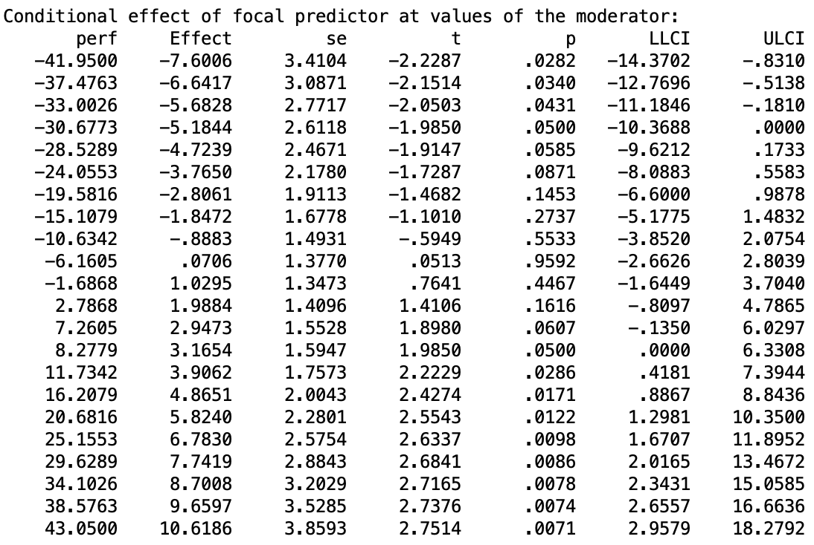
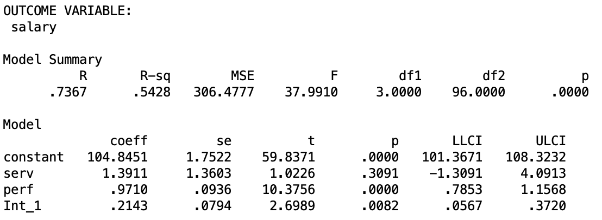
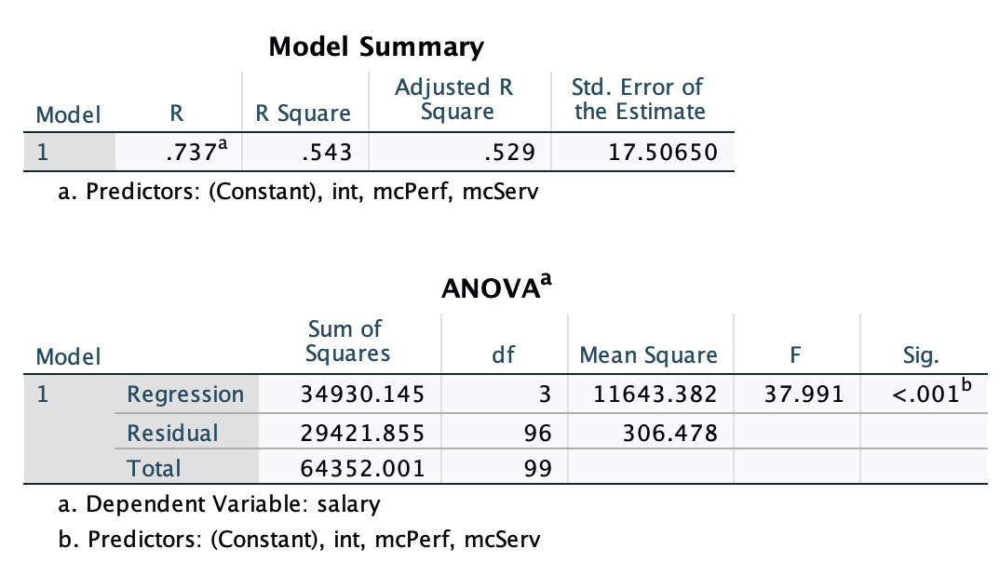
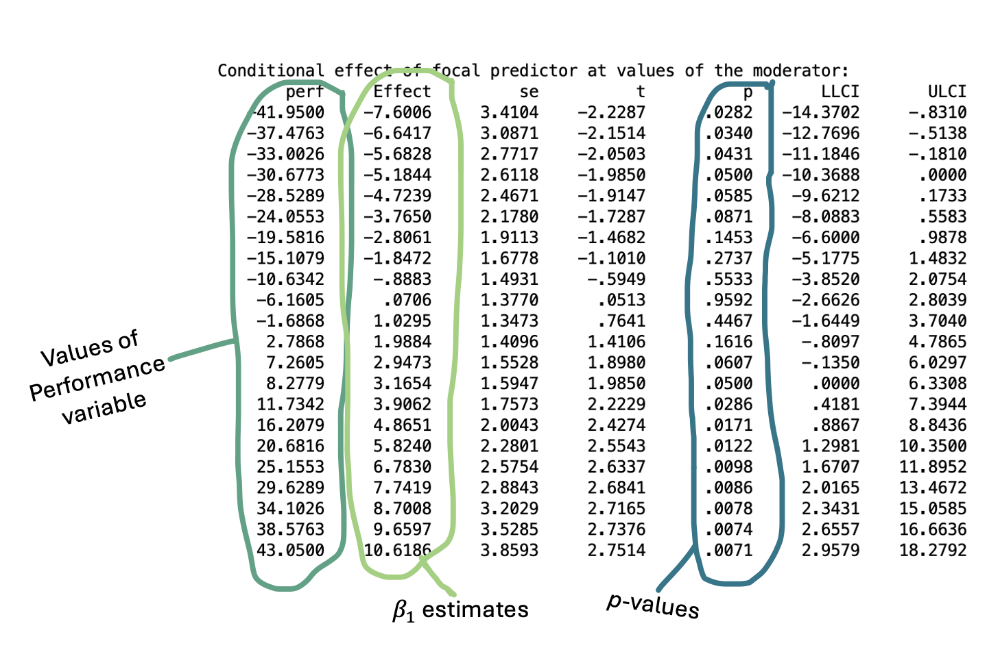
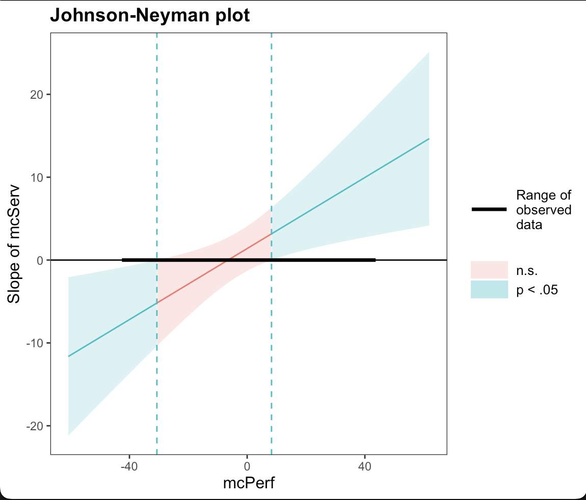

```{r setup, include=FALSE}
options(htmltools.dir.version = FALSE)
```

```{r xaringan-themer, include = FALSE}
library(xaringanthemer)
style_mono_accent(
  base_color = "#18778C",
  header_color = "#000000",
  header_font_google = google_font("Jost"),
  header_font_weight = 500,
  text_font_google = google_font("Jost", "300", "300i", "500", "500i"),
  code_font_google = google_font("Source Code Pro"),
  text_bold_color = '#4CA384',
  text_slide_number_color = '#18778C',
  text_font_size = '16pt'
)
```

```{r, echo = F, message = F, warning = F}
library(tidyverse)
library(kableExtra)

knitr::opts_chunk$set(dev = 'svg')

baseColor <- '#4CA384'
accent1 <- '#9AD079'
accent2 <- '#18778C'
accent3 <- '#19424C'
```

### This Week's Key Topics

+ Interactions between two continuous variables

+ Simple slopes analysis

+ Centering variables

+ Using PROCESS in SPSS


---
### Interactions

+ Recall that an **interaction** occurs when the effects of one predictor/IV on the outcome/DV change across levels of a second predictor/IV. 

+ We have already investigated categorical $\times$ continuous interactions

+ We'll expand this to continuous $\times$ continuous interactions:

  + The slope of the model line between a continuous predictor and the outcome changes as the values of a second continuous predictor change.

  + i.e., the association between predictor 1 and the outcome variable changes depending on the value of predictor 2. 
  
  + May also be referred to as **moderation**

---
### Expanding on Multiple Linear Regression

Recall the linear regression equation from last week:

$$y_i = \beta_0 + \beta_1x_i + \epsilon_i$$
Where:

.pull-left[
$y_i$: an individual's score on the outcome variable

$x_i$: an individual's score on predictor $x$

$\epsilon_i$: an individual's residual
]

.pull-right[
$\beta_0$: the model's intercept

$\beta_1:$ the model's slope
]


---
### Expanding on Multiple Linear Regression

We can expand this further to include multiple variables:

$$y_i = \beta_0 + \beta_1x_i + \beta_2z_i + \epsilon_i$$

Where:

.pull-left[

$y_i$: an individual's score on the outcome variable

$x_i$: an individual's score on predictor $x$

$z_i$: an individual's score on predictor $z$

$\epsilon_i$: an individual's residual

]

.pull-right[
$\beta_0$: the model's intercept

$\beta_1:$ the slope associated with $x$

$\beta_2:$ the slope associated with $z$
]


---

### Expanding on Multiple Linear Regression

We can expand even further to include the interaction between these variables:

$$y_i = \beta_0 + \beta_1x_i + \beta_2z_i + \beta_3\color{#4CA384}{xz_i} + \epsilon_i$$

Where:

.pull-left[

$y_i$: an individual's score on the outcome variable

$x_i$: an individual's score on predictor $x$

$z_i$: an individual's score on predictor $z$

$xz_i$: an individual's interaction term for $x$ and $z$

$\epsilon_i$: an individual's residual

]

.pull-right[

$\beta_0$: the model's intercept

$\beta_1:$ the slope associated with $x$

$\beta_2:$ the slope associated with $z$

$\beta_3:$ the slope associated with the interaction

]

---
### Effects in Linear Regression Models

+ **Main Effect:** the effect of predictors $x$ on the outcome variable when the others predictors are held constant

+ When an interaction is present, the effect of predictor $x$ changes as $z$ changes, so we no longer interpret $\beta_x$ in this way.

+ When we include an interaction in the model, these effects are now considered **marginal** or **conditional** effects rather than main effects as they are conditional upon the value of the other predictors. 

  + This is only true of the variables involved in the interaction.

  + The $\beta$ values associated with other predictors still reflect main effects.


---
### Effects in Linear Regression Models

+ Consider the following equation:

$$y_i = \beta_0 + \beta_1x_i + \beta_2z_i + \beta_4a_i + \beta_5c_i + \beta_6xz_i + \epsilon_i$$
> **Test Your Understanding:**

> + Which $\beta$ values reflect a **main effect**?

--

> + Which $\beta$ values reflect a **marginal effect**?

--

> + Which $\beta$ values reflect an **interaction**?


---
### Interpreting Continuous $\times$ Continuous Interactions

$$y_i = \beta_0 + \beta_1x_i + \beta_2z_i + \beta_3xz_i + \epsilon_i$$
+ $\beta_0$/Intercept: value of $y$ when both $x$ and $z$ are equal to 0

+ $\beta_1$: Effect of $x$ on $y$ when $z$ is equal to 0.

+ $\beta_2$: Effect of $z$ on $y$ when $x$ is equal to 0.

+ $\beta_3$: Change in slope of $x$ on $y$ across values of $z$ (and vice versa).

---
class: center, inverse, middle

## Questions?

---
### Interactions & Multicollinearity

+ Recall that when predictors are highly correlated, it is difficult for the model to tease apart their individual effects. 

+ Can you see any variables that may be correlated in the interaction equation?

$$y_i = \beta_0 + \beta_1x_i + \beta_2z_i + \beta_3xz_i + \epsilon_i$$

--

+ As the interaction term is calculated by multiplying variables $x$ and $z$, it will almost certainly be highly correlated with each of these predictors

+ We can address this issue by **mean-centering** our predictors


---
### Mean-Centering

.pull-left[
+ When data are mean-centered, the mean of each predictor is subtracted from each observation of that predictor.

  + $x_i - \bar{x}$

+ In this way, the mean of the mean-centered predictor is equal to 0.
  + Values higher than 0 reflect observations that are greater than the mean
  + Values lower than 0 reflect observations that are less than the mean
]

--

.pull-right[
Consider this example, where $\bar{x} = 5$:
```{r, echo = F}
set.seed(444)
mcDat <- data.frame(x = c(3, 6, 7, 2, 5, 7),
                    z = sample(1:10, size = 6, replace = T))
mcDat$xz = mcDat$x*mcDat$z

mcDat$xMC <- mcDat$x - mean(mcDat$x)
mcDat$zMC <- round(mcDat$z - mean(mcDat$z),2)
mcDat$xzMC <- round(mcDat$xMC*mcDat$zMC,2)

mcDat[,c('x', 'xMC')] %>%
  kable(col.names = c('x', 'x MC')) %>%
  kable_styling()
```
]


---
### Why does this affect collinearity?

+ Introducing negative data into $x$ and $z$ has an effect on the computed interaction terms.

+ When both values were positive, the product of $x$ and $z$ directly scaled with how large the predictor values were

  + Smaller predictor values led to smaller products, larger predictor values led to larger products

+ When negative values are introduced, if *both* $x$ and $z$ are negative or positive, it will produce a positive product. If one is negative, it will produce a negative product.

+ This reduces/removes the correlation between the predictors and the interaction term.


---
### Why does this affect collinearity?

.pull-left.center[

```{r, echo = F}
mcDat[,c('x', 'z', 'xz' )] %>%
  kable(align = 'c') %>%
  kable_styling()
```

$r_{x,\ xz} = `r round(cor(mcDat$x, mcDat$xz), 2)`$

$r_{z,\ xz} = `r round(cor(mcDat$z, mcDat$xz), 2)`$
]


.pull-right.center[

```{r, echo = F}

mcDat[,c('xMC', 'zMC', 'xzMC' )] %>%
  kable(align = 'c') %>%
  kable_styling()
```

$r_{xMC,\ xzMC} = `r round(cor(mcDat$xMC, mcDat$xzMC), 2)`$

$r_{zMC,\ xzMC} = `r round(cor(mcDat$zMC, mcDat$xzMC), 2)`$
]


---
### Does mean-centering affect our interpretation?

+ Mean-centering sets the means of our predictors to 0.

+ The intercept of our model ( $\beta_0$) reflects the value of $y$ when all predictors are equal to 0.

+ The $\beta$ of a predictor involved in an interaction reflects the effect of that predictor on the outcome when the other predictor is equal to 0.

+ The $\beta$ of a predictor uninvolved in an interaction reflects the effect of that predictor on the outcome when the other predictors are held constant.


--

> **Test Your Understanding:** When all predictors are mean-centered:

--

> How is the intercept interpreted?

--

> How is the $\beta$ of a predictor involved in an interaction interpreted?

--

> How is the $\beta$ of a predictor uninvolved in an interaction interpreted?


---
class: center, inverse, middle

## Questions?

---

### Breaking Down a Continuous $\times$ Continuous Interaction

+ Breaking down a categorical $\times$ categorical interaction was relatively straightforward

  + We simply checked the association between the predictors and the outcome at all possible level combinations.

+ Breaking down a continuous $\times$ continuous interaction is a bit more complicated; there are infinite level combinations!

+ To investigate these interactions further, we use **simple slopes analysis**.

---

### Simple Slopes Analysis

.pull-left[
+ A significant interaction effect suggests that $\beta_x$ differs at varying levels of $z$ 

+ Simple slopes analysis allows us to check whether this is the case.

+ With simple slopes analysis, we select certain points on $z$ at which we investigate the relationship between $x$ and $y$.

+ Commonly, the association between $x$ and $y$ is investigated at:
  + $\bar{z} + 1\ SD_z$
  + $\bar{z}$
  + $\bar{z} - 1\ SD_z$
  
]

--

.pull-right.center[

$\bar{z} = 100$

$SD_z = 15$

```{r, echo = F, fig.height=5}
ggplot() + 
  scale_y_continuous(limits = c(-2, 6), breaks = seq(-2, 6, 1)) +
  scale_x_continuous(limits = c(0, 5)) + 
  labs(x = 'X', y = 'Y') +
  geom_abline(slope = 1, intercept = 0, color = baseColor, linewidth = 1) +
  geom_abline(slope = .5, intercept = 0, color = accent1, linewidth = 1) +
  geom_abline(slope = 0, intercept = 0, color = accent2, linewidth = 1) +
  annotate(geom = 'text', label = 'Z = 85', x = 4.5, y = 0.25, color = accent2, size = 5) +
  annotate(geom = 'text', label = 'Z = 100', x = 4.5, y = 2.75, color = accent1, size = 5) +
  annotate(geom = 'text', label = 'Z = 115', x = 4.5, y = 5, color = baseColor, size = 5) +
  theme(axis.text = element_blank(),
        axis.ticks = element_blank(),
        axis.title = element_text(size = 16, face = 'bold'))
```

]

---

### Simple Slopes Analysis using PROCESS macro

.pull-left[
+ Simple Slopes analysis in SPSS is a complicated process, but it's much more straightforward if you use PROCESS.

+ This is an installable add-on to SPSS that can be used for both moderation and mediation models.

]


---
count: false

### Simple Slopes Analysis using PROCESS macro

.pull-left[
+ Simple Slopes analysis in SPSS is a complicated process, but it's much more straightforward if you use PROCESS.

+ This is an installable add-on to SPSS that can be used for both moderation and mediation models.

+ By default, it outputs the relationship between $x$ and $y$ at multiple levels of $z$, so you can see exactly where this relationship becomes significant.

+ To download, please [click this link](https://processmacro.org/download.html)

]

.pull-right[

```{r, echo = F}

```


]

---
class: inverse, middle, center

## Questions?

---
## Using PROCESS macro

+ To illustrate the use of PROCESS, we'll use [this dataset]('https://mtruelovehill.github.io/PRM/Data/salaryDat.sav')

+ Key Variables:
  + `serv`: years of service at current place of employment
  + `perf`: most recent performance ratings
  + `salary`: current salary in thousands of pounds

+ Research Question:
 'Does the effect of years of service on salary differ based on job performance?'

+ Model:

$$Salary_i = \beta_0 + \beta_1Service_i\ + \beta_2Performance_i\ + \beta_3Service_i\times Performance_i + \epsilon_i$$

---
## Using PROCESS macro

+ **Step 1:** Add PROCESS to SPSS (once this is done, it will always be available)
  
+ **Step 2:** Open your data

+ **Step 3:** Navigate to *Analyze > Regression > PROCESS v4.2 by Andrew F. Hayes*

+ **Step 4:** Set up your model & run it

+ Assuming you've already downloaded PROCESS macro from [this link](https://processmacro.org/download.html), let's continue in SPSS


---
## Using PROCESS macro

.pull-left[
```{r, echo = F}

```
]

.pull-right[
```{r, echo = F}

```
]

---
## Using PROCESS macro

---
## Using PROCESS macro

$$Salary_i = \beta_0 + \beta_1Service_i\ + \beta_2Performance_i\ + \beta_3Service_i\times Performance_i + \epsilon_i$$

.center[
```{r, echo = F, out.width='60%'}

```
]


---
## Using PROCESS macro

.pull-left[
```{r, echo = F}

```
]

.pull-right[
```{r, echo = F}

```
]


---
class: center, inverse, middle

## Questions?


