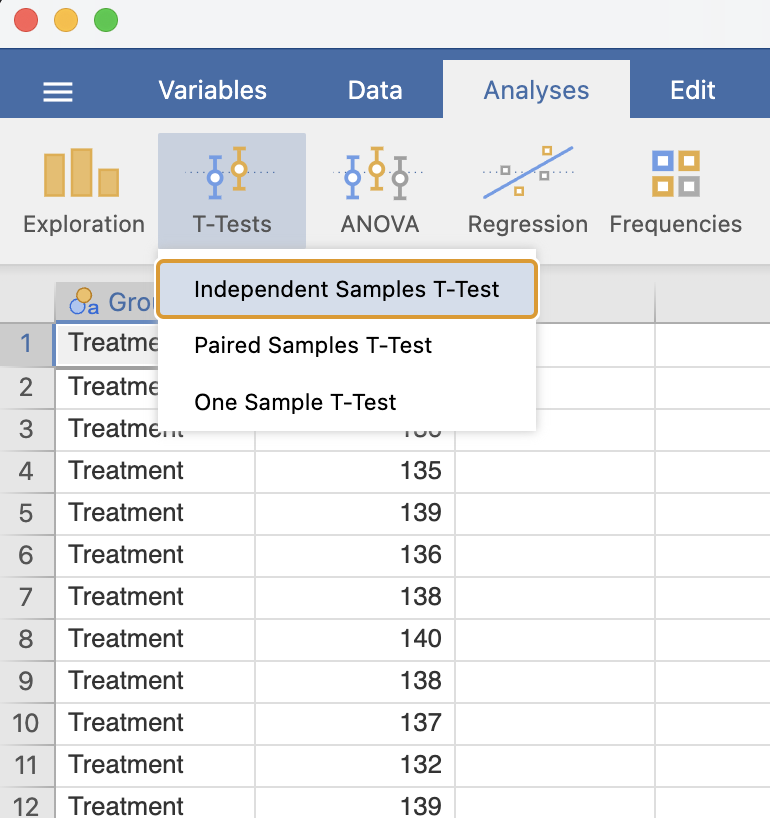
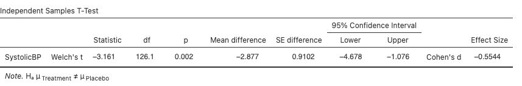
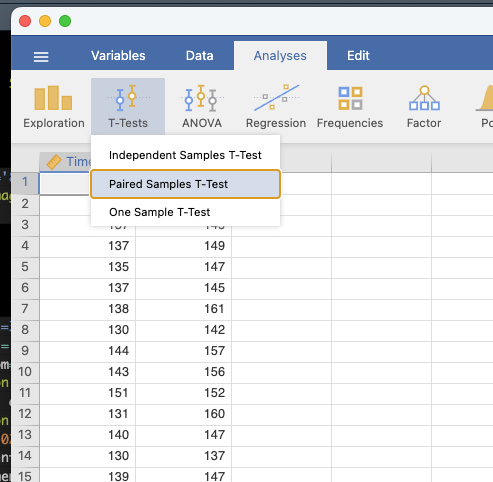
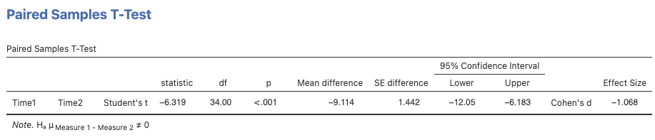

```{r setup, include=FALSE}
options(htmltools.dir.version = FALSE)
```

```{r xaringan-themer, include = FALSE}
library(xaringanthemer)
style_mono_accent(
  base_color = "#18778C",
  header_color = "#000000",
  header_font_google = google_font("Jost"),
  header_font_weight = 500,
  text_font_google = google_font("Jost", "300", "300i", "500", "500i"),
  code_font_google = google_font("Source Code Pro"),
  text_bold_color = '#4CA384',
  text_slide_number_color = '#18778C',
  text_font_size = '16pt'
)
```

```{r, echo = F, message = F, warning = F}
library(tidyverse)
knitr::opts_chunk$set(dev = 'svg')

# baseColor <- "#18778C"
# accent1 <- '#D95829'
# accent2 <- '#BF3326'
# accent3 <- '#F29422'

baseColor <- '#4CA384'
accent1 <- '#9AD079'
accent2 <- '#18778C'
accent3 <- '#19424C'
```

### This Week's Key Topics

+ Types of $t$-tests and their assumptions

+ Conducting a power analysis for a $t$-test

+ Interpreting and reporting the results of a $t$-test

+ Computing and interpreting effect sizes for $t$-tests


---
### Differences between two means

**Are the groups that produced these means different?**

.pull-left[
```{r, echo = F, fig.height=5}
set.seed(68)
dat <- data.frame(x1=round(rnorm(1000, mean = 20, sd = 2)), y1=round(rnorm(1000, mean = 26, sd = 2)), x2=round(rnorm(1000, mean = 22, sd = 15)), y2=round(rnorm(100, mean = 32, sd = 15)))

basePlot <- ggplot(dat, aes(x1)) + 
  scale_x_continuous(breaks=seq(5, 50, by = 5), limits=c(5, 50)) +
  theme(axis.line.y = element_line(),
        axis.line.x = element_line(),
        panel.grid = element_blank(),
        panel.background = element_blank(),
        axis.ticks = element_blank(),
        axis.text = element_text(size = 14),
        axis.title = element_text(size = 16, face = 'bold')) +
  xlab('x')

basePlot + geom_vline(xintercept = mean(dat$x1), linewidth=1, color = baseColor) +
  geom_vline(xintercept = mean(dat$y1), linewidth=1, color = accent2)
```

]

--

.pull-right[

```{r, echo = F, fig.height=5}
basePlot + geom_vline(xintercept = mean(dat$x2), linewidth=1, color = baseColor) +
  geom_vline(xintercept = mean(dat$y2), linewidth=1, color = accent2)
```

]


---
### Differences between two means

** Are the groups that produced these means different?**

.pull-left[
```{r, echo = F, warning=F, message=F, fig.height=5}
basePlot + geom_vline(xintercept = mean(dat$x1), linewidth=1, color = baseColor) +
  geom_vline(xintercept = mean(dat$y1), linewidth=1, color = accent2) +
  geom_histogram(fill=baseColor, color = accent3, alpha = .8, binwidth = 1) +
  geom_histogram(data = dat, aes(x=y1), fill=accent2, color = accent3, alpha = .8, binwidth = 1) +
  theme(axis.title.y = element_blank(),
        axis.text.y = element_blank(),
        axis.ticks.y = element_blank(),
        axis.line.y = element_blank())
```

]


.pull-right[

```{r, echo = F, warning=F, message = F, fig.height=5}
basePlot + geom_vline(xintercept = mean(dat$x2), linewidth=1.5, color = baseColor) +
  geom_vline(xintercept = mean(dat$y2), linewidth=1.5, color = accent2) + 
  geom_histogram(data = dat, aes(x=x2), fill=baseColor, color = accent3, alpha = .8, binwidth = 1) +
  geom_histogram(data = dat, aes(x=y2), fill=accent2, color = accent3, alpha = .8, binwidth = 1) +
  theme(axis.title.y = element_blank(),
        axis.text.y = element_blank(),
        axis.ticks.y = element_blank(),
        axis.line.y = element_blank())
```

]

---
### The $t$-test

+ $t$-tests account for both the mean and the variance of each group when determining whether groups significantly differ from each other. 

+ $t$-tests produce a $t$-statistic that reflects the standardised difference between two mean values

--
  
$$t = \frac{Value(s)\ Observed\ in\ Data- Value\ Expected\ Under\ Null\ Hypothesis}{Variation\ Measure}$$
--

+ $t$-tests require:

  + A continuous dependent variable
  
  + A binary independent variable

---
### The $t$-test

  
+ When a $t$-test is conducted:

  + A $t$-value is computed using the collected data
  
  + A probability is calculated that reflects the likelihood of obtaining this value of $t$ if the null were true

  + The researcher uses this probability to make a decision whether to reject the null hypothesis

---
### Types of $t$-tests

  + **One-sample $t$-test** tests the difference between a sample mean and a known mean
  
  + **Independent-sample $t$-test** tests the difference between two separate sample means
  
  + **Paired-samples $t$-test** tests the difference in a single sample at two points in time or across different conditions

---
### One-sample $t$-test

$$t = \frac{\bar{x}-\mu_0}{SE_\bar{x}}$$
+ Compare a sample mean ( $\bar{x}$ ) and a known mean ( $\mu_0$ )

+ Used to check whether the sample mean is significantly different from a known value

--

+ **Example research questions:**

  + Are speeds along Road A significantly higher than the speed limit?
  
  + Do a beauty product's results last longer than 3 months?

---
### Independent-samples $t$-test

$$t = \frac{(\bar{x_1}-\bar{x_2})-(\mu_1 - \mu_2)}{\sqrt{\frac{s_p^2}{n_1}+\frac{s_p^2}{n2}}}$$
$s_p^2$: a pooled variance estimate that weights variance by sample size

--

+ Compares the mean of group 1 ( $\bar{x_1}$ ) to the mean of group 2 ( $\bar{x_2}$ )

+ Used to determine whether there is a difference between two independently measured groups

--

+ **Example research questions:**

  + Are there differences in symptoms between the treatment group and the group that received a placebo?
  
  + Do inmates who are put in solitary confinement exhibit more aggressive behaviour than those who are not?
  
  + Are there differences in TBI rate between boxers and Muay Thai fighters?
  
---
### Paired-samples $t$-test


$$t = \frac{\bar{d}-\mu_d}{SE_\bar{d}}$$


+ where:

  + $\bar{d}$: the mean of the individual difference scores (e.g. $d_i = x_{i1} - x_{i2}$)

  + $\mu_d$: The hypothesised null mean difference

  + $SE_\bar{d} = \frac{sd_\bar{d}}{\sqrt{n}}$

--

+ Compares the mean of the same group of participants across two timepoints/conditions

--

+ **Example research questions:**

  + Does time of day affect one's attention span?
  
  + Is a new fitness routine effective in improving one's cardiovascular health?


---
### The $t$ distribution

.pull-left[
+ The $t$-distribution is the null distribution against which our calculated $t$-value is compared. 

+ The shape of the $t$-distribution depends on the degrees of freedom ( $df$ ) of our data.
]

.pull-right[

```{r, echo = F, fig.height=4}
ggplot(data = data.frame(x = c(-5, 5)), aes(x=x)) +
  stat_function(fun=dt, geom='line', args=c(df = 2), color = baseColor, linewidth=1.5) +
  stat_function(fun=dt, geom='line', args=c(df = 5), color = accent1, linewidth=1.5) +
  stat_function(fun=dt, geom='line', args=c(df = 15), color = accent2, linewidth=1.5) +
  xlab('t') +
  theme(axis.text.y = element_blank(),
        axis.title.y = element_blank(),
        axis.line.y = element_blank(),
        axis.ticks.y = element_blank(),
        axis.text.x = element_text(size = 14),
        axis.title.x = element_text(size = 16, face = 'bold')) +
  annotate('text', label = 'df = 2', x = 2.25, y = .27, color = baseColor, size = 7) + 
  annotate('text', label = 'df = 5', x = 2.25, y = .32, color = accent1, size = 7) +
  annotate('text', label = 'df = 15', x = 2.25, y = .37, color = accent2, size = 7)
```

]

---
### Degrees of freedom

+ The number of values/observations within the data that are free to vary and still allow you to get the same parameter estimate

--

.center[
```{r, echo = F}

```
]

---
count: false
### Degrees of freedom


+ The number of values/observations within the data that are free to vary and still allow you to get the same parameter estimate

**Non-Stats Example:**
+ Imagine you're out to dinner with 5 friends and the bill is £150.

+ 4 of the 5 guests can pay whatever they want, but 1 of the 5 must make up the difference.

+ In this case, there are 4 degrees of freedom. 4 friend's bills are free to vary, but the 5th is restricted based upon what the others decide to pay.

---
### Degrees of freedom


+ The number of values/observations within the data that are free to vary and still allow you to get the same parameter estimate

+ In statistics, degrees of freedom are typically calculated as: df = total observations - total parameters being estimated

--

**Stats Example:**

+ Imagine you have a sample of 10 participants and have calculated the average hours of sleep per night.


--

> **Check your Understanding:** how many observations do you have?


--


> What is the parameter/parameters being estimated?


--


> What are your degrees of freedom?

---
count: false

### Degrees of freedom


+ The number of values/observations within the data that are free to vary and still allow you to get the same parameter estimate

+ In statistics, degrees of freedom are typically calculated as: df = total observations - total parameters being estimated

**Stats Example 2:**

+ Imagine you have a sample of 10 participants, split into two groups: treatment and placebo. You intend to compare the mean sleep of the treatment group to the mean of the placebo group.


--

> **Check your Understanding:** how many observations do you have?


--


> What is the parameter/parameters being estimated?


--


> What are your degrees of freedom?


---
### Degrees of freedom for $t$-tests

+ **One-sample $t$-test:** we estimate the <span style = "color:#18778C"> mean of our data </span>
    + $df = n - 1$
  
+ **Independent samples $t$-test:** we estimate the <span style = "color:#18778C"> mean of each of our two groups </span>
    + $df = n - 2$
  
+ **Paired-samples $t$-test:** we estimate the <span style = "color:#18778C"> mean difference between observations </span>
    + $df = n - 1$


???

Imagine we have a set of 3 values and we know that the mean is 4. In this case, the parameter we wish to estimate is the mean, so there is 1 parameter. We have 3 values within our dataset. In this case, the degrees of freedom in this set is 2, because 3-1 is 2. To understand what this means in terms of 'free to vary', if we know the mean is 4, Value 1 could be anything...it could be 3 or 8, or 12. Value 2 could be the same, any value at all. But the third value is fixed, because it has to be whatever makes the mean equal to 4. So Value 1 and 2 are free to vary, but the 3rd value has a constraint, which is that it must be equal to whatever value makes the mean equal to 4. 

---
### The $t$ distribution

.pull-left[
+ The $t$-distribution is the null distribution against which our calculated $t$-value is compared. 

+ The shape of the $t$-distribution depends on the degrees of freedom ( $df$ ) of our data.

+ Consider how the shape of the distribution changes as $df$ increases

]

.pull-right[

```{r, echo = F, fig.height=4}
ggplot(data = data.frame(t = c(-5, 5)), aes(x=t)) +
  stat_function(fun=dt, geom='line', args=c(df = 2), color = baseColor, linewidth=1.5) +
  stat_function(fun=dt, geom='line', args=c(df = 5), color = accent1, linewidth=1.5) +
  stat_function(fun=dt, geom='line', args=c(df = 15), color = accent2, linewidth=1.5) +
  theme(axis.text.y = element_blank(),
        axis.title.y = element_blank(),
        axis.line.y = element_blank(),
        axis.ticks.y = element_blank(),
        axis.text.x = element_text(size = 14),
        axis.title.x = element_text(size = 16, face = 'bold')) +
  annotate('text', label = 'df = 2', x = 2.25, y = .27, color = baseColor, size = 7) + 
  annotate('text', label = 'df = 5', x = 2.25, y = .32, color = accent1, size = 7) +
  annotate('text', label = 'df = 15', x = 2.25, y = .37, color = accent2, size = 7)
```

]

--

> **Test your Critical Thinking:** What does the change in shape suggest?

---
### Putting it all together

.pull-left[
Basically:

1) The data are used to calculate a $t$-statistic

]

.pull-right[
```{r, echo = F, fig.height=4}
tPlot <- ggplot(data = data.frame(t = c(-5, 5)), aes(x=t)) +
  labs(x = 't') + 
  scale_x_continuous(limits = c(-5, 5)) + 
  scale_y_continuous(limits = c(0, .4)) + 
  annotate('text', label = 't = 2.86', x = 3.75, y = .05, size = 6) +
  theme(axis.text.y = element_blank(),
        axis.title.y = element_blank(),
        axis.line.y = element_blank(),
        axis.ticks.y = element_blank(),
        axis.text.x = element_text(size = 14),
        axis.title.x = element_text(size = 16, face = 'bold'))

tPlot
```
]

---
count: false
### Putting it all together

.pull-left[
Basically:

1) The data are used to calculate a $t$-statistic

2) The $df$ are used to identify the appropriate null distribution for comparison

]


.pull-right[
```{r, echo = F, fig.height=4}
(tPlot <- tPlot + 
  stat_function(fun=dt, geom='line', args=c(df = 15), color = baseColor, linewidth=1.5) +
  annotate('text', label = 't = 2.86', x = 3.75, y = .05, size = 6))
```
]

---
count: false
### Putting it all together

.pull-left[
Basically:

1) The data are used to calculate a $t$-statistic

2) The $df$ are used to identify the appropriate null distribution for comparison

3) The probability of getting the current $t$-statistic under the constraints of the null hypothesis is calculated

]


.pull-right[
```{r, echo = F, fig.height=4}
tPlot + 
  geom_vline(xintercept = 2.86, color = accent3, linetype = 'dashed', linewidth = 1.5) +
  geom_area(stat = "function", fun = dt, fill = accent3, args = c(df = 15),
              xlim = c(2.86, 5), alpha = .7)
```
]
---
class: center, inverse, middle

## Questions?

---

### Conducting a $t$-test...or really, most inferential statistical tests

1. State hypotheses

2. Conduct a power analysis

3. Check the data (visualisations/descriptive statistics)

4. Check assumptions

5. Run the test

6. Interpret results

7. Report

---
### Today's Practical Example

.pull-left[
+ You're a researcher studying the association between anxiety and blood pressure in the elderly. 

+ You randomly assigned elderly participants with anxiety to either a waitlist or a therapy group and collected blood pressure data after two months of therapy

+ **Research Objective:** Determine whether there are differences in blood pressure between anxious elderly patients receiving therapy and those who are not. 
]

.pull-right.center[
```{r, echo = F, out.width='60%'}

```
]

---
### Step 1: State Hypotheses

.pull-left[
Null Hypothesis
+ There will be no difference in blood pressure between elderly anxiety patients who are in therapy and those who are not.
$$H_0: \mu_{waitlist} = \mu_{treatment}$$
]

.pull-right[
Alternative hypotheses may be *directional* or *nondirectional*

.center[**Directional**]
Elderly anxiety patients in therapy will have **lower** blood pressure than those not receiving anxiety treatment.

$$H_1: \mu_{waitlist} < \mu_{treatment}$$
<br>

.center[**Nondirectional**]
Therapy will **have an effect** on blood pressure in elderly anxiety patients.

$$H_1: \mu_{waitlist} \neq \mu_{treatment}$$
]


---
### One-Tailed vs Two-Tailed Tests

+ The $t$-distribution has two tails, so $t$-tests may be one-tailed or two-tailed

.pull-left[
.center[**One-Tailed**: hypothesis is *directional*


```{r, echo = F, fig.height=2, fig.width = 4}
ggplot(data = data.frame(t = c(-5, 5)), aes(x=t)) +
  stat_function(fun=dt, geom='line', args=c(df = 29), color = baseColor, linewidth=1.5) +
  geom_area(stat = 'function', fun = dt, args= list(df = 29), fill = accent2, 
            xlim=c(qt(.05, df = 29, lower.tail = F), 5), alpha = .8) +
  theme(axis.text.y = element_blank(),
        axis.title.y = element_blank(),
        axis.line.y = element_blank(),
        axis.ticks.y = element_blank(),
        axis.text.x = element_text(size = 10),
        axis.title.x = element_text(size = 12, face = 'bold')) +
  annotate('text', x = 3, y = .3, parse = T, label = paste('bar(x) > mu'), size = 6, color = baseColor) +
  annotate('text', x = 3.25, y = .05, parse = T, label = paste('alpha == .05'), size = 4, color = accent2)
```

```{r, echo = F, fig.height=2, fig.width = 4}
ggplot(data = data.frame(t = c(-5, 5)), aes(x=t)) +
  stat_function(fun=dt, geom='line', args=c(df = 29), color = baseColor, linewidth=1.5) +
  geom_area(stat = 'function', fun = dt, args= list(df = 29), fill = accent2, 
            xlim=c(-5, qt(.05, df = 29)), alpha = .8) +
  theme(axis.text.y = element_blank(),
        axis.title.y = element_blank(),
        axis.line.y = element_blank(),
        axis.ticks.y = element_blank(),
        axis.text.x = element_text(size = 10),
        axis.title.x = element_text(size = 12, face = 'bold')) +
  annotate('text', x = -3, y = .3, parse = T, label = paste('bar(x) < mu'), size = 6, color = baseColor) +
  annotate('text', x = -3.25, y = .05, parse = T, label = paste('alpha == .05'), size = 4, color = accent2)
```
]]

--

.pull-left.center[
**Two-Tailed**: hypothesis is *directional* or *nondirectional*


```{r, echo = F, fig.height=4.5, fig.width = 6.5}
ggplot(data = data.frame(t = c(-5, 5)), aes(x=t)) +
  stat_function(fun=dt, geom='line', args=c(df = 29), color = baseColor, linewidth=1.5) +
  geom_area(stat = 'function', fun = dt, args= list(df = 29), fill = accent2, 
            xlim=c(qt(.025, df = 29, lower.tail = F), 5), alpha = .8) +
  geom_area(stat = 'function', fun = dt, args= list(df = 29), fill = accent2, 
            xlim=c(-5, qt(.025, df = 29)), alpha = .8) +
  theme(axis.text.y = element_blank(),
        axis.title.y = element_blank(),
        axis.line.y = element_blank(),
        axis.ticks.y = element_blank(),
        axis.text.x = element_text(size = 14),
        axis.title.x = element_text(size = 16, face = 'bold')) +
  annotate('text', x = 3, y = .3, parse = T, label = paste('bar(x) != mu'), size = 8, color = baseColor) +
  annotate('text', x = 3.25, y = .05, parse = T, label = paste('alpha == .025'), size = 6, color = accent2) +
  annotate('text', x = -3.25, y = .05, parse = T, label = paste('alpha == .025'), size = 6, color = accent2)
```
]

---
### One-Tailed vs Two-Tailed Tests

+ One-tailed tests 
  + **Pro:** More powerful for capturing an effect in the expected direction (5% alpha threshold is constrained to a single tail)
  + **Con:** Completely disregards any extreme results in the opposite direction
  
+ Two-tailed tests
  + **Pro:** Capable of capturing effects in either direction
  + **Con:** Slightly less powerful (5% alpha threshold is split equally between 2-tails)


+ If you're unsure, it's better to default to a two-tailed test.

---
### Step 2 - Conduct a Power Analysis

+ Recall that power usually involves some combination of the following values:
  
  + $\alpha$
  + Effect Size
  + Power
  + Sample Size
  
+ You can use three of these values to solve for the fourth. 

+ In almost all cases, $\alpha = .05$ and $Power = .8$

+ **Cohen's $d$ ** is the typical effect size used when comparing two means

---
### Cohen's $d$

+ Cohen's $d$ is the standardized difference between the means

$$d = \frac{\bar{x}_1 -\bar{x}_2}{s_{pooled}}$$

.pull-left[
+ $\bar{x}_1$ = mean of group 1
+ $\bar{x}_2$ = mean of group 2
+ $s_{pooled}$ = pooled standard deviation
]

--

.pull-right[

$$s_{pooled} = \sqrt{\frac{(n_1-1)s_1^2\ + (n_2-1)s_2^2}{n_1+n_2-2}}$$

]

--

+ In other words, how many standard deviations separate the two mean values?

> **Check Your Understanding:** If the first group's mean is 15, the second group's mean is 10, and the pooled standard deviation is 5, what is Cohen's *d*? 

---

### Interpretation of Cohen's $d$

+ Proposed by Cohen (1998):


| Strength | Absolute Magnitude of $d$ |
|:--------:|:-------------------------:|
| Weak     | $\leq$ .20                |
| Moderate | $\approx$ .50             |
| Strong   | $\geq$ .8                 |


---
### Step 2 - Conduct a Power Analysis for an independent-samples $t$-test

+ Many basic power analyses can be conducted using jamovi

+ Open jamovi and install a power module (e.g. `pamlj`)

> **Check Your Understanding**
> If you would like to compute the sample required to achieve 80% power to detect a moderate effect with $\alpha$ = .05, would this be an a priori or sensitivity power analysis? Run this power analysis in jamovi. 

--

> You are working with a secondary dataset that has 82 participants. If you want to compute the smallest effect size this sample is capable of detecting, would that be an a priori or sensitivity power analysis? Run this analysis in jamovi, given power = 80%, $\alpha$ = .05 and assuming equally sized groups.


---
### Step 3: Check the Data

+ Compute descriptive statistics
  + Continuous Data: Mean or Median and Standard Deviation or IQR.
  + Categorical Data: Frequency Data (i.e. number per category)
  
+ Look at relevant plots
  + Check data distribution using histograms or bar charts

+ This can be done in jamovi with [these data](https://mtruelovehill.github.io/PRM/Data/BPdat.csv).

---
### Step 4: Check Assumptions

+ All parametric statistical tests have certain **assumptions**, or criteria for the data that must be met in order for the test to produce valid results

+ When assumptions are violated, the test's results may be inaccurate or unreliable.

---

### Step 4: Check Assumptions

.pull-left[
+ **Normality:** Dependent data should be normally distributed
]

.pull-right[
.center[**Normally Distributed**]
```{r, echo = F, fig.height=2.5}
set.seed(82087)
assumpDat <- data.frame(normDat=rnorm(300, mean = 25, sd = 5), floorDat=rbeta(300, shape1=1, shape2=5), bimodDat=c(rnorm(150, mean = 8, sd = 4), rnorm(150, mean = 22, sd = 4)), eqVar=rnorm(300, mean = 45, sd = 5), uneqVar = rnorm(300, mean = 45, sd = 12))

ggplot(assumpDat, aes(normDat)) + geom_histogram(fill = baseColor, color = accent3, bins = 30) +
  labs(x='Score', y = 'Count') +
  theme(axis.text = element_text(size = 14),
        axis.title = element_text(size = 16, face = 'bold'))
```


.center[**Not so normally distributed**]
```{r, echo = F, fig.height=2.5}
ggplot(assumpDat, aes(floorDat)) + geom_histogram(fill = baseColor, color = accent3, bins = 30) +
  labs(x='Score', y = 'Count') +
  theme(axis.text = element_text(size = 12),
        axis.title = element_text(size = 14, face = 'bold'))
```
]

---
count: false
### Step 4: Check Assumptions

.pull-left[
+ **Normality:** Dependent data should be normally distributed
  + Have a look at the histograms & QQ-plots
  + Check skewness and kurtosis values
  + **Do not** rely on tests of normality...these may not provide accurate results 
]

.pull-right[
.center[**Normally Distributed**]
```{r, echo = F, fig.height=2.5}
set.seed(82087)
assumpDat <- data.frame(normDat=rnorm(300, mean = 25, sd = 5), floorDat=rbeta(300, shape1=1, shape2=5), bimodDat=c(rnorm(150, mean = 8, sd = 4), rnorm(150, mean = 22, sd = 4)), eqVar=rnorm(300, mean = 45, sd = 5), uneqVar = rnorm(300, mean = 45, sd = 12))

ggplot(assumpDat, aes(normDat)) + geom_histogram(fill = baseColor, color = accent3, bins = 30) +
  labs(x='Score', y = 'Count') +
  theme(axis.text = element_text(size = 14),
        axis.title = element_text(size = 16, face = 'bold'))
```


.center[**Not so normally distributed**]
```{r, echo = F, fig.height=2.5}
ggplot(assumpDat, aes(floorDat)) + geom_histogram(fill = baseColor, color = accent3, bins = 30) +
  labs(x='Score', y = 'Count') +
  theme(axis.text = element_text(size = 12),
        axis.title = element_text(size = 14, face = 'bold'))
```
]

---
### Step 4: Check Assumptions

.pull-left[
+ **Normality:** Dependent data should be normally distributed
  + Have a look at the histograms & QQ-plots
  + Check skewness and kurtosis values
  + **Do not** rely on tests of normality...these may not provide accurate results 
  
+ **Independence:** Observations should be sampled independently
  + Consider study design
  
]

---
count: false
### Step 4: Check Assumptions

.pull-left[
+ **Normality:** Dependent data should be normally distributed
  + Have a look at the histograms & QQ-plots
  + Check skewness and kurtosis values
  + **Do not** rely on tests of normality...these may not provide accurate results 
  
+ **Independence:** Observations should be sampled independently
  + Consider study design

+ **Homogeneity of Variance:** Equal variance between the two groups

]


--

.pull-right[
.center[**Equal Variance**]
```{r, echo = F, fig.height=2.5}
ggplot(assumpDat) + geom_histogram(aes(normDat), fill = baseColor, color = accent3, alpha = .8, bins = 30) +
  geom_histogram(aes(eqVar), fill = accent2, color = accent3, alpha = .8, bins = 30) + 
  xlab('Score') + 
  theme(axis.text = element_text(size = 12),
        axis.title = element_text(size = 14, face = 'bold'),
        axis.text.y = element_blank(),
        axis.title.y = element_blank(),
        axis.ticks.y = element_blank())
```

.center[**Not So Equal Variance**]
```{r, echo = F, fig.height=2.5}
ggplot(assumpDat) + geom_histogram(aes(normDat), fill = baseColor, color = accent3, alpha = .8, bins = 30) +
  geom_histogram(aes(uneqVar), fill = accent2, color = accent3, alpha = .8, bins = 30) + 
  xlab('Score') + 
  theme(axis.text = element_text(size = 12),
        axis.title = element_text(size = 14, face = 'bold'),
        axis.text.y = element_blank(),
        axis.title.y = element_blank(),
        axis.ticks.y = element_blank())
```
]
 
---
count: false
### Step 4: Check Assumptions

.pull-left[
+ **Normality:** Dependent data should be normally distributed
  + Have a look at the histograms & QQ-plots
  + Check skewness and kurtosis values
  + **Do not** rely on tests of normality...these may not provide accurate results 
  
+ **Independence:** Observations should be sampled independently
  + Consider study design

+ **Homogeneity of Variance:** Equal variance between the two groups
  + Rather than [checking for heterogeneity](https://rips-irsp.com/articles/10.5334/irsp.82), default to Welch's $t$-test
]


.pull-right[
.center[**Equal Variance**]
```{r, echo = F, fig.height=2.5}
ggplot(assumpDat) + geom_histogram(aes(normDat), fill = baseColor, color = accent3, alpha = .8, bins = 30) +
  geom_histogram(aes(eqVar), fill = accent2, color = accent3, alpha = .8, bins = 30) + 
  xlab('Score') + 
  theme(axis.text = element_text(size = 12),
        axis.title = element_text(size = 14, face = 'bold'),
        axis.text.y = element_blank(),
        axis.title.y = element_blank(),
        axis.ticks.y = element_blank())
```

.center[**Not So Equal Variance**]
```{r, echo = F, fig.height=2.5}
ggplot(assumpDat) + geom_histogram(aes(normDat), fill = baseColor, color = accent3, alpha = .8, bins = 30) +
  geom_histogram(aes(uneqVar), fill = accent2, color = accent3, alpha = .8, bins = 30) + 
  xlab('Score') + 
  theme(axis.text = element_text(size = 12),
        axis.title = element_text(size = 14, face = 'bold'),
        axis.text.y = element_blank(),
        axis.title.y = element_blank(),
        axis.ticks.y = element_blank())
```
]


---
### Step 5: Run the Test
.pull-left[
```{r, echo = F, out.width='80%'}

```
]

--

.pull-right[
```{r, echo = F, fig.height=3.65, fig.width = 8}
ggplot(data = data.frame(t = c(-5, 5)), aes(x=t)) +
  stat_function(fun=dt, geom='line', args=c(df = 128), color = baseColor, linewidth=1.5) +
  geom_area(stat = 'function', fun = dt, args= list(df = 128), fill = accent1, 
            xlim=c(qt(.025, df = 128, lower.tail = F), 5), alpha = .8) +
  geom_area(stat = 'function', fun = dt, args= list(df = 128), fill = accent1, 
            xlim=c(-5, qt(.025, df = 128)), alpha = .8) +
  theme(axis.text.y = element_blank(),
        axis.title.y = element_blank(),
        axis.line.y = element_blank(),
        axis.ticks.y = element_blank(),
        axis.text.x = element_text(size = 14),
        axis.title.x = element_text(size = 16, face = 'bold')) +
  annotate('text', x = -4.25, y = .05, label = 't = -3.16', size = 8, color = accent2) +
  geom_vline(xintercept = -3.16, color = accent2, linetype = 'dashed', linewidth = 1.5)

```
]

---
### Step 6: Interpret Results

```{r, echo = F}

```

--

.pull-left[
> **Check Your Understanding:** Are the results significant? If so, how strong are they?

]

.pull-right[

| Strength | Absolute Magnitude of $d$ |
|:--------:|:-------------------------:|
| Weak     | $\leq$ .20                |
| Moderate | $\approx$ .50             |
| Strong   | $\geq$ .8                 |

]


---
### Step 7: Report

.pull-left[
+ In the Methods, at least report:
  + Type of test conducted
  + Statistical software used
  + Which descriptive statistics were used
  + Which assumptions were assessed
  + The $\alpha$ threshold used
  + The groups being compared


+ In the Results, at least report:
  + Descriptive data for each group
  + $t$ statistic
  + Degrees of freedom
  + $p$-value
  + Effect size and confidence intervals
  + Directional interpretation (**ONLY** if results are significant)

]

--
.pull-right[

**Results Example:** 

We conducted a **two-tailed independent-samples $t$-test** to determine the effect of <span style = "color:#9AD079"> <b> treatment </span></b> on <span style = "color:#9AD079"> <b>systolic blood pressure (SBP) </span></b>. There was a significant effect of treatment, <span style = "color:#18778C"><b> $t$(128) = -3.16, $p$ = .002, 95% CI = [-4.68, -1.08], $d$ = -.55 </span></b>. Specifically, SBP in the treatment group was lower <span style = "color:#19424C"><b> ( $M$ = 136.97, $SD$ = 4.86)</span></b> than SBP in the placebo group <span style = "color:#19424C"><b>( $M$ = 139.85, $SD$ = 5.50)</span></b>.

]

---
## Running an Independent-Samples $t$-Test

**Step 8: Report**

.pull-left[

+ Figures are useful in helping readers visualise your results.

+ A **boxplot** is especially good for demonstrating results when you have a continuous DV and a categorical IV

+ In jamovi, you can find a boxplot option under `Exploration > Descriptives` 

]

.pull-right[
```{r, echo = F, fig.height=4.5}

bpDat <- read.csv('https://mtruelovehill.github.io/PRM/Data/BPdat.csv')
bpDat$GroupLab <- ifelse(bpDat$Group==0, 'Placebo', 'Treatment')

ggplot(bpDat, aes(x=GroupLab, y = SystolicBP, fill = GroupLab)) + geom_boxplot() +
  scale_fill_manual(values=c(accent1, accent2)) + 
  labs(x = 'Group', y = 'Systolic Blood Pressure') +
  theme(legend.position = 'none',
        axis.text = element_text(size = 14),
        axis.title = element_text(size = 16, face = 'bold'))

```

]

---
class: center, inverse, middle

## Questions?

---
### Running a paired-samples $t$-test

+ Research Question: Does therapy have an impact on blood pressure in elderly anxiety patients?

**Hypotheses**

.pull-left[
Null Hypothesis
+ There will be no difference in blood pressure in elderly anxiety patients before and after they receive therapy.
$$H_0: \mu_{diff} = 0$$
]

.pull-right[
.center[**Directional**]
The blood pressure of elderly anxiety patients will **decrease** after therapy.

$$H_1: \mu_{diff} > 0$$
<br>

.center[**Nondirectional**]
Blood pressure in elderly anxiety patients **will differ** after therapy as compared to before therapy. 

$$H_1:\mu_{diff} \neq 0$$
]


---
### Running a paired-samples $t$-test

**Power Analysis**

+ As before, check the sample required to achieve 80% power to detect a moderate effect ( $d$ = 0.5) with $\alpha$ = .05.

---
### Running a paired-samples $t$-test

**Check the data**

+ Data for this example can be found [here](https://mtruelovehill.github.io/PRM/PRMcontent/Data/BPpairedDat.csv)

+ Note how data are organised in this spreadsheet.


---
### Running a paired-samples $t$-test

**Check Assumptions**

+ Observations must be paired. 

+ Normality of difference scores
  
  + Have a look at the histograms & QQ-plots
  + Check skewness and kurtosis values
  + May also run statistical tests of normality...but this is not recommended

+ Independence (of participants rather than observations)
 
  + Consider study design

--

> **Test your Critical Thinking:** Why is homogeneity of variance not an assumption of a paired-samples $t$-test?


---
## Running a paired-samples $t$-test

**Run the test**

.pull-left[
```{r, echo = F, out.width='80%'}

```
]

--

.pull-right[
```{r, echo = F, fig.height=3.65, fig.width = 8}
ggplot(data = data.frame(t = c(-7, 7)), aes(x=t)) +
  stat_function(fun=dt, geom='line', args=c(df = 34), color = baseColor, linewidth=1.5) +
  geom_area(stat = 'function', fun = dt, args= list(df = 34), fill = accent1, 
            xlim=c(qt(.025, df = 34, lower.tail = F), 7), alpha = .8) +
  geom_area(stat = 'function', fun = dt, args= list(df = 34), fill = accent1, 
            xlim=c(-7, qt(.025, df = 34)), alpha = .8) +
  theme(axis.text.y = element_blank(),
        axis.title.y = element_blank(),
        axis.line.y = element_blank(),
        axis.ticks.y = element_blank(),
        axis.text.x = element_text(size = 14),
        axis.title.x = element_text(size = 16, face = 'bold')) +
  annotate('text', x = -4.8 , y = .05, label = 't = - 6.32', size = 8, color = accent2) +
  geom_vline(xintercept = -6.32, color = accent2, linetype = 'dashed', linewidth = 1.5)

```
]


---
### Running a paired-samples $t$-test

**Interpret results**

```{r, echo = F}

```

--

.pull-left[
> **Check Your Understanding:** Are the results significant? If so, how strong are they?

]

.pull-right[

| Strength | Absolute Magnitude of $d$ |
|:--------:|:-------------------------:|
| Weak     | $\leq$ .20                |
| Moderate | $\approx$ .50             |
| Strong   | $\geq$ .8                 |

]


---
### Running a paired-samples $t$-test

**Report**

We conducted a **two-tailed paired-samples $t$-test** to determine the effect of <span style = "color:#9AD079"> <b> treatment  </span></b> on <span style = "color:#9AD079"> <b>systolic blood pressure (SBP) </span></b>. There was a significant effect of treatment, <span style = "color:#18778C"><b> $t$(128) = -6.32, $p$ < .001, 95% CI = [-12.05, -6.18], $d$ = -1.07 </span></b>. Specifically, SBP was lower before the medication was administered <span style = "color:#19424C"><b> ( $M$ = 138.60, $SD$ = 6.67)</span></b> than after taking the medication <span style = "color:#19424C"><b>( $M$ = 147.71, $SD$ = 8.48)</span></b>.


---

class: center, inverse, middle

## Questions?


