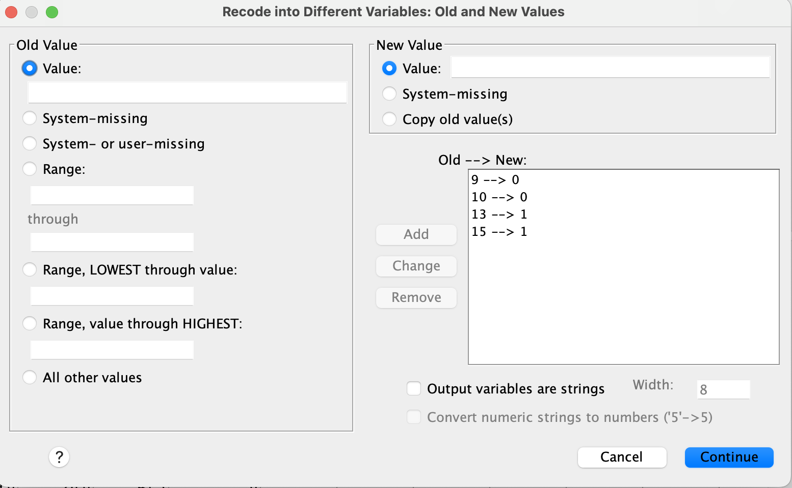
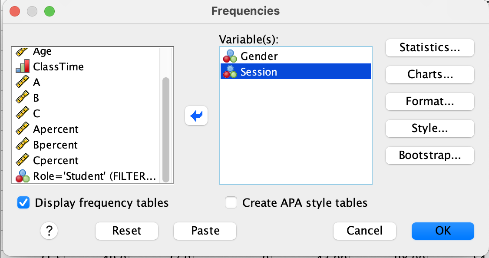

```{r, warning = F, message = F, echo = F}
library(knitr)
library(kableExtra)

baseColor <- "#18778C"
```


# Intro to Today's Lab


During today's lab, you'll apply the concepts discussed during this week's lecture. Each lab consists of 10 tasks, with corresponding questions you can answer. Please note that the questions are not required and not marked, although they do provide a helpful source of formative feedback that will help you gauge your understanding. 

You'll be working with simulated data based on a paper by [Hughes and colleagues (2013)](https://journals.sagepub.com/doi/full/10.1177/0956797613494853) that investigates participant's subjective age as it relates to their chronological age and their performance on a memory experiment. Please refer to the paper for details on study design and methods. It also provides an example of how results may be reported in APA style.

You have the following variables:

```{r, echo = F}
dat <- read.csv('Week1LabData.csv')
datInfo <- data.frame(VariableName=colnames(dat), 
                      Description=c('Participant ID', 'Age in years', 'Levels: 1=Male, 2=Females, 3=Nonbinary', 
                                    'Years of education', 'Subjective age before memory test',
                                    'Subjective age after memory test', 'Score on memory test'))

datInfo %>%
  kbl(col.names=c('Variable Name', 'Description')) %>%
  kable_styling(full_width = F) %>%
  row_spec(0, bold = T, color="#18778C", font_size = 18, align='l') %>%
  column_spec(1, bold = T, width = '4.5cm')
```


## Learning Objectives
At the end of this lab, you will be able to:

1.  Import data into SPSS
2.  Check and reset variable types and codes
3.  Check the descriptive statistics of your data
4.  Produce histograms to visually assess your data's distribution

## Requirements
To complete this lab, you should have:

- [ ] &nbsp; Attended this week's lectures
- [ ] &nbsp; Installed SPSS on your computer


## This Week's Tasks

- [ ] &nbsp; [Task 1 - Import Data](#import-data)
- [ ] &nbsp; [Task 2 - Adjust Variable Measures](#adjust-variable-measures)
- [ ] &nbsp; [Task 3 - Add Values to Nondescriptive Data](#add-values-to-nondescriptive-data)
- [ ] &nbsp; [Task 4 - Check Frequency Data](#check-frequency-data)
- [ ] &nbsp; [Task 5 - Visualise Distribution of Data](#visualise-distribution-of-data)
- [ ] &nbsp; [Task 6 - Check Central Tendency](#check-central-tendency)
- [ ] &nbsp; [Task 7 - Check Variance](#check-variance)
- [ ] &nbsp; [Task 8 - Calculate Percentiles](#calculate-percentiles)
- [ ] &nbsp; [Task 9 - Identify Normal Distribution Thresholds](#identify-normal-distribution-thresholds)
- [ ] &nbsp; [Task 10 - Report & Interpret](#report-and-interpret)


# Import Data {.tabset .tabset-fade .tabset-pills}

## Description
Import 'Week1LabData.csv' into SPSS. You can download the data from <span style = "color: #18778C;"> [Learn (requires university login)](MONICA - ADD LINK HERE) </span>. Once you have imported the file, save it as 'Week1LabData_SPSS' in the folder of your choice on your home computer. Note the difference in filetype between 'Week1LabData' and 'Week1LabData_SPSS'. 

## Hint

Check under the **File** tab in SPSS. What is the difference between the 'Open' and 'Import Data' options? 

## Solution

Click *Import Data* under the **File** tab. The data are in .csv format, so choose *CSV Data*. Navigate to the folder where you've stored  'Week1LabData.csv' and select the file. 

```{r, echo = F, out.width='50%'}
include_graphics('images/week1_1a.png')
```

A box will pop up that allows you to review the data before import. In this example, the first row of our data is the name for each column, so the 'First line contains variable names' should remain checked. Note that if you import data without column names, you'll need to uncheck this box. Click 'OK'. 

```{r, echo = F, out.width='60%'}
include_graphics('images/week1_1b.png')
```


# Adjust Variable Measures {.tabset .tabset-fade .tabset-pills}

## Description
Recall that data can be measured in multiple formats, and these scales of measurement will affect how data may be described and analysed. Have a look at your data - were all variables imported into SPSS as the correct measurement type? If not, change the variable's measure so that it appropriately describes the data. 

## Hint

You'll need to switch from *Data View* to *Variable View* for this step. Do the labels used by SPSS match the scales of measurement you've learned (Nominal, Ordinal, Interval, Ratio)? Think about what kind of data each of your variables represents. 

## Solution


To check that your variables are labeled as the correct scale of measurement, look at the **Measure** column under the *Variable View* tab. 

```{r, echo = F, out.width='75%'}
include_graphics('images/week1_2a.png')
```

SPSS labels the data as:

* _Nominal:_ data that fall into discrete categories that have no information regarding order (e.g., eye colour)
* _Ordinal:_ data that fall into discrete categories that have some kind of ordering information (e.g. Likert Scale responses)
* _Scale:_ continuous/numerical data; data have some kind of numeric relationship and could technically be measured to infinite decimal places, if the measurement was actually capable of doing so. 

To adjust the measure type, select the Measure box for a single variable and click the arrow that appears. 

* **ID** is represented as a number, but there really is no numeric relationship between the numbers (e.g. someone with an ID = 40 didn't complete the study in twice the time of someone with an ID = 20). Technically, the numbers are ordered in a way that reflects the order in which they completed the study, so this could be considered an 'Ordinal' variable.

* **Age** is continuous. Someone who is 12 is twice as old as someone who is 6, and you could measure age up to infinite decimal places if you had a perfectly precise measurement. This can be considered a 'Scale' variable.

* **Gender** is nominal. It can be captured in discrete categories and there is no inherent order.

* **Education** is a bit tricky, as its type changes based on how it is measured. In this example, the variable reflects years of education, so technically it is numeric, or a 'Scale' variable.

* **SubAgeT1** and * **SubAgeT2** were measured on a continuous slider, so they are both numeric, or 'Scale' variables.

* **MemoryScore** is also a numeric variable. 


# Add Values to Nondescriptive Data {.tabset .tabset-fade .tabset-pills}

## Description 

Sometimes categorical data may be recorded as a number. In this example, the gender variable consists of 3 values: 1, 2, 3, which represent the different genders that participated in the study. Instead of recording gender as a character label, participants were given a number to reflect their gender group. However, it is important to always include a coding key, so that anyone who works with the data will know the labels used and can make appropriate interpretations. 

Add a key to the Gender variable so that 1 = 'Male', 2 = 'Female', and 3 = 'Nonbinary'. 

## Hint

This should also be done in Variable View. The column names may seem a bit misleading; you don’t use the ‘Label’ column for this task.

## Solution

To provided an associated label for each value of a variable, you'll use the **Values** column under the **Variable View** tab. 

```{r, echo = F, out.width='70%'}
include_graphics('images/week1_3a.png')
```

Select the Gender x Values cell and click the dots to bring up the _Value Labels_ box. Use the $+$ to add a new label. In the Value column, type the value **exactly as it is recorded in your data.** In the Label column, add the label you would like to associate with that specific value. Continue adding labels using  $+$ until you've labeled all values in the Gender column. 

```{r, echo = F, out.width='40%'}
include_graphics('images/week1_3b.png')
```

Click 'OK'. If you've done this properly, you'll see that each numeric value is now associated with a character label.


# Check Frequency Data {.tabset .tabset-fade .tabset-pills}

## Description 
Before doing any sort of analysis, it's important to first check the data to make sure everything is as expected. With categorical data, one way we can do this is to inspect the frequency of observations in each group. When doing this, it allows you to check the following:

+ Are observations distributed relatively equally or are there major differences across groups?
+ Are there any groups with a limited number of observations?
+ Are there any missing datapoints?

Check the frequency of the Gender variable. Make sure to display a frequency table.

Are any of these groups limited in size? If so, how might this affect your ability to make generalisable claims about this group?

## Hint

You'll find what you need under the *Analyze* tab.

## Solution 
Select Analyze>Descriptives>Frequencies. Select Gender and use the arrow to move it into the Variable box. Make sure 'Display frequency tables' is checked. 

</br>

```{r, echo = F, out.width='65%'}
include_graphics('images/week1_4a.PNG')
```

</br>

**Output:**

```{r, echo = F, out.width='50%'}

```


# Visualise Distribution of Data {.tabset .tabset-fade .tabset-pills}

## Description
Another useful way of visualising the data is to check how your variables are distributed. Produce plots that allow you to look at the distribution of your variables. Make sure to use the proper plot type given the type of variables you have.

## Hint
A histogram will allow you to visualise the distribution of continuous variables. Bar plots allow you to check the distribution of categorical data. You'll need to produce a separate plot for each variable.

## Solution
<B> For Categorical Variables: </B>

Select *Graphs>Bar*. Select the chart type you'd prefer. When you're checking the distribution of a single variable, you would use a 'Simple' plot.  Use the arrow to add the variable you wish to view to the 'Category Axis' box. When looking at distributions of a categorical variable, you are plotting the total number of participants of each group, so you can leave the 'Bars Represent' portion at the default setting.

```{r, echo = F, out.width='55%'}
include_graphics('images/week1_5a.PNG')
```

When checking the distribution of categorical variables, check whether all groups are well represented. Consider the questions from the [Frequency Data](#check-frequency-data) portion of this lab. 


<B> For Continuous Variables: </B>


Select *Graphs>Histogram*. Use the arrow to add the variable you wish to view to the 'Variable' box.

```{r, echo = F, out.width='55%'}
include_graphics('images/week1_5c.PNG')
```

Have a look at the output. If a variable is normally distributed, most observations will fall near the mean, while more extreme values are less common.


**Note:** You can also produce both of these plots using *Analyze>Descriptive Statistics>Frequencies* and selecting the Charts option.


# Check Central Tendency {.tabset .tabset-fade .tabset-pills}

## Description
Check the measures of central tendency discussed in class. Make sure to use the proper central tendency measures given the variable type.

+ Are the measures of central tendency similar within a variable?
+ If not, what might this imply?

## Hint
Although this is descriptive data, *Analyze>Descriptive Statistics>Descriptives* is not what you need.

## Solution
To get all 3 measures of central tendency, you'll need to select *Analyze>Descriptive Statistics>Frequencies*, then put the variables of interest into the 'Variable(s)' box. Click 'Statistics' and select the options for 'Mean', 'Median', and 'Mode', as needed. 

```{r, echo = F, out.width='60%'}
include_graphics('images/week1_6a.PNG')
```

Note that Gender, as a categorical variable, should only be described using Mode. The other variables can be described using all 3 measures.


# Check Measures of Variability {.tabset .tabset-fade .tabset-pills}

## Description
For all continuous variables, check the measures of variance described in class. These include the maximum, minimum, range, interquartile range, variance, and standard deviation.

## Hint
You've already completed the steps to do this. You just need to check different boxes.

## Solution
This procedure is identical to getting the measures of central tendency, so in the future, you can do it all at once. You'll need to select *Analyze>Descriptive Statistics>Frequencies*, then put the variables of interest into the 'Variable(s)' box. Click 'Statistics' and select the options needed. For IQR, you'll need to select 'Quartiles':

```{r, echo = F, out.width='60%'}

```

Data will be reported in table format in the output. To get the IQR, you'll need to subtract the 25th percentile value from the 75th percentile value.


# Calculate Percentiles {.tabset .tabset-fade .tabset-pills}

## Description
Check the measures of variance discussed in class and report here. MORE DESCRIPTION

## Hint

## Solution

# Identify Normal Distribution Thresholds {.tabset .tabset-fade .tabset-pills}

## Description

## Hint

## Solution

# Report and Interpret{.tabset .tabset-fade .tabset-pills}

## Description

Write a paragraph describing your sample as you would include in a methods section. Please be sure to use APA style. Include an APA-style table to present the descriptive data for each variable (excluding ID). 

When writing a describing your sample, you will need to include, at minimum, the total number of participants included, a description of their available demographic data, and how/where participants were recruited. See the Hughes paper for a brief example.

</br>
</br>

## Hint

You might find the [Purdue Owl website](https://owl.purdue.edu/owl/research_and_citation/apa_style/apa_formatting_and_style_guide/general_format.html) helpful for APA formatting.

</br>
</br>

## Solution

</br>
</br>