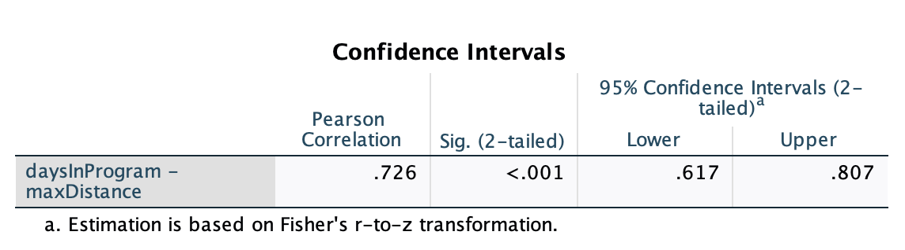

```{r setup, include=FALSE}
options(htmltools.dir.version = FALSE)
```

```{r xaringan-themer, include = FALSE}
library(xaringanthemer)
style_mono_accent(
  base_color = "#18778C",
  header_color = "#000000",
  header_font_google = google_font("Jost"),
  header_font_weight = 500,
  text_font_google = google_font("Jost", "300", "300i", "500", "500i"),
  code_font_google = google_font("Source Code Pro"),
  text_bold_color = '#4CA384',
  text_slide_number_color = '#18778C',
  text_font_size = '16pt'
)
```

```{r, echo = F, message = F, warning = F}
library(tidyverse)
library(kableExtra)
library(faux)

knitr::opts_chunk$set(dev = 'svg')

# baseColor <- "#18778C"
# accent1 <- '#D95829'
# accent2 <- '#BF3326'
# accent3 <- '#F29422'

baseColor <- '#4CA384'
accent1 <- '#9AD079'
accent2 <- '#18778C'
accent3 <- '#19424C'
```

## This Week's Learning Objectives

After this week, you should be able to:

1. Describe the difference between variance, covariance, and correlation

2. Calculate both covariance and correlation

3. Interpret the correlation coefficient

4. Perform and interpret the results of a significance test of your correlation

5. Understand which form of correlation is most appropriate to use with your data

---
## Data for Today

.pull-left[
+ Correlation is a measure of the relationship between two variables

+ The primary method we'll use is Pearson's correlation, which measures the association between two **continuous** variables

+ When investigating the relationship between two continuous variables, we often visualise them using scatterplots
]

--

.pull-right[

```{r, echo=F, message = F, fig.width=5, fig.height=3.5}

dat <- read.csv('https://mtruelovehill.github.io/PRM/Data/distDat.csv')

ggplot(dat, aes(daysInProgram, maxDistance)) + geom_point(shape = 21, size = 3, color = accent3, fill = baseColor) + 
  labs(x='Days In Program', y='Max Distance (miles)') + 
  theme(axis.text = element_text(size=12), axis.title = element_text(size=14, face = 'bold'))
```
]

---
## Variance Refresher

.pull-left[
$$s^2_x = \frac{\sum_{i=1}^{n}{(x_i - \bar{x})}^2}{n-1}$$

+ **Variance:** Deviance around the mean of a single variable
]

.pull-right[
```{r, echo = F, fig.height=3, fig.width=5}
sampleDat <- data.frame(Names=c('Alfred', 'Bernard', 'Clarence', 'Dorothy', 'Edna', 'Flora', 'Geraldine'),
                    daysInProgram=c(117, 99, 103, 95, 136, 126, 108),
                    maxDistance=c(8.53, 10.57, 8.01, 14.63, 27.03, 22.22, 6.77))


(p1 <- ggplot(sampleDat, aes(Names, daysInProgram)) + geom_point(size=2, colour = baseColor) +
  labs(x='Participant Name', y = 'Days in Program') +
  theme(axis.text = element_text(size=10), axis.title = element_text(size=12, face = 'bold')) +
  scale_y_continuous(breaks=seq(80, 140, by = 20), limits = c(80, 140)))


```

]


---
count: false

## Variance Refresher

.pull-left[
$$s^2_x = \frac{\sum_{i=1}^{n}{(x_i - \bar{x})}^2}{n-1}$$

+ **Variance:** Deviance around the mean of a single variable

+ Raw deviation is the distance between each person's days in the program and the mean number of days in the program. 
]

.pull-right[
```{r, echo = F, fig.height=3, fig.width=5}
p1 + geom_hline(yintercept = mean(sampleDat$daysInProgram)) +
  labs(x='Participant Name', y = 'Days In Program') + 
  geom_segment(x = sampleDat$Names, y = sampleDat$daysInProgram, 
               xend = sampleDat$Names, yend = mean(sampleDat$daysInProgram), linetype = "dashed",
               colour= baseColor)
```
]

---
count: false

## Variance Refresher

.pull-left[
$$s^2_x = \frac{\sum_{i=1}^{n}{(x_i - \bar{x})}^2}{n-1}$$

+ **Variance:** Deviance around the mean of a single variable

+ Raw deviation is the distance between each person's days in the program and the mean number of days in the program. 

+ To get the variance, we:
  1. Square the values to get rid of the negative
  2. Sum them up and divide by $n-1$ to get the average deviation of the group from its mean.
]

.pull-right[
```{r, echo = F, fig.height=3, fig.width=5}
p1 + geom_hline(yintercept = mean(sampleDat$daysInProgram)) +
  geom_segment(x = sampleDat$Names, y = sampleDat$daysInProgram, 
               xend = sampleDat$Names, yend = mean(sampleDat$daysInProgram), linetype = "dashed",
               colour= baseColor)
```
]


---
## Covariance

.pull-left[
+ **Covariance:** A value that represents how two variables change together

+ Do $x$ and $y$ differ from their means in a similar way?
]

.pull-right[

```{r, echo = F, fig.height=2.5, fig.width=5}
p1 + geom_hline(yintercept = mean(sampleDat$daysInProgram)) +
  geom_segment(x = sampleDat$Names, y = sampleDat$daysInProgram, 
               xend = sampleDat$Names, yend = mean(sampleDat$daysInProgram), linetype = "dashed",
               colour= baseColor)
```

```{r, echo = F, fig.height=2.5, fig.width=5}
p2 <- ggplot(sampleDat, aes(Names, maxDistance)) + geom_point(size=2, colour = accent2) +
  labs(x='Participant Name', y ='Max Distance (miles)') +
  theme(axis.text = element_text(size=10), axis.title = element_text(size=12, face = 'bold')) + 
  geom_hline(yintercept = mean(sampleDat$maxDistance)) + 
  geom_segment(x = sampleDat$Names, y = sampleDat$maxDistance, 
               xend = sampleDat$Names, yend = mean(sampleDat$maxDistance), linetype = "dashed",
               colour= accent2) +
  scale_y_continuous(breaks=seq(0, 30, 10), limits = c(0, 30))

p2
```

]


---
count: false

## Covariance

.pull-left[
+ **Covariance:** A value that represents how two variables change together

+ Do $x$ and $y$ differ from their means in a similar way?

+ Mathematically similar to variance:


**Variance**
$$s^2_x = \frac{\sum_{i=1}^{n}{(x_i-\bar{x})^2}}{n-1} = \frac{\sum_{i=1}^{n}{(x_i-\bar{x})(x_i-\bar{x})}}{n-1}$$


**Covariance**

$$Cov_{xy} = \frac{\sum_{i=1}^{n}{\color{#4CA384}{(x_i-\bar{x})}\color{#18778C}{(y_i-\bar{y})}}}{n-1}$$
]

.pull-right[
```{r, echo = F, fig.height=2.5, fig.width=5}
p1 + geom_hline(yintercept = mean(sampleDat$daysInProgram)) +
  geom_segment(x = sampleDat$Names, y = sampleDat$daysInProgram, 
               xend = sampleDat$Names, yend = mean(sampleDat$daysInProgram), linetype = "dashed",
               colour= baseColor)
```

```{r, echo = F, fig.height=2.5, fig.width=5}
p2
```
]

---

## Covariance

.pull-left[
+ It's possible two variables are related if their observations differ proportionally from their means in a consistent way

+ Covariance gives us a sense of this...

  + High covariance suggests a stronger relationship than a lower covariance

  + Why can't we stop here? 
  
  + Why is correlation necessary? 

]


.pull-right[
```{r, echo = F, fig.height=2.5, fig.width=5}
p1 + geom_hline(yintercept = mean(sampleDat$daysInProgram)) +
  geom_segment(x = sampleDat$Names, y = sampleDat$daysInProgram, 
               xend = sampleDat$Names, yend = mean(sampleDat$daysInProgram), linetype = "dashed",
               colour= baseColor)
```

```{r, echo = F, fig.height=2.5, fig.width=5}
p2
```
]

---

## The Trouble with Covariance

.pull-left[

$$Cov_{xy}=\frac{\sum_{i=1}^n\color{#18778C}{(x_i-\bar{x})}(y_i-\bar{y})}{n-1}$$


```{r, echo = F}
sampleDat$varX <- round(sampleDat$daysInProgram-mean(sampleDat$daysInProgram),2)
sampleDat$varY <- round(sampleDat$maxDistance-mean(sampleDat$maxDistance), 2)
sampleDat$varXY <- round(sampleDat$varX*sampleDat$varY, 2)
row.names(sampleDat) <- NULL

```

| Participant           |  $x_i - \bar{x}$      |
|:----------------------|:---------------------:|
| `r sampleDat$Names[1]`| `r sampleDat$varX[1]` |
| `r sampleDat$Names[2]`| `r sampleDat$varX[2]` |
| `r sampleDat$Names[3]`| `r sampleDat$varX[3]` |
| `r sampleDat$Names[4]`| `r sampleDat$varX[4]` |
| `r sampleDat$Names[5]`| `r sampleDat$varX[5]` |
| `r sampleDat$Names[6]`| `r sampleDat$varX[6]` |
| `r sampleDat$Names[7]`| `r sampleDat$varX[7]` |
]


.pull-right[

```{r, echo = F, fig.width=5, fig.height=2.5}
(p3 <- p1 + geom_hline(yintercept = mean(sampleDat$daysInProgram)) +
  geom_segment(x = sampleDat$Names, y = sampleDat$daysInProgram, 
               xend = sampleDat$Names, yend = mean(sampleDat$daysInProgram), linetype = "dashed",
               colour= baseColor) +
  geom_text(aes(label = sampleDat$varX), nudge_x = .2, y = mean(sampleDat$daysInProgram)+(sampleDat$varX/2)))
```

]

---
count: false

## The Trouble with Covariance

.pull-left[

$$Cov_{xy}=\frac{\sum_{i=1}^n(x_i-\bar{x})\color{#18778C}{(y_i-\bar{y})}}{n-1}$$

| Participant           |  $x_i - \bar{x}$      |    $y_i - \bar{y}$    |
|:----------------------|:---------------------:|:---------------------:|
| `r sampleDat$Names[1]`| `r sampleDat$varX[1]` | `r sampleDat$varY[1]` |
| `r sampleDat$Names[2]`| `r sampleDat$varX[2]` | `r sampleDat$varY[2]` |
| `r sampleDat$Names[3]`| `r sampleDat$varX[3]` | `r sampleDat$varY[3]` |
| `r sampleDat$Names[4]`| `r sampleDat$varX[4]` | `r sampleDat$varY[4]` |
| `r sampleDat$Names[5]`| `r sampleDat$varX[5]` | `r sampleDat$varY[5]` |
| `r sampleDat$Names[6]`| `r sampleDat$varX[6]` | `r sampleDat$varY[6]` |
| `r sampleDat$Names[7]`| `r sampleDat$varX[7]` | `r sampleDat$varY[7]` |
]


.pull-right[

```{r, echo = F, fig.width=5, fig.height=2.5}
p3 
```

```{r, echo = F, fig.width=5, fig.height=2.5}
(p4 <- p2 + geom_text(aes(label = sampleDat$varY), nudge_x = .35, y = mean(sampleDat$maxDistance)+(sampleDat$varY/2)))
```

]

---
count: false

## The Trouble with Covariance

.pull-left[

$$Cov_{xy}=\frac{\sum_{i=1}^n\color{#18778C}{(x_i-\bar{x})(y_i-\bar{y})}}{n-1}$$

| Participant           |  $x_i - \bar{x}$      |    $y_i - \bar{y}$    | $(x_i - \bar{x})(y_i - \bar{y})$   |
|:----------------------|:---------------------:|:---------------------:|:------------------------:|
| `r sampleDat$Names[1]`| `r sampleDat$varX[1]` | `r sampleDat$varY[1]` |  `r sampleDat$varXY[1]`  |
| `r sampleDat$Names[2]`| `r sampleDat$varX[2]` | `r sampleDat$varY[2]` |  `r sampleDat$varXY[2]`  |
| `r sampleDat$Names[3]`| `r sampleDat$varX[3]` | `r sampleDat$varY[3]` |  `r sampleDat$varXY[3]`  |
| `r sampleDat$Names[4]`| `r sampleDat$varX[4]` | `r sampleDat$varY[4]` |  `r sampleDat$varXY[4]`  |
| `r sampleDat$Names[5]`| `r sampleDat$varX[5]` | `r sampleDat$varY[5]` |  `r sampleDat$varXY[5]`  |
| `r sampleDat$Names[6]`| `r sampleDat$varX[6]` | `r sampleDat$varY[6]` |  `r sampleDat$varXY[6]`  |
| `r sampleDat$Names[7]`| `r sampleDat$varX[7]` | `r sampleDat$varY[7]` |  `r sampleDat$varXY[7]`  |


]


.pull-right[

```{r, echo = F, fig.width=5, fig.height=2.5}
p3
```

```{r, echo = F, fig.width=5, fig.height=2.5}
p4
```

]

---
count: false

## The Trouble with Covariance

.pull-left[

$$Cov_{xy}=\frac{\color{#18778C}{\sum_{i=1}^n}(x_i-\bar{x})(y_i-\bar{y})}{n-1}$$


| Participant           |  $x_i - \bar{x}$      |    $y_i - \bar{y}$    | $(x_i - \bar{x})(y_i - \bar{y})$   |
|:----------------------|:---------------------:|:---------------------:|:------------------------:|
| `r sampleDat$Names[1]`| `r sampleDat$varX[1]` | `r sampleDat$varY[1]` |  `r sampleDat$varXY[1]`  |
| `r sampleDat$Names[2]`| `r sampleDat$varX[2]` | `r sampleDat$varY[2]` |  `r sampleDat$varXY[2]`  |
| `r sampleDat$Names[3]`| `r sampleDat$varX[3]` | `r sampleDat$varY[3]` |  `r sampleDat$varXY[3]`  |
| `r sampleDat$Names[4]`| `r sampleDat$varX[4]` | `r sampleDat$varY[4]` |  `r sampleDat$varXY[4]`  |
| `r sampleDat$Names[5]`| `r sampleDat$varX[5]` | `r sampleDat$varY[5]` |  `r sampleDat$varXY[5]`  |
| `r sampleDat$Names[6]`| `r sampleDat$varX[6]` | `r sampleDat$varY[6]` |  `r sampleDat$varXY[6]`  |
| `r sampleDat$Names[7]`| `r sampleDat$varX[7]` | `r sampleDat$varY[7]` |  `r sampleDat$varXY[7]`  |
|                       |                       |                       |  **`r round(sum(sampleDat$varXY), 2)`**|

]

.pull-right[

```{r, echo = F, fig.width=5, fig.height=2.5}
p3
```

```{r, echo = F, fig.width=5, fig.height=2.5}
p4
```

]

---

## The Trouble with Covariance

.pull-left[

$$Cov_{xy}=\frac{\sum_{i=1}^n(x_i-\bar{x})(y_i-\bar{y})}{n-1}=\frac{`r round(sum(sampleDat$varXY), 2)`}{7-1}=`r round(sum(sampleDat$varXY)/6, 2)`$$


| Participant           |  $x_i - \bar{x}$      |    $y_i - \bar{y}$    | $(x_i - \bar{x})(y_i - \bar{y})$   |
|:----------------------|:---------------------:|:---------------------:|:------------------------:|
| `r sampleDat$Names[1]`| `r sampleDat$varX[1]` | `r sampleDat$varY[1]` |  `r sampleDat$varXY[1]`  |
| `r sampleDat$Names[2]`| `r sampleDat$varX[2]` | `r sampleDat$varY[2]` |  `r sampleDat$varXY[2]`  |
| `r sampleDat$Names[3]`| `r sampleDat$varX[3]` | `r sampleDat$varY[3]` |  `r sampleDat$varXY[3]`  |
| `r sampleDat$Names[4]`| `r sampleDat$varX[4]` | `r sampleDat$varY[4]` |  `r sampleDat$varXY[4]`  |
| `r sampleDat$Names[5]`| `r sampleDat$varX[5]` | `r sampleDat$varY[5]` |  `r sampleDat$varXY[5]`  |
| `r sampleDat$Names[6]`| `r sampleDat$varX[6]` | `r sampleDat$varY[6]` |  `r sampleDat$varXY[6]`  |
| `r sampleDat$Names[7]`| `r sampleDat$varX[7]` | `r sampleDat$varY[7]` |  `r sampleDat$varXY[7]`  |
|                       |                       |                       |  **`r round(sum(sampleDat$varXY), 2)`**|

]

.pull-right[

```{r, echo = F, fig.width=5, fig.height=2.5}
p3
```

```{r, echo = F, fig.width=5, fig.height=2.5}
p4
```

]


---

## The Trouble with Covariance

+ A value of `r round(sum(sampleDat$varXY)/6, 2)` seems high...I think. Is it?

  + Maybe? But maybe not. 
  
  + Covariance is related specifically to the scales of the variables we are analysing. 
  
  + Variables with larger scales will naturally have larger covariance values.


---

## The Trouble with Covariance

+ Consider what would happen if we converted our distance data to kilometers instead of miles.

```{r, echo=F}
sampleDat$maxDistancekm <- sampleDat$maxDistance*1.61
```


.pull-left[

.center[**Miles**]

```{r, echo = 5, fig.height=3.5, fig.width=5}
p4
```


]

.pull-right[

.center[**Kilometers**]

```{r, echo = F, fig.height=3.5, fig.width=5}
sampleDat$varYkm <- round(sampleDat$maxDistancekm-mean(sampleDat$maxDistancekm),2)
sampleDat$varXYkm <- round(sampleDat$varX*sampleDat$varYkm,2)

ggplot(sampleDat, aes(Names, maxDistancekm)) + geom_point(size=2, colour = accent2) +
  labs(x='Participant Name', y = 'Max Distance (km)') + 
  theme(axis.text = element_text(size=10), axis.title = element_text(size=12, face = 'bold')) +
  scale_y_continuous(breaks=seq(20, 50, by = 10), limits = c(0, 50)) + geom_hline(yintercept = mean(sampleDat$maxDistancekm)) +
  geom_segment(x = sampleDat$Names, y = sampleDat$maxDistancekm, 
               xend = sampleDat$Names, yend = mean(sampleDat$maxDistancekm), linetype = "dashed",
               colour= accent2) +
  geom_text(aes(label = varYkm), nudge_x = .35, y = mean(sampleDat$maxDistancekm)+(sampleDat$varYkm/2))
```


]

---

## The Trouble with Covariance

.pull-left[

.center[**Miles**]

$$Cov_{xy}=`r round(sum(sampleDat$varXY)/6, 2)`$$


| Participant       |  $x_i - \bar{x}$      |    $y_i - \bar{y}$    | $(x_i - \bar{x})(y_i - \bar{y})$   |
|:------------------|:---------------------:|:---------------------:|:----------------------------------:|
| `r sampleDat$Names[1]`| `r sampleDat$varX[1]` | `r sampleDat$varY[1]` |  `r sampleDat$varXY[1]`  |
| `r sampleDat$Names[2]`| `r sampleDat$varX[2]` | `r sampleDat$varY[2]` |  `r sampleDat$varXY[2]`  |
| `r sampleDat$Names[3]`| `r sampleDat$varX[3]` | `r sampleDat$varY[3]` |  `r sampleDat$varXY[3]`  |
| `r sampleDat$Names[4]`| `r sampleDat$varX[4]` | `r sampleDat$varY[4]` |  `r sampleDat$varXY[4]`  |
| `r sampleDat$Names[5]`| `r sampleDat$varX[5]` | `r sampleDat$varY[5]` |  `r sampleDat$varXY[5]`  |
| `r sampleDat$Names[6]`| `r sampleDat$varX[6]` | `r sampleDat$varY[6]` |  `r sampleDat$varXY[6]`  |
| `r sampleDat$Names[7]`| `r sampleDat$varX[7]` | `r sampleDat$varY[7]` |  `r sampleDat$varXY[7]`  |
|                       |                       |                       |  **`r round(sum(sampleDat$varXY), 2)`**|


]

.pull-right[

.center[**Kilometers**]

$$Cov_{xy}=`r round(sum(sampleDat$varXYkm)/6, 2)`$$


| Participant           |  $x_i - \bar{x}$      |    $y_i - \bar{y}$    | $(x_i - \bar{x})(y_i - \bar{y})$   |
|:----------------------|:---------------------:|:---------------------:|:------------------------:|
| `r sampleDat$Names[1]`| `r sampleDat$varX[1]` | `r sampleDat$varYkm[1]` |  `r sampleDat$varXYkm[1]`  |
| `r sampleDat$Names[2]`| `r sampleDat$varX[2]` | `r sampleDat$varYkm[2]` |  `r sampleDat$varXYkm[2]`  |
| `r sampleDat$Names[3]`| `r sampleDat$varX[3]` | `r sampleDat$varYkm[3]` |  `r sampleDat$varXYkm[3]`  |
| `r sampleDat$Names[4]`| `r sampleDat$varX[4]` | `r sampleDat$varYkm[4]` |  `r sampleDat$varXYkm[4]`  |
| `r sampleDat$Names[5]`| `r sampleDat$varX[5]` | `r sampleDat$varYkm[5]` |  `r sampleDat$varXYkm[5]`  |
| `r sampleDat$Names[6]`| `r sampleDat$varX[6]` | `r sampleDat$varYkm[6]` |  `r sampleDat$varXYkm[6]`  |
| `r sampleDat$Names[7]`| `r sampleDat$varX[7]` | `r sampleDat$varYkm[7]` |  `r sampleDat$varXYkm[7]`  |
|                       |                       |                         |  **`r round(sum(sampleDat$varXYkm), 2)`**|


]

---

## Correlation

+ Correlation allows you to compare continuous variables across different scales without the magnitude of the variables skewing your results.

+ **Pearson's correlation**, $r$, is the standardised version of covariance:

.f4[

$$r=\frac{\frac{\sum_{i=1}^n(x_i-\bar{x})(y_i-\bar{y})}{n-1}}{\sqrt{\frac{\sum_{i=1}^n(x_i-\bar{x})^2}{n-1}}\sqrt{\frac{\sum_{i=1}^n(y_i-\bar{y})^2}{n-1}}}$$
]


---
count: false

## Correlation

+ Correlation allows you to compare continuous variables across different scales without the magnitude of the variables skewing your results.

+ **Pearson's correlation**, $r$, is the standardised version of covariance:

.f4[

$$r=\frac{\frac{\sum_{i=1}^n(x_i-\bar{x})(y_i-\bar{y})}{n-1}}{\sqrt{\frac{\sum_{i=1}^n(x_i-\bar{x})^2}{n-1}}\sqrt{\frac{\sum_{i=1}^n(y_i-\bar{y})^2}{n-1}}} = \frac{Cov_{xy}}{s_xs_y}$$
]

---
## Correlation

.pull-left[
+ By dividing covariance by the product of the standard deviations of $x$ and $y$, we remove issues with scale differences in the original variables.

+ Because of this, you can use $r$ to investigate the relationships between continuous variables with completely different ranges. 

]


.pull-right[
.center.f3[**Miles**]

<br>

$$r=\frac{`r round(sum(sampleDat$varXY)/6, 2)`}{`r round(sd(sampleDat$daysInProgram),2)`\times`r round(sd(sampleDat$maxDistance),2)`}=`r round((sum(sampleDat$varXY)/6)/(sd(sampleDat$daysInProgram)*sd(sampleDat$maxDistance)), 2)`$$

<br>

.center.f3[**Kilometers**]

<br>

$$r=\frac{`r round(sum(sampleDat$varXYkm)/6, 2)`}{`r round(sd(sampleDat$daysInProgram),2)`\times`r round(sd(sampleDat$maxDistancekm),2)`}=`r round((sum(sampleDat$varXYkm)/6)/(sd(sampleDat$daysInProgram)*sd(sampleDat$maxDistancekm)), 2)`$$

]

---
class: inverse, middle, center

## Questions?

---
## Interpreting $r$

+ Values of $r$ can fall between -1 and 1.

  + Values closer to 0 indicate a weaker relationship
  
  + More extreme values indicate a stronger association

--

+ Interpretation (somewhat arbitrary):

.center[

| Value   | Interpretation |
|:-------:|:--------------:|
| < .1    | Neglible       |
| .1-.3   | Weak           |
| .3-.6   | Moderate       |
|  > .6   | Strong         |

]

---
## Interpreting $r$

+ Values of $r$ fall between -1 and 1.

  + Values closer to 0 indicate a weaker relationship
  
  + More extreme values indicate a stronger association

.center[
```{r, echo = F, message = F, warning = F, fig.height=3.75, fig.width = 9}
set.seed(504)
strCor <- rnorm_multi(n=200, mu = c(mean(dat$daysInProgram), mean(dat$maxDistance)), sd = c(sd(dat$daysInProgram),  sd(dat$maxDistance)), varnames = c('daysInProgram', 'maxDistance'), r = 0.8)
strCor$maxDistance[strCor$maxDistance<=0] <- 5
strCor$daysInProgram[strCor$daysInProgram<=0] <- 2
strCor$corrStrength <- 'Strong'

set.seed(1022)
modCor <- rnorm_multi(n=200, mu = c(mean(dat$daysInProgram), mean(dat$maxDistance)), sd = c(sd(dat$daysInProgram),  sd(dat$maxDistance)), varnames = c('daysInProgram', 'maxDistance'), r = 0.45)
modCor$corrStrength <- 'Moderate'
modCor$maxDistance[modCor$maxDistance<=0] <- 5

set.seed(86)
lowCor <- rnorm_multi(n=200, mu = c(mean(dat$daysInProgram), mean(dat$maxDistance)), sd = c(sd(dat$daysInProgram),  sd(dat$maxDistance)), varnames = c('daysInProgram', 'maxDistance'), r = 0.15)
lowCor$corrStrength <- 'Weak'

set.seed(86)
noCor <- rnorm_multi(n=200, mu = c(mean(dat$daysInProgram), mean(dat$maxDistance)), sd = c(sd(dat$daysInProgram),  sd(dat$maxDistance)), varnames = c('daysInProgram', 'maxDistance'), r = 0)
noCor$corrStrength <- 'None'

corDat <- rbind(strCor, modCor, lowCor, noCor)

corDat$corrStrength <- factor(corDat$corrStrength, levels = c('None', 'Weak', 'Moderate', 'Strong'))

corPlot <- ggplot(corDat, aes(daysInProgram, maxDistance)) + 
  geom_point(alpha = 0.7, size = 1) + 
  geom_smooth(method = 'lm', se = F, colour = baseColor) +
  labs(x = 'Days in Program', y = 'Max Distance (miles)')

ann_text <- data.frame(daysInProgram = rep(75, 4),maxDistance = rep(0, 4),
                       lab = c(paste('r =', round(cor.test(noCor$daysInProgram, noCor$maxDistance)$estimate, 2)),
                               paste('r =', round(cor.test(lowCor$daysInProgram, lowCor$maxDistance)$estimate, 2)),
                               paste('r =', round(cor.test(modCor$daysInProgram, modCor$maxDistance)$estimate, 2)),
                               paste('r =', round(cor.test(strCor$daysInProgram, strCor$maxDistance)$estimate, 2))),
                       corrStrength = c('None', 'Weak', 'Moderate', 'Strong'))

ann_text$corrStrength <- factor(ann_text$corrStrength, levels = c('None', 'Weak', 'Moderate', 'Strong'))

corPlot + facet_grid(.~corrStrength) +
  theme(strip.text = element_text(size = 10, face = 'bold')) +
  geom_text(data = ann_text, label = ann_text$lab, size = 4)

```
]

---
## Interpreting $r$

+ The sign of $r$ refers to the direction of the relationship

  + Positive values: the two variables increase or decrease together.
  
  + Negative values: as one variable increases, the other decreases

.pull-left[
```{r, echo = F, fig.height=3.5, fig.width=5, warning = F, message = F}
set.seed(806)
negCor <- rnorm_multi(n=200, mu = c(mean(dat$daysInProgram), mean(dat$maxDistance)), sd = c(sd(dat$daysInProgram),  sd(dat$maxDistance)), varnames = c('daysInProgram', 'maxDistance'), r = -0.5)
negCor$maxDistance[negCor$maxDistance<=0] <- 5

ggplot(negCor, aes(daysInProgram, maxDistance)) + geom_point() + geom_smooth(method = 'lm', se = F, colour = baseColor) + 
  labs(x='Days in Program', y='Max Distance (miles)') +
  scale_y_continuous(breaks = seq(0, 30, 10), limits = c(0, 35)) +
  theme(axis.text = element_text(size = 10), axis.title = element_text(size = 12, face = 'bold')) + 
  annotate('text', label = paste('r =', round(cor.test(negCor$daysInProgram, negCor$maxDistance)$estimate, 2)),
           x=150, y = 30, size = 4)
```
]

.pull-right[
```{r, echo = F, fig.height=3.5, fig.width=5, warning = F, message = F}
ggplot(modCor, aes(daysInProgram, maxDistance)) + geom_point() + geom_smooth(method = 'lm', se = F, colour = baseColor) + 
  labs(x='Days in Program', y = 'Max Distance (miles)') +
  scale_y_continuous(breaks = seq(0, 30, 10), limits = c(0, 35)) +
  theme(axis.text = element_text(size = 10), axis.title = element_text(size = 12, face = 'bold')) + 
  annotate('text', label = paste('r =', round(cor.test(modCor$daysInProgram, modCor$maxDistance)$estimate, 2)), 
           x = 45, y = 30, size = 4)
```
]
  
---

class: center, middle, inverse
## Questions?

---

## Hypothesis Testing with Correlation

+ $r$ is actually a direct measure of effect size:
  
  + It provides information about the strength of the relationship between two variables.
      
  + It is a standardized measure

+ However, there may be times that a correlation is the test of interest, and we can formulate associated hypotheses tests.

---
## Conducting a Hypothesis Test using $r$

1. State your hypothesis

2. Conduct a power analysis

3. Check your data

4. Check assumptions

5. Run the correlation

6. Calculate confidence intervals

7. Interpret results

8. Report

---

## Conducting a Hypothesis Test using $r$

**Step 1: State your hypothesis**

+ You wouldn't expect two random variables to be related; the null hypothesis reflects this.

.pull-left[.center[<span style = "color: #18778C"> Null Hypothesis </span>]
$H_0:r=0$
]

.pull-right[.center[<span style = "color: #18778C"> Alternative Hypothesis </span>]
<b> Nondirectional </b>

$H_{1\ two-tailed}:r\neq0$


<b> Directional </b>


$$H_1: r > 0$$
$$H_1: r < 0$$
]


--

Research Question: Is there an association between days in a fitness program and maximum running distance?

>**Test Your Understanding:** How would you state your hypothesis, given the research question?

---
## Conducting a Hypothesis Test using $r$

**Step 2: Conduct a power analysis**

+ As $r$ itself is an effect size, it is what we will use in our power analysis.

+ [WebPower](https://webpower.psychstat.org/wiki/models/index)

+ Let's check the sample required to achieve 80% power to detect a weak correlation ( $r = .2$) with $\alpha = .05$

--

> **Test Your Understanding:** If you had a sample of 86 and $\alpha = .05$, what is your power to detect a moderate relationship between two variables ( $r = .35$)?

---
## Conducting a Hypothesis Test using $r$

**Step 3: Check your data**

+ Using [this simulated dataset](https://mtruelovehill.github.io/PRM/Data/distDat.csv), let's compute descriptive statistics and visualise our data in SPSS

---
## Conducting a Hypothesis Test using $r$

**Step 4: Check assumptions**

.pull-left[

1. Variables must be continuous 
  
  + No Likert Scales!

]

---

## Conducting a Hypothesis Test using $r$

**Step 4: Check assumptions**

.pull-left[

1. Variables must be continuous

2. Variables must be normally distributed

]

---

## Conducting a Hypothesis Test using $r$

**Step 4: Check assumptions**

.pull-left[

1. Variables must be continuous
	
2. Variables must be normally distributed.
	
3. There must be no extreme outliers in your data.
]


.pull-right[
.center[**Looks ok**]
```{r, echo = F, fig.height=1.75, fig.width=4.75, message = F}
set.seed(816)
sampRows <- sample(1:nrow(dat), 25)
baseDat <- dat[sampRows,]

(datPlot <- ggplot(baseDat, aes(daysInProgram, maxDistance)) + geom_point(alpha = 0.5) + 
  geom_smooth(method = 'lm', se = F, colour = baseColor) +
  labs(x='Days in Program', y = 'Max Distance (miles)') +
  scale_x_continuous(breaks=seq(0, 160, 40), limits=c(0, 165)) +
  scale_y_continuous(breaks=seq(0, 30, 10), limits = c(0, 35)))
```

.center[**Investigate further**]
```{r, echo = F, fig.height=1.75, fig.width=4.75, message = F}
dat2 <- baseDat
dat2[nrow(dat2)+1, ] <- c(100, 49)
dat2[nrow(dat2)+1, ] <- c(250, 18)

ggplot(dat2, aes(daysInProgram, maxDistance)) + geom_point(alpha = 0.5) + geom_smooth(method = 'lm', se = F, colour = baseColor) +
  labs(x='Days in Program', y = 'Max Distance (miles)') +
  scale_x_continuous(limits=c(0, 250)) +
  scale_y_continuous(breaks=seq(0, 50, 10)) +
  annotate('point', x=100, y=49, colour="#BF1932") +
  annotate('point', x=250, y=18, colour="#BF1932")
```
]

---

## Conducting a Hypothesis Test using $r$

**Step 4: Check assumptions**

.pull-left[

1. Variables must be continuous
	
2. Variables must be normally distributed.
	
3. There must be no extreme outliers in your data.

4. The relationship between the two variables must be linear.

]

.pull-right[
.center[**Looks ok**]
```{r, echo = F, fig.height = 1.75, fig.width = 4.75, message=F}
datPlot
```

.center[**Investigate further**]
```{r, echo = F, fig.height = 1.75, fig.width = 4.75, message = F}
nonLinDat <- read.csv('https://uoepsy.github.io/data/anx_perf.csv')
nonLinDat <- nonLinDat[nonLinDat$anxiety<30,]
ggplot(nonLinDat, aes(anxiety, performance)) + geom_point() + geom_smooth(se=F, colour = baseColor)
```
]

---

## Conducting a Hypothesis Test using $r$

**Step 4: Check assumptions**

.pull-left[

1. Variables must be continuous
	
2. Variables must be normally distributed.
	
3. There must be no extreme outliers in your data.

4. The relationship between the two variables must be linear.
	
5. Homoscedasticity (homogeneity of variance)   

]

.pull-right[
.center[**Looks ok**]
```{r, echo = F, fig.height = 1.75, fig.width = 5, message=F}
datPlot
```

.center[**Investigate further**]
```{r, echo = F, fig.height = 1.75, fig.width = 5, message = F}
set.seed(113)
dat2 <- rbind(dat, rnorm_multi(n=150, mu=c(130, 18), sd = c(15, 20), varnames = c('daysInProgram', 'maxDistance')))

ggplot(dat2, aes(daysInProgram, maxDistance)) + geom_point(alpha = 0.5) + geom_smooth(method = 'lm', se = F, colour = baseColor) +
  labs(x='Days in Program', y = 'Max Distance (miles)')
```
]

---
## Conducting a Hypothesis Test using $r$

**Step 4: Check assumptions**

**Step 5: Run the test**

**Step 6: Calculate confidence intervals**

+ Let's continue in SPSS...


---
## Conducting a Hypothesis Test using $r$

**Step 7: Interpret results**

```{r, echo = F, out.width='75%'}
knitr::include_graphics('images/corrResults.png')
```


---
## Conducting a Hypothesis Test using $r$

**Step 7: Interpret results**

```{r, echo = F}

```

---
## Conducting a Hypothesis Test using $r$

**Step 7: Report**

On average, participants had been in the program for 89.07 days ( $SD$ = 31.39; minimum = 12; maximum = 174) and had a maximum running distance of 13.22 miles ( $SD$ = 6.86, minimum = 0, maximum = 28.93). We conducted a Pearson correlation to determine the association between total days in the fitness program and maximum running distance in miles. Results from this test were evaluated at a threshold of $\alpha$ = .05. There was a strong, positive relationship between the two variables, $r$(98) = .73, $p$ < .001, 95% CI = [.61, .81], indicating that participants who spent more days in the program also demonstrated higher maximum running distances.


---
## VERY IMPORTANT NOTE ABOUT CORRELATION

+ Correlation is NOT causal

+ Note that when reporting, I did not say 'The program increased participant's running distances.'

+ **Causality:** one event directly leads to another event
    + Sun exposure $\Rightarrow$ sunburn

+ This is different from **covariance**, where two variables change together


---

## Causality

.pull-left[

```{r, echo = F, out.width='80%'}
knitr::include_graphics('images/sharkPlot.jpg')
```
]

.pull-right[

```{r, echo = F}

```

]


---
## Conditions for Causality
+ Covariation

--

+ Plausibility

--

+ Temporal Precedence
    + $A \Rightarrow B$, never $B \Rightarrow A$ or $B \Leftrightarrow A$

--

+ No Reasonable Alternatives
  + Very hard to establish
  + Failing to account for alternative explanations may lead to spurious correlations


---
## Conditions for Causality 

**Covariation**

<span style="color: green;"> $\checkmark$ </span> It is true that as ice cream purchases increase, so do shark attacks.


** $\oslash$ ** However, you can buy ice cream, go for a swim, and fail to be attacked by a shark, or vice versa.


--
**Plausibility**


** $\oslash$ ** The idea of ice cream consumption directly causing a shark attack is not plausible.


--
**Temporal Precedence**


<span style="color: green;"> $\checkmark$ </span> It's reasonable that the ice cream purchase always happens *before* the shark attack...


--
**No Reasonable Alternatives**


** $\oslash$ ** There is a much more logical explanation for the positive association between ice cream and shark attacks.

---
class: center, middle, inverse

## Questions?


---

## Other Types of Correlation

| Variable 1  | Variable 2  | Correlation Type |
|-------------|-------------|------------------|
| Continuous  | Continuous  | Pearson          |
| Continuous  | Categorical | Polyserial       |
| Continuous  | Binary      | Biserial         |
| Categorical | Categorical | Polychoric       |
| Binary      | Binary      | Tetrachoric      |
| Rank        | Rank        | Spearman         |
| Nominal     | Nominal     | Chi-square       |


---

class: center, middle, inverse
# Thanks for listening!

