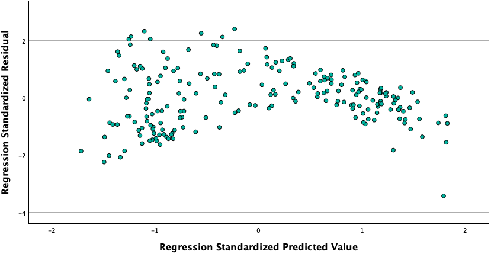

```{r setup, include=FALSE}
options(htmltools.dir.version = FALSE)
```

```{r xaringan-themer, include = FALSE}
library(xaringanthemer)
style_mono_accent(
  base_color = "#18778C",
  header_color = "#000000",
  header_font_google = google_font("Jost"),
  header_font_weight = 500,
  text_font_google = google_font("Jost", "300", "300i", "500", "500i"),
  code_font_google = google_font("Source Code Pro"),
  text_bold_color = '#4CA384',
  text_slide_number_color = '#18778C',
  text_font_size = '16pt'
)
```

```{r, echo = F, message = F, warning = F}
library(tidyverse)
library(kableExtra)

knitr::opts_chunk$set(dev = 'svg')

baseColor <- '#4CA384'
accent1 <- '#9AD079'
accent2 <- '#18778C'
accent3 <- '#19424C'
```

### This Week's Key Topics

+ Why use nonparametric tests?

+ $\chi^2$ for nominal categories

+ Tests for comparing two groups 
  + Mann-Whitney test
  + Wilcoxon signed-rank test

+ Tests for comparing more than two groups 
  + Kruskal-Wallis test
  + Friedman's ANOVA

+ Spearman's $\rho$ for looking at continuous association

---
### Why use nonparametric tests?

+ This far, all tests we've covered have been **parametric tests**, which make assumptions about the *parameters* of the population from which the sample was drawn:

  + Normality
  
  + Independence
  
  + Equal Variance/Homogeneity/Homoskedasticity/Sphericity
  
  + Linear relationship between variables
  
  + Continuous dependent variables
  
--

+ When these assumptions are violated, it affects our ability to draw accurate conclusions from our data.

+ Assumptions being violated doesn't **guarantee** the conclusions are inaccurate...it just makes it a bit more likely.

---
### Identifying assumptions violations

**Normality**

.pull-left.center[
<span style = "color: #18778C"> Normal Histogram </span>
```{r, echo = F}

```
]

--

.pull-right.center[
<span style = "color: #18778C"> Non-normal Histogram </span>
```{r, echo = F}

```
]


---
### Identifying assumptions violations

**Normality**

.pull-left.center[
<span style = "color: #18778C"> Normal Q-Q Plot </span>
```{r, echo = F, out.width='75%'}

```
]

--

.pull-right.center[
<span style = "color: #18778C"> Non-normal Q-Q Plot </span>
```{r, echo = F, out.width='75%'}

```
]

---
### Identifying assumptions violations

**Homogeneity of Variance in Continuous Data**

.pull-left.center[
<span style = "color: #18778C"> Homogeneity of Variance/Homoskedasticity </span>
```{r, echo = F}

```
]

--

.pull-right.center[
<span style = "color: #18778C"> Heterogeneity of Variance/Heteroskedasticity </span>
```{r, echo = F}

```
]

---
### Identifying assumptions violations

**Homogeneity of Variance in Categorical Data**

.pull-left.center[
<span style = "color: #18778C"> Homogeneity of Variance </span>
```{r, echo = F}

```
]

--

.pull-right.center[
<span style = "color: #18778C"> Heterogeneity of Variance </span>
```{r, echo = F}

```
]

---
### Identifying assumptions violations

**Linearity**

.pull-left.center[
<span style = "color: #18778C"> Linearity </span>
```{r, echo = F}

```
]

--

.pull-right.center[
<span style = "color: #18778C"> Nonlinearity </span>
```{r, echo = F}

```
]

---
### Why use nonparametric tests?

+ Nonparametric tests don't make these assumptions about the population parameters, so results can be trusted even when data do not meet them.

+ These tests are less powerful than parametric tests **when all assumptions are met**

+ However, if assumptions are violated, nonparametric tests can be *more* powerful.


---
class: center, inverse, middle

## Questions?

---
### Comparing 2 Groups 

+ Testing differences between two groups with parametric tests involves a comparison of their means

+ Testing differences with nonparametric tests compares the central tendency of the groups, but not using their means

+ Rather than using the raw data points, these tests **rank** the values and then compare groups according to their ranks

+ Should be used when dependent variable is ordinal (e.g., Likert Scale data) or violates assumptions of normality. 

--

+ **Mann-Whitney Test:** nonparametric equivalent to independent-samples $t$-test

+ **Wilcoxon Signed-Rank Test:** nonparametric equivalent to paired-samples $t$-test


---
### Comparing 2 Independent Groups - Mann-Whitney Test

.pull-left[

Consider the following values:

| Group A | Group B |
|:-------:|:-------:|
| 4       |  8      |
| 3       |  12     |
| 7       |  2      |
| 5       |  6      |

<br>

The Mann-Whitney test orders all values and compares the ranks between the two groups

]

--

.pull-right[

|Group | Value | Rank |
|:----:|:-----:|:----:|
| 2    |  12   | <span style = "font-weight: bold; color: #18778C"> 1 </span>|
| 2    |  8    | <span style = "font-weight: bold; color: #18778C"> 2 </span>|
| 1    |  7    | <span style = "font-weight: bold; color: #9AD079"> 3 </span>|
| 2    |  6    | <span style = "font-weight: bold; color: #18778C"> 4 </span>|
| 1    |  5    | <span style = "font-weight: bold; color: #9AD079"> 5 </span>|
| 1    |  4    | <span style = "font-weight: bold; color: #9AD079"> 6 </span>|
| 2    |  3    | <span style = "font-weight: bold; color: #18778C"> 7 </span>|
| 1    |  2    | <span style = "font-weight: bold; color: #9AD079"> 8 </span>|

]


---
### Comparing 2 Independent Groups - Mann-Whitney Test


.pull-left[

+ If there is a systematic difference between groups, it is expected that most of one group's ranks will be higher and most of the other's will be lower.

+ The Mann-Whitney Statistic, $U$, is computed using the differences between group ranks and size of each group

+ Smaller $U$s provide stronger evidence against the null hypothesis

  + i.e., it is more likely that there is a systematic difference between groups
  
]

.pull-right[

```{r, echo = F, out.width='75%'}

```

]

---
### Comparing 2 Dependent Groups - Wilcoxon Signed-Rank Test

.pull-left[

+ Somewhat similar procedure to the Mann-Whitney Test, but ranks the differences between two groups when the observations are matched rather than ranks of raw values

+ Assigns negative ranks or positive ranks depending upon which of the paired values is larger 

+ Compares the negative and positive ranks to determine whether there is generally consistent change between the paired scores.
]

.pull-right[

```{r, echo = F, out.width='75%'}

```
]

---
### Comparing > 2 Groups 

+ **Kruskal-Wallis Test:** nonparametric equivalent to One-Way Between-Subjects ANOVA

+ **Friedman's ANOVA:** nonparametric equivalent to One-Way Repeated-Measures ANOVA

+ These tests work similarly to those that compare two groups: 
  + Kruskal-Wallis: Data are ranked and the ranks of the groups are compared across groups
  + Friedman's ANOVA: Differences between groups are ranked and then these ranks are compared
  
+ If results are significant, nonparametric post-hoc tests can be used to determine which groups are driving the results:
  + Dunn's Test for Kruskal-Wallis
  + Pairwise Wilcoxon Signed-Rank Tests with Bonferroni Corrections for Friedman's ANOVA
  

---
class: middle, center, inverse

## Questions?

---
### Spearman's Correlation

+ Spearman's $\rho$ (or rank-order correlation) uses data on the rank-ordering of $x$, $y$ responses for each individual.
  
+ Spearman's $\rho$ is a nonparametric version of Pearson's $r$, so it doesn't require the same constraints on your data

+ When would we choose to use the Spearman correlation?
	+ If our data are naturally ranked data (e.g. a survey where the task is to rank foods and drinks in terms of preference)
	+ Our data are ordinal (e.g., Likert Scales)
	+ If the data are non-normal or skewed
	+ If the data shows evidence of non-linearity

---
### Spearman's Correlation

+ Spearman's is not testing for linear relations, it is testing for increasing monotonic relationship.

--

  + What?

--

.pull-left.center[
**Perfectly Linear Relationship**
```{r, echo = F, fig.height=3, fig.width=5}
mono <- data.frame(
  A = c(1,2,3,4,5,6,7,8),
  B = c(1,2,3,4,5,6,7,8),
  C = c(1,4,5,6,8,9,10,13)
)

lp <- mono %>%
  ggplot(., aes(x=A, y=B)) +
  geom_point() + 
  geom_line()

mp <- mono %>%
  ggplot(., aes(x=A, y=C)) +
  geom_point() + 
  geom_line()

lp
```

]

.pull-right.center[
**Perfectly Increasing Monotonic Relationship**
```{r, echo = F, fig.height=3, fig.width=5}
mp
```

]

---
### Monotonic Relationship

+ **Perfect Monotonic Relationship:** The rank position of all observations on Variable A is the same as the rank position of all observations on Variable C.

.pull-left[

```{r, echo = F}
mono %>%
  mutate(
    ID = paste("ID", 1:8, sep = ""),
    Rank_A = rank(A),
    Rank_C = rank(C)
  ) %>%
  dplyr::select(., ID, A, C, Rank_A, Rank_C) %>%
  kable() %>%
  kable_styling(full_width = F)

```

]

.pull-right[
```{r, echo = F, fig.height=3.5, fig.width=5}
mp
```

]

---
### Interpretation of Spearman's $\rho$

+ Identical to Pearson's $r$

+ Values fall between -1 and 1, with values further from 0 indicating a stronger association

| Value   | Interpretation |
|:-------:|:--------------:|
| < .1    | Negligible     |
| .1 - .3 | Weak           |
| .3 - .5 | Moderate       |
| > .5    | Strong         |

---
class: inverse, center, middle

## Questions?

---
### $\chi^2$ Tests

+ Used for testing frequencies (counts) in categorical variables that have more than 2 levels

  + ** $\chi^2$ Goodness of Fit Test**: Are your data distributed in a way that you would expect?
    + Do the actual number of observations in each group align with the number of observations you would expect to see in each group?

  + ** $\chi^2$ Test of Independence**: Are two categorical variables from a single population independent of each other?
    + Is membership in variable 1 dependent upon membership in variable 2?

---
### $\chi^2$ Tests

+ In both instances, a $\chi^2$ statistic is calculated and compared against an expected distribution

+ The probability of a $\chi^2$ as extreme as this value is calculated

+ Using this probability, a decision is made in regards to whether this probability is extreme enough to provide solid evidence against the null hypothesis.


---
### $\chi^2$ Goodness of Fit Test

.pull-left[

+ Tests the null hypothesis that the number of observations observed within groups of a variable are consistent with the number of observations expected

+ Checks for consistency between frequencies across categories of a single variable

+ **Hypotheses:**
  + $H_0: n_i = m_i$
  + $H_1: n_i \neq m_i$

    + $n_i$ = the number of observations in category $i$
    + $m_i$ = the expected number of observations in category $i$

]

.pull-right[
```{r, echo = F}

```
]

---
### How do we decide what is expected?


+ Based on an understanding of your variable, and how you would expect it to be distributed in the population.

  + Sometimes, you might expect counts to be evenly distributed across groups (number of times fair dice roll each number between 1 and 12)

  + Others, you may expect counts to be distributed unevenly (e.g., handedness: 85% right-handed, 13% left-handed, 2% ambidextrous)
  
+ If the $\chi^2$ value is significant, this means that your observations don't align with those expected given the null hypothesis.


---
### Example - $\chi^2$ Goodness of Fit

.pull-left[
+ **Which days should a florist close the store?**

  + A florist has just opened a shop and needs to decide which days they will be open.
  
  + They want to know whether there are certain days that more orders will come in.
  
  + $H_0$: Orders will be equal regardless of day of the week
  
  + $H_1$: The number of orders will be higher on some days than others.
]

--

|  Day    |  Number of Orders |
|:-------:|:-----------------:|
|Monday   | 54                |
|Tuesday  | 39                |
|Wednesday| 44                |
|Thursday | 47                |
|Friday   | 68                |
|Saturday | 72                |
|Sunday   | 53                |

---
### Example - $\chi^2$ Goodness of Fit Results

.pull-left[
.center[
```{r, echo = F, out.width='60%'}
knitr::include_graphics('images/chisqResults.png')
```
]]

.pull-right[
**Which two days should the florist close the shop?**
]

---
### $\chi^2$ Test of Independence

.pull-left[

+ Checks whether two categorical variables from a single population are independent of each other.

+ Checks for consistency between frequencies across categories of *two* variables

+ **Hypotheses:**
  + $H_0:$ Variable A is not associated with Variable B
  + $H_1:$ Variable A is associated with Variable B

]

.pull-right[
```{r, echo = F}

```
]

---
### Example - $\chi^2$ Test of Independence

.pull-left[
+ **Does the best-selling flower type depends on the season?**

  + The florist is trying to decide how best to stock their shop.
  
  + They want to know whether there are certain times of the year that some flowers sell better than others.
  
  + $H_0$: Type of flowers being ordered will be independent of the current season
  
  + $H_1$: Type of flowers being ordered will depend on the current season
]

.pull-right[

|  Season |  Tulips | Lilies | Roses |
|:-------:|:-------:|:------:|:-----:|
|Spring   | 288     | 202    |  183  |
|Summer   | 225     | 207    |  174  |
|Autumn   | 142     | 221    |  213  |
|Winter   | 131     | 212    |  307  |


]

---
### Example - $\chi^2$ Test of Independence Results

.pull-left[
.center[
```{r, echo = F, out.width='80%'}

```
]]

.pull-right[
**Is the best-selling flower dependent upon the season?**
]

---
class: middle, center, inverse

## Questions?
