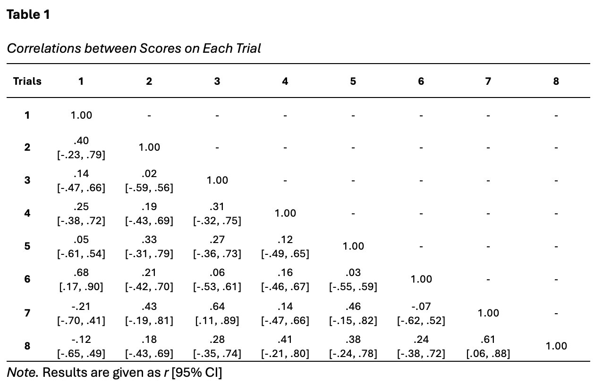
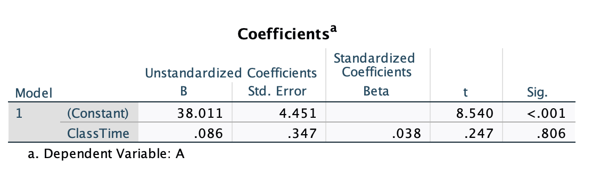

```{r, echo = F, message = F, warning = F}
library(ggplot2)
library(reshape2)
```

```{r setup, include=FALSE}
options(htmltools.dir.version = FALSE)
knitr::opts_chunk$set(dev = 'svg')

library(xaringanthemer)

style_mono_accent(
  base_color = "#18778C",
  header_color = "#000000",
  header_font_google = google_font("Jost"),
  header_font_weight = 500,
  text_font_google = google_font("Jost", "300", "300i", "500", "500i"),
  code_font_google = google_font("Source Code Pro"),
  text_bold_color = '#4CA384',
  text_slide_number_color = '#18778C',
  text_font_size = '16pt'
)
```

## Basics

+ Be mindful.

+ Be clear.

+ Be organised.

+ Be efficient.

+ Be informative.

+ Be focused.

+ Be scholarly.

---
## Be mindful.

+ Use the results section for reporting...results.

+ **NO INTERPRETATION.** Save that for the discussion. 

--

.pull-left[
.center[
**This is bad.**]
<font size=4> "There was a significant main effect of group A, &beta; = 2.51, 95% CI = [1.12, 3.90], <i>t</i>(65) = 5.25, <i>p</i> < .001. This indicates that super-recognisers correctly identified more faces than the typical group. Although they demonstrated better identification ability, it is unclear whether they did so by focusing on the whole face rather than specific regions. It is possible that they used a similar strategy to the typical group, but their memory for facial characteristics was more efficient." </font> 
]

.pull-right[
.center[
**This is better.**]
<font size=4> "There was a significant main effect of group A, &beta; = 2.51, 95% CI = [1.12, 3.90], <i>t</i>(65) = 5.25, <i>p</i> < .001. This indicates that super-recognisers correctly identified more faces than the typical group." </font> 
]

<br>
<br>
<small> This example adapted from Dunn et al., 2022 </small>

---
## Be clear.

+ Have you already done the study? Yes? Then why are you writing about it in future or present tense?

  + In almost all cases, **you should be writing in past tense**.

+ Don't be vague about what is being tested, particularly when you have used multiple measures or have several hypotheses.

--

.pull-left[
.center[
**This is bad.**]
<font size=4> "We <b>will run</b> a one-way ANOVA to test the difference between 3 intervention groups. Group A <b>shows</b> higher scores (<i>M</i> = 17.62, <i>SD</i> = 5.21) than groups B (<i>M</i> = 12.11, <i>SD</i> = 8.20) and C (<i>M</i> = 10.22, <i>SD</i> = 9.26), <i>F</i> (2, 147) = 14.13, <i>p</i> < .001, &eta;<sup>2</sup> = .16 [.08, 1.00])" </font>
]

.pull-right[
.center[
**This is better.**]
<font size=4> "A one-way ANOVA <b>indicated</b> that intervention group status significantly <b>affected</b> BDI scores. Specifically, participants in Group A <b>scored</b> higher (<i>M</i> = 17.62, <i>SD</i> = 5.21) than those in Groups B (<i>M</i> = 12.11, <i>SD</i> = 8.20), and C (<i>M</i> = 10.22, <i>SD</i> = 9.26); <i>F</i> (2, 147) = 14.13, <i>p</i> < .001, &eta;<sup>2</sup> = .16 [.08, 1.00])." </font>
]

---

## Be organised.

+ Use headings when necessary to separate your themes (qualitative) or hypotheses (quantitative)

+ **Do not clump all your results into a single wall of text**.

--

.pull-left[
.center[
**This is bad.**]
<font size=2.5> We utilized a one-way ANOVA to test whether intervention group status significantly affected BDI scores. Our results indicated that intervention type was significant, <i>F</i> (2, 147) = 14.13, <i>p</i> < .001, &eta;<sup>2</sup> = .16 [.08, 1.00]. Post-hoc analyses using Tukey's tests found that participants in Group A scored higher (<i>M</i> = 17.62, <i>SD</i> = 5.21) than those in Groups B (<i>M</i> = 12.11, <i>SD</i> = 8.20), <i>p</i> < .001 and C (<i>M</i> = 10.22, <i>SD</i> = 9.26), <i>p</i> < .001. There was no significant difference in BDI scores between Groups B and C, <i>p</i> = .635. This suggests that Intervention A was less effective than Interventions B and C in reducing depressive symptoms. We then examined whether intervention group status significantly affected BAI scores. Our results indicated that intervention type was significant, <i>F</i> (2, 147) = 8.22, <i>p</i> < .001, &eta;<sup>2</sup> = .10 [.04, .93]). Post-hoc analyses using Tukey's tests... </font>
]

.pull-right[
.center[
**This is better.**]
<font size=2.5> 
<b> Intervention Type and BDI Scores </b>
<br>
A one-way ANOVA indicated that intervention type significantly affected BDI scores, <i>F</i> (2, 147) = 14.13, <i>p</i> < .001, &eta;<sup>2</sup> = .16 [.08, 1.00]. Post-hoc analyses using Tukey's tests found that participants in Group A scored higher (<i>M</i> = 17.62, <i>SD</i> = 5.21) than those in Groups B (<i>M</i> = 12.11, <i>SD</i> = 8.20), <i>p</i> < .001, and C (<i>M</i> = 10.22, <i>SD</i> = 9.26), <i>p</i> < .001. There was no significant difference in BDI scores between Groups B and C, <i>p</i> = .635. This suggests that Intervention A was less effective than Interventions B and C in reducing depressive symptoms. 


<b> Intervention Type and BAI Scores </b>
<br>
Results from a one-way ANOVA suggested...
]

---
## Be efficient. 

```{r, echo = F}
dat <- read.csv('https://uoepsy.github.io/data/bballhrv.csv')
dat <- na.omit(dat)
dat$sub <- NULL
dat <- dat[, 1:8]
corDat <- cor(dat)
corDat[upper.tri(corDat)] <- NA
plotDat <- melt(corDat, c('x', 'y'), na.rm = T)
```


+ **Don't put the same results in the text AND a table.** Pick one.
  + If you only have results from a single test to report, report it in text.
  + If you have results from a large regression with multiple predictors, a table might be a better option. 

--

.pull-left[
.center[
**This is bad.**]
<font size=4> "Results from the first trial were strongly correlated with scores on trial 6, <i>r</i> = .68, 95% CI [.17, .90]; moderately correlated with scores on trial 2, <i>r</i> = .40, 95% CI [-.23, .79]; and weakly correlated with scores on trials 4, <i>r</i> = .25, 95% CI [-.38, .72]; and 7, <i>r</i> = -.21, 95% CI [-.70, .41]. Results from the second trial were moderately correlated with..." </font>
]

.pull-left[
.center[
**This is better.**
```{r, echo = F, out.width = '85%'}

```
]
]

---
## Be efficient. 

+ **Don't put the same results in the text AND a table.** Pick one.
  
+ You could also use figures to effectively display a large number of grouped results:

.center[

```{r, echo = F, warning = F, message = F, , fig.height = 4}
trials = paste('Trial', 1:8)
ggplot(plotDat, aes(x, y, fill = value)) +
  geom_tile(color = 'white') +
  scale_fill_viridis_c(option = "D", direction = -1) +
  labs(x = '', y = '', fill = 'r') +
  scale_x_discrete(labels = trials) +
  scale_y_discrete(labels = trials) +
  theme(axis.text = element_text(size = 10),
        legend.text = element_text(size = 12),
        legend.title = element_text(size = 14, face = 'italic'),
        legend.key.size = unit(1, 'cm'),
        legend.title.align =.25) +
  geom_text(aes(x, y, label = round(value, 2)), color = "white", size = 4) 
```

]


---
## Be informative.

**Qualitative**

+ Don't just include a random quote with no context.

+ The reader should not have to determine its relevance; that's on you.

--

.pull-left[
.center[
**This is bad.**]
<font size=3>  <B> Learning Approach: Leaning In </B>

This sociology major described her experience of leaning in:
"There was so much work, a lot of which was hard for me to understand, but I continued to push myself to understand it. I took notes, I read as much as I could and while there were certain concepts that I really couldn’t grasp, I'm a hard-working student, so I was willing to go above and beyond."


<br>
<br>
<small> This example is adapted from Markle et al., 2016 </small>
]

.pull-right[
.center[
**This is better.**]
<font size=3> <B> Learning Approach: Leaning In </B> 


Some students used a learning approach that involved “embracing the challenge”; they “leaned in”. Leaning in behaviors included not missing class, doing the reading, meeting with the professor, forming study groups, and seeking out additional resources. This sociology major described her experience of leaning in:
"There was so much work, a lot of which was hard for me to understand, but I continued to push myself to understand it. I took notes, I read as much as I could and while there were certain concepts that I really couldn’t grasp, I'm a hard-working student, so I was willing to go above and beyond."
]


---
## Be informative.

**Quantitative**

+ Provide detailed results from your tests, **not just a $p$-value** (see [Sullivan & Feinn](https://www.ncbi.nlm.nih.gov/pmc/articles/PMC3444174/)).
  + Statistical test used 
  + Test statistic value (e.g., $F$, $\beta$)
  + Degrees of freedom 
  + $p$-value (up to 3 decimal places)
  + Effect sizes and confidence intervals.

--

.pull-left[
.center[
**This is bad.**]
<font size=3> Our results indicated that intervention type was significant, <i>F</i> = 14.13, <i>p</i> < .05. Participants in Group A scored higher than those in Groups B, <i>p</i> < .05 and C, <i>p</i> < .05. There was no significant difference between Groups B and C, <i>p</i> = n.s. </font>
]

.pull-right[
.center[
**This is better.**]
<font size=3> A one-way ANOVA indicated that intervention type significantly affected BDI scores, <i>F</i> (2, 147) = 14.13, <i>p</i> < .001, &eta;<sup>2</sup> = .16 [.08, 1.00]. Post-hoc analyses using Tukey's tests found that participants in Group A scored higher (<i>M</i> = 17.62, <i>SD</i> = 5.21) than those in Groups B (<i>M</i> = 12.11, <i>SD</i> = 8.20), <i>p</i> < .001, and C (<i>M</i> = 10.22, <i>SD</i> = 9.26), <i>p</i> = .012. There was no significant difference between Groups B and C, <i>p</i> = .635. </font>

]

---
## Be focused.

.pull-left[
+ Don't report something that's irrelevant.

+ Does the test provide results that contribute to your original hypotheses in some way? 
  + If not, why did you run it? 

+ **DON'T REPORT RESULTS JUST BECAUSE THEY'RE SIGNIFICANT**. That's bad science.
]

.pull-right.center[
```{r, echo = F, out.width='75%'}
knitr::include_graphics('images/noFishing.jpeg')
```
]

---
## Be scholarly.

+ Don't report something you don't understand.

--

> What does it mean if SPSS says $p$ = .000?*

--

> Should you report the significance of (Constant) in this regression model?

.center[
```{r, echo = F, out.width='55%'}

```
]

--

+ Before you report your results, be sure you thoroughly understand them. You may have to do a bit of extra reading or ask someone for help.

+ *Recent versions of SPSS have fixed this but you should still take note.

---
## Some final points

+ Use APA formatting. See here for some guidance:
  
  + [APA style](https://apastyle.apa.org/style-grammar-guidelines)
  + [Purdue Owl](https://owl.purdue.edu/owl/research_and_citation/apa_style/apa_formatting_and_style_guide/general_format.html)

--
  
+ If using color in figures, it's good to select colors that are colorblind-friendly.
  + [Coloring for Colorblindness](https://davidmathlogic.com/colorblind/#%23D81B60-%231E88E5-%23FFC107-%23004D40)

--

+ Take a breath; you're almost done.

---
class: inverse

## Questions?

.center[
```{r, echo = F, out.width = '85%'}

```
]
